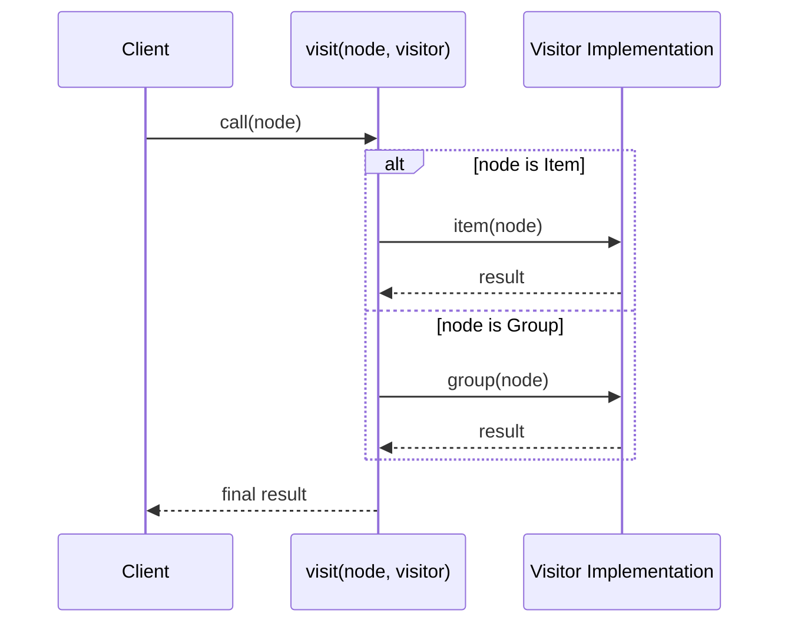

# 第88章：Visitor ② TSの現実解：判別Union＋関数で“訪問”する🧠

## ねらい🎯

* 「構造（データの形）」は固定のまま、「処理（表示・集計・検証）」をどんどん足せるようになる✨
* GoFのVisitorを **TypeScriptっぽく** “軽量”に再現できるようになる🧁
* `switch` の **網羅チェック**（漏れたらコンパイルで気づく）を体に入れる✅ ([TypeScript][1])

---

## まず困りごと😵‍💫：「同じデータに処理を足すたび、あちこちを編集…」

例：メニューの木構造（Composite🌳）があって…

* 画面表示したい🖥️
* 合計金額を出したい🧾
* 入力データを検証したい🔍

…となるたびに、**いろんな場所の `if/switch` を増やす**と、すぐ “編集漏れ” が起きる😭
そこで「処理の追加を1か所に集める」発想がVisitor✨

---

## TSでの現実解🧠：GoFの“クラスVisitor”より、**判別Union＋関数**が自然

TypeScriptは「データの形」を **判別Union**（discriminated union）で表すのが強い💪
`type`（or `kind`）みたいな **タグ**で分岐すると、型がちゃんと絞り込まれるよ🧠 ([TypeScript][2])

そしてVisitorはこうする👇

* **ノード（データ）**：判別Union
* **Visitor（処理の集合）**：`{ タグ名: (node)=>結果 }` のオブジェクト
* **入口**：`visit(node, visitor)` を1つだけ用意




---

## ハンズオン🛠️：カフェの「メニュー木」を“訪問”して、表示/集計/検証を足していく☕🌳

### 1) データ構造：判別Unionで「Leaf/Group」を表現🌿🌲


```typescript
// menu.ts
export type MenuNode =
  | { type: "item"; id: string; name: string; price: number }
  | { type: "group"; id: string; name: string; children: MenuNode[] };
```

`type` がタグになって、`switch` で絞り込みできるよ✨ ([TypeScript][2])

---

### 2) Visitor型：タグごとに“処理”を持つ🧳✨

ポイントはここ👇

* `Extract<Union, {type:"..."}>` で「そのタグのノード型だけ」を抜き出す
* `satisfies` で「漏れなし＆余計なキーなし」をチェック✅（超便利！） ([effectivetypescript.com][3])

```typescript
// visitor.ts
import { MenuNode } from "./menu";

type NodeOf<TType extends MenuNode["type"]> = Extract<MenuNode, { type: TType }>;

export type Visitor<R> = {
  item: (node: NodeOf<"item">) => R;
  group: (node: NodeOf<"group">) => R;
};
```

---

### 3) visit関数：入口はここ1か所🚪✨（網羅チェックつき）

```typescript
// visit.ts
import { MenuNode } from "./menu";
import { Visitor } from "./visitor";

function assertNever(x: never): never {
  throw new Error("Unexpected node: " + JSON.stringify(x));
}

export function visit<R>(node: MenuNode, v: Visitor<R>): R {
  switch (node.type) {
    case "item":
      return v.item(node);
    case "group":
      return v.group(node);
    default:
      // ここに来たら「タグ追加したのに処理書いてない」ってこと！
      return assertNever(node);
  }
}
```

`never` を使うと **switchの漏れ** をコンパイルで検出できる✅ ([TypeScript][1])

---

### 4) Visitorを作る①：表示用（メニューを文字列で整形）🖊️🍰


```typescript
// renderVisitor.ts
import { Visitor } from "./visitor";
import { visit } from "./visit";
import { MenuNode } from "./menu";

export const renderVisitor = {
  item: (n) => `• ${n.name} ¥${n.price}`,
  group: (n) => {
    const lines = n.children.map((c) => visit(c, renderVisitor));
    return `【${n.name}】\n` + lines.map((s) => "  " + s.replace(/\n/g, "\n  ")).join("\n");
  },
} satisfies Visitor<string>; // ✅ 漏れ・余計キーをチェック
```

`satisfies` は「型を満たすか検証しつつ、値の型情報も保ちやすい」用途でよく使われるよ🧠✨ ([effectivetypescript.com][3])

---

### 5) Visitorを作る②：合計金額（木を全部足す）🧾✨

```typescript
// totalVisitor.ts
import { Visitor } from "./visitor";
import { visit } from "./visit";

export const totalVisitor = {
  item: (n) => n.price,
  group: (n) => n.children.reduce((sum, c) => sum + visit(c, totalVisitor), 0),
} satisfies Visitor<number>;
```

---

### 6) 実行してみよ🎉

```typescript
// demo.ts
import { MenuNode } from "./menu";
import { visit } from "./visit";
import { renderVisitor } from "./renderVisitor";
import { totalVisitor } from "./totalVisitor";

const menu: MenuNode = {
  type: "group",
  id: "root",
  name: "メインメニュー",
  children: [
    { type: "item", id: "c1", name: "コーヒー", price: 450 },
    { type: "item", id: "t1", name: "紅茶", price: 420 },
    {
      type: "group",
      id: "sweets",
      name: "スイーツ",
      children: [{ type: "item", id: "ck", name: "チーズケーキ", price: 520 }],
    },
  ],
};

console.log(visit(menu, renderVisitor));
console.log("合計:", visit(menu, totalVisitor));
```

✅ “構造”はそのまま、Visitorを増やすだけで“処理”が増える！最高👏✨

---

## よくある拡張シーン🍀（Visitorが効くやつ）


* 表示形式を増やす：テキスト / HTML / JSON など🧩
* 集計を増やす：合計金額 / 件数 / 最安値 / カテゴリ別合計📊
* 検証を増やす：価格がマイナスじゃない？ id重複してない？🔍

---

## つまずき回避💡（TSでVisitorやるときの“あるある”）

### 1) 「Visitorの中で再帰したいのに、参照が難しい」問題🌀


上の例みたいに **visitorオブジェクト自身を参照**して再帰するのが一番シンプル👍
（`function makeVisitor(){...}` にしてクロージャで持ってもOKだよ🧁）

### 2) 「タグ増やしたのに、どこか直し忘れた😇」


* `visit` の `switch` に `assertNever` を入れる✅ ([TypeScript][1])
* visitor定義に `satisfies Visitor<...>` を付ける✅ ([effectivetypescript.com][3])
  この2枚看板で“漏れ”を潰せるよ💥

### 3) ファイルが増えて迷子になる📁💦


おすすめルール（最小）👇

* `menu.ts`（型）
* `visit.ts`（入口）
* `visitors/xxxVisitor.ts`（処理たち）
  これだけでかなりスッキリ✨

---

## ミニコラム🗞️：最近のTypeScript事情（“大きいUnion”が現実になる時代）

* 2026/02/05時点のTypeScript安定版は **5.9.3**（公式リリース一覧ベース）📌 ([GitHub][4])
* 判別Unionは便利だけど、巨大になると型計算コストが気になることも。TypeScript 5.5では **判別Union由来の型計算をキャッシュして高速化**みたいな改善も入ってるよ⏱️✨ ([TypeScript][5])
* さらに、コンパイラ/言語サービスの **ネイティブ移植（TypeScript Native Previews）** も進んでいて、`@typescript/native-preview` で試せる流れがあるよ🚀 ([Microsoft for Developers][6])
  （Visitorみたいに「型で安全に増やす」設計は、こういう流れとも相性いい💞）

---

## AIプロンプト例🤖💬（Visitorを“読みやすく”したい時）

```text
判別Unionで表したツリー構造があります。TypeScriptでVisitorを「関数オブジェクト + visit関数」で実装してください。
条件:
- switchの網羅チェック（never/assertNever）を入れる
- visitor定義は `satisfies` で漏れを検出できるようにする
- クラスでGoF Visitorを再現しない（TSらしく関数で）
- 例として「表示Visitor」「合計Visitor」「検証Visitor（エラー配列を返す）」の3つを作る
出力: 設計の意図 → 最小コード → ありがちなミス3つ
```

`satisfies` と `never` をちゃんと入れてくるかをチェックすると、AIの“それっぽい”事故が減るよ✅✨ ([effectivetypescript.com][3])

[1]: https://www.typescriptlang.org/docs/handbook/2/narrowing.html?utm_source=chatgpt.com "Documentation - Narrowing"
[2]: https://www.typescriptlang.org/play/typescript/meta-types/discriminate-types.ts.html?utm_source=chatgpt.com "Playground Example - Discriminate Types"
[3]: https://effectivetypescript.com/2025/12/19/ts-2025/?utm_source=chatgpt.com "A Small Year for tsc, a Giant Year for TypeScript"
[4]: https://github.com/microsoft/typescript/releases "Releases · microsoft/TypeScript · GitHub"
[5]: https://www.typescriptlang.org/docs/handbook/release-notes/typescript-5-5.html?utm_source=chatgpt.com "Documentation - TypeScript 5.5"
[6]: https://devblogs.microsoft.com/typescript/announcing-typescript-native-previews/?utm_source=chatgpt.com "Announcing TypeScript Native Previews"
