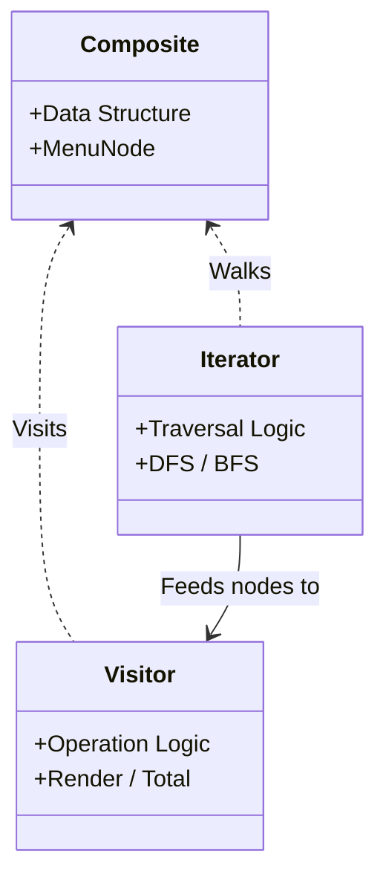

# 第89章：Visitor ③ まとめ：Composite/Iteratorと合わせ技で強い💪✨

## ねらい🎯

* 「木構造（Composite）」に対して

  * **走査のやり方（Iterator）** と
  * **やりたい処理（Visitor）**
    を分けて考えられるようになるよ🌳🔁🧳
* TypeScriptでは、GoFの“クラスVisitor”よりも **判別Union＋関数** でスッキリ書ける感覚を掴む🧠✨（Unionの考え方は公式でも基本として説明されてるよ）([TypeScript][1])

---

## 1) まず結論：3つの役割分担🧩✨

* **Composite（構造）**：データの形（木）を作る🌳
  例）カテゴリの中にカテゴリ、カテゴリの中に商品…みたいな構造
* **Iterator（探索）**：木をどういう順番で見るかを決める🔁
  例）深さ優先DFS / 幅優先BFS / フィルタしながら…
  `for...of` できる形はJS標準の考え方だよ([MDNウェブドキュメント][2])
* **Visitor（処理）**：木に対して“やりたいこと”を追加する🧳
  例）表示、集計、検証、エクスポート…を後から増やす✨

この分担ができると、**「構造は安定してるけど、処理だけが増えていく」**状況にめちゃ強いよ💪💡




---

## 2) 題材：カフェのメニューを「木」で持つ☕🌳

## Composite（判別Unionで木を作る）🧠

```ts
// 1) ノード（木の1要素）を判別Unionで表現
export type MenuNode =
  | { kind: "item"; id: string; name: string; priceYen: number }
  | { kind: "group"; id: string; name: string; children: MenuNode[] };

// 2) 例：メニューの木（カテゴリの中にカテゴリ/商品）
export const menu: MenuNode = {
  kind: "group",
  id: "root",
  name: "ALL",
  children: [
    {
      kind: "group",
      id: "coffee",
      name: "Coffee",
      children: [
        { kind: "item", id: "c1", name: "Americano", priceYen: 450 },
        { kind: "item", id: "c2", name: "Latte", priceYen: 520 },
      ],
    },
    {
      kind: "group",
      id: "food",
      name: "Food",
      children: [{ kind: "item", id: "f1", name: "Bagel", priceYen: 380 }],
    },
  ],
};
```

---

## 3) Iterator：走査（DFS/BFS）を“交換可能”にする🔁✨

JS/TSでは **generator（`function*`）＋`for...of`** が王道で、余計なクラスを作らずに済むよ([MDNウェブドキュメント][2])

## 深さ優先 DFS（おすすめ）🌲

```ts
export function* dfs(root: MenuNode): Generator<MenuNode> {
  yield root;
  if (root.kind === "group") {
    for (const child of root.children) {
      yield* dfs(child);
    }
  }
}
```

## 幅優先 BFS（上から順に見る）🌊

```ts
export function* bfs(root: MenuNode): Generator<MenuNode> {
  const q: MenuNode[] = [root];
  while (q.length) {
    const n = q.shift()!;
    yield n;
    if (n.kind === "group") q.push(...n.children);
  }
}
```

## 走査が分かれた瞬間の気持ちよさ🎉

* 「同じ木」でも、**DFSで表示**、**BFSで検索**、みたいに切り替え可能になる💡
* 2025以降、Iteratorに“ヘルパー”が増える流れもあるけど、まずは generator で十分👍（実行環境の対応差もあるからね）([LogRocket Blog][3])

---

## 4) Visitor：処理を“後から足す”🧳✨（TS流は「関数＋網羅性」）

TypeScriptでのコツはこれ👇

* `kind` で分岐して
* **`never` を使って網羅性チェック**（分岐漏れをコンパイルで気づける）([Stack Overflow][4])

## `assertNever`（網羅チェックの定番）✅

```ts
export function assertNever(x: never): never {
  throw new Error("Unexpected object: " + JSON.stringify(x));
}
```

---

## 5) Visitor①：メニューを「表示」する📄✨

「Groupは見出し」「Itemは行」みたいな表示を作るよ😊
（ここでは Visitor を“戻り値を組み立てる関数”として扱う）

```ts
type ItemNode = Extract<MenuNode, { kind: "item" }>;
type GroupNode = Extract<MenuNode, { kind: "group" }>;

export type MenuVisitor<R> = {
  item: (n: ItemNode) => R;
  group: (n: GroupNode, children: R[]) => R;
};

export function visitMenu<R>(node: MenuNode, v: MenuVisitor<R>): R {
  switch (node.kind) {
    case "item":
      return v.item(node);
    case "group": {
      const childrenResults = node.children.map((c) => visitMenu(c, v));
      return v.group(node, childrenResults);
    }
    default:
      return assertNever(node);
  }
}

export const renderVisitor: MenuVisitor<string[]> = {
  item: (n) => [`- ${n.name} ¥${n.priceYen}`],
  group: (n, children) => [
    `\n## ${n.name}`,
    ...children.flat(),
  ],
};

// 使い方
// const lines = visitMenu(menu, renderVisitor);
// console.log(lines.join("\n"));
```

ポイント💡

* 「構造（Composite）」はそのまま
* 「表示したい（Visitor）」を後から追加
* 将来「CSV出力Visitor」「管理画面用Visitor」も増やせる📦✨

---

## 6) Visitor②：合計金額を「集計」する💰✨

```ts
export const sumVisitor: MenuVisitor<number> = {
  item: (n) => n.priceYen,
  group: (_n, children) => children.reduce((a, b) => a + b, 0),
};

// 使い方
// const total = visitMenu(menu, sumVisitor);
// console.log(total);
```

ここまでで「Visitor＝処理追加」が体感できたはず🎉

---

## 7) ここで合わせ技：Iterator × Visitor の分離が効く場面💪✨

## こんな“現場あるある”に効くよ😵‍💫➡️😊

* 「まず**検索**してから、見つかった部分だけ**表示**したい」🔎📄
* 「走査順を変えたい（BFS/DFS）」けど、処理ロジックは変えたくない🔁
* 「巨大ツリーで、全部Visitorの再帰で処理すると重い」→ 走査で絞る🐢

## 例：Iteratorで“itemだけ”拾って合計（Visitorなし版）🔁

「探索」と「処理」が分かれてると、こういう雑な作業もラク😂

```ts
export function sumItemsByIterator(root: MenuNode, order: (r: MenuNode) => Iterable<MenuNode>) {
  let total = 0;
  for (const n of order(root)) {
    if (n.kind === "item") total += n.priceYen;
  }
  return total;
}

// sumItemsByIterator(menu, dfs)
// sumItemsByIterator(menu, bfs)
```

使い分けの感覚👇

* **Visitor**：構造に沿った“意味のある処理”を増やす（表示・検証・変換など）🧳
* **Iterator**：見る順番、絞り込み、途中終了など“探索都合”を持つ🔁
* **Composite**：データの形（木）そのもの🌳

---

## 8) ミニテスト（境界だけでOK）🧪✨

「学習用に最小」でいこうね😊

```ts
import { describe, it, expect } from "vitest";
import { menu, visitMenu, sumVisitor, renderVisitor } from "./menu";

describe("menu visitors", () => {
  it("sumVisitor sums all item prices", () => {
    expect(visitMenu(menu, sumVisitor)).toBe(450 + 520 + 380);
  });

  it("renderVisitor includes item lines", () => {
    const lines = visitMenu(menu, renderVisitor).join("\n");
    expect(lines).toContain("Americano");
    expect(lines).toContain("Bagel");
  });
});
```

---

## 9) つまずき回避💡（ここで事故りがち🥲）

## ✅ つまずき1：分岐漏れ（後からkind追加したのに…）

* `assertNever` を置いておけばコンパイル時に気づける可能性が上がるよ✅([Stack Overflow][4])

## ✅ つまずき2：Visitorが巨大化（“何でもVisitor”病）

* 1つのVisitorは **1つの目的** に寄せる（表示用、検証用、集計用…）📌
* 「神Visitor」になったら分割✨

## ✅ つまずき3：深い木で再帰が怖い

* 走査はIterator（ループ）に寄せると安心な場面もあるよ🔁

---

## 10) この章のまとめ🧡🎉

* **Composite**：木構造を作る🌳
* **Iterator**：どう歩くかを決める🔁（`Symbol.iterator` / generator が定番）([MDNウェブドキュメント][2])
* **Visitor**：処理を後から増やす🧳（TSは判別Union＋関数＋網羅チェックがやりやすい）([TypeScript][1])
* 3つを分けると、**「構造は固定・処理は増える・探索も変えたい」**に強くなる💪✨

---

## ハンズオン🛠️（やることリスト）✨

1. メニュー木に `drink` / `food` 以外のカテゴリを追加してみる🍰
2. Visitorをもう1個増やす：

   * 「価格が500円以上の商品だけ一覧」🔎
   * 「idの重複チェック（検証Visitor）」✅
3. DFS/BFSで出力順が変わるのを確認する🔁👀

---

## AIプロンプト例🤖💬

```
次のTypeScriptコード（Compositeの木構造）に対して、
1) 表示用Visitor
2) 検証用Visitor（id重複チェック）
3) DFS/BFSのIterator
を、余計な独自クラスを増やさず（判別Union+関数中心で）提案して。
網羅性チェック（never）も入れて、テスト観点も5つ挙げて。
```

---

## 本日時点のTSメモ📝✨

* TypeScriptの最新リリースは 5.9.x 系が確認できるよ（GitHub Releasesに 5.9.3 が 2025-10-01 として掲載）([github.com][5])

[1]: https://www.typescriptlang.org/docs/handbook/unions-and-intersections.html?utm_source=chatgpt.com "Handbook - Unions and Intersection Types"
[2]: https://developer.mozilla.org/en/docs/Web/JavaScript/Guide/Iterators_and_Generators?utm_source=chatgpt.com "Iterators and generators - JavaScript - MDN Web Docs"
[3]: https://blog.logrocket.com/iterator-helpers-es2025/?utm_source=chatgpt.com "Iterator helpers: The most underrated feature in ES2025"
[4]: https://stackoverflow.com/questions/39419170/how-do-i-check-that-a-switch-block-is-exhaustive-in-typescript?utm_source=chatgpt.com "How do I check that a switch block is exhaustive in ..."
[5]: https://github.com/microsoft/typescript/releases?utm_source=chatgpt.com "Releases · microsoft/TypeScript"
