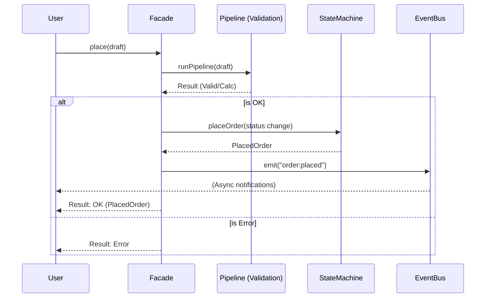

# 第90章：総合演習：カフェ注文ミニアプリを“パターンで育てる”🎉

## この章で作るもの（完成イメージ）🎯✨

* 「注文下書き（カート）」を編集できる（Undo/Redoつき）🛒↩️↪️
* 割引は **Strategy** で差し替えできる 🎟️⚙️
* 注文イベントは **Observer** で通知（在庫更新・ログ・UI更新…を疎結合に）📣🧩
* 注文の状態遷移は **State** で安全に（禁止操作を型で防ぐ）🚦✅
* 注文確定の前処理は **Chain**（検証→割引→合計→…）⛓️🧼
* 外部決済（仮）と内部モデルのズレは **Adapter** で吸収 🔌
* 入口は **Facade** で「これだけ呼べばOK」にする 🚪✨
* テスト＆Lintで壊れにくくする 🧪🧹（ESLintはFlat Configが基本）([eslint.org][1])




---

## 0) 2026っぽい“今どき”セットアップメモ 🧰✨

* `tsconfig` の `module` は **モダンNodeなら `"nodenext"` が基本**、公式もそう案内してるよ 🧠📦 ([TypeScript][2])
* TypeScript公式のリリースノートは 5.9 系が 2026年2月に更新されてる（新しめ前提でOK）🆕 ([TypeScript][3])
* Node は偶数メジャーが LTS 系列になりやすく、Node公式のリリース表でも **v24 が Active LTS** として載ってるよ ✅ ([nodejs.org][4])
* テストは **Vitest 4** 系が現行の大きな節目（2025/10のメジャー告知）🧪⚡ ([Vitest][5])
* typescript-eslint は Flat Config 前提のクイックスタートを用意してるよ 🧹🧠 ([typescript-eslint.io][6])

---

## 1) まず“最小で動く”注文モデルを作る ☕️🧾

ここはパターン無しでOK！「困る」ための土台を作る段階だよ 🌱

## 1-1. 型（ドメイン）を用意する 🧩

```ts
// src/domain.ts
export type MoneyYen = number;

export type MenuItem = {
  id: string;
  name: string;
  price: MoneyYen;
};

export type OrderLine = {
  item: MenuItem;
  qty: number;
};

export type DraftOrder = {
  id: string;
  status: "draft";
  lines: OrderLine[];
  note?: string;
};
```

## 1-2. 合計（小計）を計算する関数 🧮

```ts
// src/money.ts
import type { DraftOrder, MoneyYen } from "./domain.js";

export function calcSubTotal(order: DraftOrder): MoneyYen {
  return order.lines.reduce((sum, line) => sum + line.item.price * line.qty, 0);
}

// 表示用（TypeScriptの標準クラス！）
export function formatJPY(yen: MoneyYen): string {
  return new Intl.NumberFormat("ja-JP", {
    style: "currency",
    currency: "JPY",
    maximumFractionDigits: 0,
  }).format(yen);
}
```

✅ チェックポイント

* `DraftOrder` は **status が "draft" 固定**（後でStateに繋がるよ）🚦
* 合計は「関数」で十分（最初からクラス盛らない）🍰

---

## 2) Strategy：割引を“差し替え可能”にする 🎟️⚙️

「会員ランクが増えるたびに if/switch が太る…」を止めるやつ！🛑😵

## 2-1. Strategy型と“登録Map” 🗂️

```ts
// src/discount.ts
import type { DraftOrder, MoneyYen } from "./domain.js";

export type DiscountKey = "none" | "student" | "memberGold";

export type DiscountStrategy = (order: DraftOrder, subTotal: MoneyYen) => MoneyYen;

export const discountStrategies = new Map<DiscountKey, DiscountStrategy>([
  ["none", (_order, _subTotal) => 0],
  ["student", (_order, subTotal) => Math.floor(subTotal * 0.1)],
  ["memberGold", (_order, subTotal) => Math.min(500, Math.floor(subTotal * 0.15))],
]);

export function getDiscount(
  key: DiscountKey,
  order: DraftOrder,
  subTotal: MoneyYen,
): MoneyYen {
  const fn = discountStrategies.get(key) ?? discountStrategies.get("none")!;
  return fn(order, subTotal);
}
```

✅ チェックポイント

* Strategyは **関数でOK**（TypeScriptだと自然）🧁
* 追加は `Map.set(...)` だけ → if増殖しない 🌈

---

## 3) Observer：注文イベントを疎結合にする 📣🧩

「注文が確定したら、在庫更新・ログ・通知…」を **直接呼び合わない** のがポイント！

## 3-1. EventTargetを“型つき”で使う（関数で包む）🎯

```ts
// src/events.ts
export type AppEventMap = {
  "order:placed": { orderId: string; totalYen: number };
  "order:paid": { orderId: string; paymentId: string };
  "order:cancelled": { orderId: string; reason: string };
};

export function emit<K extends keyof AppEventMap>(
  bus: EventTarget,
  type: K,
  detail: AppEventMap[K],
): void {
  // CustomEvent を使うと detail を載せられて便利（標準寄り）✨
  bus.dispatchEvent(new CustomEvent(String(type), { detail }));
}

export function on<K extends keyof AppEventMap>(
  bus: EventTarget,
  type: K,
  handler: (detail: AppEventMap[K]) => void,
): () => void {
  const listener = (e: Event) => handler((e as CustomEvent).detail);
  bus.addEventListener(String(type), listener);
  return () => bus.removeEventListener(String(type), listener);
}
```

## 3-2. 購読側（例：ログ・在庫）🪵📦

```ts
// src/subscribers.ts
import { on } from "./events.js";

export function registerSubscribers(bus: EventTarget) {
  const off1 = on(bus, "order:placed", ({ orderId, totalYen }) => {
    console.log("📣 order placed:", orderId, "total=", totalYen);
  });

  const off2 = on(bus, "order:paid", ({ orderId, paymentId }) => {
    console.log("💳 paid:", orderId, "paymentId=", paymentId);
  });

  return () => {
    off1();
    off2();
  };
}
```

✅ チェックポイント

* 発行側は購読者を知らない → 追加/削除が楽 😌✨
* イベント名は **過去形っぽく**（仕様として扱える）📦

---

## 4) State：注文ライフサイクルを“型で安全に”🚦✅

「draft なのに paid にしちゃった…」をコンパイル時に止めるやつ！✋🧠

## 4-1. 判別Unionで状態を表す 🧩

```ts
// src/state.ts
import type { DraftOrder, MoneyYen } from "./domain.js";

export type PlacedOrder = {
  id: string;
  status: "placed";
  lines: DraftOrder["lines"];
  subTotalYen: MoneyYen;
  discountYen: MoneyYen;
  totalYen: MoneyYen;
  placedAt: string;
};

export type PaidOrder = {
  id: string;
  status: "paid";
  totalYen: MoneyYen;
  paymentId: string;
  paidAt: string;
};

export type CancelledOrder = {
  id: string;
  status: "cancelled";
  reason: string;
  cancelledAt: string;
};

export type AnyOrder = DraftOrder | PlacedOrder | PaidOrder | CancelledOrder;

export function placeOrder(
  draft: DraftOrder,
  info: { subTotalYen: MoneyYen; discountYen: MoneyYen; totalYen: MoneyYen },
  now = new Date(),
): PlacedOrder {
  return {
    id: draft.id,
    status: "placed",
    lines: draft.lines,
    ...info,
    placedAt: now.toISOString(),
  };
}

export function payOrder(placed: PlacedOrder, paymentId: string, now = new Date()): PaidOrder {
  return {
    id: placed.id,
    status: "paid",
    totalYen: placed.totalYen,
    paymentId,
    paidAt: now.toISOString(),
  };
}

export function cancelOrder(
  order: DraftOrder | PlacedOrder,
  reason: string,
  now = new Date(),
): CancelledOrder {
  return {
    id: order.id,
    status: "cancelled",
    reason,
    cancelledAt: now.toISOString(),
  };
}
```

✅ チェックポイント

* `payOrder` の引数が `PlacedOrder` だから、draftを渡せない！🚫
* 状態は少なく始めて育てるのがコツ 🌱

---

## 5) Chain：注文確定の前処理を“積める”ようにする ⛓️🧼

「検証が増えて placeOrder() が巨大化…」を止めるよ！🛑😵‍💫

## 5-1. Result と Pipeline 🚰

```ts
// src/result.ts
export type Result<T, E> = { ok: true; value: T } | { ok: false; error: E };
export const ok = <T>(value: T): Result<T, never> => ({ ok: true, value });
export const err = <E>(error: E): Result<never, E> => ({ ok: false, error });
```

```ts
// src/chain.ts
import type { Result } from "./result.js";
import { ok } from "./result.js";

export type Step<C, E> = (ctx: C) => Result<C, E>;

export function runPipeline<C, E>(steps: Step<C, E>[], initial: C): Result<C, E> {
  let ctx = initial;
  for (const step of steps) {
    const r = step(ctx);
    if (!r.ok) return r;
    ctx = r.value;
  }
  return ok(ctx);
}
```

## 5-2. 前処理ステップ例（検証・計算）🧾

```ts
// src/place-steps.ts
import type { DraftOrder, MoneyYen } from "./domain.js";
import type { DiscountKey } from "./discount.js";
import { getDiscount } from "./discount.js";
import { calcSubTotal } from "./money.js";
import type { Result } from "./result.js";
import { ok, err } from "./result.js";

export type PlaceCtx = {
  draft: DraftOrder;
  discountKey: DiscountKey;
  subTotalYen: MoneyYen;
  discountYen: MoneyYen;
  totalYen: MoneyYen;
};

export type PlaceError =
  | { type: "invalid_qty"; message: string }
  | { type: "empty_order"; message: string };

export function initCtx(draft: DraftOrder, discountKey: DiscountKey): PlaceCtx {
  const sub = calcSubTotal(draft);
  return { draft, discountKey, subTotalYen: sub, discountYen: 0, totalYen: sub };
}

export function validateNotEmpty(ctx: PlaceCtx): Result<PlaceCtx, PlaceError> {
  return ctx.draft.lines.length === 0
    ? err({ type: "empty_order", message: "注文が空だよ🥺" })
    : ok(ctx);
}

export function validateQty(ctx: PlaceCtx): Result<PlaceCtx, PlaceError> {
  const bad = ctx.draft.lines.find((l) => l.qty <= 0);
  return bad ? err({ type: "invalid_qty", message: "個数が変だよ🥺" }) : ok(ctx);
}

export function applyDiscount(ctx: PlaceCtx): Result<PlaceCtx, PlaceError> {
  const d = getDiscount(ctx.discountKey, ctx.draft, ctx.subTotalYen);
  return ok({ ...ctx, discountYen: d });
}

export function calcTotal(ctx: PlaceCtx): Result<PlaceCtx, PlaceError> {
  return ok({ ...ctx, totalYen: Math.max(0, ctx.subTotalYen - ctx.discountYen) });
}
```

✅ チェックポイント

* ステップは小さく、テストしやすく 🍭
* 追加/削除で本体が汚れない ✨

---

## 6) Command × Memento：編集Undo/Redoを作る 🕹️📸

ここは合わせ技が強い！💪

* **Command**：編集操作を「関数」として扱う ✍️
* **Memento**：状態スナップショットでUndo/Redo 📸↩️

## 6-1. History（Memento）🗂️

```ts
// src/history.ts
export type History<T> = {
  past: T[];
  present: T;
  future: T[];
};

export function createHistory<T>(initial: T): History<T> {
  return { past: [], present: initial, future: [] };
}

export function commit<T>(h: History<T>, next: T): History<T> {
  return { past: [...h.past, h.present], present: next, future: [] };
}

export function undo<T>(h: History<T>): History<T> {
  if (h.past.length === 0) return h;
  const prev = h.past[h.past.length - 1];
  return { past: h.past.slice(0, -1), present: prev, future: [h.present, ...h.future] };
}

export function redo<T>(h: History<T>): History<T> {
  if (h.future.length === 0) return h;
  const next = h.future[0];
  return { past: [...h.past, h.present], present: next, future: h.future.slice(1) };
}
```

## 6-2. Command（編集関数）＋安全なコピー 🧁

```ts
// src/editor.ts
import type { DraftOrder } from "./domain.js";
import type { History } from "./history.js";
import { commit, createHistory, redo, undo } from "./history.js";

// Command = 「DraftOrderを受けて、新しいDraftOrderを返す関数」✨
export type DraftCommand = (draft: DraftOrder) => DraftOrder;

export function createEditor(initial: DraftOrder) {
  let history: History<DraftOrder> = createHistory(structuredClone(initial));

  return {
    get current() {
      return history.present;
    },
    apply(cmd: DraftCommand) {
      const next = cmd(structuredClone(history.present));
      history = commit(history, structuredClone(next));
    },
    undo() {
      history = undo(history);
    },
    redo() {
      history = redo(history);
    },
  };
}

// よくあるコマンド例 🧁
export function addLine(itemId: string, qty: number): DraftCommand {
  return (draft) => {
    // 本物は item を引くけど、演習なので itemId だけ増やす想定でもOK
    draft.lines.push({
      item: { id: itemId, name: itemId, price: 0 },
      qty,
    });
    return draft;
  };
}
```

✅ チェックポイント

* Undo/Redoの境界ケース（past空、future空）を踏むと理解が深まるよ 🧠✨
* `structuredClone` で「参照共有事故」を避けやすい 🧊

---

## 7) Adapter：外部決済（仮）のズレを吸収する 💳🔌

外部APIは「命名・単位・型」がズレがち！そこを **1箇所に封じ込める** 🧼✨

## 7-1. 外部DTO（仮）→ 内部モデルへの変換 🧩

```ts
// src/adapter/payment-adapter.ts
export type ExternalPaymentResponse = {
  payment_id: string;
  result: "succeeded" | "failed";
  paid_amount: string; // "1200" みたいに文字列で来ることもある想定
};

export type PaymentResult =
  | { ok: true; paymentId: string }
  | { ok: false; message: string };

export function toPaymentResult(dto: ExternalPaymentResponse): PaymentResult {
  if (dto.result === "succeeded") return { ok: true, paymentId: dto.payment_id };
  return { ok: false, message: "決済に失敗したよ🥺" };
}
```

✅ チェックポイント

* 変換は **散らばらせない**（Adapterは“境界の掃除係”）🧹

---

## 8) Facade：入口を1つにまとめる 🚪✨

いよいよ総まとめ！「注文確定」と「支払い」をFacadeで提供するよ ☕️🎉

## 8-1. placeOrder（Chain + Strategy + State + Observer）📣⛓️🚦

```ts
// src/facade.ts
import type { DraftOrder } from "./domain.js";
import type { DiscountKey } from "./discount.js";
import { emit } from "./events.js";
import { runPipeline } from "./chain.js";
import { initCtx, validateNotEmpty, validateQty, applyDiscount, calcTotal } from "./place-steps.js";
import type { Result } from "./result.js";
import { err, ok } from "./result.js";
import { placeOrder, payOrder, type PlacedOrder, type PaidOrder } from "./state.js";
import { toPaymentResult, type ExternalPaymentResponse } from "./adapter/payment-adapter.js";

export type PlaceFail = { type: "place_failed"; message: string };
export type PayFail = { type: "pay_failed"; message: string };

export function createCafeFacade(bus: EventTarget) {
  function place(draft: DraftOrder, discountKey: DiscountKey): Result<PlacedOrder, PlaceFail> {
    const steps = [validateNotEmpty, validateQty, applyDiscount, calcTotal];
    const r = runPipeline(steps, initCtx(draft, discountKey));

    if (!r.ok) return err({ type: "place_failed", message: r.error.message });

    const placed = placeOrder(draft, {
      subTotalYen: r.value.subTotalYen,
      discountYen: r.value.discountYen,
      totalYen: r.value.totalYen,
    });

    emit(bus, "order:placed", { orderId: placed.id, totalYen: placed.totalYen });
    return ok(placed);
  }

  function pay(placed: PlacedOrder, external: ExternalPaymentResponse): Result<PaidOrder, PayFail> {
    const pr = toPaymentResult(external);
    if (!pr.ok) return err({ type: "pay_failed", message: pr.message });

    const paid = payOrder(placed, pr.paymentId);
    emit(bus, "order:paid", { orderId: paid.id, paymentId: paid.paymentId });
    return ok(paid);
  }

  return { place, pay };
}
```

✅ チェックポイント

* 「巨大関数 placeOrder()」になりがちな所が、道具で分かれて見通しが良くなる 👀✨
* Facadeが“入口”、中はChain/State/Observerが担当 🧩

---

## 9) テストで“設計の価値”を体感する 🧪🎉

「差し替えできる＝テストが書きやすい」が一番のごほうび！🍰✨
Vitest 4 系が節目になってるよ 🧪⚡ ([Vitest][5])

## 9-1. Strategy（割引）のテスト 🎟️

```ts
// src/discount.test.ts
import { describe, it, expect } from "vitest";
import { getDiscount } from "./discount.js";
import type { DraftOrder } from "./domain.js";

const draft: DraftOrder = {
  id: "o1",
  status: "draft",
  lines: [{ item: { id: "c", name: "Coffee", price: 500 }, qty: 2 }],
};

describe("discount strategies", () => {
  it("student is 10% off", () => {
    const sub = 1000;
    expect(getDiscount("student", draft, sub)).toBe(100);
  });

  it("none is 0", () => {
    expect(getDiscount("none", draft, 1000)).toBe(0);
  });
});
```

## 9-2. Facade（注文確定→イベント発火）📣

```ts
// src/facade.test.ts
import { describe, it, expect } from "vitest";
import { createCafeFacade } from "./facade.js";
import type { DraftOrder } from "./domain.js";
import { on } from "./events.js";

describe("facade", () => {
  it("place emits order:placed", () => {
    const bus = new EventTarget();
    const facade = createCafeFacade(bus);

    const draft: DraftOrder = {
      id: "o2",
      status: "draft",
      lines: [{ item: { id: "t", name: "Tea", price: 400 }, qty: 1 }],
    };

    let seen = 0;
    const off = on(bus, "order:placed", () => seen++);

    const r = facade.place(draft, "none");
    off();

    expect(r.ok).toBe(true);
    expect(seen).toBe(1);
  });
});
```

---

## 10) ESLint（Flat Config）で“事故りやすさ”を減らす 🧹✨

ESLintは Flat Config の公式ドキュメントがあるよ（`eslint.config.js`）🧼 ([eslint.org][1])
TypeScript向けは typescript-eslint のクイックスタートが早い ✨ ([typescript-eslint.io][6])

```js
// eslint.config.js（例：超ミニマム）
import js from "@eslint/js";
import tseslint from "typescript-eslint";

export default [
  js.configs.recommended,
  ...tseslint.configs.recommended,
  {
    files: ["**/*.ts"],
    rules: {
      // 演習向け：まずは最小。厳しすぎると学習が止まりがち🥺
      "no-unused-vars": "off",
      "@typescript-eslint/no-unused-vars": ["warn", { argsIgnorePattern: "^_" }],
    },
  },
];
```

---

## よくある“つまずき”回避メモ 💡🥺

* Chain のステップが増えてきたら「入力/出力が同じ形か？」を確認（ctxがブレると辛い）🧩
* Observer はイベント名が散らばりがち → **イベント一覧（型）を1ファイルに集約** 📦
* State は状態を増やしすぎない（最初は `draft/placed/paid/cancelled` で十分）🚦
* Undo/Redo は「新規操作したら future を捨てる」を忘れがち（commitで future を空にしてるのはそのため）🗂️✨
* Adapter に業務判断（割引とか）を混ぜない（変換だけ！）🧼

---

## AIプロンプト例（コピペOK）🤖💬

```text
次の制約で、TypeScriptの総合演習コードをレビューして改善案をください。
- 目的：カフェ注文ミニアプリ（Strategy/Observer/State/Chain/Command+Memento/Adapter/Facade）
- GoFのためだけの過剰な独自クラスは作らない（関数・Map・EventTarget・判別Union中心）
- 出力：1) 匂い指摘 2) 改善優先度 3) 具体的リファクタ案 4) テスト追加案 5) 事故りやすい落とし穴
対象コード：
（ここに貼る）
```

---

## 仕上げチェック✅🎓

* 「割引の種類を1個増やす」時、どこを触る？ → Strategy登録だけで済む？🎟️
* 「注文確定後に処理を追加」したい時、Facade本体は増えすぎてない？ → Observer/Chainに逃がせてる？📣⛓️
* 「禁止操作」が型で止まる？（draftにpayを渡せない？）🚦
* 「外部APIの変更」が Adapter 1箇所で吸収できる？🔌
* 「Undo/Redo」が壊れそうな境界ケースをテストしてる？🧪

[1]: https://eslint.org/docs/latest/use/configure/configuration-files?utm_source=chatgpt.com "Configuration Files - ESLint - Pluggable JavaScript Linter"
[2]: https://www.typescriptlang.org/tsconfig/module?utm_source=chatgpt.com "TSConfig Option: module"
[3]: https://www.typescriptlang.org/docs/handbook/release-notes/typescript-5-9.html?utm_source=chatgpt.com "Documentation - TypeScript 5.9"
[4]: https://nodejs.org/en/about/previous-releases?utm_source=chatgpt.com "Node.js Releases"
[5]: https://vitest.dev/blog/vitest-4?utm_source=chatgpt.com "Vitest 4.0 is out!"
[6]: https://typescript-eslint.io/getting-started/?utm_source=chatgpt.com "Getting Started"
