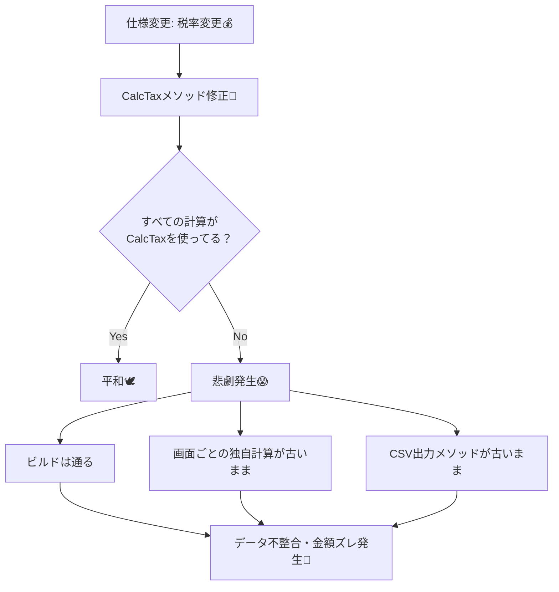
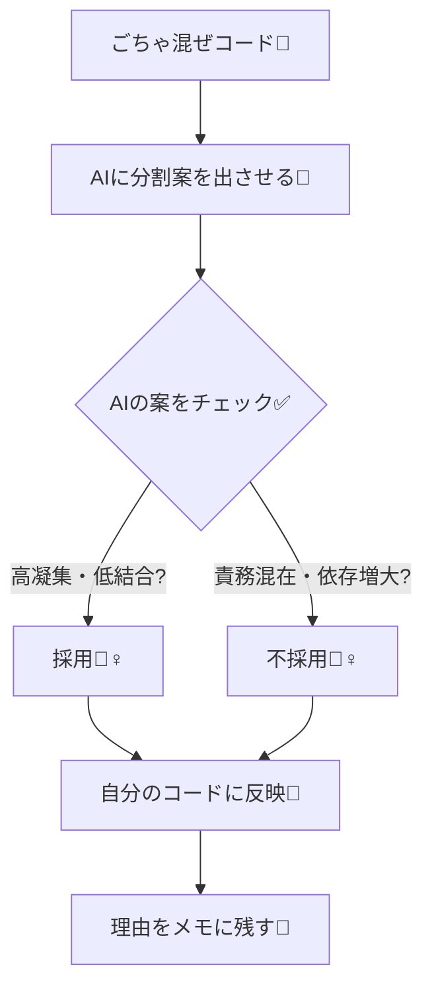

# 第01章：AI支援の使い方（この教材の共通ルール）🤖✨

## 1. この章のゴール🎯


この教材では、AI（Copilot / Codex など）を✅ これ、**めっちゃ起こりがち**で、そしてだいたい壊れる😇



でもね、AIに丸投げすると **“それっぽいけど危ない設計”**が混ざりやすい…！💦
だから第1章では、**便利に使って、振り回されない**ための共通ルールを作ります🧠✅

---

## 2. AIの得意・不得意を最初に固定しよ💡

### AIが得意なこと✅（使いどころ）

* 分割案をたくさん出す✂️（責務の候補出し）
* 命名案を大量に出す🏷️（伝わる名前の候補）
* テスト観点を挙げる🧪（壊れやすい所を当てる）
* 依存関係の“におい”を指摘する🔗（密着してない？）

### AIが苦手なこと⚠️（ここは人間が握る）

* 仕様の最終判断（要件の行間）📌
* “今後の変更”まで見越した境界の決定🧭
* 新しい依存（ライブラリ/層/抽象）を増やしすぎない判断📦💥
* 「やりすぎ設計」になってないかのブレーキ🛑

> いまのC#まわりは **.NET 10（LTS）**＋ **C# 14** が最新の軸になってて、IDE側も **Visual Studio 2026** でAI機能がかなり統合されてるよ🛠️✨ ([Microsoft for Developers][1])
> つまり…AIが近くにいる時代だからこそ、**運用ルールが超大事**ってこと🤝✨

---

## 3. この教材のAI運用ルール🎀（超大事）


### ルールA：AIは「案出し」担当、決めるのはあなた🧠✅


AIの返答は **“候補集”**。
採用するかは、次の2つでチェックして決めます👇

* **責務が混ざってない？**🍲
* **依存が増えすぎてない？**🔗💥

### ルールB：1章につきプロンプトは最大2つまで🎀

情報が多いほど迷子になりやすい😵‍💫
だから各章は **プロンプト1〜2個だけ**で進めます✨
（この章で、その“型”を決めちゃうよ😊）

### ルールC：AIに頼むのは「小さく」「具体的に」🔍

おすすめの頼み方はこれ👇

* 一気に全部直させない🙅‍♀️
* まずは **分割案だけ**出してもらう
* 次に **危ない点だけ**指摘させる
* 最後に自分で **最小の修正**を入れる✍️

### ルールD：AIが提案したら、必ず「採点」する📝✨


返答を見た瞬間に、次のチェックでサクッと判定！

#### ✅ 責務チェック（高凝集）

* そのクラス、**一言で説明できる？**（できないなら混ざりがち😱）
* メソッド達が **同じ目的に向かってる？**🎯
* 「ついで処理」が入り込んでない？（ログ、保存、通知…）📎

#### ✅ 依存チェック（低結合）

* UI / 業務 / I/O が混ざってない？📦
* 変更が起きたとき、**1か所直せば済む？**（波及してない？）💥
* 便利そうだからって、interface や層を増やしすぎてない？🧱💦

---

## 4. Visual StudioでのAIの使い分け🛠️✨（迷わない版）

### ① 右クリックのCopilotアクション🖱️✨

Visual Studio 2026 では、右クリックから **Copilotのアクション**を呼べて、説明・コメント生成・最適化みたいな“軽い支援”がしやすいよ😊 ([Microsoft Learn][2])
👉 **ポイント：** ここは「小さく助けてもらう場所」💡

### ② チャットで「設計の相談」💬🧠

この教材のメインはこっち！
ただし、相談は **1〜2回**で止めるのがコツ🎀（聞きすぎると迷子）

### ③ もしVisual Studio 2022を使うなら🪟

Copilotは Visual Studio 2022 だと **17.8以降**が要件として案内されてるよ📌 ([GitHub Docs][3])
（今はVS 2026もあるので、できるだけ“新しめ”がラク😊）

---

## 5. 第1章のハンズオン🛠️✨（AI案を1回だけ出して採用/不採用を書く）


### ハンズオンのねらい🎯

同じコードを見て、AIが出した案を
**「採用する理由」or「捨てる理由」**で説明できるようになること📝✨



---

### ステップ1：まず“ごちゃ混ぜコード”を用意する🍲💦

下のコードを、コンソールアプリにそのまま貼ってOK（動けばOK！）😊

```csharp
using System;
using System.Collections.Generic;
using System.IO;

public class Program
{
    public static void Main()
    {
        Console.Write("商品名: ");
        var name = Console.ReadLine() ?? "";

        Console.Write("単価: ");
        var unitText = Console.ReadLine() ?? "0";
        decimal unitPrice = decimal.TryParse(unitText, out var u) ? u : 0;

        Console.Write("数量: ");
        var qtyText = Console.ReadLine() ?? "0";
        int qty = int.TryParse(qtyText, out var q) ? q : 0;

        // ルール：小計、割引、税、合計（ここに全部入り…😱）
        var subTotal = unitPrice * qty;

        var discount = 0m;
        if (subTotal >= 10000) discount = subTotal * 0.10m;
        else if (subTotal >= 5000) discount = subTotal * 0.05m;

        var afterDiscount = subTotal - discount;
        var tax = afterDiscount * 0.10m;
        var total = afterDiscount + tax;

        // ログもここ
        Console.WriteLine($"[LOG] Calculated total: {total}");

        // “保存”もここ（本当はDBとかのつもり）
        var line = $"{DateTime.Now:O},{name},{unitPrice},{qty},{total}";
        File.AppendAllLines("orders.csv", new[] { line });

        // “通知”もここ（本当はメールとかのつもり）
        Console.WriteLine($"✅ 注文完了！ {name} x{qty} 合計 {total} 円");
    }
}
```

---

### ステップ2：AIに「分割案」を1回だけ出させる🤖💡

ここでチャットに **プロンプト①**を投げるよ！

#### AIプロンプト① 🤖

1回だけね🎀（連投しない！）

> 「このコードの責務を3つに分ける案を、クラス名付きで提案して」

---

### ステップ3：AI案の「危ない点」を指摘させる🤖⚠️

次に **プロンプト②** を1回だけ！

#### AIプロンプト② 🤖

> 「その案は責務の混在や依存増加がない？危ない点を3つ指摘して」

---

### ステップ4：採用/不採用を自分の言葉で書く📝✨

ここがいちばん大事！！（この教材のキモ🎯）

#### 記録テンプレ📝（コピペOK）

* AI案（3分割）はこうだった：

  * ①〇〇：
  * ②〇〇：
  * ③〇〇：
* 採用した点✅：

  * （例）UIと計算を分けるのは変更に強そう、など
* 捨てた点🗑️：

  * （例）interface増やしすぎで逆に複雑、など
* 私の結論🎀：

  * “今回はここまで”直す（最小の一歩）✂️


---

## 6. この章で覚えておく「合言葉」🔖✨

* AIは **案出し係**💡
* 人間は **責務と依存の審査官**🧠✅
* プロンプトは **1章1〜2個**🎀
* 直すのは **最小の一歩**✂️✨

---

## 7. ちょい補足：Copilot以外（Codex等）でも同じ運用でOK🤝

OpenAIのCodexみたいな“作業を進める系”のAIでも、ルールは同じだよ😊
**「案はもらう、決めるのは自分」**が最強🛡️✨ ([OpenAI][4])

---

## まとめ🎉

第1章は、設計の勉強というより **“AIとの付き合い方の型づくり”**でした😊✨
次章からは、わざと「変更が怖い😱」コードを体験して、
高凝集・低結合が必要な理由を体でわかるようにしていくよ〜💪💖

[1]: https://devblogs.microsoft.com/dotnet/announcing-dotnet-10/?utm_source=chatgpt.com "Announcing .NET 10"
[2]: https://learn.microsoft.com/en-us/visualstudio/releases/2026/release-notes?utm_source=chatgpt.com "Visual Studio 2026 Release Notes"
[3]: https://docs.github.com/copilot/get-started/quickstart?utm_source=chatgpt.com "Quickstart for GitHub Copilot"
[4]: https://openai.com/index/introducing-codex/?utm_source=chatgpt.com "Introducing Codex"

