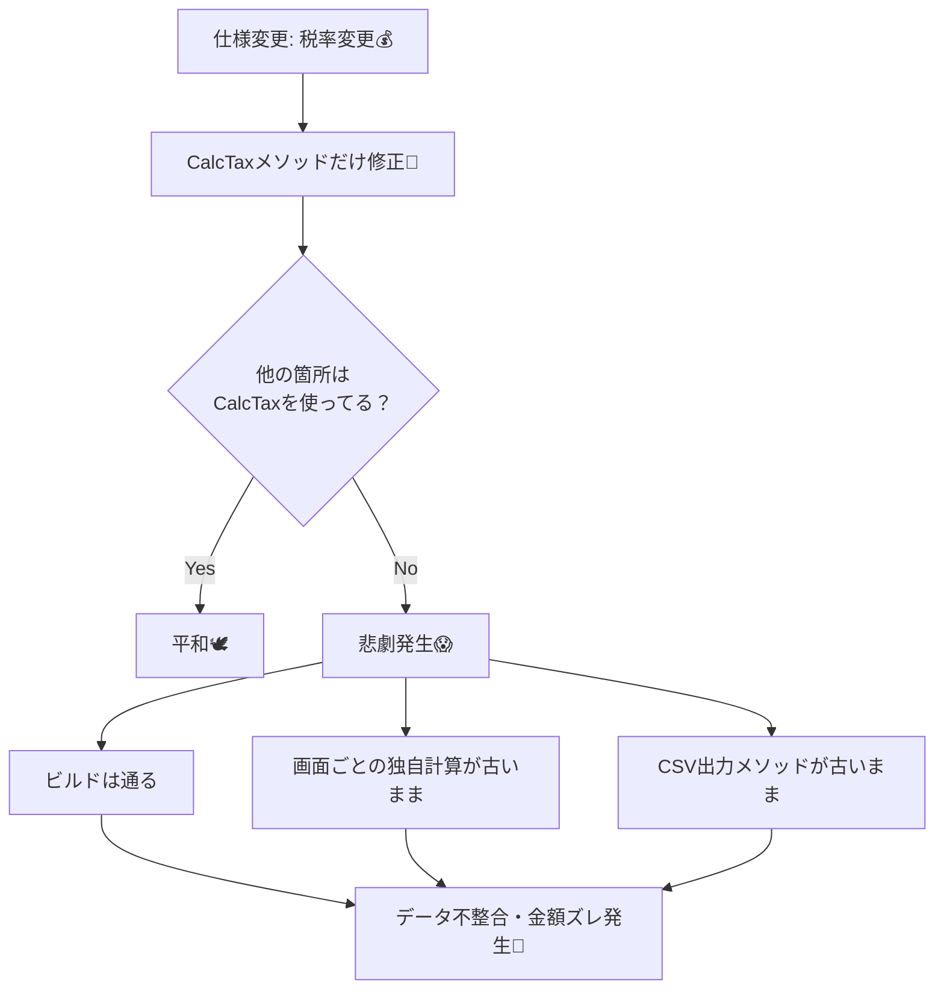

# 第02章：まず“変更が怖い”を体験する😱➡️😄

## この章のゴール🎯

* 「ちょい修正」のつもりが、**あちこち壊れる**感覚を体験する💥
* “怖さ”の正体（どこが地雷か）を、**自分の言葉で説明**できるようになる🗣️✨
* 次章以降で直していくための「観察メモ」を残せるようになる📝💕

---

## 1) まずは“変更が怖い”ってどんな状態？😱


「変更が怖い」って、だいたいこう👇

* 1か所直したら、別の場所が壊れる💣
* 直してないはずの機能が壊れる（しかも理由が分からない）🌀
* どこをa修正すべきか判断できなくて、**検索→勘→祈り**になる🙏
* 直ったと思ったら、**金額がズレてる**（もっと怖い）💸😇

この章は、あえて **“怖いコード”** を触って、怖さを味わいます🎢✨
（そして「なぜ怖いのか」をメモして、次章で言語化していくよ📚）

---

## 2) ハンズオン🛠️：1ファイル地獄のミニアプリを動かす💥


### 2-1. プロジェクト作成🧁

* **Console App（.NET 10）** を作ってね（新しめでOK）😄
  .NET 10 は LTS で、VS 2026 でもサポートされてるよ📌 ([Microsoft for Developers][1])

プロジェクト名は例：`ScaryChangeDemo` 🎀

---

### 2-2. まずは「悪い例」を貼って実行▶️😈

`Program.cs` をぜんぶ置き換えて実行してね（F5 / Ctrl+F5）✨

```csharp
using System.Text;
using System.Text.Json;

// ❌ ぜんぶ1ファイル / ぜんぶstatic / ぜんぶ混在（UI・業務・保存・集計）
// 今日は「怖さ」を体験する章なので、あえてこうしてます😈

static class AppConfig
{
    // ❌ 魔法の数字（税率）＆globalな設定（どこからでも参照される）
    public static decimal TaxRate = 0.10m;

    // ❌ 仕様がここに直書き
    public static bool StudentMode = true;
}

static class Logger
{
    // ❌ どこからでも呼べる（依存が見えにくい）
    public static void Info(string msg) =>
        Console.WriteLine($"[INFO] {DateTime.Now:HH:mm:ss} {msg}");
}

record OrderLine(string Sku, string Name, string Category, int Qty, decimal UnitPrice);

static class Program
{
    static void Main()
    {
        Logger.Info("Start!");

        // ❌ 入力がコード直書き（UI/データが混在）
        var order = LoadOrderFromJson("""
        {
          "lines": [
            { "sku": "A001", "name": "Sandwich", "category": "Food",  "qty": 2, "unitPrice": 420 },
            { "sku": "B010", "name": "Notebook", "category": "Goods", "qty": 1, "unitPrice": 300 }
          ]
        }
        """);

        // ❌ ここで請求書作りつつ、保存もして、画面表示もして、ついでに集計もする
        var invoiceText = BuildInvoiceAndAlsoSaveStuff(order);

        Console.WriteLine();
        Console.WriteLine("===== INVOICE (Console) =====");
        Console.WriteLine(invoiceText);

        Logger.Info("Done!");
        Console.WriteLine("Press any key...");
        Console.ReadKey();
    }

    static List<OrderLine> LoadOrderFromJson(string json)
    {
        // ❌ JSONの構造にべったり（将来変わると全部巻き込む）
        using var doc = JsonDocument.Parse(json);
        var lines = new List<OrderLine>();
        foreach (var e in doc.RootElement.GetProperty("lines").EnumerateArray())
        {
            lines.Add(new OrderLine(
                e.GetProperty("sku").GetString()!,
                e.GetProperty("name").GetString()!,
                e.GetProperty("category").GetString()!,
                e.GetProperty("qty").GetInt32(),
                e.GetProperty("unitPrice").GetDecimal()
            ));
        }
        return lines;
    }

    static string BuildInvoiceAndAlsoSaveStuff(List<OrderLine> lines)
    {
        // ❌ 検証・計算・文字列整形・保存・分析…全部やる
        Validate(lines);

        var subtotal = lines.Sum(x => x.UnitPrice * x.Qty);

        // ❌ 税計算が「別の場所でも」出てくる（重複のタネ）
        var tax = CalcTax(subtotal);

        // ❌ 割引ルールもここで直書き
        var discount = AppConfig.StudentMode ? CalcStudentDiscount(subtotal) : 0m;

        // ❌ 合計の出し方がまた別（しかも再計算）＝ズレの温床
        var total = CalcTotalAgain(lines);

        // ❌ 表示（UI）
        var sb = new StringBuilder();
        sb.AppendLine("Items:");
        foreach (var x in lines)
        {
            sb.AppendLine($"- {x.Name} x{x.Qty}  {x.UnitPrice} yen  ({x.Category})");
        }
        sb.AppendLine($"Subtotal: {subtotal} yen");
        sb.AppendLine($"Tax(10%): {tax} yen");
        sb.AppendLine($"Discount(Student): -{discount} yen");
        sb.AppendLine($"TOTAL: {total} yen");

        // ❌ 保存（I/O）
        File.WriteAllText("invoice.txt", sb.ToString(), Encoding.UTF8);

        // ❌ ついでの集計（分析） ※ここでも税率が出る（しかも魔法の数字）
        SaveAnalyticsCsv(lines);

        Logger.Info("invoice.txt / analytics.csv saved!");
        return sb.ToString();
    }

    static void Validate(List<OrderLine> lines)
    {
        if (lines.Count == 0) throw new InvalidOperationException("No lines!");
        if (lines.Any(x => x.Qty <= 0)) throw new InvalidOperationException("Qty must be > 0");
        if (lines.Any(x => x.UnitPrice < 0)) throw new InvalidOperationException("Price must be >= 0");
    }

    static decimal CalcTax(decimal subtotal)
        => Math.Round(subtotal * AppConfig.TaxRate, 0, MidpointRounding.AwayFromZero);

    static decimal CalcStudentDiscount(decimal subtotal)
    {
        // ❌ 仕様：1000円以上なら5%割引（とりあえず）
        if (subtotal >= 1000m) return Math.Round(subtotal * 0.05m, 0, MidpointRounding.AwayFromZero);
        return 0m;
    }

    static decimal CalcTotalAgain(List<OrderLine> lines)
    {
        // ❌ ここでもう一度計算（subtotal/tax/discountを別々に再計算）
        var subtotal = lines.Sum(x => x.UnitPrice * x.Qty);

        // ❌ ここは AppConfig を使ってるけど…
        var tax = Math.Round(subtotal * AppConfig.TaxRate, 0, MidpointRounding.AwayFromZero);

        // ❌ 割引は、こっちは「1000円以上なら固定50円」みたいにズレてる（わざと）
        var discount = AppConfig.StudentMode && subtotal >= 1000m ? 50m : 0m;

        return subtotal + tax - discount;
    }

    static void SaveAnalyticsCsv(List<OrderLine> lines)
    {
        var subtotal = lines.Sum(x => x.UnitPrice * x.Qty);

        // ❌ 税率がここだけ直書き（AppConfigすら使ってない）
        var tax = Math.Round(subtotal * 0.10m, 0, MidpointRounding.AwayFromZero);

        var total = subtotal + tax;
        var csv = new StringBuilder();
        csv.AppendLine("items,subtotal,tax,total");
        csv.AppendLine($"{lines.Count},{subtotal},{tax},{total}");
        File.WriteAllText("analytics.csv", csv.ToString(), Encoding.UTF8);
    }
}
```

✅ 実行できたら、フォルダに `invoice.txt` と `analytics.csv` ができてるはず📄✨
そして、すでに **怪しさ** あるよね…？（計算が複数箇所にある👻）

---

## 3) 変更依頼📩：「税率が変わりました」😇（ここから地獄）

突然仕様変更ですっ📣💥

### 新仕様（今日の変更）🆕

* `Category == "Food"` は **8%**
* それ以外は **10%**
* 請求書には **税率別の税額内訳** を出したい（Food税 / その他税）🍞📒

---

## 4) まずは“雑に直して”壊してみよう😈🔧

この章は、上手に直すのが目的じゃないよ🙅‍♀️
**「壊れ方」と「波及」を記録するのが目的**📝✨

### 4-1. ありがちな雑修正（やってOK）😈

とりあえず `CalcTax` を「Foodなら8%」にしたくなるよね？
でも今の `CalcTax` は **subtotalしか受け取らない** から、Category別にできない…🤔

そこで多くの人はこうする👇

* `CalcTax(decimal subtotal)` を放置して
* `BuildInvoiceAndAlsoSaveStuff` の中で Food/Other を別計算して、表示だけ直す

✅ これ、**めっちゃ起こりがち**で、そしてだいたい壊れる😇



### 4-2. 何が起きる？（観察ポイント）👀💥


雑修正すると、だいたいこうなる：

* コンソールの請求書だけ税が合ってる（気がする）
* でも `invoice.txt` / `analytics.csv` は古い税率のまま📄💣
* さらに `TOTAL` がズレる（`CalcTotalAgain` が別ルールだから）💸😱

つまり「直した場所だけ正しい」状態になって、**静かに壊れる**のが最恐ポイント😇🧊

---

## 5) “壊れた場所”を記録しよう📒✨（超重要）

変更したら、次のテンプレでメモしてね📝💕

**変更ログ（コピペして使ってOK）**

* 変更したファイル：
* 変更した内容（1行で）：
* 壊れた症状（例：TOTALがズレる / CSVが古い / 表示が矛盾）：
* 原因っぽい場所（行番号 or メソッド名）：
* 「なぜ怖い？」一言で：

このメモが、次章以降の“設計の言葉”に変わるよ🪄✨

---

## 6) よくある「壊れ方の正体」図鑑👻📚


今回のコード、怖さの材料が山盛り🍲💥

* **重複ロジック**：税計算・合計計算が複数箇所にある🔁


  → 1個直しても他が残る＝矛盾が起きる😇
* **責務の混在**：計算・表示・保存・分析が1メソッドに同居🏠💦


  → 仕様変更のたびに全部触ることになる🧤
* **隠れ依存**：`static`（`AppConfig`, `Logger`）でどこからでも触れる🕸️


  → “どこが影響受けるか”が見えない😵
* **データ構造にべったり**：JSONの形が変わると広範囲が壊れる📦💣

このへんが、まさに「高凝集・低結合」が必要になる理由だよ〜😄✨

---

## 7) AIで「変更が怖いポイント」を洗い出す🤖🔍（この章のAIは1回だけ🎀）

ここで AI の出番💡
ただし、**採用するかは人間が決める**よ🧠✅（責務混在🍲／依存増えすぎ🔗 を見る！）

### AIプロンプト🤖（1つだけ）

```text
このコードで“変更が怖いポイント”を5つ、理由つきで指摘して
```

### AIの回答を見たら、こうチェック✅

* 「重複してる計算」はどこ？（税/合計/割引）🔁
* 「1メソッドでやりすぎ」はどこ？🍲
* 「staticで隠れてる依存」はどこ？🕸️
* “変更仕様（税率別）”を入れた時、どこが巻き込まれそう？💣

---

## 8) （おまけ）30秒セーフティネット🧪✨

時間あったらでOK🙆‍♀️
**テストが1本あるだけで怖さが激減**するよ🧸

* xUnit は v3 系が .NET 8+ をサポートしてるよ📌 ([xunit.net][2])
* ただ、この章は「怖さ体験」メインなので、次章以降で本格的にやっても大丈夫👌

---

## 9) まとめ🎁（今日持ち帰るもの）

今日の勝ち🏆✨はこれ！

* 「小変更がどこへ波及したか」を**自分のメモ**で残せた📝
* 怖さの正体が、だいたいこの4つだと分かった👇

  * 重複🔁 / 混在🍲 / 隠れ依存🕸️ / べったり結合🧲
* 次章で「凝集」「結合」の言葉を覚えると、今日のメモが一気に整理される📚✨

---

## ミニ宿題🎀（10分でOK）

* 仕様変更をもう1個だけ足してみて、**壊れた場所を3つ**メモ📝
  例：

  * 小数の丸めを「切り上げ」にしたい⬆️
  * `Category` を `"Food"` じゃなく `"Meal"` に名前変更したい🏷️
  * 請求書の出力を「円」付きにしたい💴✨

次は第3章で、今日の「怖さメモ」を“用語”に変えてスッキリさせるよ〜😄📚✨ ([Microsoft Learn][3])

[1]: https://devblogs.microsoft.com/dotnet/announcing-dotnet-10/?utm_source=chatgpt.com "Announcing .NET 10"
[2]: https://xunit.net/?utm_source=chatgpt.com "xUnit.net: Home"
[3]: https://learn.microsoft.com/en-us/dotnet/csharp/whats-new/csharp-14?utm_source=chatgpt.com "What's new in C# 14"

