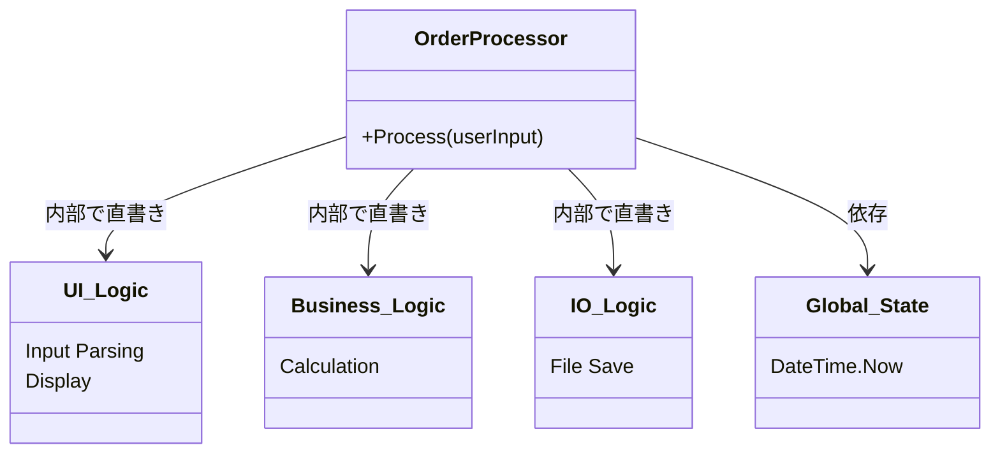

# 第03章：用語をやさしく理解（凝集／結合）📚✨

## 0) 今日のゴール🎯

この章が終わったら…👇

* 「このクラス、**高凝集**だね🎯」を**理由つきで**言える
* 「ここ、**結合が強すぎ**て変更が怖い🔗💦」を**指さして**言える
* そして、**“結合ゼロが正義じゃない”**も腑に落ちる🙆‍♀️✨

---

## 1) まずは一言で！凝集と結合🧠✨

### ✅ 凝集（Cohesion）＝「クラスの中が、同じ目的でまとまってる度」🎯

* 高凝集：同じ目的のものが“ぎゅっ”と集まってる🍙
* 低凝集：関係ないものまで“ごちゃ混ぜ”🍲💥

### ✅ 結合（Coupling）＝「他のクラスに、どれくらい依存してるか」🔗

* 低結合：必要最小限だけに頼る🤝✨
* 高結合：相手の事情を知りすぎ＆影響されすぎ😵‍💫

> “結合”は「つながりの**量**」だけじゃなく、「つながりの**質**（ヤバさ）」が大事だよ〜🧪✨
> （相手の“内部事情”にベッタリだと、だいたい辛い…） ([Microsoft Learn][1])

---

## 2) 最新のC#目線で軽くアップデート🆕✨

2026年1月時点だと、.NET は **.NET 10（LTS）**が最新ラインで、C# も **C# 14** が “今の最新世代” だよ〜📌✨ ([Microsoft][2])
Visual Studio も **Visual Studio 2026** が出てて、.NET 10 / C# 14 をサポートしてるよ🛠️✨ ([Microsoft Learn][3])

（この章の内容は、C#の文法が何であっても一生使える“設計の言葉”だから安心してね☺️🫶）

---

## 3) たとえ話で一瞬で掴む🧩✨

### 🍱 高凝集＝「お弁当箱の中が、役割でまとまってる」


* おかずゾーン🥦・ごはんゾーン🍚・デザート🍓
  → 取り出しやすい＆増減しやすい✨

### 🍲 低凝集＝「お弁当箱に、何でも突っ込んだ」

* おかずとUSBとレシートとリップが同居💄🔌🧾
  → 探しにくい＆“ちょい変更”でぐちゃる💥

---

### 🧷 低結合＝「友だち関係が “約束だけ” で回ってる」


* 「集合は19:00ね！」みたいな最低限の約束📜
  → 相手の部屋の模様替え（内部変更）では困らない✨

### 🧷 高結合＝「相手の部屋の鍵と家計簿と予定表を握ってる」

* 相手が引っ越したら全部崩壊🏚️💥
  → 変更の波及が怖い😱

---

## 4) すぐ使える！判定チェックリスト✅✨

## 4-1) 高凝集チェック🎯

次の質問に「YES」が多いほど高凝集っぽいよ👇

* ✅ **クラス名を一文で説明できる？**（例：注文の合計金額を計算する）
* ✅ メソッド同士が**同じ目的**に向かってる？
* ✅ 「この変更が入ったらこのクラスが変わる」っていう**変更理由が1つ寄り**？
* ⚠️ 逆に、「UIもDBも計算も…」みたいに**変更理由が複数**なら低凝集🍲

---

## 4-2) 低結合チェック🔗

* ✅ 依存先が少ない（クラスが知らない相手が多いほどラク）
* ✅ **“具体クラス”にベッタリじゃない**（差し替え余地がある）
* ✅ 依存先の「内部事情」じゃなく、**“約束（インターフェース／戻り値）”だけ**見てる
* ⚠️ `static` や `new` だらけ、グローバル状態参照だらけだと結合が強くなりがち⚡ ([Microsoft Learn][1])

---

## 5) 「結合ゼロ」が正義じゃない🙅‍♀️⚖️

現実のプログラムは、**何かに依存しないと何もできない**よね？（ログ、時間、DB、API…）
だから目標は👇

### ✅ “必要な依存はOK” でも “依存の仕方” を整える✨

* 依存の数を減らす（量）
* 依存を安全にする（質）

  * 例：**内部実装じゃなく、約束に依存する**
  * 例：差し替えできる余地を残す

---

## 6) ミニ例で体感🧪✨（同じ「注文合計」でもこんなに違う）

### ❌ 低凝集＋高結合（ごちゃ混ぜ🍲💥）

* 1クラスで「入力」「計算」「保存」「画面表示」まで全部やる
* さらに `DateTime.Now` や DB 直接操作が混ざってる
  → 変更理由が多すぎる＆波及が起きやすい😱

```csharp
public class OrderProcessor
{
    public void Process(string userInput) // Input: "Apple,100"
    {
        // ❌ 1. 入力解析 (UIの仕事)
        if (string.IsNullOrEmpty(userInput)) return;
        var parts = userInput.Split(',');
        var name = parts[0];
        var price = int.Parse(parts[1]);

        // ❌ 2. 業務ロジック/計算 (Domainの仕事)
        var taxRate = 0.10m; // ここにビジネスルールがある
        var total = price * (1 + taxRate);

        // ❌ 3. 外部I/O/保存 (Infrastructureの仕事)
        using (var sw = new System.IO.StreamWriter("orders.log", true))
        {
            sw.WriteLine($"{DateTime.Now}: {name} - {total}円"); // 時間依存も混ざる⚡
        }

        // ❌ 4. 結果表示 (UIの仕事)
        Console.WriteLine($"注文完了: {name} 支払額: {total}円");
    }
}
```



### ✅ 高凝集＋低結合（まとまり🍙✨）

考え方はシンプル👇

* 「合計を計算する人」
* 「保存する人」
* 「表示する人」
  に分ける。
  そしてそれぞれが**必要最小限**だけ知ってる状態にする🔗✨

（※この章では“概念理解”が目的なので、interface/DIは次の章で本格的にやるよ〜☺️）

---

## 7) ハンズオン🛠️：凝集／結合 判定クイズ🧩✨

### ルール📌

各クラスを見て、👇を直感でOKで判定してみてね！

* 凝集：高い？低い？🎯
* 結合：低い？高い？🔗

---

### Q1：これはどう？🧾✨

```csharp
public class PriceCalculator
{
    public decimal CalculateSubtotal(IEnumerable<decimal> prices)
        => prices.Sum();

    public decimal CalculateTax(decimal subtotal, decimal taxRate)
        => subtotal * taxRate;

    public decimal CalculateTotal(IEnumerable<decimal> prices, decimal taxRate)
    {
        var subtotal = CalculateSubtotal(prices);
        return subtotal + CalculateTax(subtotal, taxRate);
    }
}
```

---

### Q2：これはどう？😵‍💫

```csharp
public class UserManager
{
    public void Register(string email)
    {
        // 入力チェック
        if (!email.Contains("@")) throw new Exception("invalid");

        // DB保存（仮）
        System.IO.File.AppendAllText("users.txt", email + "\n");

        // メール送信（仮）
        Console.WriteLine($"Send welcome mail to {email}");

        // 画面表示（仮）
        Console.WriteLine("登録完了");
    }
}
```

---

### Q3：これはどう？⚡

```csharp
public class ReportService
{
    public string CreateDailyReport()
    {
        var today = DateTime.Now.Date; // ここがポイント⏰
        return $"Report: {today:yyyy-MM-dd}";
    }
}
```

---

### Q4：これはどう？📦

```csharp
public class CsvExporter
{
    public string Export(IEnumerable<string[]> rows)
        => string.Join("\n", rows.Select(r => string.Join(",", r)));
}
```

---

## 8) 解答＆理由💡✨

### ✅ A1

* 凝集：**高い**🎯（“価格計算”という1テーマでまとまってる）
* 結合：**低い**🔗（外部I/Oなし、他クラスにも依存してない）

### ✅ A2

* 凝集：**低い**🍲（入力チェック・保存・メール・表示…変更理由が多すぎ）
* 結合：**高い**🔗（ファイル書き込み、コンソール表示など “外側” に直で依存）

### ✅ A3

* 凝集：**高い寄り**🎯（レポート作成という目的）
* 結合：**中〜高**⏰🔗（`DateTime.Now` は “外部（時間）” への強い依存。テストや再現がしづらくなる）

  * ここは次の章で「差し替え」の話につながるよ〜🧪✨

### ✅ A4

* 凝集：**高い**🎯（CSV文字列を作ることに集中）
* 結合：**低い**🔗（入力と出力が“データ”だけ。外部に触れてない）

---

## 9) Visual Studio の“指標”も味方にする📏✨（信じすぎ注意！）

「結合」は数でもざっくり見えるよ👀
Visual Studio の Code Metrics には **Class Coupling（クラス結合度）**があって、「そのクラスが何種類のクラスを使ってるか」を測る指標があるよ📌 ([Microsoft Learn][4])
ただし、**数字が低ければ常に正義！**ではないので、あくまで「臭いを見つけるレーダー」くらいで使うのがちょうどいい☺️📡

---

## 10) AIプロンプト（この章は1個だけ🤖🎀）

クイズや自分のコードに対して、まずは“責務の一文”を作るのが最強だよ✨
（責務が一文で言えない＝低凝集のサイン率UP🍲）

**プロンプト🤖**

1. 「このクラスの責務を一文で説明して（短く！）。ついでに“変更理由”が複数ありそうなら列挙して」

---

## 11) まとめ🎉

* 高凝集＝**同じ目的でまとまってる**🍙🎯
* 低結合＝**必要最小限だけ依存してる**🤝🔗
* 結合ゼロはムリ＆不要🙅‍♀️
  → 大事なのは「依存の**量**と**質**」をコントロールすること✨

次の第4章では、この章で出てきた「変更理由」を**判断軸として使う方法**に入っていくよ〜🧠✨

[1]: https://learn.microsoft.com/en-us/archive/msdn-magazine/2008/october/patterns-in-practice-cohesion-and-coupling?utm_source=chatgpt.com "Patterns in Practice: Cohesion And Coupling"
[2]: https://dotnet.microsoft.com/en-us/download/dotnet?utm_source=chatgpt.com "Browse all .NET versions to download | .NET"
[3]: https://learn.microsoft.com/en-us/visualstudio/releases/2026/release-notes?utm_source=chatgpt.com "Visual Studio 2026 Release Notes"
[4]: https://learn.microsoft.com/en-us/visualstudio/code-quality/code-metrics-class-coupling?view=visualstudio&utm_source=chatgpt.com "Code metrics - Class coupling - Visual Studio (Windows)"

