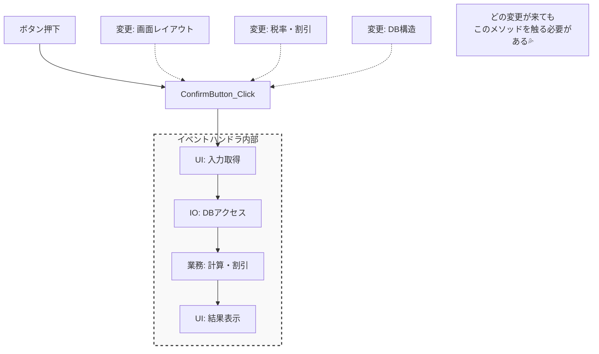

# 第04章：設計の判断軸は「変更理由」🧠✨

（分け方の基準は“好み”じゃなくて「それ、何が変わったら直す？」だよ〜😊🎀）

---

### ねらい🎯

この章が終わると…👇✨

* 「ここで分けるべき？」って迷った時に、**“変更理由”で判断**できる🧭
* **UI／業務ロジック／外部I/O** を混ぜない“境界線”が引ける🚪📦
* 小さな修正で**壊れにくい設計**の第一歩が踏み出せる😌💪

---

## 4-1. まず「変更理由」ってなに？🤔💡

めちゃくちゃシンプルに言うと👇

> **「そのコードを直すことになる“理由”」**のことだよ📝✨
>
> 

たとえば「注文合計を計算する処理」でも、変わる理由は色々あるよね👇

* 税率が変わった💰📈（業務ルールが変わった）
* 画面の見た目を変えたい🎨🖥️（UI都合で変わった）
* DBのテーブル構造が変わった🗄️🔧（外部I/O都合で変わった）

この“理由”が違うのに同じ場所に混ざってると…
**「UIちょっと変えただけなのに計算バグった😭」**みたいな事故が起きやすいの💥

ちなみにこの考え方、SRP（単一責任の原則）でもド真ん中の定義で、**「モジュールは1つの変更理由を持つべき」**って話につながるよ📚✨ ([blog.cleancoder.com][1])

---

## 4-2. 分け方の超・合言葉🪄✨

迷ったらこれだけ唱えてOK👇😄

### ✅ 合言葉①：同じ理由で変わるものは、近くにまとめる🧲

たとえば「割引ルール」と「税計算ルール」が**同時に同じ担当・同じタイミングで変わる**なら、近くに置くのはアリ🙆‍♀️✨

### ✅ 合言葉②：違う理由で変わるものは、分ける✂️

* 見た目（UI）が変わる理由
* 業務ルールが変わる理由
* DB/API/ファイル（外部I/O）が変わる理由

これらは基本、**変わるタイミングも担当も違いがち**だから分けると強いよ💪✨ ([Microsoft Learn][2])

---

## 4-3. まずは「3つの箱」で境界線を引こう📦📦📦

超入門では、いったんこれでOK！👇✨


1. **UI（画面・入力・表示）**🖥️🎛️
2. **業務ロジック（ルール・判断・計算）**🧠📏
3. **外部I/O（DB・API・ファイル・時刻・メール送信など）**🗄️🌐📁

「業務ロジックを中心にして、外側（UIやI/O）は差し替えやすくする」って考え方は、クリーンアーキテクチャ/レイヤードでも定番だよ🌸
特に **“依存は内側に向ける”** ってルールが有名✨ ([blog.cleancoder.com][3])

---

## 4-4. 例：混ざるとどう怖い？😱➡️境界を引くとどう嬉しい？😄

題材は「クーポン付きの注文合計」🍔🎟️（ありがちなやつ！）

### ❌ 悪い例：UIイベントの中に全部混ぜる（変更理由がぐちゃぐちゃ🍲💥）

```csharp
// 例：ボタン押下で注文確定（UIのはずなのに…）
private async void ConfirmButton_Click(object sender, EventArgs e)
{
    // UI: 入力取得
    var couponText = CouponTextBox.Text;

    // I/O: DBへ接続して商品取得（仮）
    var items = await _db.LoadCartItemsAsync(userId);

    // 業務: 合計計算・割引・税（全部ここ）
    decimal subtotal = items.Sum(x => x.Price * x.Quantity);
    if (!string.IsNullOrWhiteSpace(couponText))
    {
        subtotal *= 0.9m; // 10% OFF（雑！）
    }
    decimal total = subtotal * 1.10m; // 税10%（ここも雑！）

    // UI: 表示
    TotalLabel.Text = total.ToString("N0");
}
```

これ、何が怖いかというと👇😵‍♀️

* 税率変更（業務）でもこのUIイベントを触ることに…💥
* DB変更（I/O）でもここが壊れる…💥
* 画面変更（UI）でも計算に触って事故る…💥

**つまり「変更理由が3種類」混ざってる**のが問題だよ🍲🔥



---

### ✅ 良い例：まず“境界線”だけ引く（超入門版）🚪✨

この章では、DIとかinterfaceとかは次で丁寧にやるので、いまは **「箱分け」だけ**でOK🙆‍♀️🎀

```csharp
// ① 業務ロジック（ルール）だけを担当🧠✨
public sealed class OrderPricingService
{
    public decimal CalculateTotal(decimal subtotal, bool hasCoupon, decimal taxRate)
    {
        var discounted = hasCoupon ? subtotal * 0.9m : subtotal;
        return discounted * (1 + taxRate);
    }
}

// ② I/O担当（今はダミーでもOK）🗄️✨
public sealed class CartRepository
{
    public Task<List<CartItem>> LoadCartItemsAsync(string userId)
        => Task.FromResult(new List<CartItem>
        {
            new("Coffee", 500m, 2),
            new("Sandwich", 700m, 1),
        });
}

public sealed record CartItem(string Name, decimal Price, int Quantity);
```

```csharp
// ③ UIは “集める＆渡す＆表示” に寄せる🖥️✨
private async void ConfirmButton_Click(object sender, EventArgs e)
{
    var couponText = CouponTextBox.Text;                 // UI
    var items = await _repo.LoadCartItemsAsync(userId);  // I/O

    var subtotal = items.Sum(x => x.Price * x.Quantity); // ここは集計（薄い処理）
    var hasCoupon = !string.IsNullOrWhiteSpace(couponText);

    var total = _pricing.CalculateTotal(subtotal, hasCoupon, taxRate: 0.10m); // 業務へ委譲🧠
    TotalLabel.Text = total.ToString("N0"); // UI
}
```

これだけでもメリットが出るよ〜！🎉

* 税率や割引ルールが変わったら **`OrderPricingService`だけ**見ればいい🧠✨
* 画面の変更はUI側だけで済みやすい🖥️🎨
* DBの都合はRepository側に閉じ込めやすい🗄️🔒

この「変更理由で箱分け」こそが、**高凝集・低結合の入口**だよ😊💗

---

## 4-5. 変更理由から境界を引く「3ステップ」🗺️✨

### Step1️⃣：変更理由を5個くらい“妄想”する（予言🔮）

ポイント：**正解じゃなくてOK！**
「変わりそう」を出すだけで、境界が見えてくるよ〜😄

例（注文機能）🍔

* 税率が変わる
* 割引ルールが増える（学割、雨の日割など☔）
* 画面の入力項目が増える
* DBがSQLite→SQL Serverに変わる
* 外部の決済APIが変わる💳🌐

### Step2️⃣：UI／業務／I/O に分類する📦

* UI：画面・入力・表示
* 業務：ルール・計算・判断
* I/O：DB・API・ファイル・時刻など

### Step3️⃣：分類ごとに「置き場」を決める📍

最初はクラス3つでもOK🙆‍♀️
（UI側・業務側・I/O側）に“寄せる”だけでだいぶ事故が減るよ✨

---

## 4-6. ハンズオン🛠️：要件から「変わりそう」を3つ書いて境界線を引く🗺️💕

### お題：学食の注文システム🍛✨

要件（シンプル版）👇

* メニューを表示して注文できる
* クーポンがあれば割引
* 合計金額を表示

### やること①：変更理由を3つ書く📝

例（このまま真似してOK）

* UI：注文画面のレイアウト変更
* 業務：割引ルールが「10%」→「固定100円引き」に変更
* I/O：メニュー取得が「DB」→「Web API」になる

### やること②：境界線を引く（図でOK）✍️

こんな感じでOK👇

* UI：画面イベント、入力取得、表示
* 業務：`CalculateTotal()`
* I/O：`LoadMenu()` `LoadCartItems()`

### やること③：コードにする（最低限の骨組み）🦴✨

* `OrderPricingService`（業務）
* `MenuRepository`（I/O）
* 画面（UI）は“渡して表示するだけ”に寄せる

---

## 4-7. よくある落とし穴😵‍♀️💦（ここ大事！）

* **「とりあえずクラス分割」して満足**しちゃう🥲
  → 分割の根拠が“変更理由”じゃないと、また混ざる🍲
* **UIに計算ロジックが残る**🖥️💥
  → 画面改修で壊れやすい原因No.1！
* **I/Oの都合（DBの列名とか）が業務に漏れる**🗄️➡️🧠😱
  → 次章以降で「依存」を弱める練習をするよ🔗✨

---

## 4-8. AIプロンプト🤖（この章は1つだけ🎀）

（要件を貼って、**変更理由**を出してもらうよ！）

```text
この機能の「変更理由」を5つ挙げてください。
それぞれを UI / 業務ロジック / 外部I/O（DB・API・ファイル等） に分類して、
最後に「境界線（分ける場所）」の提案を1つください。
```

使い方のコツ🍀

* AIの案は“候補”💡
* 採用する前に **「それ同じ理由で変わる？」**を自分で確認🧠✅

---

## 4-9. まとめ🎉

* 設計の判断軸は **「変更理由」**🧠✨（好みで分けない！）
* まずは **UI／業務／I/O** の3箱で境界線を引く📦📦📦
* “同じ理由で変わるものをまとめ、違う理由は分ける”が基本🎯✨ ([blog.cleancoder.com][1])

---

必要なら次に、あなたの教材用に
**第4章の「クイズ問題セット🧩」**（正解・解説つき）も作れるよ😊💖

[1]: https://blog.cleancoder.com/uncle-bob/2014/05/08/SingleReponsibilityPrinciple.html?utm_source=chatgpt.com "The Single Responsibility Principle - Clean Coder Blog"
[2]: https://learn.microsoft.com/en-us/dotnet/architecture/modern-web-apps-azure/architectural-principles?utm_source=chatgpt.com "Architectural principles - .NET"
[3]: https://blog.cleancoder.com/uncle-bob/2012/08/13/the-clean-architecture.html?utm_source=chatgpt.com "Clean Architecture by Uncle Bob - The Clean Code Blog"

