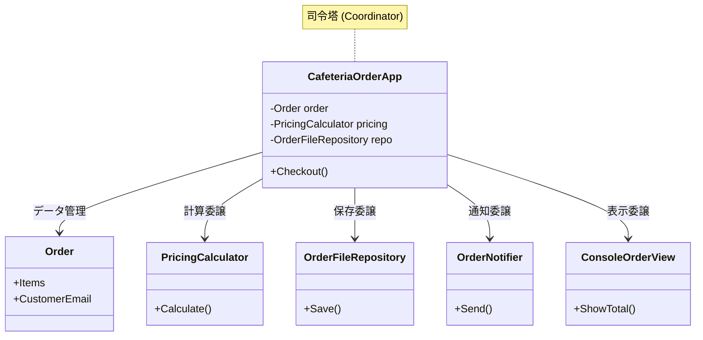

# 第05章：ニオイ図鑑① God Class（何でも屋）🧟‍♀️💦

### ねらい🎯

* 「うわ…このクラス何でもやってる…😇」を**見抜ける目**をつくる👀✨
* 分割の第一歩「責務ラベル🏷️」で、**安全に分ける入口**を体験する🚪💖

---

## 0) 今どき前提のミニ豆知識🪄

2026年1月時点の最新ラインだと、**.NET 10（LTS）**が最新で、C#も**C# 14**が最新です📦✨（Visual Studio 2026 同時期リリース） ([Microsoft for Developers][1])
※この章は“文法の新機能”じゃなく、**設計の目👀**を育てる回だよ〜！

---

## 1) God Classってなに？🧟‍♀️

一言でいうと…

**「1つのクラスが責務を抱えすぎて、巨大化した状態」**😵💦


* 責務が多い → クラス内が“関心ごとの鍋🍲”になる
* 結果：**凝集が下がる**（まとまりがなくなる）
* さらに：いろんな所を知る → **結合が上がる**（依存が増える）🔗💥

こういうのは、一般に **God Class（Large Class / Blob）**みたいな「コードのニオイ」として扱われます🧪🫧 ([ResearchGate][2])

---

## 2) God Classあるある症状チェック✅（初心者でも見抜ける版）

次のうち **3つ以上**当てはまったら、かなり怪しいよ🚨💦

### 見た目のサイン👀

* ファイルがやたら長い（スクロール地獄📜）
* フィールド（メンバ変数）が多い📦📦📦
* メソッドが多い／名前もバラバラ（Save/Print/Send/Validate…）🌀
* `using` が多い（あちこちの機能を取り込んでる）🧲

### 変更のサイン🛠️

* 仕様変更のたびに「このクラスだけ毎回編集してる」✍️💦
* ちょっと直したら別機能が壊れる😱（影響範囲が読めない）
* 「このクラス、何のため？」が一文で言えない🤯

### 依存のサイン🔗

* DB、ファイル、API、メール、ログ、UI…何でも触る📡🗃️📧🪵
* いろんな型をnewして、いろんな場所に手を伸ばす🖐️🌍

---

## 3) 分割の第一歩は「責務ラベル🏷️」🎨（いきなり切らない！）

いきなり「クラス分割だー！✂️」ってやると、初心者はだいたい事故ります🚑💦
だから順番はこれ👇✨


### ステップ0：切らないで“色分け”する🎨

1つのクラスの中にコメントでラベルを貼っていくよ🏷️

* 🧾 **入力/表示（UI）**
* 🧠 **業務ルール（ドメイン）**
* 🧮 **計算（ルール）**
* 💾 **保存（DB/ファイル）**
* 📧 **通知（メール等）**
* 🪵 **ログ**

この“色分け”ができると、分割がめちゃ安全になる😊🎀

---

## 4) ハンズオン🛠️：God Classを「責務ラベル→分割案」まで作る🎉

### お題：学食注文アプリ（超ミニ）🍛

まずは **わざとダメな例**からいくね😈（ニオイ嗅ぎ練習🫧）

#### 4-1) ダメな例（God Class）🧟‍♀️

```csharp
using System;
using System.Collections.Generic;
using System.IO;

public class CafeteriaOrderManager
{
    // いろんな責務のデータが混在💦
    private readonly List<(string name, int price)> _items = new();
    private int _discountPercent;
    private string _customerEmail = "";

    public void AddItem(string name, int price)
    {
        _items.Add((name, price));
        Console.WriteLine($"追加: {name} {price}円"); // 表示(UI)混在
    }

    public void SetCustomerEmail(string email)
    {
        if (!email.Contains("@")) // 簡易バリデーション(業務/ルール)混在
            throw new ArgumentException("メールが変だよ😵");
        _customerEmail = email;
    }

    public void ApplyStudentDiscount(bool isStudent)
    {
        _discountPercent = isStudent ? 10 : 0; // ルール(計算)混在
    }

    public int CalculateTotal()
    {
        int sum = 0;
        foreach (var item in _items) sum += item.price;

        int discount = sum * _discountPercent / 100;
        int total = sum - discount;

        Console.WriteLine($"合計: {sum}円 / 割引: {discount}円 / 支払: {total}円"); // 表示(UI)混在
        return total;
    }

    public void SaveOrderToFile(string path)
    {
        // 保存(I/O)混在
        using var sw = new StreamWriter(path, append: true);
        sw.WriteLine($"--- {DateTime.Now} ---");
        foreach (var item in _items) sw.WriteLine($"{item.name},{item.price}");
        sw.WriteLine($"discount={_discountPercent}%");
        sw.WriteLine($"email={_customerEmail}");
        sw.WriteLine();
    }

    public void SendConfirmationEmail()
    {
        // 通知(外部)っぽいこと（今回はダミー）
        if (string.IsNullOrWhiteSpace(_customerEmail))
            throw new InvalidOperationException("メール未設定だよ😵");

        Console.WriteLine($"📧 {_customerEmail} に確認メール送信！（のつもり）");
    }
}
```

---

### 4-2) まずやること：責務ラベルで色分け🎨🏷️

上のコードをコピーして、**各行にラベルコメント**を入れてみよう✨
（ほんとに“コメントで”OKだよ！）

例👇

* `Console.WriteLine(...)` → 🧾UI
* `email.Contains("@")` → ✅検証/ルール
* `CalculateTotal()` の中 → 🧮計算
* `StreamWriter` → 💾I/O
* `SendConfirmationEmail()` → 📧通知

---

### 4-3) ラベルが貼れたら「分割候補」を作る📦✨

色分けできたら、だいたいこう分けられるよ👇😊

* 🧮 **PricingCalculator**（合計・割引の計算）
* ✅ **CustomerEmailValidator**（メール検証）
* 💾 **OrderFileRepository**（ファイル保存）
* 📧 **OrderNotifier**（通知）
* 🧾 **ConsoleOrderView**（表示）
* 🧠 **Order**（注文データ本体：アイテムと状態を持つ）

ここでポイント🎀
**「データ（注文）と、その近くにある自然な振る舞い」**をセットで考えると、凝集が上がりやすいよ🏠✨

---

## 5) 例：分割後の姿（完成イメージ）🌟

全部を完璧に作らなくてもOK！まずは“分け方”が大事だよ😊🎀

```csharp
using System;
using System.Collections.Generic;
using System.IO;

public record OrderItem(string Name, int Price);

public class Order
{
    private readonly List<OrderItem> _items = new();
    public IReadOnlyList<OrderItem> Items => _items;
    public string CustomerEmail { get; private set; } = "";

    public void AddItem(string name, int price) => _items.Add(new OrderItem(name, price));
    public void SetCustomerEmail(string email) => CustomerEmail = email;
}

public class PricingCalculator
{
    public (int sum, int discount, int total) Calculate(IReadOnlyList<OrderItem> items, int discountPercent)
    {
        int sum = 0;
        foreach (var i in items) sum += i.Price;

        int discount = sum * discountPercent / 100;
        int total = sum - discount;
        return (sum, discount, total);
    }
}

public class CustomerEmailValidator
{
    public void Validate(string email)
    {
        if (string.IsNullOrWhiteSpace(email) || !email.Contains("@"))
            throw new ArgumentException("メールが変だよ😵");
    }
}

public class OrderFileRepository
{
    public void Save(string path, Order order, int discountPercent)
    {
        using var sw = new StreamWriter(path, append: true);
        sw.WriteLine($"--- {DateTime.Now} ---");
        foreach (var item in order.Items) sw.WriteLine($"{item.Name},{item.Price}");
        sw.WriteLine($"discount={discountPercent}%");
        sw.WriteLine($"email={order.CustomerEmail}");
        sw.WriteLine();
    }
}

public class OrderNotifier
{
    public void Send(string email)
    {
        if (string.IsNullOrWhiteSpace(email))
            throw new InvalidOperationException("メール未設定だよ😵");

        Console.WriteLine($"📧 {email} に確認メール送信！（のつもり）");
    }
}

public class ConsoleOrderView
{
    public void ShowAdded(string name, int price) => Console.WriteLine($"追加: {name} {price}円");
    public void ShowTotal(int sum, int discount, int total)
        => Console.WriteLine($"合計: {sum}円 / 割引: {discount}円 / 支払: {total}円");
}

public class CafeteriaOrderApp
{
    private readonly Order _order = new();
    private readonly PricingCalculator _pricing = new();
    private readonly CustomerEmailValidator _emailValidator = new();
    private readonly OrderFileRepository _repo = new();
    private readonly OrderNotifier _notifier = new();
    private readonly ConsoleOrderView _view = new();

    private int _discountPercent;

    public void AddItem(string name, int price)
    {
        _order.AddItem(name, price);
        _view.ShowAdded(name, price);
    }

    public void SetCustomerEmail(string email)
    {
        _emailValidator.Validate(email);
        _order.SetCustomerEmail(email);
    }

    public void ApplyStudentDiscount(bool isStudent) => _discountPercent = isStudent ? 10 : 0;

    public int Checkout(string savePath)
    {
        var (sum, discount, total) = _pricing.Calculate(_order.Items, _discountPercent);
        _view.ShowTotal(sum, discount, total);

        _repo.Save(savePath, _order, _discountPercent);
        _notifier.Send(_order.CustomerEmail);

        return total;
    }
}
```



---

## 6) 分割が“うまくいってる”サイン🌈

* クラス名を見ただけで役割がわかる🏷️✨
* 変更理由が分かれる

  * 計算ルール変更 → `PricingCalculator`
  * 保存形式変更 → `OrderFileRepository`
  * 表示変更 → `ConsoleOrderView`
* 1つのクラスの中で「話題が飛びまくる🌀」が減る

これ、まさに **高凝集・低結合の入口**だよ〜！🎉

---

## 7) よくある失敗あるある😵💦（先に潰す！）

* ❌ **細かくしすぎて迷子**（クラスが増えすぎ）🧩🧩🧩
  → まずは **2〜4個くらい**に分けるでOK👌
* ❌ 分けたのに、呼び出しがぐちゃぐちゃ（依存の方向が地獄）🔗💥
  → いったん **“司令塔”役（App/Service）**を1個にまとめて、そこから呼ぶと整理しやすい🧭
* ❌ `Util` / `Manager` に逃げる🏃‍♀️💨
  → 「何を保証するクラス？」って言える名前にしよ💖

---

## 8) この章のミニ宿題📝✨

1. 自分の過去コード（または適当な小プロジェクト）から
   **“何でも屋っぽいクラス”を1個**見つける🧟‍♀️
2. そのクラスに **責務ラベルを10個以上**貼る🏷️🎨
3. 「分割候補クラス名」を **最低3つ**書く📦✨
   （実装しなくてOK！今日は“見抜く練習”が主役🎀）

---

## AIプロンプト🤖（この章は1つだけ🎀）

1つの巨大クラスを貼って、これだけ聞いてね👇✨

**プロンプト**
「このクラスを責務ごとにグルーピングして、責務ラベル（UI/業務/計算/I-O/通知/ログなど）を付けて。さらに分割後のクラス名案も出して。最後に“分割しすぎ注意ポイント”も3つ挙げて。」

### AIの答えを採用する前のチェック🧠✅

* その分割、**変更理由が分かれてる？**（同じ理由なら同じ箱🧲）
* 依存が増えてない？（分割したのに呼び出しが複雑化してない？🔗）
* 名前が役割を説明できてる？（一文で言える？🏷️）

---

次の第6章は「混ぜるな危険🍲💥」で、UI/業務/DBが混ざった地獄をさらにスッキリさせていくよ〜😆✨

[1]: https://devblogs.microsoft.com/dotnet/announcing-dotnet-10/?utm_source=chatgpt.com "Announcing .NET 10"
[2]: https://www.researchgate.net/publication/344673117_God_Class_Refactoring_Recommendation_and_Extraction_Using_Context_based_Grouping?utm_source=chatgpt.com "God Class Refactoring Recommendation and Extraction ..."

