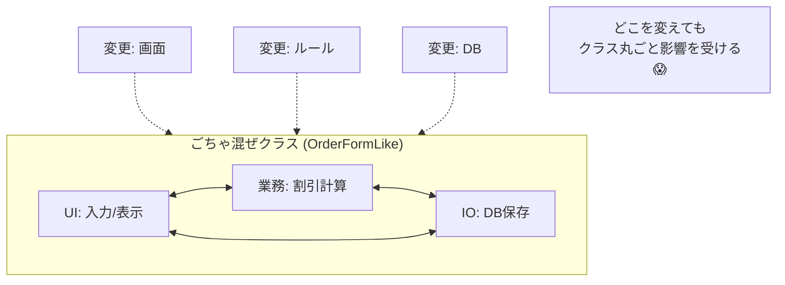

# 第06章：ニオイ図鑑② 混ぜるな危険（UI・業務・DB）🍲💥

## この章のゴール🎯

この章が終わると…👇

* 「ここ混ざってる！危険！😱」を**見抜ける**ようになる👀✨
* UI変更・DB変更が来ても、**壊れにくい境界（バリア）🛡️**を作れるようになる
* まずは **“3つの箱📦📦📦”** で仕分けできるようになる

※2026年1月12日時点だと、.NET は **.NET 10 が LTS（長期サポート）**で現役だよ〜📌（サポート期間などの公式情報） ([Microsoft Learn][1])
（この章の中身は “.NETのバージョンが変わっても効く設計の話” だから安心してね😊）

---

## 1) 「混ぜる」と何が起きるの？😱（地獄のはじまり）

たとえば「ボタン押したら注文確定」みたいな処理で…


* UI（画面）📱が変わっただけなのに、業務ルール（割引計算）💰が壊れる
* DBのテーブル名を変えただけなのに、画面が動かなくなる🧨
* ちょっと直したら、別の場所が連鎖で壊れる💥（変更が波及する）

これ、理由はシンプルで👇
**UI・業務・DBが同じ場所に入ってると、どれを変えても全部に触れる必要が出る**から🍲💦

Microsoftのアーキテクチャ資料でも、ざっくり言うと

* UIはUIの責任
* 業務ロジックはコア側
* データアクセスはインフラ側
  …に分けるのが基本だよ、って考え方が紹介されてるよ📚 ([Microsoft Learn][2])

---

## 2) まず覚える「3つの箱」📦📦📦（超・実戦ルール）

この章では、難しい言葉より **箱分け**でいくよ〜😊🎀

### 箱① UI（見た目・入力・表示）🖥️✨

* 画面表示、入力フォーム、ボタンイベント、表示用の整形
* 「入力が空ならメッセージ出す」みたいな**見た目寄り**のチェックはOK👌

**入れちゃダメな代表例🚫**

* 割引率の決定、在庫の引当、締切判定みたいな**業務ルール**
* SQL、DB接続、HTTP直叩きみたいな**外部I/O**

### 箱② 業務（ルール・判断・手続き）🧠⚙️

* 価格計算、割引、状態遷移、バリデーション（業務上の）
* 「注文できる？できない？」の判断
* UIにもDBにも寄らない、**意思決定の中心**💕

**入れちゃダメな代表例🚫**

* TextBox / Button などUI部品の参照
* SQL文字列、DbContext直参照、ファイルパス直参照などI/Oの詳細

### 箱③ I/O（DB・ファイル・外部API）💾🌐

* DB保存・取得、ファイル読み書き、外部API呼び出し
* “外の世界”との接続担当🔌

**入れちゃダメな代表例🚫**

* 「会員なら10%引き」みたいな業務判断（それは業務の箱！）

この分け方、Microsoft Learnでも「UI→BLL→DAL」みたいな層の考え方として説明されてて、**UIが直接DB層に触らない**のが基本だよ〜って書かれてるよ📘 ([Microsoft Learn][3])

---

## 3) 典型的な“混ぜ混ぜコード”を見てみよう🍲💥

（わざと悪い例ね！学習用だから安心して😆）

```csharp
using System.Data.SqlClient;

public class OrderFormLike
{
    // UIっぽい入力（本当はTextBoxとか想像してね）
    public string CustomerTypeText { get; set; } = "";
    public string AmountText { get; set; } = "";

    public void OnClickSubmit()
    {
        // ✅ UI: 形式チェックっぽい
        if (string.IsNullOrWhiteSpace(AmountText))
        {
            Console.WriteLine("金額を入力してね！");
            return;
        }

        // 🍲 ここから混ざり始める…
        var amount = decimal.Parse(AmountText);

        // ❌ 業務: 割引ルール（UIの中にある）
        var isMember = CustomerTypeText == "Member";
        var discountRate = isMember ? 0.10m : 0.00m;
        var finalAmount = amount * (1 - discountRate);

        // ❌ I/O: DB保存（UIの中にある）
        using var conn = new SqlConnection("Server=...;Database=...;Trusted_Connection=True;");
        conn.Open();

        using var cmd = conn.CreateCommand();
        cmd.CommandText = "INSERT INTO Orders(Amount) VALUES(@Amount)";
        cmd.Parameters.AddWithValue("@Amount", finalAmount);
        cmd.ExecuteNonQuery();

        // ✅ UI: 表示
        Console.WriteLine($"注文OK！最終金額は {finalAmount} 円だよ〜✨");
    }
}
```

### どこがヤバい？😱（すぐ起きる事故）

* 割引ルール変更💰 → 画面コードを触る羽目 → UI担当も巻き込まれる🌀
* DBが変わる💾 → 画面コード修正 → 画面改修と同じリリースに混ざる🧨
* テストしたい🧪 → DBが必要になって面倒（速く回せない）



---

## 4) ハンズオン🛠️：3つの箱に仕分けしよう📦📦📦

上のコードを見て、各行に **ラベル**を付けてみてね🏷️✨

* [UI]
* [BIZ]（業務）
* [IO]（DB/外部）

例（こんな感じ👇）

* `Console.WriteLine("金額を入力してね！");` → [UI]
* `var discountRate = ...;` → [BIZ]
* `new SqlConnection(...)` → [IO]

🌟コツ：迷ったら「これって何が変わったら直す？」で考える🧠

* 画面文言が変わったら？→UI
* ルールが変わったら？→業務
* DBやAPIが変わったら？→I/O

---

## 5) じゃあ、どう直すの？😌✨（境界を作る🛡️）

いきなり大改造じゃなくてOK🙆‍♀️
まずは **置き場所を分けるだけ**で一気に楽になるよ〜🎀


### Step A：業務を「注文サービス」に追い出す💨

```csharp
public class OrderService
{
    public decimal CalculateFinalAmount(decimal amount, bool isMember)
    {
        var discountRate = isMember ? 0.10m : 0.00m;
        return amount * (1 - discountRate);
    }
}
```

### Step B：DB保存を「リポジトリ」に閉じ込める💾

（ここは“保存するだけ”に集中！ルールは入れない！🚫）

```csharp
using System.Data.SqlClient;

public class OrderRepository
{
    private readonly string _connectionString;

    public OrderRepository(string connectionString)
    {
        _connectionString = connectionString;
    }

    public void Save(decimal finalAmount)
    {
        using var conn = new SqlConnection(_connectionString);
        conn.Open();

        using var cmd = conn.CreateCommand();
        cmd.CommandText = "INSERT INTO Orders(Amount) VALUES(@Amount)";
        cmd.Parameters.AddWithValue("@Amount", finalAmount);
        cmd.ExecuteNonQuery();
    }
}
```

### Step C：UIは「集めて渡して表示する」だけにする🖥️✨

```csharp
public class OrderFormLike
{
    public string CustomerTypeText { get; set; } = "";
    public string AmountText { get; set; } = "";

    private readonly OrderService _service;
    private readonly OrderRepository _repo;

    public OrderFormLike(OrderService service, OrderRepository repo)
    {
        _service = service;
        _repo = repo;
    }

    public void OnClickSubmit()
    {
        // UI: 入力の最低限チェック
        if (!decimal.TryParse(AmountText, out var amount))
        {
            Console.WriteLine("金額は数字でお願い🙏");
            return;
        }

        // UI→業務へ「情報を渡す」
        var isMember = CustomerTypeText == "Member";
        var finalAmount = _service.CalculateFinalAmount(amount, isMember);

        // UI→I/Oへ「保存を頼む」
        _repo.Save(finalAmount);

        // UI: 表示
        Console.WriteLine($"注文OK！最終金額は {finalAmount} 円だよ〜✨");
    }
}
```

この時点でもう強い💪✨

* ルール変更 → `OrderService` だけ見ればいい
* DB変更 → `OrderRepository` だけ見ればいい
* UI変更 → 画面だけ直せる

（この「責任を分ける」考え方は、UI/業務/I/Oを分離してテストもしやすくなるよ〜って説明とも相性バツグン📘） ([Microsoft Learn][3])

---

## 6) “混在”を見抜くチェックリスト✅👀

### UIにこれがあったら黄色信号🚦

* `SELECT` / `INSERT` / `UPDATE` みたいなSQL文字列🧨
* `DbContext` / `SqlConnection` / `HttpClient` 直出し🔌
* 「会員なら…」「在庫が…」みたいな**判断ロジック**🧠

### 業務にこれがあったら黄色信号🚦

* `TextBox` / `Console.WriteLine` / `HttpContext` 参照🖥️
* DBテーブル名や外部APIのURLが出てくる💾🌐

### I/Oにこれがあったら黄色信号🚦

* 割引・状態遷移・締切判定などのルール💰⏳
  （保存係が勝手に判断し始めるとカオス…😵）

---

## 7) よくある質問コーナー🙋‍♀️💡

### Q1. 入力チェックはUIでやっちゃダメ？🥺

**A. “見た目/形式”はUIでOK👌、でも“業務上の正しさ”は業務へ🧠✨**

* UI：空欄、数値かどうか、桁数など
* 業務：上限金額、会員条件、締切、在庫など

### Q2. 分けたらファイル増えてダルくない？😵

**A. 最初はちょい増えるけど、変更が来た瞬間に勝つ😌✨**
“直す場所が1つに決まる”のが超大きいよ〜🧭

---

## 8) ミニクイズ🧩✨（理解チェック）

次の変更が来た！どの箱を触る？📦

1. 「会員の割引率を10%→12%に変更」💰
2. 「注文テーブル名が Orders→Purchases に変更」💾
3. 「画面の文言を ‘注文OK’→‘購入完了’ に変更」🖥️

（答え：1)業務 2)I/O 3)UI 🎉）

---

## AIプロンプト（この章は1個だけ🤖🎀）

```text
このコードを UI / 業務 / I/O に分類して、混ざってる箇所を指摘して。
さらに「最小の移動」で3つの箱に分ける提案を、クラス名つきで出して。
（過剰なレイヤー追加はしないで、まずは3箱だけ）
```

### AIの答えを採用する前の最終チェック🧠✅

* UIがDBに触ってない？💾🚫
* 業務がUI部品名を知らない？🖥️🚫
* I/Oが割引判定してない？💰🚫
* “分けた結果、直す場所が1つに絞れた？”🧭✨

---

[1]: https://learn.microsoft.com/en-us/dotnet/core/releases-and-support ".NET releases, patches, and support - .NET | Microsoft Learn"
[2]: https://learn.microsoft.com/en-us/dotnet/architecture/modern-web-apps-azure/architectural-principles "Architectural principles - .NET | Microsoft Learn"
[3]: https://learn.microsoft.com/en-us/dotnet/architecture/modern-web-apps-azure/common-web-application-architectures "Common web application architectures - .NET | Microsoft Learn"

