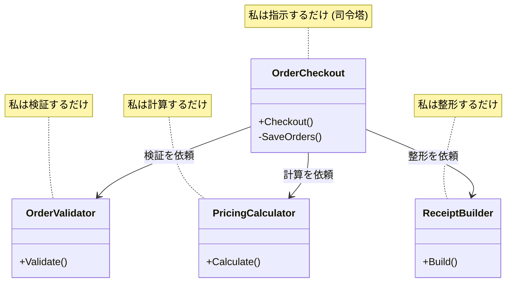

# 第07章：高凝集①「責務で切る」✂️🎯

この章は **「でっかいクラスを、役割ごとに2〜3個に切って、公開メソッドも減らす」** を “手を動かして” 覚える回だよ〜😊🧩
（いまは .NET 10 / C# 14 / Visual Studio 2026 が最新の組み合わせだよ📦✨ ([Microsoft][1])）

---

### 0) 今日できるようになること ✅🎀

* 「このクラス、何の責務が混ざってる？」を言葉で見抜ける👀✨
* “責務ラベル🏷️”でグルーピングして、2〜3クラスに切れる✂️
* **公開メソッド（public）を最小にする** 感覚がつく🔒
* （ついでに）F5デバッグの体感が前より軽くなるかも…！🚀 ([Microsoft Learn][2])

---

## 1) まず「責務」ってなに？🤔💭（超やさしく）

**責務 = “このクラスが責任を持つお仕事”** だよ👩‍💼✨
で、**高凝集**っていうのは、

> **同じ目的の仕事が、ちゃんと一箇所にまとまってる状態** 🎯

逆に、責務が混ざると…

* ちょっと直しただけで、別の処理が壊れる😱
* メソッドが増えて、読めなくなる📚💦
* “ここ直したいのに、どこ触るの？”って迷子になる🧭

---

## 2) 責務で切るときの「5ステップ」✋✨


### ステップ①：責務ラベルを貼る🏷️🎨

クラスのメソッドを見て、ざっくりでOKだからラベル付けするよ！

* 🛡️ **検証**（入力チェック・ルール確認）
* 🧮 **計算**（金額・ポイント・割引）
* 🧾 **整形**（レシート文・表示文の組み立て）
* 💾 **保存**（DB/ファイル/外部送信）※第6章と相性強い
* 📣 **通知**（メール/Slack/ログ）

👉 コツ：**「何が変わると、このメソッドを直す？」** を考えると当たりやすい🧠✨
（“変更理由”が違うなら、責務が違う可能性が高いよ！）

### ステップ②：ラベルごとに“かたまり”を作る🧩

同じラベルのメソッドを **同じグループ** にまとめる！

### ステップ③：まずは2〜3クラスに切る✂️⚖️

いきなり細かくしすぎると疲れるので、最初は **2〜3** がちょうどいい😊🎀
（細かすぎ注意！“1クラス1メソッド病”になりがち😵‍💫）

### ステップ④：公開メソッドを削る🔒✨

* “外から呼ばれる必要がある？”を毎回チェック👀


* 迷ったら **private** に寄せる（あとで public にできる）
* “チーム内だけ”なら **internal** が便利だよ🧡

### ステップ⑤：動くことを確認する🧪✅

* まずはコンソール出力でもOK！
* 「分割前と同じ結果か」をチェックするだけでも十分えらい👏✨

---

## 3) ハンズオン🛠️：巨大クラスを “責務で切って” スッキリさせる✨

題材：**学食の注文（クーポンあり）🍛🎟️**
やること：`OrderCheckout` を **検証 / 計算 / レシート作成** に分割するよ✂️🎯

---

## 3-1) 分割前（責務が混ざってる例）🍲💥

ポイント：このクラス、全部やってる😇

* 注文チェック🛡️
* 合計計算🧮
* レシート文🧾
* ついでに保存っぽいこと💾（今回はメモリだけ）

```csharp
using System;
using System.Collections.Generic;
using System.Linq;

public record OrderItem(string Name, int Price, int Quantity);

public class OrderCheckout
{
    private readonly List<string> _savedOrders = new(); // 疑似保存💾

    // いろいろ混ざった “何でも屋” 😵‍💫
    public string Checkout(string studentId, List<OrderItem> items, string? couponCode)
    {
        // ① 検証🛡️
        if (string.IsNullOrWhiteSpace(studentId))
            throw new ArgumentException("studentId is required");

        if (items is null || items.Count == 0)
            throw new ArgumentException("items is required");

        if (items.Any(i => i.Quantity <= 0))
            throw new ArgumentException("quantity must be > 0");

        if (items.Any(i => i.Price < 0))
            throw new ArgumentException("price must be >= 0");

        // ② 計算🧮
        var subTotal = items.Sum(i => i.Price * i.Quantity);

        var discount = 0;
        if (!string.IsNullOrWhiteSpace(couponCode))
        {
            // 例：GAKUSHOKU10 は10%OFF
            if (couponCode == "GAKUSHOKU10")
                discount = (int)Math.Round(subTotal * 0.10m);
            // 例：STUDENT50 は50円引き（最低300円以上）
            else if (couponCode == "STUDENT50" && subTotal >= 300)
                discount = 50;
        }

        var total = Math.Max(0, subTotal - discount);

        // ③ レシート整形🧾
        var lines = new List<string>();
        lines.Add($"Student: {studentId}");
        lines.Add("---- Items ----");
        foreach (var item in items)
            lines.Add($"{item.Name} x{item.Quantity}  {item.Price * item.Quantity}yen");
        lines.Add($"Subtotal: {subTotal}yen");
        lines.Add($"Discount: -{discount}yen");
        lines.Add($"TOTAL: {total}yen");

        // ④ 保存っぽいこと💾（今回はメモリ）
        var orderId = $"ORD-{DateTimeOffset.Now:yyyyMMddHHmmss}";
        _savedOrders.Add(orderId);

        lines.Add($"OrderId: {orderId}");
        return string.Join(Environment.NewLine, lines);
    }

    // ついでに外から見えるけど、本当に必要？🤔
    public int SavedCount() => _savedOrders.Count;
}
```

---

## 3-2) 責務ラベル🏷️を貼ってみよう🎨✨

`OrderCheckout` の中身をラベル付けすると…

* 🛡️ 検証：studentId / items / quantity / price のチェック
* 🧮 計算：subtotal / discount / total
* 🧾 整形：receipt文字列の組み立て
* 💾 保存：orderId作って保存（今回はメモリだけ）

👉 今回は **2〜3クラスにしたい** ので、保存は `OrderCheckout` に残して
**検証 / 計算 / 整形** を外に出すのが気持ちいいよ😊🎀

---

## 3-3) 分割後（高凝集に寄せる）✂️🎯

ゴール：

* `OrderCheckout` は **流れの司令塔**（オーケストラ指揮者🎼）だけ
* 検証は `OrderValidator`
* 計算は `PricingCalculator`
* レシートは `ReceiptBuilder`
* それぞれ **公開メソッドは1個** に寄せる🔒✨

```csharp
using System;
using System.Collections.Generic;
using System.Linq;

public record OrderItem(string Name, int Price, int Quantity);
public record PricingResult(int SubTotal, int Discount, int Total);

public class OrderCheckout
{
    private readonly List<string> _savedOrders = new(); // 疑似保存💾

    // 依存は “中で new” しちゃってOK（低結合は後の章で育てる🌱）
    private readonly OrderValidator _validator = new();
    private readonly PricingCalculator _pricing = new();
    private readonly ReceiptBuilder _receipt = new();

    // ✅ 外からの入口はこれだけ（公開面を絞る！）🔒
    public string Checkout(string studentId, List<OrderItem> items, string? couponCode)
    {
        _validator.Validate(studentId, items);

        var pricing = _pricing.Calculate(items, couponCode);

        var orderId = $"ORD-{DateTimeOffset.Now:yyyyMMddHHmmss}";
        _savedOrders.Add(orderId);

        return _receipt.Build(studentId, items, pricing, orderId);
    }

    // ✅ “本当に要る？”だけ残す（今回は練習用に残す）
    public int SavedCount() => _savedOrders.Count;
}

// 🛡️ 検証だけ担当（高凝集！）
internal class OrderValidator
{
    public void Validate(string studentId, List<OrderItem> items)
    {
        if (string.IsNullOrWhiteSpace(studentId))
            throw new ArgumentException("studentId is required");

        if (items is null || items.Count == 0)
            throw new ArgumentException("items is required");

        if (items.Any(i => i.Quantity <= 0))
            throw new ArgumentException("quantity must be > 0");

        if (items.Any(i => i.Price < 0))
            throw new ArgumentException("price must be >= 0");
    }
}

// 🧮 計算だけ担当（高凝集！）
internal class PricingCalculator
{
    public PricingResult Calculate(List<OrderItem> items, string? couponCode)
    {
        var subTotal = items.Sum(i => i.Price * i.Quantity);
        var discount = CalculateDiscount(subTotal, couponCode);
        var total = Math.Max(0, subTotal - discount);

        return new PricingResult(subTotal, discount, total);
    }

    private static int CalculateDiscount(int subTotal, string? couponCode)
    {
        if (string.IsNullOrWhiteSpace(couponCode)) return 0;

        return couponCode switch
        {
            "GAKUSHOKU10" => (int)Math.Round(subTotal * 0.10m),
            "STUDENT50" when subTotal >= 300 => 50,
            _ => 0
        };
    }
}

// 🧾 レシート整形だけ担当（高凝集！）
internal class ReceiptBuilder
{
    public string Build(string studentId, List<OrderItem> items, PricingResult pricing, string orderId)
    {
        var lines = new List<string>
        {
            $"Student: {studentId}",
            "---- Items ----"
        };

        foreach (var item in items)
            lines.Add($"{item.Name} x{item.Quantity}  {item.Price * item.Quantity}yen");

        lines.Add($"Subtotal: {pricing.SubTotal}yen");
        lines.Add($"Discount: -{pricing.Discount}yen");
        lines.Add($"TOTAL: {pricing.Total}yen");
        lines.Add($"OrderId: {orderId}");

        return string.Join(Environment.NewLine, lines);
    }
}
```

### 分割できてるか？チェック✅👀

* `OrderValidator` の説明：**注文が成立する条件を保証する**🛡️
* `PricingCalculator` の説明：**金額ルールを計算して結果を返す**🧮
* `ReceiptBuilder` の説明：**表示用の文字列を組み立てる**🧾
* `OrderCheckout` の説明：**流れをつなぐ（指揮）＋ID発行＆保存**🎼💾

👉 ぜんぶ **一文で説明できる** よね？これが超大事！💖



---

## 4) “公開メソッド最小”のコツ🔒✨（ここ超重要！）

公開メソッドは **「外部に対する約束」** だよ📜
増えるほど、変更が難しくなる😵

### 迷ったらこれ👇🎀

* 外から呼ばれない → **private**
* 同じプロジェクト内だけ → **internal**
* 外部にも提供する → **public（最小限）**

今回は `OrderValidator / PricingCalculator / ReceiptBuilder` を **internal** にしたのが地味に効くよ🧡
（あとで必要なら public に “昇格” できるしね✨）

---

## 5) よくあるミス集😇🧯

### ❌「とりあえずクラス増やした」だけ

* `Manager` や `Helper` が増えるだけだと、責務がまだモヤる☁️
  ✅ それぞれ **一文で説明** できる名前にしよ🏷️✨

### ❌ 切りすぎて、呼び出しがバラバラ

* クラスが増えすぎると “司令塔” が迷子になる🧭
  ✅ まずは **2〜3クラス** にして、慣れたら増やす🌱

### ❌ “public だらけ” で戻れなくなる

✅ 迷ったら private / internal に寄せる🔒

---

## 6) ミニ問題🧩✨（10分でOK）

次のメソッド群、責務ラベル🏷️で分けてみて〜！

* `ValidateEmail()`
* `ValidatePasswordStrength()`
* `HashPassword()`
* `CreateUserId()`
* `BuildWelcomeMailBody()`
* `CalculateTrialEndDate()`

💡 ヒント：**検証 / 変換(暗号化) / 生成 / 整形 / 計算** あたりに分かれそう！

---

## 7) AIプロンプト🤖✨（この章は2つまで🎀）

1. **分割案を出してもらう（責務で切る）**

```text
このC#クラスを「責務」でグルーピングして、2〜3クラスに分割する案をください。
各メソッドが「どの新クラスへ移動するか」も一覧で出して。
（ただし public は最小にしたい）
```

2. **分割後の“責務の一文説明”をチェック**（あなたの最終判断用🧠✅）

```text
分割後の各クラスについて、責務を「一文」で説明して。
もし責務が混ざってそうなら、そのクラス名と理由も教えて。
```

※ Copilot を使うなら、**Extract Class の下書き**を作らせるのが相性いいよ〜✂️✨
（Visual Studio では Copilot/Copilot Chat が “統合拡張” として扱われる流れもあるよ📦 ([Visual Studio][3])）

---

## 8) まとめ🎉✨

* **責務で切る**＝「変更理由が同じものをまとめる」🧠
* まずは **責務ラベル🏷️→2〜3分割✂️** が最強ルート
* **公開メソッドは最小🔒**（約束を増やさない！）
* 低結合（DIとか）は後の章で “もっと気持ちよく” なるから、今は分割に集中でOK😊🎀

---

次、やるなら：
この章の例をあなたの題材（ToDo、備品貸出、学食注文の別バージョン🍛など）に置き換えて、**“責務ラベル貼り”だけ** やってみるのが最高に効くよ〜🏷️✨

[1]: https://dotnet.microsoft.com/en-US/download/dotnet/10.0 "Download .NET 10.0 (Linux, macOS, and Windows) | .NET"
[2]: https://learn.microsoft.com/ja-jp/visualstudio/releases/2026/release-notes "Visual Studio 2026 リリース ノート | Microsoft Learn"
[3]: https://visualstudio.microsoft.com/ja/github-copilot/ "
	GitHub Copilot を含む Visual Studio – AI ペア プログラミング"

