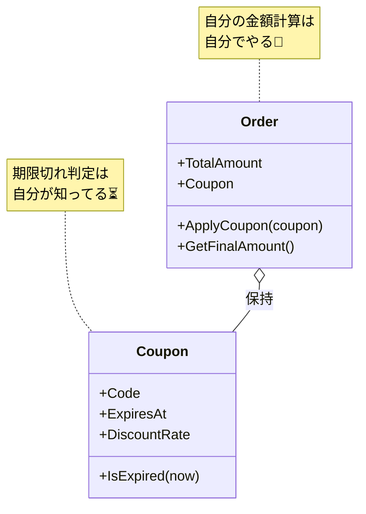

# 第08章：高凝集②「データと振る舞いを近づける」🏠✨

### この章でできるようになること🎯

* 「データだけのクラス📦」が増えてバグりやすくなる理由がわかる😵‍💫
* **“ルール（計算・検証）をどこに置くか”** を迷わず決められる🧭✨
* ルールをデータの近くへ寄せて、**変更に強いまとまり**を作れる💪🌸

※2026年1月12日時点では **C# 14 が最新**で、**.NET 10** 上でサポートされています。([Microsoft Learn][1])

---

## 8.1 「データだけのクラス📦」が増えると何がヤバいの？😱


まず、ありがちな構図👇

* `Order` は **プロパティだけ**（データ置き場）📦
* ルール（割引💰・期限⏳・検証✅）は全部 `OrderService` に集中🍲💥
* すると…

  * ルールがあちこちに散らばる🌀（同じ判定が複製されがち）
  * **「正しい状態」をクラスが守ってくれない**😵
  * どこかで1つ更新し忘れて破綻💥

これ、感覚としては
**「大事なルールを“別の部署”が管理してて、引き継ぎ漏れで事故る」**みたいな感じ💦

---

## 8.2 合言葉は「データの持ち主がルールを持つ」👑🧷

オブジェクト指向の基本に **カプセル化（Encapsulation）**って考え方があるよ〜📚✨
ざっくり言うと👇


* **関連するデータと操作（メソッド）を “ひとまとまり” にする**🫶
* 外から勝手にいじられないように守る🔒

（Microsoftの解説でも、関連するものを1つの単位として扱うのがカプセル化だよって説明されてるよ）([Microsoft Learn][2])

---

## 8.3 ルールの置き場所・決め方（超実用チェックリスト）🧭✨

「この検証ロジック、どこに置く？」って迷ったら、まずこれ👇


### ✅ 置き場所の第一候補：そのデータを“所有”してるクラス🏠

次の条件に当てはまるほど、**データの近く**が正解だよ🎯

* そのルールは **ほぼそのクラスのデータだけ**で決まる？📦
* そのルールは **そのデータの正しさ（不変条件）**を守る？🛡️
* 「それは誰の責任？」→ **そのデータの持ち主**って言える？👀

### ✅ 例外（ここ重要！）⚠️

1つのクラスに押し込むと逆に事故ることもあるよ〜💦
たとえば👇

* ルールが **複数のオブジェクト**にまたがる（注文＋会員＋クーポン…）🔗
* ルールが **差し替えたい**（キャンペーンで割引ロジックが変わる）🔁
* その場合は

  * `DiscountPolicy` みたいな **方針クラス**🧩
  * `OrderPricingService` みたいな **ドメインサービス**🛠️
    にして、でも **できるだけ近くに置く**（関係のある場所に置く）✨

---

## 8.4 ハンズオン🛠️：「割引＆期限ルール」を近くへ寄せよう💰⏳

題材：

* 注文 `Order`
* クーポン `Coupon`（期限切れだと使えない）
* 割引：クーポンがあれば合計から値引き

### 8.4.1 まずは “よくあるダメな形” を見る😵‍💫（Before）

ポイントは「Orderがデータだけ」「ルールが外に散乱」だよ👇

```csharp
public class Order
{
    public decimal TotalAmount { get; set; }
    public string? CouponCode { get; set; }
    public DateTime? CouponExpiresAt { get; set; }
}

public class OrderService
{
    public decimal CalculateFinalAmount(Order order, DateTime now)
    {
        if (!string.IsNullOrWhiteSpace(order.CouponCode))
        {
            if (order.CouponExpiresAt == null || order.CouponExpiresAt <= now)
                throw new InvalidOperationException("クーポン期限切れ");

            // 10% OFF（仮）
            return order.TotalAmount * 0.9m;
        }

        return order.TotalAmount;
    }
}
```

この形の困りごとあるある👇😱

* クーポン期限チェックが別の場所にも必要になってコピペ増殖📄📄📄
* `CouponExpiresAt` と `CouponCode` の整合性が崩れる（片方だけ入ってる等）💥
* 仕様変更（例：割引率変更）で `OrderService` がどんどん巨大化🍲💦

---

### 8.4.2 改善方針：**「ルールはデータのそばへ」**🏠✨

今回の移動先はこうするよ👇

* **期限切れ判定** → `Coupon` の責務⏳
* **割引適用** → `Order`（もしくは `DiscountPolicy`）の責務💰

---

### 8.4.3 “データ＋振る舞い” に寄せた形（After）🌷


```csharp
public sealed class Coupon
{
    public string Code { get; }
    public DateTime ExpiresAt { get; }
    public decimal DiscountRate { get; } // 例: 0.10m = 10%

    public Coupon(string code, DateTime expiresAt, decimal discountRate)
    {
        if (string.IsNullOrWhiteSpace(code)) throw new ArgumentException("code is required");
        if (discountRate <= 0 || discountRate >= 1) throw new ArgumentOutOfRangeException(nameof(discountRate));

        Code = code;
        ExpiresAt = expiresAt;
        DiscountRate = discountRate;
    }

    public bool IsExpired(DateTime now) => ExpiresAt <= now;
}

public sealed class Order
{
    public decimal TotalAmount { get; }
    public Coupon? Coupon { get; private set; }

    public Order(decimal totalAmount)
    {
        if (totalAmount < 0) throw new ArgumentOutOfRangeException(nameof(totalAmount));
        TotalAmount = totalAmount;
    }

    public void ApplyCoupon(Coupon coupon, DateTime now)
    {
        if (coupon.IsExpired(now)) throw new InvalidOperationException("クーポン期限切れ");
        Coupon = coupon;
    }

    public decimal GetFinalAmount()
    {
        if (Coupon is null) return TotalAmount;

        var discount = TotalAmount * Coupon.DiscountRate;
        return TotalAmount - discount;
    }
}
```

**ここが気持ちいいポイント🥹💖**


* 「期限切れか？」は **Couponに聞けばいい**（探さなくて済む）⏳✨
* 「最終金額は？」は **Orderに聞けばいい**（計算が散らばらない）💰✨
* `Order` が「自分が正しい状態か」を自分で守りやすい🛡️



---

## 8.5 実装のコツ集（初心者がハマりやすい所を先に潰す）🧯✨

### コツ1：プロパティを `set` し放題にしない🔓➡️🔒


* “いつでもどこでも値が変わる” は、ルール破壊の入口💥
* まずは `private set` やコンストラクタで守るだけでも世界が変わるよ🌍✨

### コツ2：例外を投げる場所は「守りたいルールの近く」🛡️

* 「期限切れはダメ」なら `Coupon` / `Order.ApplyCoupon` あたりが自然👌

### コツ3：迷ったら「読む人が一番探しやすい場所」📍


* 未来の自分（or チーム）が

  * 「クーポンの期限ロジックどこ？」
  * 「最終金額どこで計算？」
    ってなった時、**直感で当てられる場所**が正義🥳

---

## 8.6 ミニ確認クイズ🧩✨（1分）

次のルール、どこに置くのが自然？👀

1. 「クーポンが期限切れなら使えない」⏳
2. 「注文の合計金額はマイナス禁止」💰
3. 「会員ランクで割引率が変わる」👑

ヒント💡

* 1. は Couponっぽい
* 2. は Orderっぽい
* 3. は Orderだけじゃ決まらない（会員が絡む）→ 方針クラス/サービスも候補🧩

---

## 8.7 まとめ🎀（この章の合格ライン✅）

* **データだけクラス📦**を減らして、**データ＋振る舞い🏠**を増やす
* ルールの置き場所は

  * まず「持ち主」
  * 例外は「方針（Policy）/サービス」
* 結果：変更がラク・バグが減る・読むのがラク🥰✨

---

## AIプロンプト🤖（この章は1つだけ🎀）

1. 「この検証ロジックはどこに置くのが自然？理由つきで候補を3つ」

使い方コツ💡

* AIの提案を見たら、人間の最終チェックはこれ👇

  * 「責務混在🍲してない？」
  * 「依存が増えすぎ🔗てない？」

---

必要なら、この章のハンズオンを **あなたの教材用に“もう1題材”**（例：期限付きToDo✅⏳／学食注文🍛／備品貸出📦）で、同じ学習ゴールの別サンプルも作れるよ😊✨

[1]: https://learn.microsoft.com/en-us/dotnet/csharp/whats-new/csharp-14?utm_source=chatgpt.com "What's new in C# 14"
[2]: https://learn.microsoft.com/en-us/dotnet/visual-basic/programming-guide/concepts/object-oriented-programming?utm_source=chatgpt.com "Object-oriented programming - Visual Basic"

