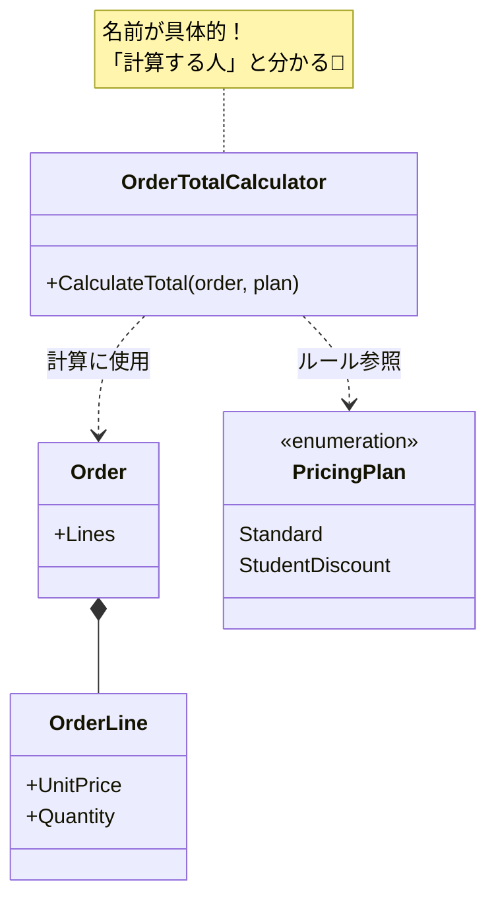

# 第09章：高凝集③「命名で設計する」🏷️💖

〜“名前が決まらない”は、設計の赤信号〜🚨

---

### この章でできるようになること🎯✨

* 「このクラス何者？」を**名前で説明できる**ようになる👀
* `Manager / Util / Process` みたいな **なんでも屋ネーム**を減らせる🚦
* メソッド名で「何を保証するか」を表現できる🗣️✨
* リネーム（名前変更）を**安全に**回せるようになる🔁🛡️
* `.editorconfig`＋`dotnet format` で **命名のブレを自動で検出**できるようになる🤖🧹 ([Microsoft Learn][1])

---

## 1) まず大事な考え方💡：「命名＝設計の表面」✨


命名ってただのラベルじゃなくて、設計の“答え合わせ”なんだよね😊
特に **高凝集**の世界では、

> ✅ いい名前が付く＝責務がまとまってる
> ❌ 名前が付かない＝責務が混ざってる可能性が高い🍲💥

って考えると、めちゃ使えるよ〜🫶

---

## 2) “黄色信号ネーム”図鑑🚦（増えたら設計を疑う）


次の単語がクラス名に増え始めたら、だいたい設計がモヤってる合図⚠️

* `Manager` / `Management`（管理って…何を？😵）
* `Util` / `Helper` / `Common`（便利箱📦になりがち）
* `Process` / `Handler` / `Service`（粒度が曖昧になりやすい🌫️）
* `Data` / `Info` / `Work` / `Thing`（説明を放棄してるやつ😂）

もちろん **絶対ダメ**ではないけど、増殖してたら「責務が言語化できてない」可能性が高いよ〜🚦💦

---

## 3) C#の命名の“基本ルール”だけは押さえる📚✨


ここは迷わないように **土台**として固定しちゃおう😊

### 3.1 よく使う大枠ルール（超重要）⭐

* **型（class / record / struct / enum）・メソッド・publicメンバー**：`PascalCase` ✨
* **ローカル変数・引数・privateフィールド**：`camelCase`（privateフィールドは `_camelCase` がよく使われる）🧷
* **略語は乱用しない**（通じる略語だけにする）📛 ([Microsoft Learn][2])

### 3.2 asyncメソッドは `Async` を付ける⏳➡️✨

`Task` / `ValueTask` を返す非同期メソッドは、基本 `Async` サフィックスを付けるのが .NET の流儀だよ〜🧠 ([Microsoft Learn][3])

---

## 4) 命名で“責務”を透けさせるコツ🏷️✨（実戦）

### 4.1 クラス名は「役割の名詞」🏠


クラス名は **“何をするか”より“何者か”** が伝わると強い💪

* ❌ `OrderManager`
* ✅ `OrderPricing` / `OrderTotalCalculator` / `DiscountPolicy` / `OrderValidator`

この差って、「中に何が入ってそうか」が一瞬で変わるの分かる？👀✨
✅の方は **責務の境界**が見えるよね🧭

---

### 4.2 メソッド名は「意図（保証）を言う」🗣️✨


メソッド名でおすすめはこれ👇

* **Query（状態を変えない）**：`Get / Find / Calculate / Is / Can`
* **Command（状態を変える）**：`Add / Remove / Apply / Update / Register`

例：

* ❌ `Do()` / `Process()`（何するの〜😵）
* ✅ `CalculateTotal()`（合計を計算する）
* ✅ `ApplyDiscount()`（割引を適用して状態を変える）

---

### 4.3 boolは `Is/Has/Can/Should` が超つよい✅


* ❌ `Valid`（名詞？形容詞？あいまい🌫️）
* ✅ `IsValid`（真偽が一発で分かる✨）
* ✅ `HasStock` / `CanCancel`（読みやすい〜😊）

---

## 5) ハンズオン🛠️：ダメ命名をリネームして“設計が見える”状態にする✨

ここから実際に手を動かすよ〜💪🎀
**目的は「中身はほぼ変えずに、名前だけで設計を良くする」**こと！

---

### 5.1 お題コード（いまいち命名）😵‍💫

```csharp
public class OrderManager
{
    public decimal Proc(OrderData data, bool flag)
    {
        // flag=true: 学割、false: 通常
        var sum = 0m;

        foreach (var x in data.Items)
        {
            sum += x.Price * x.Count;
        }

        if (flag)
        {
            sum *= 0.9m; // 学割
        }

        return sum;
    }
}

public class OrderData
{
    public List<ItemData> Items { get; set; } = new();
}

public class ItemData
{
    public decimal Price { get; set; }
    public int Count { get; set; }
}
```

「OrderManager」「Proc」「flag」「OrderData」「ItemData」…
ぜんぶ **“何を表してるか薄い”** から、責務が見えない😱💦

---

### 5.2 まずは“責務ラベル”を貼る🏷️（章7〜8の復習にもなるよ✨）

このコードの中身は、実は3つ混ざってる👇

1. 合計を出す（計算）🧮
2. 学割の方針（ルール）🎓
3. 注文明細（データ）📦

→ だから、名前もそれに合わせて分けるのが自然😊

---

### 5.3 リネーム案（名前だけで設計が立つ✨）

**Step A：モデル名を“ドメイン用語”に寄せる**

* `OrderData` → `Order`
* `ItemData` → `OrderLine`（注文の1行って感じ📄）

**Step B：処理の正体を名前にする**

* `OrderManager` → `OrderTotalCalculator`
* `Proc` → `CalculateTotal`
* `flag` → `pricingPlan`（学割/通常を表すなら enum が気持ちいい🫶）

こんな感じ👇

```csharp
public enum PricingPlan
{
    Standard,
    StudentDiscount
}

public sealed class OrderTotalCalculator
{
    public decimal CalculateTotal(Order order, PricingPlan plan)
    {
        var subtotal = 0m;

        foreach (var line in order.Lines)
        {
            subtotal += line.UnitPrice * line.Quantity;
        }

        if (plan == PricingPlan.StudentDiscount)
        {
            subtotal *= 0.9m;
        }

        return subtotal;
    }
}

public sealed class Order
{
    public List<OrderLine> Lines { get; } = new();
}

public sealed class OrderLine
{
    public decimal UnitPrice { get; init; }
    public int Quantity { get; init; }
}
```

この時点で、もう **責務の輪郭**が前より見えるよね？👀✨
「少なくとも何をしてるクラスか」が名前で説明できる💖

---



## 6) リネームを“安全”にやるコツ🛡️🔁


### 6.1 置換（Ctrl+F）じゃなくて「リネーム機能」を使う🙅‍♀️

* 置換だと別の単語まで壊す💥（最悪😱）
* リネーム（シンボル変更）なら参照も追ってくれる🧠✨

VS：リネーム（例：`Ctrl + R, R`）
VS Code：リネーム（例：`F2`）
※ショートカットは環境で違うことあるけど「Rename Symbol」が正解だよ🙆‍♀️✨

---

### 6.2 “名前変更＝挙動変更じゃない”を守る✅

リネーム中は、原則これだけ意識してね👇

* ✅ メソッドの中身（ロジック）をいじらない
* ✅ コンパイル通す
* ✅ 動作確認する（最小でOK）

---

## 7) 命名のブレを“自動で止める”🧰✨（お守り）


チームや教材だと、命名がジワジワ崩れるのあるある😂
そこで `.editorconfig` の命名ルール＋`dotnet format` が便利だよ〜🧹🤖 ([Microsoft Learn][1])

### 7.1 例：privateフィールドは `_camelCase` にしたい🧷

```ini
## .editorconfig（抜粋例）
[*.cs]

## naming rules（ざっくり例）
dotnet_naming_rule.private_fields_should_be_underscore.severity = warning
dotnet_naming_rule.private_fields_should_be_underscore.symbols = private_fields
dotnet_naming_rule.private_fields_should_be_underscore.style = underscore_camel_case

dotnet_naming_symbols.private_fields.applicable_kinds = field
dotnet_naming_symbols.private_fields.applicable_accessibilities = private

dotnet_naming_style.underscore_camel_case.required_prefix = _
dotnet_naming_style.underscore_camel_case.capitalization = camel_case
```

そして整形・チェックは `dotnet format` でOK✨ ([Microsoft Learn][4])

---

## 8) AIの使い方（この章は“命名専用”に絞るよ🤖🎀）

### ✅ AIプロンプト（1章2個まで）

1. **命名案を出させる（候補作り）**
   「このクラス/メソッドの命名案を10個。責務が伝わる順に並べて。各案に“この名前が示す責務”を一言で添えて」

2. **“黄色信号ネーム”検出（ダメ出し係）**
   「この命名は `Manager/Util/Process` 的に責務が曖昧になってない？曖昧な点と、より具体的な名前の方向性を3つ提案して」

👉 ここで大事なのは、AIの案を**そのまま採用しない**こと！
最後は「この名前、責務が1つに見える？」で人間が判定🧠✅

---

## 9) 仕上げクイズ🧩✨（サクッと練習）

次の名前、どう直す？（答えは1つじゃないよ〜😊）

* `UserManager`
* `DataUtil`
* `ProcessOrder`（メソッド）
* `flag`（bool）
* `Handle`（メソッド）

✨コツ：
「何の名詞？」「どんな責務？」「何を保証？」を言える名前にする！

---

## まとめ🎀✨

* 命名は “読みやすさ” だけじゃなく **責務の境界を固定する設計**🏷️💖
* `Manager/Util/Process` が増えたら **責務が混ざってるサイン**🚦
* C#の基本（`PascalCase/camelCase/_camelCase`、`Async` など）は固定すると迷わない📚✨ ([Microsoft Learn][2])
* `.editorconfig`＋`dotnet format` で命名の崩れを自動検出できる🧹🤖 ([Microsoft Learn][1])

---

次の第10章は、いよいよ **低結合**側へ突入！👀🔗
「依存（new/static/具体参照）」を見える化して、変更に弱い場所を炙り出すよ〜🕸️✨

[1]: https://learn.microsoft.com/en-us/dotnet/fundamentals/code-analysis/style-rules/naming-rules?utm_source=chatgpt.com "Code-style naming rules - .NET"
[2]: https://learn.microsoft.com/en-us/dotnet/csharp/fundamentals/coding-style/identifier-names?utm_source=chatgpt.com "C# identifier naming rules and conventions"
[3]: https://learn.microsoft.com/en-us/dotnet/csharp/asynchronous-programming/async-scenarios?utm_source=chatgpt.com "Asynchronous programming scenarios - C#"
[4]: https://learn.microsoft.com/en-us/dotnet/core/tools/dotnet-format?utm_source=chatgpt.com "dotnet format command - .NET CLI"

