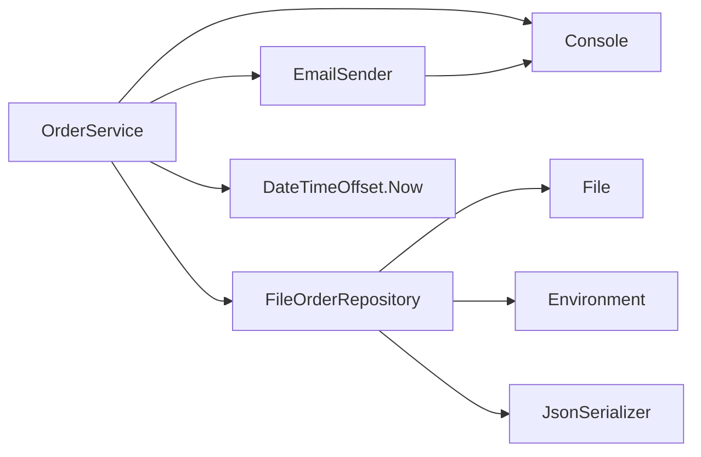

# 第10章：低結合の入口「依存」を見える化👀🔗

この章はね、**「低結合って何となく大事そう…でもどこを直せばいいの？」**って迷子になるのを止める章だよ〜🧭✨
まずは **直す前に、密着ポイント（依存）を発見できる目👀** を作ろうね🎀

※ちなみに **C# 14 が最新で .NET 10 対応**、**.NET 10 は LTS**、**Visual Studio 2026 も提供**されてるよ〜（2026/01 時点の最新情報）🆕✨ ([Microsoft Learn][1])

---

## この章のゴール🎯✨

章末にこうなれたら勝ち🏆💕

* 「このクラス、何に依存してる？」を **口で説明できる** 🗣️
* 依存を **矢印（A → B）で書ける** ✍️
* 「ここが変更に弱い線だ…！」を **見つけられる** 🕸️💥

---

## まず「依存」ってなに？🤔🔗

ざっくり言うと…

> **A が B を使わないと動けない状態 = A は B に依存してる** 👭🔗

依存が増えると何が起きる？💣

* B を変えたら A が壊れる（変更の波及🌊）
* テストがしにくい（差し替えできない😵‍💫）
* 修正が怖い（第2章の地獄😱）

だから第10章では、まず **依存の線を可視化して「怖い線」を見つける** のが目的だよ👀✨
（直し方は次章以降でガッツリやるね💪）

---

## 依存が強くなりやすい “3大サイン”🚨📌

### ① `new` してる（中で作ってる）🧱

* その場で具体クラスを作ると、**交換できない** ＝密着💦
* 「作り方」まで固定されるのがキツい😵

### ② `static` を呼んでる⚡

* `DateTime.Now` / `File.ReadAllText` / `Console.WriteLine` …みたいなやつ
* 便利だけど、**テストや差し替えが苦手** 🧪💦
  （第15章で扱うやつにもつながるよ⚡）

### ③ 具体クラス名がコードに直書きされてる🧱

* `SqlWhateverRepository` とか `SmtpEmailSender` とか
* その “種類” に依存してるから、変更に弱い📎

---

## 依存を見える化する「超シンプル3ステップ」🧠✍️✨

### Step 1️⃣：依存っぽい行に「DEPラベル」を付ける🏷️

やることは単純！コード見ながら、

* `new` を見つけたら `// DEP: new`
* `static` を見つけたら `// DEP: static`
* 外部（DB/ファイル/ネット/時計/ログ）っぽければ `// DEP: I/O`

みたいにコメントを付けるだけ📝✨

### Step 2️⃣：矢印（A → B）リストを書く➡️

クラス単位で
`OrderService → File`
`OrderService → DateTimeOffset`
みたいに書く✍️
**これだけで密着が露出する** よ👀✨

### Step 3️⃣：危険な線を丸で囲む⭕💥


危険線の見分け方はコレ👇

* **変更理由が違うもの同士がつながってる**（UI変更なのにDBが壊れる等）🍲💥
* **外部I/Oに直でつながってる**（File/DB/HTTP/Clock）🌍📡
* **依存が多い（線が多い）**：変更が波及しやすい🕸️

---

## ハンズオン🛠️：依存を “見える化” してみよっ👀🔗

題材：超ミニ「注文確定」📦💕

### ① まずは “密着コード” を用意（わざと😈）

下のコードをそのまま貼ってOK（1ファイルでもOKだよ）👇

```csharp
using System;
using System.IO;
using System.Text.Json;

public sealed class OrderService
{
    public void PlaceOrder(OrderDto dto)
    {
        var now = DateTimeOffset.Now;               // DEP: static (Clock)
        Console.WriteLine("注文処理開始");            // DEP: static (Console I/O)

        var repo = new FileOrderRepository("orders.json"); // DEP: new (concrete) + I/O
        repo.Save(dto, now);

        var sender = new EmailSender();             // DEP: new (concrete)
        sender.Send(dto.CustomerEmail, "注文ありがとう！");

        Console.WriteLine("注文処理完了");            // DEP: static (Console I/O)
    }
}

public sealed record OrderDto(string CustomerEmail, int Amount);

public sealed class FileOrderRepository
{
    private readonly string _path;
    public FileOrderRepository(string path) => _path = path;

    public void Save(OrderDto dto, DateTimeOffset now)
    {
        var line = JsonSerializer.Serialize(new { dto.CustomerEmail, dto.Amount, now });
        File.AppendAllText(_path, line + Environment.NewLine); // DEP: static (File I/O) + static (Environment)
    }
}

public sealed class EmailSender
{
    public void Send(string to, string message)
    {
        // 本当はSMTPとか外部送信になる想定（ここでは疑似）
        Console.WriteLine($"[MAIL] To:{to} {message}"); // DEP: static (Console I/O)
    }
}
```

---

## ② DEPラベルを見ながら「矢印リスト」を作ろう✍️➡️

例）こんな感じでOK✨

* `OrderService → DateTimeOffset.Now`（Clock）⏰
* `OrderService → Console`（UIっぽいI/O）🖥️
* `OrderService → FileOrderRepository`（具体クラス）🧱
* `OrderService → EmailSender`（具体クラス）🧱
* `FileOrderRepository → File`（外部I/O）📁
* `FileOrderRepository → Environment`（外部）🌍
* `FileOrderRepository → JsonSerializer`（ライブラリ）📚
* `EmailSender → Console`（I/O）🖥️

ここで大事なのは、**「多い／外部が直」＝危険の匂い**って気付くこと👃💥

---

## ③ 図にしてみる（超ざっくりでOK）🕸️✨

手書きでもいいけど、テキストで残すなら Mermaid が便利だよ🧠
（この図は “設計メモ” だから、キレイさより「線が見える」こと優先💕）



---

## ④ 「変更が波及しそうな線」を3本だけ選んで⭕💥

この章のラストはここが一番おいしい😋✨
次の観点で **“やばい線TOP3”** を決めよう👇

* 外部I/O直結（File / Console / Clock）📡
* 具体クラス直結（差し替え不能）🧱
* 変更理由が違うのに繋がってる（混在）🍲💥

たとえば今回なら…

1. `OrderService → FileOrderRepository`（保存先が変わると OrderService まで影響しがち）💥
2. `OrderService → DateTimeOffset.Now`（時間依存はテストの敵）⏰🧪
3. `OrderService → Console`（UI都合で業務が揺れる）🖥️💥

って感じで「怖い線」が見えてくるよ👀✨
（直し方は第11〜13章で“気持ちよく”やるよ〜🎁💉🔌）

---

## よくあるつまずき🫠➡️😄

* **「依存が悪」じゃないよ！** 🙅‍♀️
  依存ゼロは無理だし、目的は「必要最小にする」だよ⚖️✨

* **まずは見える化が先！**
  いきなり interface とか DI に飛ぶと、初心者さんは混乱しやすい🥺💦
  この章は「線を見つけて、危険線に印を付ける」だけで十分💯

---

## ミニクイズ🧩💡（1分）

Q1：次のうち「依存が強くなりやすいサイン」どれ？（複数OK）
A) `new SqlRepository()`
B) `DateTime.Now`
C) `IRepository repo` を引数でもらう
D) `static Logger.Log()`

👉 正解：A, B, D ✅（Cはむしろ結合を弱めやすい方向🎁）

---

## AIプロンプト🤖（この章は1個だけ🎀）

そのままコピペで使ってOK👇

```text
次のC#コードについて、依存関係を「A → B」の矢印リストで列挙して。
そのあと、変更に弱い依存を「危険度が高い順」にTOP5で並べて、理由も一行ずつ書いて。
最後に、依存を減らす“次の一手”を1つだけ提案して（やりすぎ禁止）。
```

---

## まとめ🎉✨

* 低結合の第一歩は **直すことじゃなくて「線を見ること」** 👀🔗
* `new / static / 具体クラス直書き` を見つけたら、依存の匂い👃💥
* 矢印リスト + 簡易図で、**怖い線が見える** 🕸️✨

次の第11章は、その怖い線を **「引数で渡す🎁」** だけでスッと弱める回だよ〜😊💖

[1]: https://learn.microsoft.com/ja-jp/dotnet/csharp/whats-new/csharp-14?utm_source=chatgpt.com "C# 14 の新機能"

