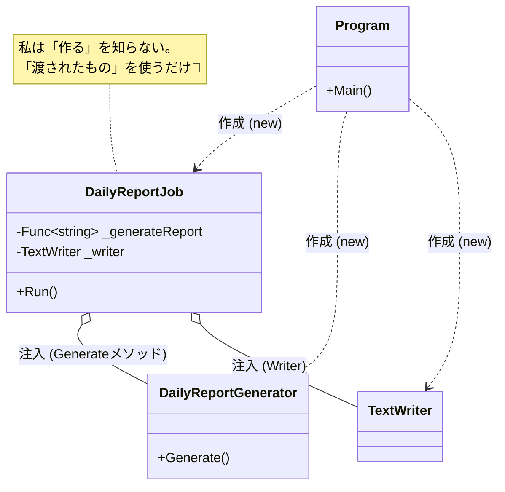

# 第11章：低結合① まずは「引数で渡す」🎁✨

この章は、低結合の“最初の一歩”として **「中で new しないで、外から渡す」** を体に覚えさせます😊
（ちなみに今の最新だと **.NET 10（LTS）＋C# 14** が最新ラインだよ〜📌 ([Microsoft for Developers][1])）

---

## 1) ねらい🎯： “中で作らない”感覚を身につける


### 今日できるようになること💪✨

* `new` を見つけたら「これ、外から渡せる？」って考えられる👀🔍
* **メソッド引数** と **コンストラクタ引数** を使い分けられる📦
* テストで「本物のファイル/本物の外部」なしでも確認できる🧪🎉

---

## 2) まず敵を知る👾：「中で new」すると何が困るの？

たとえばクラスの中でこういうの作ってたら…👇

* 変更が波及しやすい😱（作り方・設定・種類の変更が全部ここに来る）
* テストが難しくなる🧪💦（ファイル/ネットワーク/時間…“現実”に引っ張られる）
* 再利用しづらい🧩（別の保存先にしたい、ログの出し方変えたい、が面倒）

ポイントはこれ👇
**「依存（＝外側の都合が変わりやすいもの）」は中で作らず、外から渡す** 🎁✨

---

## 3) 依存を渡す3つの型📦✨（超基本）


### A. メソッド引数で渡す（その1回だけ使う時）🫶

* その処理の間だけ必要
* 例：`Send(emailSender)` とか、`Save(writer)` とか

### B. コンストラクタ引数で渡す（ずっと使う時）🏠

* そのクラスの“性格”としてずっと必要
* 例：`OrderService(repo, logger)` みたいに保持する

### C. デリゲート（関数）で渡す（まだ interface 使わない時の裏技）🪄

* 「処理そのもの」を引数でもらう
* 例：`Func<string>` を渡して「レポートを作る係」を差し替え可能にする

> 次章（第12章）で interface に進むけど、この章はまず **“渡す”だけで効く** を体験する章だよ😊🔰
> .NET 自体も DI を強くサポートしてる考え方なんだけど（公式ドキュメントあり📚）まずはミニマムにいこうね✨ ([Microsoft Learn][2])

---

## 4) ハンズオン🛠️：new を外に追い出して、引数で受け取る🔁

### お題📌：毎日のレポートを書き出す処理📝

---

### Step 0：ダメな例（中で全部作ってる）😵‍💫

```csharp
using System;
using System.IO;

public sealed class DailyReportJob
{
    public void Run()
    {
        // 依存①：レポート生成器（中で new）
        var generator = new DailyReportGenerator();

        // 依存②：出力先ファイル（中で new）
        using var writer = new StreamWriter("report.txt");

        var text = generator.Generate();
        writer.Write(text);
    }
}

public sealed class DailyReportGenerator
{
    public string Generate()
    {
        return $"Report: {DateTime.Now:yyyy-MM-dd HH:mm:ss}";
    }
}
```

👆これ、テストしようとすると「ファイル書き込み」「現在時刻」に引っ張られてダルいの…😇💦

---

### Step 1：まず “依存” を引数にする🎁✨（コンストラクタ注入版）

ここでは **「レポートを作る係」** を `Func<string>` にして、**出力先** は `TextWriter` を受け取るようにするよ✌️
（まだ interface なしでも差し替えできるのがポイント🪄）

```csharp
using System;
using System.IO;

public sealed class DailyReportJob
{
    private readonly Func<string> _generateReport;
    private readonly TextWriter _writer;

    public DailyReportJob(Func<string> generateReport, TextWriter writer)
    {
        _generateReport = generateReport ?? throw new ArgumentNullException(nameof(generateReport));
        _writer = writer ?? throw new ArgumentNullException(nameof(writer));
    }

    public void Run()
    {
        var text = _generateReport();
        _writer.Write(text);
    }
}
```

---

### Step 2：「組み立てる場所」を外に作る🏗️（Program側）

**作るのは外！渡すのが中！** これが合言葉🎀

```csharp
using System;
using System.IO;
using System.Text;

public static class Program
{
    public static void Main()
    {
        var generator = new DailyReportGenerator();

        using var writer = new StreamWriter(
            path: "report.txt",
            append: true,
            encoding: Encoding.UTF8);

        var job = new DailyReportJob(generator.Generate, writer);
        job.Run();

        Console.WriteLine("Done!");
    }
}

public sealed class DailyReportGenerator
{
    public string Generate()
    {
        return $"Report: {DateTime.Now:yyyy-MM-dd HH:mm:ss}";
    }
}
```

✅ これで、`DailyReportJob` 自体は「ファイルに書く」ことを知らない
→ **低結合**になった🎉✨



---

### Step 3：テストが一気にラクになる🧪💖（ファイル不要！）

例：xUnit で確認（`StringWriter` を使うとメモリ上で完結するよ🥳）

```csharp
using System;
using System.IO;
using Xunit;

public sealed class DailyReportJobTests
{
    [Fact]
    public void Run_writes_generated_text()
    {
        // Arrange
        var writer = new StringWriter();
        var job = new DailyReportJob(() => "HELLO", writer);

        // Act
        job.Run();

        // Assert
        Assert.Equal("HELLO", writer.ToString());
    }
}
```

🎉 **“引数で渡す”だけ** で、テストしやすさが爆上がりするの体感できた？✨

---

## 5) 使い分け早見（迷ったらこれ）🧭✨

* **クラス全体で使う** → コンストラクタ引数（保持する）🏠
* **そのメソッド1回だけ** → メソッド引数（都度渡す）🎁
* **まだ interface 作りたくない**／**処理だけ差し替えたい** → `Func<>` / `Action<>` 🪄

---

## 6) ありがち落とし穴⚠️😵

### 落とし穴①：引数が増えすぎる（パラメータ地獄）🌋

* 「え、引数10個…？」ってなったら
  👉 **“まとめ役”のオブジェクト**を作る（設定クラスなど）か、そもそも責務が混ざってないか疑う🍲💥

### 落とし穴②：Dispose（後始末）どっちがやるの問題🧹

* ルール：**作った人が片付ける** 🙋‍♀️
  今回は `StreamWriter` を Program が作ったから Program が `using` で片付ける✅

### 落とし穴③：null を受け取って爆発💣

* 受け取り側で `ArgumentNullException` 入れておくと安心😌✨（上の例みたいに）

---

## 7) 練習問題（15〜30分）⏳🎀

### 練習A：new を引数に追い出してみよう🔁

次のうち「中で new してそう」なものを1つ選んで、外から渡す形に直してみて👇

* `HttpClient` 🌐
* `StreamWriter` / `FileStream` 📁
* `Random` 🎲
* `DateTime.Now`（これは次章で “Clock” にすると気持ちいい）⏰✨

### 練習B：テストを1本だけ書く🧪

* 本物の外部に触らずに（ファイルなし、ネットなし）
* `StringWriter` / `MemoryStream` とかを使って確認する🎉

---

## 8) 章末チェック✅✨（3つ言えたら勝ち！）

* 「依存」って何？（自分が頼ってる外部のもの！）🔗
* どうやって弱める？（中で作らず、引数で渡す！）🎁
* 何が嬉しい？（変更に強い＆テストがラク！）🧪💖

---

## AIプロンプト🤖（この章は1個だけ🎀）

> 「このコード内の `new` を列挙して、**“外から渡すべき依存”** と **“中で作ってOKなもの”** に分類して。
> さらに、外から渡す場合は **メソッド引数 or コンストラクタ引数** のどちらが良いかも理由つきで提案して。」

---

次の第12章では、ここで“引数で渡せるようになった依存”を **interface にして差し替えやすくする**よ🔌✨
（「交換できるって気持ちいい…！」を体験しにいこう🥳）

[1]: https://devblogs.microsoft.com/dotnet/announcing-dotnet-10/?utm_source=chatgpt.com "Announcing .NET 10"
[2]: https://learn.microsoft.com/en-us/dotnet/core/extensions/dependency-injection?utm_source=chatgpt.com "Dependency injection - .NET"

