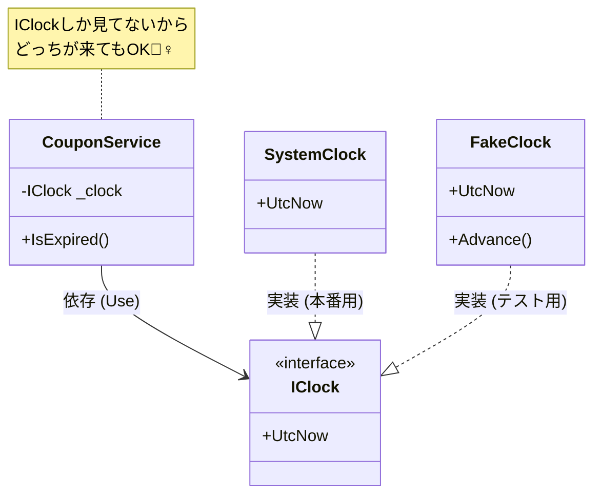

# 第12章：低結合② interfaceで差し替え（超入門）🔌✨
〜「交換できるって気持ちいい！」を体験しよ〜😊💕

---

## 1) 今日のゴール🎯✨


この章が終わるころには…

* ✅ `interface` が「契約（約束）📜」って感覚でわかる
* ✅ “差し替えできる設計” がどうして低結合になるか、説明できる
* ✅ **テストしにくい依存（時刻とか）** を **差し替え** できるようになる⏰➡️🧪

ちなみに、いまの最新C#は **C# 14**、対応SDKは **.NET 10** だよ〜（2025年11月公開の公式ドキュメント）。([Microsoft Learn][1])

---

## 2) interface を一言でいうと？📜✨


**interface =「こういう機能を提供します！」っていう “約束の形”** だよ😊

* 使う側（呼ぶ側）🧑‍💻：「約束どおりに動いてくれればOK」
* 作る側（実装側）🏗️：「約束どおりに作ります！」

ここが超大事👇
**使う側が “具体クラス” を知らなくてよくなる** → 依存が弱くなる（＝低結合）🔗✨

---

## 3) 低結合になる “矢印” の話👀➡️


ありがちな密着パターン😵‍💫

* `OrderService` が `SystemClock` を **直に知ってる**（具体クラス依存）
  → 後で時計を変えたい／テストしたいときに辛い💦

理想のパターン😍

* `OrderService` は `IClock` だけ知ってる
* `SystemClock` でも `FakeClock` でも **交換可能**🔁✨

イメージ図（超大事！）👇

OrderService → IClock ← SystemClock / FakeClock

矢印が **具体クラスじゃなく、interface に向く** と安全になる🛡️✨

---

## 4) 「interface にするべき依存」チェックリスト✅🧠


全部を interface にすると逆にゴチャゴチャするので🙅‍♀️
まずはこの3つで判断しよ😊🎀

### ✅ ① 外側の都合で変わりやすい？🌍

例：時刻⏰、ログ🪵、ファイル📁、DB💾、Web API🌐、乱数🎲

### ✅ ② テストで “固定したい” もの？🧪

例：今の時刻が変わるとテストが不安定😇💥

### ✅ ③ 交換したい理由がはっきりある？🎯

「将来こう変えるかも」「環境で切り替えるかも」が言えるならアリ✨

---

## 5) ハンズオン🛠️：IClock で “時刻依存” を差し替える⏰➡️🧪

題材はシンプルにするね😊
「締切を過ぎてたら期限切れ」みたいな判定を作るよ✅

### 5-1) ダメな例（時刻を直呼び）😱


```csharp
public class CouponService
{
    public bool IsExpired(DateTimeOffset expiresAtUtc)
    {
        // 😱 直に呼ぶとテストが難しい＆変更に弱い
        return DateTimeOffset.UtcNow >= expiresAtUtc;
    }
}
```

これ、テストしようとすると「今」のせいでブレるの😇💦
（テストがたまに落ちる “フレーク” の原因になりやすい）

---

### 5-2) Step1：契約（interface）を作る📜✨


「今のUTC時刻を返せること」だけ約束しよう😊
**最小でOK！**（太らせない！）🍰❌

```csharp
public interface IClock
{
    DateTimeOffset UtcNow { get; }
}
```

---

### 5-3) Step2：本番用の時計を作る⏰✨

```csharp
public sealed class SystemClock : IClock
{
    public DateTimeOffset UtcNow => DateTimeOffset.UtcNow;
}
```

※ ここは実務だと .NET の `TimeProvider` を使う選択もあるよ（後で紹介するね）😊
`TimeProvider` は “時間の抽象化” を提供する公式機能だよ。([Microsoft Learn][2])

---

### 5-4) Step3：使う側は interface を見る（差し替え可能にする）🔁✨

```csharp
public class CouponService
{
    private readonly IClock _clock;

    public CouponService(IClock clock)
    {
        _clock = clock;
    }

    public bool IsExpired(DateTimeOffset expiresAtUtc)
    {
        return _clock.UtcNow >= expiresAtUtc;
    }
}
```

ここが気持ちいいポイント😍
`CouponService` は **時計の種類を知らない** → 低結合✨



---

### 5-5) Step4：テスト用の FakeClock を作る🧪✨

```csharp
public sealed class FakeClock : IClock
{
    public FakeClock(DateTimeOffset initialUtcNow)
    {
        UtcNow = initialUtcNow;
    }

    public DateTimeOffset UtcNow { get; private set; }

    public void Advance(TimeSpan delta)
    {
        UtcNow = UtcNow.Add(delta);
    }
}
```

---

### 5-6) テストしてみる（例：MSTest風）🧪✅

```csharp
using Microsoft.VisualStudio.TestTools.UnitTesting;

[TestClass]
public class CouponServiceTests
{
    [TestMethod]
    public void IsExpired_期限前ならfalse()
    {
        var clock = new FakeClock(new DateTimeOffset(2026, 01, 14, 0, 0, 0, TimeSpan.Zero));
        var service = new CouponService(clock);

        var expiresAt = new DateTimeOffset(2026, 01, 14, 1, 0, 0, TimeSpan.Zero);

        Assert.IsFalse(service.IsExpired(expiresAt));
    }

    [TestMethod]
    public void IsExpired_期限後ならtrue()
    {
        var clock = new FakeClock(new DateTimeOffset(2026, 01, 14, 0, 0, 0, TimeSpan.Zero));
        var service = new CouponService(clock);

        var expiresAt = new DateTimeOffset(2026, 01, 14, 0, 30, 0, TimeSpan.Zero);

        clock.Advance(TimeSpan.FromHours(1)); // ⏰ 時間を進める！

        Assert.IsTrue(service.IsExpired(expiresAt));
    }
}
```

できた〜！🎉
テストが **いつ実行しても同じ結果** になるの、最高だよね🥹✨

---

## 6) よくある失敗あるある🚧💦（ここ超大事）

### ❌ 失敗①：interface を作りすぎる（1クラス1interface病）😵

「テストのためだけ」に全部 interface にすると、逆に迷子になりがち📁🧭
→ まずは **外側の依存（時刻/ログ/DB/ファイル）** からでOK😊

### ❌ 失敗②：interface が太る（メソッド盛り盛り）🍰💥


`IClock` に `Parse()` とか `Format()` とか入れ始めると責務が混ざる🍲
→ **“その依存の核” だけ** を約束にしよう✨

### ❌ 失敗③：命名がふわっとする（IService/Manager増殖）🫠

* `IClock` ✅（役割が明確）
* `IUtility` ❌（何でも屋の匂い）

---

## 7) おまけ：実務寄りの「TimeProvider」って選択肢⏰🧰✨


.NET には **時間を抽象化する公式機能 `TimeProvider`** があるよ😊
「時間に依存するコードをテスト可能にする」ための仕組みとして紹介されてる。([Microsoft Learn][2])

たとえば `TimeProvider.System` は “システム時計” を表して、`GetUtcNow()` で UTC 時刻を取れるよ。([Microsoft Learn][3])

さらに、テスト用に `FakeTimeProvider` を使うパッケージも提供されてる（NuGet）。([NuGet][4])

※ ただしこの章は「interfaceの基本体験」が主役だから、まずは `IClock` 自作でOKだよ😊🎀

---

## 8) おまけ（ちょい上級）：default interface methods って何？🧩✨

「interface に後からメソッドを追加したい…でも既存実装が壊れるの怖い😱」
ってときに、**既定実装（default interface methods）** という手があるよ。([Microsoft Learn][5])

ただし便利な反面、設計が難しくなりやすいから…
**最初は “使わない” でOK** 🙆‍♀️✨（必要になってからで大丈夫）

---

## 9) この章のAIプロンプト🤖💡（1つだけ）

* 「このクラスの依存のうち interface 化すると効果が大きいものを3つ挙げて。各interfaceは “最小メソッド” で設計して、理由もつけて」

使うときのコツ👇
AIの案は「候補」だから、最後に自分でチェック✅

* 約束が太ってない？🍰💦
* 交換したい理由が本当にある？🎯
* 境界が “外側” になってる？🌍

---

## 10) まとめ🎀✨（今日の持ち帰り）

* ✅ interface は「約束」📜
* ✅ 低結合は「矢印が interface に向く」状態🔁
* ✅ まずは **時刻・ログ・DB** みたいな “外側依存” を差し替えると効果デカい⏰🪵💾
* ✅ テストが安定して、変更が怖くなくなる😊🧪✨

---

## 次章予告👀💉✨（第13章へ）

次は **DI（依存性注入）** を「コンテナ無し」でやるよ〜！
今日やった `IClock` を **“組み立て場所” で差し込む** と、さらにスッキリする😆🏗️✨

[1]: https://learn.microsoft.com/ja-jp/dotnet/csharp/whats-new/csharp-14?utm_source=chatgpt.com "C# 14 の新機能"
[2]: https://learn.microsoft.com/en-us/dotnet/standard/datetime/timeprovider-overview?utm_source=chatgpt.com "What is the TimeProvider class - .NET"
[3]: https://learn.microsoft.com/en-us/dotnet/api/system.timeprovider?view=net-10.0&utm_source=chatgpt.com "TimeProvider Class (System)"
[4]: https://www.nuget.org/packages/Microsoft.Extensions.TimeProvider.Testing/10.0.0?utm_source=chatgpt.com "Microsoft.Extensions.TimeProvider.Testing 10.0.0"
[5]: https://learn.microsoft.com/en-us/dotnet/csharp/advanced-topics/interface-implementation/default-interface-methods-versions?utm_source=chatgpt.com "Safely update interfaces using default interface methods - C#"

