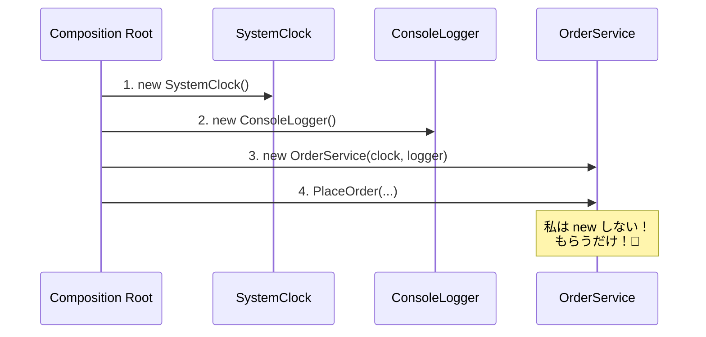

# 第13章：低結合③ DI（依存性注入）※コンテナ無し💉✨

### 0. この章でできるようになること🎯

* 「DIって結局なに？」を **“差し替え”の感覚**で説明できる🙆‍♀️✨
* `new` をクラスの中で乱発しないで、**コンストラクタで受け取る**設計にできる👶📦
* **組み立て場所（Composition Root）**を作って、依存のゴチャつきを一箇所に寄せられる🏗️🧹

※いまの最新版だと、.NET 10（LTS）＆ C# 14 が前提で話してOKだよ〜🫶（2025/11/11 に .NET 10 がリリース、LTSとしてサポートも明記） ([Microsoft][1])

---

### 1. DIってなに？いちばん短い説明🧠✨


DI（依存性注入）は、

> **「必要な部品（依存）を、外から渡してあげる」** ことだよ🎁

たったこれだけ！
目的は超シンプルで、**差し替えできる＝変更に強い＝低結合**になること🔁💪

* ❌ クラスの中で `new` して部品を固定 → 変更が怖い😱
* ✅ 外から部品を渡す → テストも変更も楽になる😌🧪

---

### 2. まず “DIしてない” 地獄コードを見よう😇➡️😱


「注文を確定する」処理があるとして、ログと現在時刻が必要だとするね🧾⏰

```csharp
// ❌ DIしてない例：クラスの中で全部 new して固定
public sealed class OrderService
{
    public void PlaceOrder(string itemName)
    {
        var clock = new SystemClock();
        var logger = new ConsoleLogger();

        logger.Log($"注文: {itemName} at {clock.Now:O}");
        // ...本当はDB保存や通知などが続く...
    }
}

public sealed class SystemClock
{
    public DateTimeOffset Now => DateTimeOffset.Now;
}

public sealed class ConsoleLogger
{
    public void Log(string message) => Console.WriteLine(message);
}
```

これ、何が困る？💦

* テストで「時刻を固定」できない（毎回 `Now` が変わる）⏰😵
* ログをファイルにしたくても、`ConsoleLogger` が中で固定されてる📌
* `OrderService` が「注文」以外の事情（ログ/時刻）まで抱えて、責務が太りやすい🍲💥

---

### 3. “Poor Man’s DI（手作りDI）” の基本はコンストラクタ注入👶💉


まず「差し替えたい部品」を **インターフェース**にして、`OrderService` はそれにだけ依存するよ🔌✨

```csharp
public interface IClock
{
    DateTimeOffset Now { get; }
}

public interface ILogger
{
    void Log(string message);
}
```

実装は今まで通りでOK👇

```csharp
public sealed class SystemClock : IClock
{
    public DateTimeOffset Now => DateTimeOffset.Now;
}

public sealed class ConsoleLogger : ILogger
{
    public void Log(string message) => Console.WriteLine(message);
}
```

そして本体！`OrderService` は **必要な部品をコンストラクタで受け取る**だけ🎁

```csharp
public sealed class OrderService
{
    private readonly IClock _clock;
    private readonly ILogger _logger;

    public OrderService(IClock clock, ILogger logger)
    {
        _clock = clock;
        _logger = logger;
    }

    public void PlaceOrder(string itemName)
    {
        _logger.Log($"注文: {itemName} at {_clock.Now:O}");
        // ...注文の本質だけに集中できる✨...
    }
}
```

これが DI のど真ん中💉✨

* `OrderService` は **「注文」だけ**考えればよくなる🎯
* 時計やログは **交換可能な部品**になる🔁

---

### 4. コンテナ無しDIの必殺技：Composition Root（組み立て場所）🏗️✨


DIすると「じゃあ誰が `new` するの？」ってなるよね？🤔
答えはこれ👇

> **“組み立て” はアプリの入口でまとめてやる**（= Composition Root）🏗️

Composition Root は「依存関係の組み立てを行う場所」で、アプリのエントリポイントに置くのが基本だよ〜✨ ([blog.ploeh.dk][2])

コンソールアプリなら `Program.cs`（トップレベルステートメント）に置くのが超自然！🪄

```csharp
// ✅ Composition Root（組み立て役）
IClock clock = new SystemClock();
ILogger logger = new ConsoleLogger();

var service = new OrderService(clock, logger);
service.PlaceOrder("チョココロネ🍫🥐");
```

これで、

* アプリ内部（OrderServiceたち）は **注入だけ**に集中🧘‍♀️
* `new` の嵐は **入口に封印**🧹🔒

「Composition Root は1箇所が理想」って考え方もよく語られるよ📌 ([blog.ploeh.dk][2])



---

### 5. DIのご褒美：テストが “急に簡単” になる🧪🎉


時刻を固定できる `FakeClock` を作るだけで、テストがすごく安定するよ⏰🧊

```csharp
public sealed class FakeClock : IClock
{
    public DateTimeOffset Now { get; set; }
}
```

ログも「覚えておく」だけの偽物にすると便利📒✨

```csharp
public sealed class ListLogger : ILogger
{
    public List<string> Messages { get; } = new();
    public void Log(string message) => Messages.Add(message);
}
```

テストの雰囲気（xUnit想定）👇

```csharp
using Xunit;

public sealed class OrderServiceTests
{
    [Fact]
    public void PlaceOrder_LogsTimestamp()
    {
        var clock = new FakeClock { Now = new DateTimeOffset(2026, 1, 1, 12, 0, 0, TimeSpan.FromHours(9)) };
        var logger = new ListLogger();
        var service = new OrderService(clock, logger);

        service.PlaceOrder("りんご🍎");

        Assert.Contains(logger.Messages, m => m.Contains("2026-01-01T12:00:00.0000000+09:00"));
    }
}
```

DIの快感ポイントはここ！😆✨
**「差し替えできる＝テストしやすい＝変更が怖くない」** って繋がるよ🔁🧠

---

### 6. ハンズオン🛠️：Program側で “組み立てて渡す” DI を完成させよう✅

やることは3つだけだよ🎀

1. `IClock / ILogger` を作る🔌
2. `OrderService` をコンストラクタ注入にする💉
3. `Program.cs` で組み立てる🏗️

チェックリスト✅

* [ ] `OrderService` の中に `new ConsoleLogger()` が残ってない？👀
* [ ] `OrderService` が具体クラス（`ConsoleLogger` など）を参照してない？🔗
* [ ] `new` が `Program.cs` に寄ってきた？🏗️✨

---

### 7. よくある失敗パターン（初心者あるある）😵‍💫💦

#### ❌ 失敗1：注入してるのに、途中でまた `new` しちゃう


「せっかく差し替えたのに固定し直す」やつ😭
→ **“部品は最後まで外から来たものを使う”** を徹底しよ🔁

#### ❌ 失敗2：何でも interface にする

まずは **外側（時刻・ログ・DB・HTTP・ファイル）** からでOK⏰🪵💾
ドメインの中心まで無理に抽象化しなくていいよ🙆‍♀️

#### ❌ 失敗3：組み立てが散らばる


`new` があちこちにいると、また変更が怖くなる😱
→ **Composition Root に寄せる**のが正解🏗️🧹 ([blog.ploeh.dk][2])

---

### 8. まとめ🌸

* DIは「外から渡す」＝**差し替えの技術**🎁💉
* 基本は **コンストラクタ注入**👶
* コンテナ無しでも、**Composition Root を作れば十分強い**🏗️✨

---

### AIプロンプト🤖（この章は1つだけ🎀）

1. 「この構成で“組み立て役（Composition Root）”はどこに置くのが自然？理由もセットで教えて」

   * ついでに「`new` が散らばってないか」もチェックしてもらうと最高だよ👀✨

[1]: https://dotnet.microsoft.com/en-us/platform/support/policy/dotnet-core?utm_source=chatgpt.com "NET and .NET Core official support policy"
[2]: https://blog.ploeh.dk/2011/07/28/CompositionRoot/?utm_source=chatgpt.com "Composition Root - ploeh blog"

