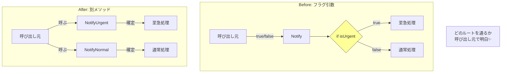

# 第14章：結合の種類① フラグ引数をやめる🚩💦

## 今日のゴール🎯

* 「`bool`引数で挙動が変わるコード」が **なぜ変更に弱いのか** 説明できる🗣️✨
* フラグ引数を見つけたら、**3つの直し方**（別メソッド／enum化／方針オブジェクト）を選べるようになる🧩
* 直したあとに、**責務が混ざってないか🍲／依存が増えてないか🔗** を自分でチェックできる✅

---

## 1) フラグ引数ってなに？👀🚩

**フラグ引数**は「引数の値（たとえば `true/false`）で、関数が**別の仕事**をするように切り替える」タイプの引数だよ〜🚩
Martin Fowler も、まさにそういう意味で “Flag Argument” を説明してるよ。([martinfowler.com][1])

たとえば…👇

* `Send(message, true)`（true だと“至急モード”で送る）
* `Export(report, false)`（false だとPDFじゃなくて別形式）
* `Save(user, true)`（true だと上書き、falseだと新規…みたいな）

こういうの、**呼び出し側が「中の分岐」を知ってないと使いにくい**のがポイント😵‍💫

---

## 2) なぜフラグ引数は「結合」を強めやすいの？🔗💣


### つらみ①：呼び出しが読めない（`foo(true)`問題）😇

`true` が何を意味するのか、コード見ただけじゃ伝わりにくいよね💦
（引数名を見に行かないとわからない…）

### つらみ②：1つのメソッドに“別の責務”が混ざりやすい🍲

`if(flag)` の中と外で、別の処理の流れが育つと…

* 変更するたびに両方の分岐を気にする
* テストケースも倍々に増える
  ってなりがち😱

### つらみ③：増殖すると地獄（フラグ×フラグ）🕸️

`bool a, bool b, bool c...` が増えると、分岐の組み合わせが爆発💥
「ちょい修正」が「全ルート確認」に変わるあるある😇

実際、リファクタリングの定番として **“Remove Flag Argument”**（フラグ引数を消す）が挙げられてるくらい、よくある改善ポイントだよ📚✨ ([martinfowler.com][2])

---

## 3) でも…`bool`引数が全部ダメってわけじゃないよ🙆‍♀️✨

ここ大事〜！💡
「`bool`が“状態”を表してるだけ」で、**挙動切り替えのスイッチじゃない**なら、必ずしも悪ではない場合もあるよ。([ardalis.com][3])

たとえば👇

* `User.IsPremium`（ユーザーの状態）
* `isDeleted`（状態の表現）
* “設定値”として options に含まれてる（ただし設計次第）

判断のコツはこれ👇
✅ **“true/falseで別の仕事になる？”** → フラグ引数っぽい🚩
✅ **“true/falseが、その対象の自然な属性？”** → 状態の可能性🌱

---

## 4) 直し方はだいたい3択だよ🧩✨（迷ったらここ！）


### A. 別メソッドに分ける（いちばん入門）✂️

* `SendUrgent()` と `SendNormal()` みたいに **名前で意図を固定**する
* 呼び出しが読みやすくなる📖✨

### B. `enum` にする（将来ふえそうなら強い）🧷

* `bool` の二択を **意味のある名前**にする
* 3段階以上になっても拡張しやすい（`Low/Normal/High` など）

### C. 方針オブジェクト（Strategyっぽく）にする（分岐が育ってきたら）🧠

* “やり方”をクラスに切り出して差し替える
* 「巨大 `switch/if` を消したい時」に相性がいいよ✨ ([リファクタリング・グル ][4])

---

## 5) ハンズオン🛠️：フラグ引数を「別メソッド」にする✂️🎀

## 5-1. まずは“あるあるNG例”🚩

「至急ならSMSも送る、通常ならEmailだけ」みたいなやつ👇

```csharp
public record User(string Email, string PhoneNumber);

public interface IEmailSender
{
    void Send(string to, string subject, string body);
}

public interface ISmsSender
{
    void Send(string phoneNumber, string message);
}

public class NotificationService
{
    private readonly IEmailSender _email;
    private readonly ISmsSender _sms;

    public NotificationService(IEmailSender email, ISmsSender sms)
    {
        _email = email;
        _sms = sms;
    }

    // 🚩 フラグ引数：isUrgent で “別の仕事” になる
    public void Notify(User user, string message, bool isUrgent)
    {
        if (isUrgent)
        {
            _sms.Send(user.PhoneNumber, $"【至急】{message}");
            _email.Send(user.Email, "至急のお知らせ", message);
            return;
        }

        _email.Send(user.Email, "お知らせ", message);
    }
}
```

呼び出し側がこうなると…👇

* `Notify(user, "明日提出だよ", true)` ← 何が起きるか一瞬でわからない😇
* “至急”の仕様変更が入ると、ifの両側を気にする必要が出てくる😵‍💫

---

## 5-2. 応急処置：名前付き引数（読みやすさだけ上げる）🩹

まずは **既存コードを壊さず** 読みやすくする小技👇
（※でも根本解決ではないよ〜💦）

```csharp
service.Notify(user, "明日提出だよ", isUrgent: true);
```

---

## 5-3. 本命：別メソッドに分ける✂️✨

「呼び出し意図」を **メソッド名で固定**するよ🎯

```csharp
public class NotificationService
{
    private readonly IEmailSender _email;
    private readonly ISmsSender _sms;

    public NotificationService(IEmailSender email, ISmsSender sms)
    {
        _email = email;
        _sms = sms;
    }

    public void NotifyNormal(User user, string message)
        => NotifyCore(user, message, isUrgent: false);

    public void NotifyUrgent(User user, string message)
        => NotifyCore(user, message, isUrgent: true);

    // 内部実装はまとめてもOK（public API からフラグを追い出すのが目的🎯）
    private void NotifyCore(User user, string message, bool isUrgent)
    {
        if (isUrgent)
        {
            _sms.Send(user.PhoneNumber, $"【至急】{message}");
            _email.Send(user.Email, "至急のお知らせ", message);
            return;
        }

        _email.Send(user.Email, "お知らせ", message);
    }
}
```

### これで何がうれしい？😊

* 呼び出しがこうなる👇
  `NotifyUrgent(user, "明日提出だよ")` ✅（意図が読める！）
* **public API からフラグが消える**ので、利用側が迷子になりにくい🧭✨
* 将来 “至急の仕様” が育っても、影響範囲を追いやすい🔍



---

## 5-4. 最小テストで安心🧪✨（分岐があるなら特に！）

テスト用のフェイクを作って、「至急ならSMSも送る」を確認しよ〜🎀

```csharp
public class FakeEmailSender : IEmailSender
{
    public List<(string To, string Subject, string Body)> Sent { get; } = new();
    public void Send(string to, string subject, string body) => Sent.Add((to, subject, body));
}

public class FakeSmsSender : ISmsSender
{
    public List<(string Phone, string Message)> Sent { get; } = new();
    public void Send(string phoneNumber, string message) => Sent.Add((phoneNumber, message));
}
```

```csharp
// xUnit想定の雰囲気（最小の確認だけでOK🧪）
public class NotificationServiceTests
{
    [Fact]
    public void Urgent_sends_sms_and_email()
    {
        var email = new FakeEmailSender();
        var sms = new FakeSmsSender();
        var service = new NotificationService(email, sms);

        var user = new User("a@example.com", "09000000000");
        service.NotifyUrgent(user, "提出だよ");

        Assert.Single(sms.Sent);
        Assert.Single(email.Sent);
    }

    [Fact]
    public void Normal_sends_only_email()
    {
        var email = new FakeEmailSender();
        var sms = new FakeSmsSender();
        var service = new NotificationService(email, sms);

        var user = new User("a@example.com", "09000000000");
        service.NotifyNormal(user, "提出だよ");

        Assert.Empty(sms.Sent);
        Assert.Single(email.Sent);
    }
}
```

---

## 6) ハンズオン🛠️：分岐が育ったら「方針オブジェクト」へ🧩✨

「至急」側の処理がどんどん増えてきたら…
`if` の中が太って、サービスが何でも屋になりやすい🍲💦

そんなときは **Strategyっぽく**「やり方」を外に出すのがキレイ✨
（巨大条件分岐を整理したい時に使う定番だよ〜）([リファクタリング・グル ][4])

```csharp
public interface INotifyPolicy
{
    void Notify(User user, string message);
}

public class NormalNotifyPolicy : INotifyPolicy
{
    private readonly IEmailSender _email;
    public NormalNotifyPolicy(IEmailSender email) => _email = email;

    public void Notify(User user, string message)
        => _email.Send(user.Email, "お知らせ", message);
}

public class UrgentNotifyPolicy : INotifyPolicy
{
    private readonly IEmailSender _email;
    private readonly ISmsSender _sms;

    public UrgentNotifyPolicy(IEmailSender email, ISmsSender sms)
    {
        _email = email;
        _sms = sms;
    }

    public void Notify(User user, string message)
    {
        _sms.Send(user.PhoneNumber, $"【至急】{message}");
        _email.Send(user.Email, "至急のお知らせ", message);
    }
}

public class NotificationService
{
    private readonly INotifyPolicy _policy;
    public NotificationService(INotifyPolicy policy) => _policy = policy;

    public void Notify(User user, string message) => _policy.Notify(user, message);
}
```

### これが効く場面🧠✨

* “至急” のロジックが増えても、**UrgentNotifyPolicy に閉じ込められる**📦
* サービス本体の責務が「通知する」だけに保てる（高凝集🎯）
* 呼び出し側は “方針” を差し替えるだけ（低結合🔗）

---

## 7) よくある落とし穴⚠️😵

* **フラグを消したのに、結局 `NotifyCore(..., true)` を外部が呼べる**
  → `Core` は `private` / `internal` にして、入口を整理しよ🔒
* **別メソッドに分けたらコピペだらけ**
  → “共通部分” は `Core` に寄せて、public API だけ分けるのがコツ✂️
* **将来3パターン以上に増えそうなのに `bool` のまま**
  → 早めに `enum` か方針へ🧷✨

---

## 8) まとめ🎁✨（この章のチェックリスト✅）

フラグ引数を見つけたら、まずこれ👇

* ✅ 呼び出しが `foo(true)` みたいになってない？（意味が読めない）
* ✅ `if(flag)` の中と外で “別の仕事” してない？🍲
* ✅ いずれパターン増えて `bool,bool,bool...` になりそう？🕸️
* ✅ 解決策は3択：**別メソッド✂️ / enum🧷 / 方針🧩**
* ✅ 直したら最後に：**責務混在🍲** と **依存増加🔗** をセルフチェック🪞✨

---

## AIプロンプト🤖（この章は2つまで🎀）

1. 「この `bool` 引数はフラグ引数？“状態”の `bool`？理由つきで判定して、直し方を **別メソッド / enum / 方針** の3案で出して（メリデメも）」
2. 「今のリファクタ後コード、**責務が混ざってる箇所🍲** と **依存が増えた箇所🔗** を3つずつ指摘して。改善案もセットでお願い」

---

### おまけ豆知識🪄

ちなみに .NET 10 では **C# 14 が最新**として案内されてるよ（言語バージョンの参照用）([learn.microsoft.com][5])

[1]: https://martinfowler.com/bliki/FlagArgument.html?utm_source=chatgpt.com "Flag Argument"
[2]: https://martinfowler.com/articles/refactoring-2nd-changes.html?utm_source=chatgpt.com "Changes for the 2nd Edition of Refactoring"
[3]: https://ardalis.com/are-boolean-flags-on-methods-a-code-smell/?utm_source=chatgpt.com "Are Boolean Flags on Methods a Code Smell?"
[4]: https://refactoring.guru/design-patterns/strategy?utm_source=chatgpt.com "Strategy"
[5]: https://learn.microsoft.com/en-us/dotnet/csharp/whats-new/csharp-14?utm_source=chatgpt.com "What's new in C# 14"

