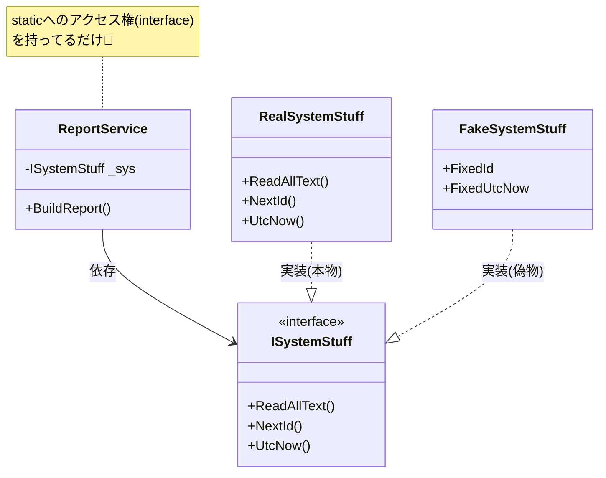

# 第15章：結合の種類② static依存（便利だけど代償）⚡💣

いまの **C# 14 / .NET 10（LTS）** でも、static は当然めちゃ便利です✨（でも“効きすぎ”ると後で泣く…！）
※.NET 10 は **2025/11/11 リリースの LTS** だよ〜📌 ([Microsoft][1])

---

## この章のゴール🎯

* static が「なぜテストと変更に弱いのか」を体感する🧪💦
* static依存を **最小変更で弱める3段階** を覚える🪜✨
* “直すべきstatic” と “そのままでOKなstatic” を見分ける👀✅

---

## static が強いのは「世界に1個」だから🌍⚡


static はざっくり言うと…

* **どこからでも呼べる**（便利）
* **差し替えできない**（つらい）
* **グローバル状態**になりやすい（事故りやすい）💥

たとえば👇

* `DateTime.UtcNow`（時間） ([Microsoft Learn][2])
* `Random.Shared`（乱数） ([Microsoft Learn][3])
* `File.ReadAllText(...)`（ファイルI/O） ([Microsoft Learn][4])

こういう“外の世界”系は、テストで固定できないと **テストが不安定（フレーク）** になりやすいの🥲

---

## 「直すべきstatic」ランキング🏆💣（初心者はここから！）

優先度高い順にいくよ〜📌

1. **時間**：`DateTime.Now / UtcNow` ⏰（日付またぎで落ちる〜） ([Microsoft Learn][2])
2. **乱数**：`Random.Shared` 🎲（毎回結果が変わる〜） ([Microsoft Learn][3])
3. **ファイル/DB/HTTP**：`File.*` / `HttpClient`（外部I/O）📁🌐 ([Microsoft Learn][4])
4. **staticなキャッシュ/状態**：`static List<>` とか（テスト順で壊れる）🧨
5. **staticイベント**：解除し忘れでメモリリーク系😱

---

## 「そのままでOKなstatic」もあるよ🙆‍♀️✨

全部が悪ではない！ここは安心してOK👇

* **定数・不変値**：`const` / `static readonly`（不変）🧊
* **純粋関数**：入力→出力だけ（外部に触らない）🧼
* **拡張メソッド**：中で外部I/Oしないならだいたい平和🧩

ポイントはこれ👇

> **“外の世界（時間・I/O・乱数・環境）に触れるstatic” が危険**⚠️

---

## static依存を弱める「3段階」🪜✨（最小変更でいくよ！）

### 段階1：呼び出しを「1か所に集める」📦

いきなり全部直さない！まず **散らばったstatic呼び出し** を **1クラス** に閉じ込める。

### 段階2：その箱を「差し替え可能」にする🔌

箱に `interface` を付けて、使う側は `interface` だけを見る👀✨

### 段階3：テストでは「偽物」を渡す🧪

本番＝本物 / テスト＝偽物（固定時間・固定乱数・仮想ファイル）で安定💖

---

## ハンズオン🛠️：static地獄を「最小変更で救う」😇✨

題材：**レポート文字列を作る**（時間・乱数・ファイルが絡むやつ）

---

## 1) まずは “変更が怖い” コード（static依存モリモリ）😱⚡

```csharp
using System;
using System.IO;

public class ReportService
{
    public string BuildReport(string templatePath)
    {
        var template = File.ReadAllText(templatePath); // static I/O 📁
        var id = Random.Shared.Next(1000, 9999);       // static 乱数 🎲
        var now = DateTime.UtcNow;                     // static 時間 ⏰

        return template
            .Replace("{id}", id.ToString())
            .Replace("{utc}", now.ToString("O"));
    }
}
```

これ、実装はラクなんだけど…

* テストで **時間も乱数も固定できない**
* ファイル読み込みが絡んで **テストが重い・遅い・壊れやすい** 🥲

---

## 2) 段階1：static呼び出しを「箱」に集める📦✨

まず “外の世界” を触る部分だけまとめるよ👇

```csharp
using System;
using System.IO;

public class SystemStuff // まずは箱（まだ interface なし）
{
    public virtual string ReadAllText(string path) => File.ReadAllText(path);
    public virtual int NextId() => Random.Shared.Next(1000, 9999);
    public virtual DateTime UtcNow() => DateTime.UtcNow;
}
```

そして `ReportService` は箱経由にする👇

```csharp
public class ReportService
{
    private readonly SystemStuff _sys;

    public ReportService(SystemStuff sys)
    {
        _sys = sys;
    }

    public string BuildReport(string templatePath)
    {
        var template = _sys.ReadAllText(templatePath);
        var id = _sys.NextId();
        var now = _sys.UtcNow();

        return template
            .Replace("{id}", id.ToString())
            .Replace("{utc}", now.ToString("O"));
    }
}
```

✅これだけでも「差し替えの入口」に立てたよ〜！

---

## 3) 段階2：箱に interface を付けて “契約化”🔌✨


“本命”はこれ👇
（使う側は interface だけ見ればOKになる）

```csharp
using System;

public interface ISystemStuff
{
    string ReadAllText(string path);
    int NextId();
    DateTime UtcNow();
}
```

本番実装👇

```csharp
using System;
using System.IO;

public class RealSystemStuff : ISystemStuff
{
    public string ReadAllText(string path) => File.ReadAllText(path);
    public int NextId() => Random.Shared.Next(1000, 9999);
    public DateTime UtcNow() => DateTime.UtcNow;
}
```

`ReportService` 側👇

```csharp
public class ReportService
{
    private readonly ISystemStuff _sys;

    public ReportService(ISystemStuff sys)
    {
        _sys = sys;
    }

    public string BuildReport(string templatePath)
    {
        var template = _sys.ReadAllText(templatePath);
        var id = _sys.NextId();
        var now = _sys.UtcNow();

        return template
            .Replace("{id}", id.ToString())
            .Replace("{utc}", now.ToString("O"));
    }
}
```



---

## 4) 段階3：テストで “偽物” を渡して固定する🧪💖

```csharp
using System;
using System.Collections.Generic;

public class FakeSystemStuff : ISystemStuff
{
    private readonly Dictionary<string, string> _files = new();
    public DateTime FixedUtcNow { get; set; } = new DateTime(2026, 1, 1, 0, 0, 0, DateTimeKind.Utc);
    public int FixedId { get; set; } = 1234;

    public void AddFile(string path, string content) => _files[path] = content;

    public string ReadAllText(string path) => _files[path];
    public int NextId() => FixedId;
    public DateTime UtcNow() => FixedUtcNow;
}
```

これで **時間も乱数もファイルも固定** できる〜🎉

---

## さらに今どきの「時間」対策：TimeProvider を使う⏰✨（おすすめ）

.NET 8 から **TimeProvider** っていう “時間の抽象化” が標準で入ったよ！
時間依存コードをテストしやすくするための仕組み✨ ([Microsoft Learn][5])

## TimeProvider を注入する形（IClock作らなくてもOK）🔥

```csharp
using System;

public class ReportService2
{
    private readonly TimeProvider _time;

    public ReportService2(TimeProvider time)
    {
        _time = time;
    }

    public string Stamp()
        => _time.GetUtcNow().ToString("O");
}
```

テストでは **FakeTimeProvider** が使えるよ🧪
（NuGet：`Microsoft.Extensions.TimeProvider.Testing`） ([Microsoft Learn][5])

---

## さらに今どきの「ファイル」対策：System.IO.Abstractions 📁✨（任意）

`File.ReadAllText` みたいな static I/O を、**IFileSystem** 経由にできるライブラリがあるよ。
“System.IO と同じAPI感”で、注入＆テストしやすい設計になってるのが強い💪 ([nuget.org][6])

---

## よくあるつまずきポイント集🧷💦（先に潰す！）

* ✅ **interface は“外の世界”だけに貼る**（時間/I/O/乱数/HTTP/環境）
* ❌ 業務ロジック全部を interface まみれにしない（やりすぎ注意）🥺
* ✅ “staticを消す”じゃなくて、**“staticを近づけない”** が勝ち🏆
* ✅ 「テストで固定したい？」と自分に聞くと判断しやすいよ🧠💡

---

## AIの使いどころ🤖✨（この章はプロンプト2個まで🎀）

1. 🔍 **static依存の洗い出し**
   「このC#コードの *static依存*（DateTime/File/Random/Environmentなど）を列挙して、テスト上のリスク順に並べて。最小変更の改善案も1つずつ添えて」

2. 🪜 **段階的リファクタ案**
   「static呼び出しを *段階1: 1か所に集約 → 段階2: interface化 → 段階3: Fake実装でテスト* の順で直す手順を、差分が小さくなるように提案して」

---

## まとめ🎉

* static は便利だけど、**差し替え不能＝変更＆テストに弱い**⚡💦
* 改善は **①集める→②interface→③偽物で固定** の3段階が最強🪜✨
* “時間”は **TimeProvider + FakeTimeProvider** が今どきの正解に近い⏰🧪 ([Microsoft Learn][5])
* “ファイル”は **System.IO.Abstractions** みたいな道具もある📁✨ ([nuget.org][6])

---

次は（もし続けるなら）「staticじゃないけど同じくらい危険なやつ」＝**Service Locator（隠れDI）** とか、**Singletonの罠**も絡めて総まとめに繋げられるよ〜😈🔗

[1]: https://dotnet.microsoft.com/en-us/platform/support/policy/dotnet-core?utm_source=chatgpt.com "NET and .NET Core official support policy"
[2]: https://learn.microsoft.com/en-us/dotnet/api/system.datetime.utcnow?view=net-10.0&utm_source=chatgpt.com "DateTime.UtcNow Property (System)"
[3]: https://learn.microsoft.com/en-us/dotnet/api/system.random.shared?view=net-10.0&utm_source=chatgpt.com "Random.Shared Property (System)"
[4]: https://learn.microsoft.com/ja-jp/dotnet/api/system.io.file.readalltext?view=net-8.0&utm_source=chatgpt.com "File.ReadAllText メソッド (System.IO)"
[5]: https://learn.microsoft.com/en-us/dotnet/standard/datetime/timeprovider-overview?utm_source=chatgpt.com "What is the TimeProvider class - .NET"
[6]: https://www.nuget.org/packages/System.IO.Abstractions/?utm_source=chatgpt.com "System.IO.Abstractions 22.1.0"

