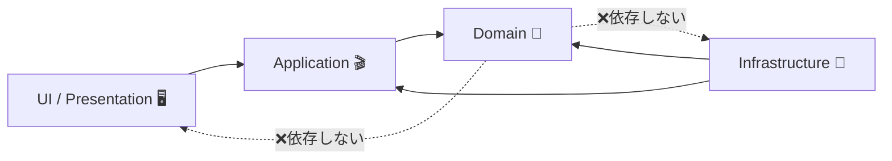
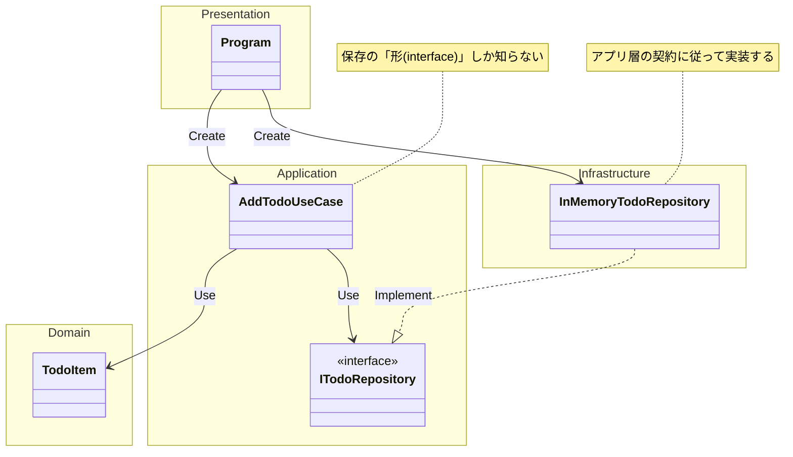

# 第16章：モジュール境界（迷子防止の土台づくり）📁🧭🔒

## この章のゴール🎯✨

この章が終わると、こんなことができるようになるよ〜😊🌸

* 「このコード、どこに置く？」で迷わなくなる🧭✅
* UI / Application / Domain / Infrastructure の“4つの箱”で整理できる📦📦📦📦
* 「依存の向き」をそろえて、変更に強い形を作れる🛡️➡️
* 公開範囲（public）を絞って、壊れにくい“外に出す顔”を作れる🔒✨

---

## 1) そもそも、モジュール境界ってなに？🤔📦

プロジェクトが大きくなると起きがちなのがこれ👇

* 似た処理が増える（どこにあるか分からない）😵‍💫
* 画面の変更なのに業務ロジックが壊れる😱
* DBを変えたいのに、あちこち直す羽目になる💥
* 「ちょっと直しただけ」で影響範囲が読めない📉

**モジュール境界**は、かんたんに言うと
✅「置き場所ルール」＋✅「依存の向きルール」＋✅「公開面（外に見せる面）を小さくする」
この3点セットだよ〜📁🧭🔒

---

## 2) まずは“4つの箱”で考える📦✨（超重要！）


この章の主役はコレ👇

* **UI（Presentation）**：画面・入力・表示（Console/WPF/WinForms/Web もここ）🖥️🎨
* **Application**：アプリのやりたいこと（ユースケース）🎬✅
* **Domain**：業務ルールそのもの（大事な本体）💎📜
* **Infrastructure**：DB・ファイル・HTTP・外部APIなど「外の世界」🌍🔌

「どこに置く？」迷子になったら、まずこの4箱に仕分けしよう🧭💕

---

## 3) 依存の向きは“内側を守る”🛡️➡️


いちばん大事なルールはこれ👇

✅ **Domain は外側（DBやUI）を知らない**
✅ **外側が内側を使う**（逆はダメ🙅‍♀️）

イメージ図（依存の矢印）👇



この向きにしておくと、

* UIを変えても Domain が揺れにくい🎨➡️🛡️
* DBを変えても Domain が揺れにくい💾➡️🛡️
  ってなるよ😊✨

ちなみに .NET は「LTS/STS」が明確で、長く安定運用したいときは LTS を選ぶのが定番だよ📌（.NET 10 は LTS で、サポート期間も明示されてる）([Microsoft][1])

---

## 4) “小さく始める”なら、まずフォルダ分けでOK📁🌱


最初から複数プロジェクトに分けなくて大丈夫🙆‍♀️
まずは 1プロジェクトの中をこう分けるのが超おすすめ👇

```text
MyApp/
  Presentation/      ← UI
  Application/       ← ユースケース
  Domain/            ← ルール本体
  Infrastructure/    ← DB/外部I/O
```

### 置き場所チートシート🧾✨

* 画面イベント、入力、表示整形 → **Presentation** 🖥️
* 「◯◯する（登録/更新/検索/通知）」の流れ → **Application** 🎬
* 金額計算、期限ルール、状態遷移、バリデーション → **Domain** 💎
* DBアクセス、ファイル、HTTP、時間取得、ログ出力 → **Infrastructure** 🔌

---

## 5) 公開面（public）を絞ると、壊れにくくなる🔒✨


プロジェクトが壊れやすくなる原因の1つが、
**なんでも public にしちゃう問題**😇💦

ポイントはこれ👇

* 基本は **internal（プロジェクト内限定）** にする🔒
* “境界として外に出すもの”だけ public にする✨

C# は「トップレベル（名前空間直下）の型」は public / internal にできて、指定しないと既定は internal だよ📌([Microsoft Learn][2])
さらに最近は「file 修飾子」で“そのファイル限定”にもできる（小さく隠せる）って流れもあるよ🧷✨([Microsoft Learn][2])

---

## 6) ハンズオン🛠️：既存コードを4箱に仕分けして“迷子ゼロ”にする📦🧭

ここから実戦だよ〜💪🎀
題材は「締切つき ToDo を登録して、期限が来たら通知する」📅🔔（ありがちで練習しやすい！）

### Step 1：まず“登場人物”を決める🧩

最低限これだけでOK👇

* Domain：ToDo のルール（期限、完了、検証）💎
* Application：登録する・完了にする・通知する流れ🎬
* Infrastructure：時間取得、通知の実装（外の世界）🔌
* UI：画面/入力/表示🖥️

---

### Step 2：Domain（本体）に “ルール” を閉じ込める💎🔒


例：ToDo は「締切が過去なら登録できない」とか「完了したら完了日時を持つ」とかね😊

```csharp
// Domain/TodoItem.cs
namespace MyApp.Domain;

public sealed class TodoItem
{
    public string Title { get; }
    public DateTime DueAt { get; }
    public bool IsCompleted { get; private set; }

    public TodoItem(string title, DateTime dueAt, DateTime now)
    {
        if (string.IsNullOrWhiteSpace(title)) throw new ArgumentException("タイトル必須だよ🥺");
        if (dueAt < now) throw new ArgumentException("締切が過去はダメだよ⏳💦");

        Title = title;
        DueAt = dueAt;
    }

    public void Complete()
    {
        IsCompleted = true;
    }
}
```

✅ ここがポイント

* Domain は「時間の取り方」を知らない（外の世界を知らない）🛡️
* だから「now」は外から渡してるよ（第11〜13章の考え方が効く！）🎁✨

---

### Step 3：Application に “やりたいことの流れ” を置く🎬✨


Application は「手順の司令塔」👑
ここで “外の世界” は **インターフェイス（契約）** にするよ🔌✨

```csharp
// Application/Ports.cs
namespace MyApp.Application;

public interface IClock
{
    DateTime Now { get; }
}

public interface ITodoRepository
{
    void Add(MyApp.Domain.TodoItem item);
}
```

```csharp
// Application/AddTodoUseCase.cs
namespace MyApp.Application;

public sealed class AddTodoUseCase
{
    private readonly IClock _clock;
    private readonly ITodoRepository _repo;

    public AddTodoUseCase(IClock clock, ITodoRepository repo)
    {
        _clock = clock;
        _repo = repo;
    }

    public void Execute(string title, DateTime dueAt)
    {
        var item = new MyApp.Domain.TodoItem(title, dueAt, _clock.Now);
        _repo.Add(item);
    }
}
```

✅ ここがポイント

* Application は Domain を使う🎬➡️💎
* でも DB の具体実装は知らない（Repository は契約だけ）🔌✨

---

### Step 4：Infrastructure に “外の世界の実装” を置く🔌🌍


ここで初めて「実際の時計」「実際の保存先」を書くよ〜🧱✨

```csharp
// Infrastructure/SystemClock.cs
namespace MyApp.Infrastructure;

public sealed class SystemClock : MyApp.Application.IClock
{
    public DateTime Now => DateTime.Now;
}
```

```csharp
// Infrastructure/InMemoryTodoRepository.cs
namespace MyApp.Infrastructure;

public sealed class InMemoryTodoRepository : MyApp.Application.ITodoRepository
{
    private readonly List<MyApp.Domain.TodoItem> _items = new();

    public void Add(MyApp.Domain.TodoItem item) => _items.Add(item);
}
```

✅ ここがポイント

* Infrastructure は Application の契約を実装する（外側が合わせに行く）🤝✨
* Domain 側は「保存の仕方」を一切知らない🛡️

---

### Step 5：UI は “組み立て役（Composition Root）” を持つ🖥️🏗️


最後に UI 側で「パーツを組み立てて」動かすよ〜😊✨

```csharp
// Presentation/Program.cs
using MyApp.Application;
using MyApp.Infrastructure;

var clock = new SystemClock();
var repo  = new InMemoryTodoRepository();

var useCase = new AddTodoUseCase(clock, repo);

Console.Write("タイトル：");
var title = Console.ReadLine() ?? "";

Console.Write("締切（例 2026-01-20）：");
var dueText = Console.ReadLine() ?? "";
var dueAt = DateTime.Parse(dueText);

useCase.Execute(title, dueAt);

Console.WriteLine("登録できたよ〜🎉✅");
```

🎉 これで「4箱＋依存の向き」が完成！



---

## 7) “分けただけ”で終わらない！境界が壊れない工夫🧱🔒

### ✅ ルール1：Domain から外側参照が出たら即ストップ🛑

例：Domain に DB クラス名、HTTP、ファイル、Console が出たら赤信号🚨

### ✅ ルール2：public は最小限に✨

「外に出すのは契約（インターフェイス）と本当に必要な型だけ」🔒
（C# の access modifiers の基本もここが肝だよ）([Microsoft Learn][3])

### ✅ ルール3：テストで境界を守る（発展）🧪🛡️

「うっかり参照しちゃった😇」を自動で検出できると強い！

例：アーキテクチャテスト用に NetArchTest みたいなライブラリを使うと、依存ルールをユニットテストでチェックできるよ✅([GitHub][4])
（ここは発展なので、“できたらラッキー”でOK🎀）

---

## 8) AI活用（この章は2つだけ）🤖✨

### AIプロンプト1（仕分け）📦

「この機能を4箱（UI/App/Domain/Infra）にどう仕分ける？理由も」

✅ チェックすること🧠

* Domain に「外の世界」が混ざってない？🛡️
* Application が “手順” に寄ってる？（ルールを抱えすぎてない？）🎬

### AIプロンプト2（依存の向き監査）🧭

「依存の向きが変になりそうな箇所を指摘して」

✅ チェックすること🧠

* “Domain → Infra” の矢印が生まれてない？🚫
* UI が Infrastructure を直呼びしてない？（Application 経由が基本）🖥️➡️🎬

C# 14 / .NET 10 まわりの最新情報も押さえつつ進めると安心だよ（最新SDKやIDEで試せるって公式にも明記されてる）([Microsoft Learn][5])

---

## 9) まとめ🎀✨（この章でいちばん大事な3行）

* **4箱で置き場所を固定**📦📦📦📦
* **依存は内側へ（Domain を守る）**🛡️➡️
* **public を絞って“外に出す顔”を小さく**🔒✨

次の第17章では、この4箱ルールを使って **ミニプロジェクトを完成**させるよ〜💪🎉

[1]: https://dotnet.microsoft.com/en-us/platform/support/policy/dotnet-core?utm_source=chatgpt.com "NET and .NET Core official support policy"
[2]: https://learn.microsoft.com/ja-jp/dotnet/csharp/programming-guide/classes-and-structs/access-modifiers?utm_source=chatgpt.com "アクセス修飾子 - C#"
[3]: https://learn.microsoft.com/en-us/dotnet/csharp/programming-guide/classes-and-structs/access-modifiers?utm_source=chatgpt.com "Access Modifiers (C# Programming Guide)"
[4]: https://github.com/BenMorris/NetArchTest?utm_source=chatgpt.com "BenMorris/NetArchTest: A fluent API for .Net that can ... - GitHub"
[5]: https://learn.microsoft.com/en-us/dotnet/csharp/whats-new/csharp-14?utm_source=chatgpt.com "What's new in C# 14"

