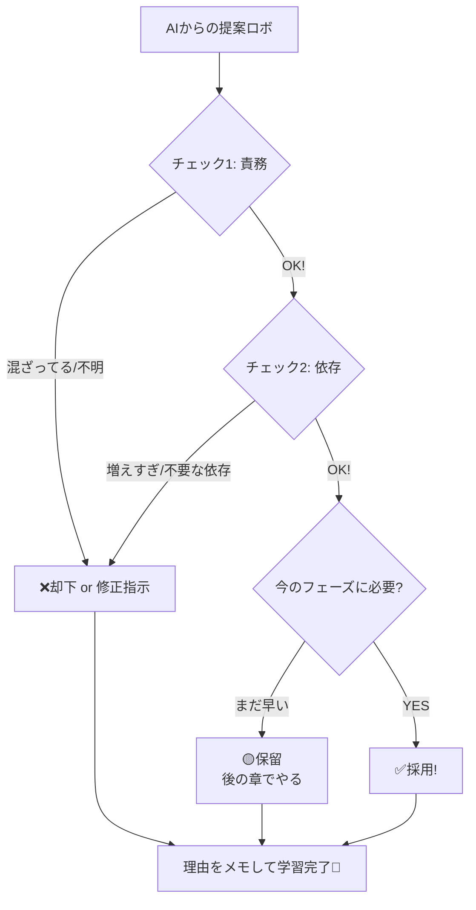

# 第01章：AIと仲良く進めるルール（TS版の共通作法）🤖✨

### 3. この教材のAI運用ルール🎀

🎯

AIを「便利な相棒💡」として使いつつ、**設計の最終判断は自分でできる🧠✅**ようになることだよ〜！

そのために、この章では **“AIの提案をレビューして採否を決める型”** を作っちゃいます✍️✨

---

## 1) 役割分担ルール：AIは案出し、人間は設計判断🧑‍💻🤖


AIはすごく強い👇

* 代替案をたくさん出す💡
* リファクタ案をスピード提示⚡
* 影響範囲の洗い出し🔍

でも弱いところもある👇

* “このプロダクトにとっての正解” は知らない🤷‍♀️
* 変更理由（なぜその分割？）がブレることがある🌪️
* 依存関係が増えても平気で提案してくることがある🔗😇

なので、**採用するかどうかは人間が決める**のがルールだよ🧠✅

---

## 2) 最終判断の2大チェック✅（これだけ覚えればOK）


AIの提案を見たら、まずこれをチェックするよ〜👀✨

### ✅チェックA：責務混在してない？🍲

「1つの関数/ファイルが、別の目的までやってない？」
例：UI表示・通信・変換・ルール判断が1か所に混ざる…みたいなやつ😱

**合格の目安🎯**

* “このファイルの仕事は◯◯です” と一文で言える🗣️
* 変更理由が似てるものが近くにいる🧲

### ✅チェックB：import依存が増えすぎてない？🔗

分割した結果、**importが蜘蛛の巣🕸️**みたいになってない？
依存が増えると、変更が伝染しやすくなるよ〜💥

**合格の目安🎯**

* 主要ロジック側が、外部I/Oにベタ依存してない（後の章で育てるよ）🌱
* “この変更で触る範囲” が増えてない🧯

---

## 3) 1章1〜2プロンプト🎀（混乱しないための鉄則）


この教材では、各章でAIに投げるプロンプトは **1〜2個まで**に絞るよ🙆‍♀️✨
理由：AIに聞きすぎると「案が多すぎて迷子」になりがちだから🧭💦

第1章のプロンプトはこれだけ👇

**Prompt 1️⃣（案出し）🤖**
「このコードの責務を3つに分ける案を、ファイル分割も含めて提案して」

**Prompt 2️⃣（危険チェック）🤖**
「その案、責務の混在やimport依存の増えすぎがない？危険点を3つ」

---

## 4) VS CodeのAIは“自動で直す”より“設計会話”が強い🧠💬

最近のAI開発支援は、「会話」だけじゃなく **自律的に編集するモード**も増えてるよ〜！

* **GitHub Copilot**には、タスクを与えると複数ファイルを自動編集して進める **Agent mode** があるよ🤖🛠️ ([GitHub Docs][1])
* **OpenAI Codex**も、VS Codeで並走したり、タスクを委任できる **Codex IDE extension** があるよ🧩✨ ([OpenAI Developers][2])

💡コツ：
**いきなり“全部おまかせ”にしない**で、まずは
「案出し → 人間が採否 → 小さく反映」
の順にすると事故が激減するよ🚧✨

---

## 5) “採用/保留/却下” 仕分け術（この章のコア）📝✨


AIの提案は、こうやって仕分けるのが超おすすめだよ🎀

| 判定   | 使う場面        | 書くべき理由の例📝                    |
| ---- | ----------- | ----------------------------- |
| ✅採用  | 良さそう！すぐ入れたい | 責務が分かれた、import増えてない、変更理由が揃ってる |
| 🟡保留 | 悪くないけど今じゃない | 今は過剰、後の章（DI/境界）でやると良い         |
| ❌却下  | 事故りそう       | import爆増、責務が逆に混ざった、抽象化しすぎ     |

この「理由を書く」が超大事！🧠✨
“自分の設計判断の筋トレ”になるよ💪💕




---

### 5. 第1章のハンズオン（AI案を1回だけ出して採用/不採用を書く）


保留/却下”に分けよう🎉

ここでは小さな例で、**仕分けの型**を身につけるよ〜🧸✨

### 6-1) ミニ題材（わざと混ぜたコード🍲💥）


「ユーザーを取得して、名前を整形して、ログも出す」…全部ごっちゃにした例😇

```ts
// src/userProfile.ts
export async function loadUserProfile(userId: string) {
  // 通信🌐
  const res = await fetch(`/api/users/${userId}`);
  if (!res.ok) throw new Error("failed");
  const user = await res.json();

  // 変換🔧
  const displayName =
    (user.firstName ?? "").trim() + " " + (user.lastName ?? "").trim();

  // ルール🧠（一部だけ…）
  const isVip = user.tags?.includes("vip") ?? false;

  // 表示/UIっぽいこと🖥️（例としてconsole）
  console.log("displayName:", displayName, "VIP:", isVip);

  return { displayName, isVip };
}
```

この時点で「通信🌐」「変換🔧」「ルール🧠」「表示🖥️」混ざってるよね🍲💦

---

### 6-2) Prompt 1️⃣：責務を3つに分ける案を出してもらう🤖💡

AIにこう聞く👇

```text
このコードの責務を3つに分ける案を、ファイル分割も含めて提案して
```

#### （例）AIが出しがちな分割案📦✨


* `src/infra/userApi.ts`：fetchしてJSONを返す🌐
* `src/domain/userProfile.ts`：表示名整形やVIP判定🧠
* `src/app/loadUserProfile.ts`：組み立て（呼び出して返す）🧩

---

### 6-3) Prompt 2️⃣：危険点チェックをさせる🤖🚨

```text
その案、責務の混在やimport依存の増えすぎがない？危険点を3つ
```

ここでAIが「import増えそう」と言ったら、あなたはこう判断する👇

* **本当に増える？増えるなら何が原因？**
* **その依存は “必要な依存” ？それとも “ついで依存” ？**

---

### 6-4) 仕分けログを書こう📝✨（これが本番！）

例：

| AI提案                            | 判定   | 理由                     |
| ------------------------------- | ---- | ---------------------- |
| fetch部分を `infra/userApi.ts` に分離 | ✅採用  | 通信責務が切れて読みやすい。依存も増えにくい |
| `displayName`整形を domainへ        | ✅採用  | 変換ロジックがまとまる。変更理由が揃う    |
| さらに `logger` 抽象化してDI導入          | 🟡保留 | 今章では早い。後のDI章でやると理解しやすい |
| 便利なので `utils.ts` に全部集約          | ❌却下  | 責務が“便利箱”に混ざって劣化しやすい    |

この表が作れたら、もう第1章は勝ちです🏆✨

---

## 7) 2026の“今どきTS環境”の小ネタ（判断の土台🧱）

* TypeScriptは **npm上の最新版が 5.9.3** として案内されてるよ ([npm][3])
* TypeScript 5.9 では `tsc --init` の生成内容が「よりミニマルで更新された」方向に整理されてるよ🧼✨ ([typescriptlang.org][4])
* VS Code は **2026-01-08 に 1.108（December 2025 update）がリリース**されてるよ📦 ([Visual Studio Code][5])
* Node.js は **24系がLTS入り**しているよ（LTSのコードネームも公開されてる）🟢 ([nodejs.org][6])
* そしてTypeScriptは 6.0/7.0（Project Corsa）に向けた動きが進行中…という公式アップデートも出てるよ🚀 ([Microsoft for Developers][7])

※この教材はまず「設計の筋トレ」が主役なので、ここは“へぇ〜”くらいでOKだよ〜☺️✨

---

## 8) この章の持ち帰りチェックリスト✅✨

最後にこれだけ自分に質問できればOK🎀

* この分割、責務が混ざってない？🍲
* import依存、増えすぎてない？🔗
* 変更理由が同じもの同士でまとまってる？🧲
* AI案を「採用/保留/却下」に分けて、理由を書いた？📝
* 変更は小さく進められそう？（一気にやらない）🐾

---

## 次章チラ見せ👀✨

次は「変更が怖いTSあるある地獄」を体験して、
**なぜ高凝集・低結合が必要か**を腹落ちさせるよ😱➡️😄

必要なら、この第1章のハンズオン用に「もう少しリアルな題材（UI×通信×状態×整形）」のサンプルも作るよ〜🛠️💖

[1]: https://docs.github.com/en/copilot/get-started/features?utm_source=chatgpt.com "GitHub Copilot features"
[2]: https://developers.openai.com/codex/ide/?utm_source=chatgpt.com "Codex IDE extension"
[3]: https://www.npmjs.com/package/typescript?utm_source=chatgpt.com "TypeScript"
[4]: https://www.typescriptlang.org/docs/handbook/release-notes/typescript-5-9.html?utm_source=chatgpt.com "Documentation - TypeScript 5.9"
[5]: https://code.visualstudio.com/updates?utm_source=chatgpt.com "December 2025 (version 1.108)"
[6]: https://nodejs.org/en/blog/release/v24.11.0?utm_source=chatgpt.com "Node.js 24.11.0 (LTS)"
[7]: https://devblogs.microsoft.com/typescript/progress-on-typescript-7-december-2025/?utm_source=chatgpt.com "Progress on TypeScript 7 - December 2025"
