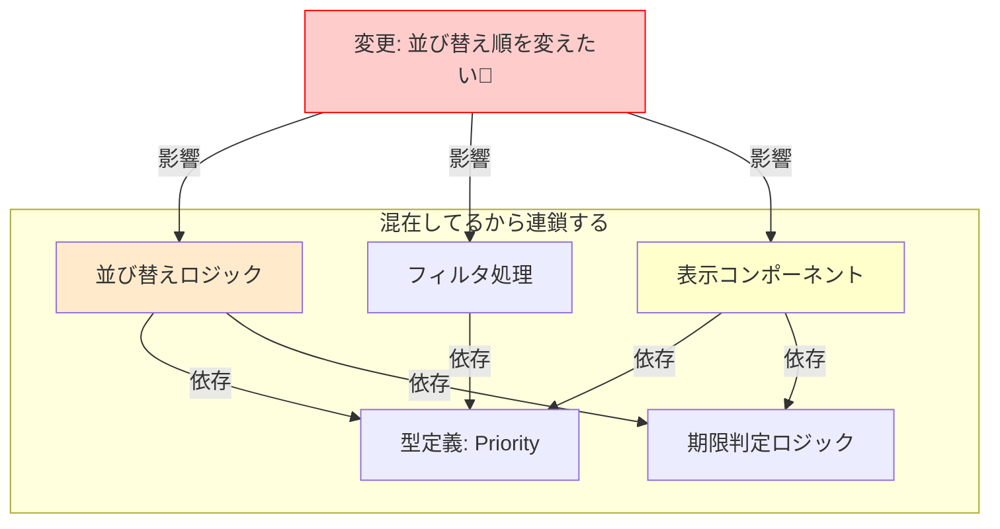

# 第02章：変更が怖いTypeScript（あるある地獄）を体験😱➡️😄

### この章でゴール🎯

* 「なんで高凝集・低結合が必要なの？」を、**痛みで理解**する😇💥
* 小さな仕様変更なのに、**直したら別が壊れる**を体験する🧨
* そして最後に、「壊れやすい理由」を言葉にする🗣️✨

---

## 1) まずは“変更が怖い”ってどんな状態？😱


## まずは“いまどき”の前提だけ超サクッと🧁（※内容は章内に溶かして使うよ）

* TypeScript は 2026年1月時点で **5.9 系の情報が公式で整理**されてるよ📌 ([Microsoft for Developers][1])
* Vite は **v7 の移行ガイド**が公式にある＝現行の主流帯がそこにある感じ🧰 ([vitejs][2])
* React は公式ドキュメント上「最新バージョン」が **19.2** として案内されてるよ🧡 ([React][3])
* Node.js は **v24 が LTS**として扱われてる情報が確認できるよ（2026/1時点）🟩 ([endoflife.date][4])

（この章は“設計の痛み体験”が主役だから、ツール話はここで終わりっ💨）

---

## 6) よくある「壊れ方の正体」図鑑👻⚡


# 1) 地獄のサンプルを動かす🔥（わざと悪いコード💀）

## 1-1. 最小セットアップ（超ざっくり）🛠️

ターミナルで Vite の React+TS を作って起動するよ🚀
（いつもの流れなので細かい説明は省略〜）

---

## 1-2. わざと「全部入り」1ファイルを作る🍲💥


ファイル例：`src/BadTodoPage.tsx`（新規）
そして `App.tsx` から `<BadTodoPage />` を呼ぶだけにしてね🙆‍♀️

↓↓このコードをコピペ👇（※“悪い例”として成立させるために、あえてごちゃっとしてるよ😈）

```tsx
import { useEffect, useMemo, useState } from "react";

type ApiTodo = {
  id: number;
  title: string;
  completed: boolean;
  dueDate: string; // ISO文字列（例: "2026-01-15T00:00:00.000Z"）
  priority: "low" | "mid" | "high";
};

type UiState = {
  loading: boolean;
  errorMessage: string | null;
  keyword: string;
  onlyIncomplete: boolean;
};

function fakeFetchTodos(): Promise<ApiTodo[]> {
  // 本当はAPI呼び出しのつもり（ここは簡易モック）
  return new Promise((resolve) => {
    setTimeout(() => {
      resolve([
        { id: 1, title: "レポート提出", completed: false, dueDate: "2026-01-15T00:00:00.000Z", priority: "high" },
        { id: 2, title: "サークル連絡", completed: true, dueDate: "2026-01-13T00:00:00.000Z", priority: "low" },
        { id: 3, title: "バイト面接準備", completed: false, dueDate: "2026-01-14T00:00:00.000Z", priority: "mid" },
        { id: 4, title: "部屋の片付け", completed: false, dueDate: "2026-01-20T00:00:00.000Z", priority: "low" },
      ]);
    }, 400);
  });
}

function formatDateJa(iso: string): string {
  // 表示整形（UI都合）なのに、あちこちで使われがち…
  const d = new Date(iso);
  const y = d.getFullYear();
  const m = String(d.getMonth() + 1).padStart(2, "0");
  const day = String(d.getDate()).padStart(2, "0");
  return `${y}/${m}/${day}`;
}

function priorityBadge(p: ApiTodo["priority"]): string {
  if (p === "high") return "🔥高";
  if (p === "mid") return "🌤️中";
  return "🍀低";
}

export function BadTodoPage() {
  const [todos, setTodos] = useState<ApiTodo[]>([]);
  const [ui, setUi] = useState<UiState>({
    loading: false,
    errorMessage: null,
    keyword: "",
    onlyIncomplete: false,
  });

  // データ取得（通信）＋状態管理（UI）＋エラー管理（UI）がここで混ざる
  useEffect(() => {
    let cancelled = false;

    (async () => {
      setUi((x) => ({ ...x, loading: true, errorMessage: null }));

      try {
        const data = await fakeFetchTodos();

        // ここで「UIに都合の良い形」にねじ曲げたりしがち（今回はそのまま）
        if (!cancelled) {
          setTodos(data);
        }
      } catch (e) {
        if (!cancelled) {
          setUi((x) => ({ ...x, errorMessage: "取得に失敗したかも…😢" }));
        }
      } finally {
        if (!cancelled) {
          setUi((x) => ({ ...x, loading: false }));
        }
      }
    })();

    return () => {
      cancelled = true;
    };
  }, []);

  // 検索・フィルタ・整形・並び替え（本来は分けたい）が全部ここ
  const visible = useMemo(() => {
    let list = [...todos];

    if (ui.keyword.trim().length > 0) {
      const kw = ui.keyword.toLowerCase();
      list = list.filter((t) => t.title.toLowerCase().includes(kw));
    }

    if (ui.onlyIncomplete) {
      list = list.filter((t) => !t.completed);
    }

    // 「並び替え」のルールがここに直書き（仕様変更のたびにここが燃える🔥）
    // 今は: 優先度 high → mid → low、同率なら id 昇順
    const score = (p: ApiTodo["priority"]) => (p === "high" ? 0 : p === "mid" ? 1 : 2);
    list.sort((a, b) => {
      const s = score(a.priority) - score(b.priority);
      if (s !== 0) return s;
      return a.id - b.id;
    });

    return list;
  }, [todos, ui.keyword, ui.onlyIncomplete]);

  function toggleCompleted(id: number) {
    // UIイベントが、データ構造に直結（API形状にべったり）
    setTodos((prev) =>
      prev.map((t) => (t.id === id ? { ...t, completed: !t.completed } : t))
    );
  }

  function renderRow(t: ApiTodo) {
    // UI描画の中で、表示整形・ルール・クラス決定が混ざる
    const dateText = formatDateJa(t.dueDate);

    const isOverdue = new Date(t.dueDate).getTime() < Date.now(); // 期限切れ判定もここ
    const titleStyle: React.CSSProperties = {
      textDecoration: t.completed ? "line-through" : "none",
      opacity: t.completed ? 0.6 : 1,
      color: isOverdue ? "#d11" : "inherit",
      fontWeight: t.priority === "high" ? 700 : 400,
    };

    return (
      <li key={t.id} style={{ display: "flex", gap: 12, alignItems: "center", padding: 8, borderBottom: "1px solid #eee" }}>
        <input
          type="checkbox"
          checked={t.completed}
          onChange={() => toggleCompleted(t.id)}
        />
        <div style={{ flex: 1 }}>
          <div style={titleStyle}>{t.title}</div>
          <div style={{ fontSize: 12, opacity: 0.75 }}>
            期限: {dateText} / 優先度: {priorityBadge(t.priority)}
          </div>
        </div>
        <button
          onClick={() => alert(`詳細: ${t.title}（ID:${t.id}）`)}
          style={{ padding: "6px 10px" }}
        >
          詳細
        </button>
      </li>
    );
  }

  // 画面（UI）＋状態（UI）＋エラー（UI）がここで全部まとまってる
  return (
    <div style={{ maxWidth: 720, margin: "24px auto", padding: 16, fontFamily: "system-ui" }}>
      <h1 style={{ marginBottom: 8 }}>やることリスト（Bad版）😇💣</h1>
      <p style={{ marginTop: 0, opacity: 0.8 }}>
        この画面は「変更が怖い」体験のために、わざと混ぜてます🍲
      </p>

      <div style={{ display: "flex", gap: 12, alignItems: "center", margin: "12px 0" }}>
        <input
          value={ui.keyword}
          onChange={(e) => setUi((x) => ({ ...x, keyword: e.target.value }))}
          placeholder="検索（例: レポート）"
          style={{ flex: 1, padding: 8 }}
        />
        <label style={{ display: "flex", gap: 6, alignItems: "center" }}>
          <input
            type="checkbox"
            checked={ui.onlyIncomplete}
            onChange={(e) => setUi((x) => ({ ...x, onlyIncomplete: e.target.checked }))}
          />
          未完了のみ
        </label>
      </div>

      {ui.loading && <div>読み込み中…⏳</div>}
      {ui.errorMessage && <div style={{ color: "#d11" }}>{ui.errorMessage}</div>}

      <div style={{ marginTop: 12, fontSize: 12, opacity: 0.75 }}>
        件数: {visible.length}（全 {todos.length}）📌
      </div>

      <ul style={{ listStyle: "none", padding: 0, marginTop: 8 }}>
        {visible.map(renderRow)}
      </ul>
    </div>
  );
}
```

---

# 2) ここからが本番：小さな変更で地獄を見る😱🔥

## 変更お題A：並び順を変えて！📌


**今**：優先度順（高→中→低）、同率はID順
**変更後**：**期限が早い順**（dueDate 昇順）、同じ日なら「未完了が先」✅

### やってみてメモ📝

* どこを触った？（1か所？複数？）
* 触ったあと、**別の仕様が崩れた**？（優先度の見え方、期限切れ表示、件数…）
* 「並び順」って言ってるのに、なんで他も怖いの？😵‍💫

---

## 変更お題B：期限が近い子を目立たせて！⏰💦

**変更後**：期限まで **24時間以内** の未完了は、タイトルを太字＋色を変える✨

### やってみてメモ📝

* 期限判定ロジックってどこにある？（1箇所にまとまってた？）
* 期限表示の整形と、期限判定って、近くに置くべき？離すべき？🤔
* ついでに「期限切れ判定」も巻き込んで壊れた？💥

---

## 変更お題C：APIの形が変わりました📦💣


**今**：dueDate
**変更後**：deadline に名前が変わった（中身はISO文字列のまま）

### やってみてメモ📝

* 何行くらい修正が必要になった？
* 「型」1個直したら済む話だった？それとも…？😇
* UI側（表示/色/並び順）が、APIの字段名にベタづきしてない？🔗

---

# 3) なぜこんなに怖いの？（答え：混ざってる🍲💥）

このBad版は、わざとこうなってるよ👇

## 混在してるものリスト🧩

* 取得（通信っぽいこと）🌐
* 状態管理（loading / error / 検索 / フィルタ）🧠
* 変換（検索、フィルタ、並び替え）🔁
* 表示整形（年月日フォーマット）🗓️
* 期限判定（期限切れ / 期限近い）⏰
* UI描画（見た目、スタイル、クリック）🎨🖱️

だから、**「並び替えを変えたい」だけでも**
「期限判定」「表示」「検索結果」「件数表示」あたりが巻き添えになりやすいの🥲



---

# 4) “変更が連鎖する”ときの犯人👮‍♀️🚨（あるある3つ）


## 犯人①：仕様が「直書き」されて散らばる📌🧨

* 並び替えルールが、一覧生成の中にベタ書き
* 期限切れ判定が、UI描画の中にベタ書き
* 期限表示のフォーマットが、あちこちで呼ばれがち

➡️ 変更が来たとき「どこが正？」ってなる😵‍💫

## 犯人②：UIが“データの形”に依存しすぎ🔗💥

* APIの字段名が変わるだけで、UIのあちこちが死ぬ
* 型（ApiTodo）が、そのままUIのロジックにも刺さってる

➡️ 「外の都合」が「中（UI）」を壊しに来る😱

## 犯人③：判断（ルール）と表現（見た目）が同居🏠🍲

* 期限が近い → 色を変える
* 優先度が高い → 太字にする
* 期限切れ → 赤くする

➡️ “ルール追加”のたびにUIが肥大化していく🐷💦

---

# 5) ハンズオンの提出物（この章のゴールに直結）📒✨

次のテンプレで、A〜Cの変更をやったログを書いてね📝
（1〜2行でもOKだよ〜！）

## 変更ログテンプレ🧾

* 変更お題：A / B / C
* 触った場所：例「visibleの中」「renderRowの中」
* 壊れたもの：例「期限切れの色が変」「並び順が期待と違う」
* 原因っぽい：例「並び替えと期限判定が近すぎ」「型がUIに刺さってる」
* 気づき：例「“変更理由”で分けたくなった…！」🧠✨

---

# 6) AIに“地雷探知”してもらう🤖💡（この章のAIプロンプト）


## 使うプロンプト（この章は1個だけ🎀）

* 「このコードの変更に弱いポイントを5つ、理由つきで指摘して」

### コツ🍀

* **そのまま鵜呑みにしない**（第1章ルールね🤝）
* 指摘が来たら、あなたはこう仕分けするだけでOK👇

  * ✅採用：確かに自分でも怖いと思った
  * 🟨保留：言ってることは分かるけど今は直せない
  * ❌却下：今回の目的（痛み体験）にはズレてる

---

# 7) まとめ🎉（この章で“持ち帰る1行”）

**「変更が怖い」の正体は、バグの多さじゃなくて——“変更理由が違うものが混ざってる”こと🍲💥**

次の第3章では、このモヤモヤを「凝集」「結合」って言葉にして、ふんわり整理していくよ〜🧩📚✨

[1]: https://devblogs.microsoft.com/typescript/announcing-typescript-5-9/?utm_source=chatgpt.com "Announcing TypeScript 5.9"
[2]: https://ja.vite.dev/guide/migration?utm_source=chatgpt.com "v7 からの移行"
[3]: https://react.dev/versions?utm_source=chatgpt.com "React Versions"
[4]: https://endoflife.date/nodejs?utm_source=chatgpt.com "Node.js"
