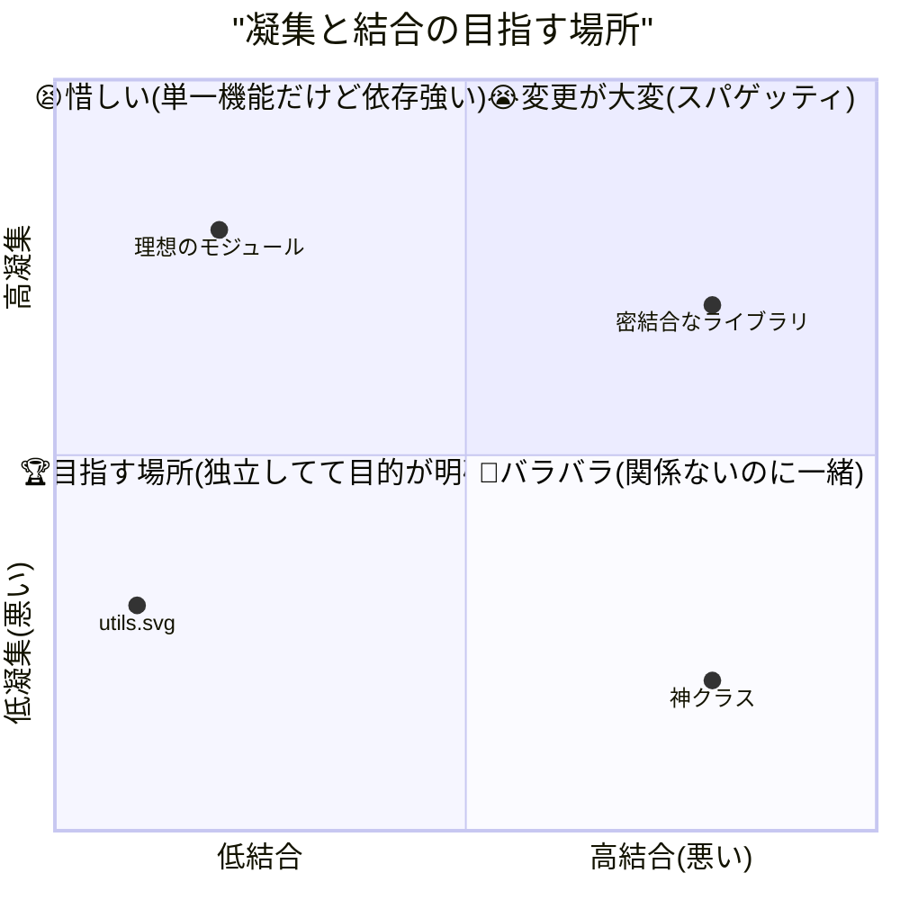

# 第03章：凝集と結合を“ふんわり”理解する🧩📚

### この章でできるようになること🎯

* 「このコード、なんか変更しづらい…😵‍💫」を **凝集/結合の言葉で説明**できる
* 「良さそう/ヤバそう」を **雰囲気じゃなく理由つき**で言えるようになる🗣️✨
* 次章（変更理由で境界を引く🧠✨）に進むための **判断の土台**ができる

---

## 3) たとえ話で一瞬で掴む🧩✨


：凝集と結合ってなに？🧠✨

### 高凝集（Cohesion）＝「中身が同じ目的でまとまってる」🎯

* 1つの関数/ファイルの中身が **同じ目的に向かって協力してる**感じ✨
* 例：`formatPrice` が「価格の表示」だけやってる → 👍

### 低結合（Coupling）＝「他と必要以上にくっついてない」🔗

* ある部分を直したときに、別の場所まで **雪崩みたいに直さなくて済む**感じ❄️
* 例：APIのURL変更が「通信モジュール」だけで済む → 👍

---

## 2) いちばん役立つ測り方：**“変更”で考える**🔧✨

「凝集と結合ってフワッとしてる…😵」ってなりがちなんだけど、**変更**を基準にすると急にわかりやすいよ！

* **結合**：変更がどれだけ“広がる”か（波及範囲）🌊
* **凝集**：変更がその“中で完結する”か（中のまとまり）📦

この「変更で測る」見方は、Kent Beck も「結合＝変更が広がる度合い／凝集＝変更が要素の中でどれくらい一緒に変わるか」みたいな捉え方を紹介してるよ💡 ([Tidy First][1])

---

## 3) TypeScriptでの“単位”はこれ！📦🧩

TSでは特にこの3つが「凝集/結合」を考える単位になりやすいよ👇

1. **関数**（いちばん小さい責務の塊）
2. **ファイル（モジュール）**（import/export の単位）
3. **フォルダ**（責務の“住所”🏠）

ちなみにTSは、**トップレベルに import/export があるファイルはモジュール扱い**になるよ（＝グローバル汚染しにくい）🧼 ([typescriptlang.org][2])

---

## 4) “結合ゼロ”は正義じゃない🙅‍♀️✨

ここ超だいじ！

* 結合ゼロ＝孤独なコード🥺（誰とも協力しない）
* 現実は「協力しないと機能にならない」ので、**必要な結合はOK**🙆‍♀️
* 目標は **“必要最小限で、意図がハッキリした結合”** ✨

合言葉👇
**「つながるのはOK、でもベタベタ依存はダメ！」** 🔗💦

---

## 5) 例でつかむ：高凝集ってこういうこと🎯✨

### ❌ 低凝集の例：目的が混ざってる🍲💥

```ts
export function handleUserLabel(userId: string) {
  // 1) 取得（通信）
  // 2) 整形（表示用の文字列）
  // 3) ログ（運用）
  // ぜんぶ同居してる 😵‍💫

  console.log("start", userId);

  // 本当は fetch とかだけどイメージで
  const user = { id: userId, name: "Alice", plan: "pro" };

  const label = `${user.name} (${user.plan.toUpperCase()})`;
  console.log("label", label);

  return label;
}
```

この子、**変更理由が3つ**あるのがツラいポイント😱

* 表示形式を変えたい
* ログ形式を変えたい
* 取得方法を変えたい
  → どれでもこの関数が揺れる🥶

---

### ✅ 高凝集の例：目的でまとまる🎯

```ts
type User = { id: string; name: string; plan: "free" | "pro" };

export function formatUserLabel(user: User) {
  // ここは「表示用ラベル」だけに集中✨
  return `${user.name} (${user.plan.toUpperCase()})`;
}
```

こうすると、表示形式の変更は **ここだけ**直せばOKになりやすい🎉

---

## 6) 例でつかむ：低結合ってこういうこと🔗✨

### ❌ 強い結合：他の“中身”に依存してる🧨

```ts
// userStore.ts
export const users = new Map<string, { name: string }>();

// userLabel.ts
import { users } from "./userStore";

export function getUserNameLabel(id: string) {
  // users の「実体」にベタッと依存😱
  const u = users.get(id);
  return u ? u.name : "unknown";
}
```

これ、`userStore` 側の都合で `Map` をやめた瞬間、あちこち壊れるやつ…💥
（結合が強い＝波及しやすい🌊）

---

### ✅ 低結合：相手の“契約（外から使う口）”だけを見る📜✨

```ts
// userStore.ts
type User = { name: string };

const users = new Map<string, User>();

export function findUserById(id: string): User | undefined {
  return users.get(id);
}

// userLabel.ts
import { findUserById } from "./userStore";

export function getUserNameLabel(id: string) {
  const u = findUserById(id);
  return u ? u.name : "unknown";
}
```

`userStore` の内部が `Map` → DB になっても、`findUserById` の形が守られてれば被害が小さい🛡️✨
これが「必要最小限で、意図がハッキリした結合」💖

---

## 7) TSならでは小ネタ：**型だけの import** で“実行時の結合”を減らせることがある🧠✨

TSは **型としてしか使ってないimportは、JS出力で消える（elideされる）**のが基本だよ👻✨
さらに明示したいときは `import type` が使えるよ！ ([typescriptlang.org][3])

```ts
import type { User } from "./types"; // 型だけ使うよ宣言✨

export function formatUser(u: User) {
  return u.name;
}
```

「実行時の import が減る」＝状況によっては **循環依存の火種を減らせる**こともあるよ🔥➡️🧯
（※万能じゃないけど、“余計な実行時結合”を作りにくくなるのが嬉しい） ([typescriptlang.org][3])

---

## 8) ミニクイズ🧠💡「凝集高い？結合強い？」（5問）

### Q1 🎯

```ts
export function toJPY(price: number) {
  return new Intl.NumberFormat("ja-JP", { style: "currency", currency: "JPY" }).format(price);
}
```

* 凝集：高い？低い？
* 結合：強い？弱い？

### Q2 🍲

```ts
export async function showProfile(userId: string) {
  const res = await fetch(`/api/users/${userId}`);
  const json = await res.json();
  const label = `${json.name} (${json.plan})`;
  document.querySelector("#profile")!.textContent = label;
}
```

（通信/整形/UIが同居してるよ）

### Q3 🔗

```ts
import { internalCache } from "./cacheCore"; // “internal”って言ってるのに…🤫

export function readSomething(key: string) {
  return internalCache[key];
}
```

### Q4 📦

```ts
type Config = { clock: () => number };

export function buildGreeting(cfg: Config) {
  const hour = new Date(cfg.clock()).getHours();
  return hour < 12 ? "おはよ〜☀️" : "こんにちは〜🌤️";
}
```

（依存を外から渡してる）

### Q5 🧩

```ts
export function parseUser(input: unknown) {
  // ここは「変換」だけ
  // UIも通信も触らない
  return input;
}
```

---

### 解答とワンポイント✅✨

* **Q1**：凝集✅高い（目的が1つ）／結合✅弱い（独立）
* **Q2**：凝集❌低い（目的が混在🍲）／結合❌強め（UIと通信に同時依存）
* **Q3**：結合❌強い（相手の“内部”に直結）
* **Q4**：結合✅弱くしようとしてる（依存を外から渡す＝差し替えやすい）
* **Q5**：凝集✅高め（変換だけに集中）

---

## 9) ハンズオン🛠️：自分のコードで“ふんわり診断”してみよ🎀

### 手順（10〜15分）⏱️✨

1. どれか1ファイル開く📄
2. そのファイルの中を「やってること」で3色に分ける気持ちで眺める🎨

   * 取得（通信/Storage）🌐
   * ルール（判断/計算）🧠
   * 表示用（整形/UI）🖼️
3. そのファイルの**責務を一文で書く**📝
4. 書けない or 「AもBもCも…」ってなるなら…
   → **低凝集のサイン**かも🍲💦

### 目標🎯

* 「このファイルは〇〇のためのものです」って **1文で言える**状態に近づける✨

---

## 10) VS Codeで“結合の強さ”を体感する小ワザ👀✨

（難しいことはしないよ！）

* **F12（定義へ移動）**：どこに依存してるか一瞬で飛べる🪽
* **Shift+F12（参照を検索）**：その関数/型がどこで使われてるか＝変更の波及候補🌊
* **F2（名前変更）**：変更がどれだけ広がるか体感できる😳
* **アウトライン表示**：そのファイルが何を抱えてるか俯瞰できる🗺️

---

## 11) AI活用コーナー🤖✨（この章は1〜2個だけ🎀）

### プロンプト1（メイン）🧠

「この関数（orモジュール）の責務を一文で言うと？」

### プロンプト2（任意）🧹

「責務が混ざってるなら、2つに割るとしたら境界はどこ？分割後の名前案も」

#### AIの答えを採点するコツ✅

* 一文が「〜して、〜して、〜して…」になってたら要注意🍲
* 分割案が「utilsに入れましょう！」ばっかりなら保留🙅‍♀️
* **“変更理由が同じものが同居してる？”** を最終チェック🧠✨（次章につながるよ！）

---

## 12) まとめ✨（今日の合言葉3つ）

* **高凝集＝同じ目的でまとまる🎯**
* **低結合＝変更が雪崩れない🔗❄️**
* **変更で測ると一気に分かる🔧✨** ([Tidy First][1])



---

## おまけ：今日の“最新”メモ📝✨（教材の鮮度チェック）

* TypeScript は **5.9 系が最新ライン**として案内されてるよ（公式トップでも 5.9 を告知） ([typescriptlang.org][4])
* npmの `typescript` は **Latest 5.9.3** 表記になってるよ ([npm][5])
* VS Code は **1.108（2025年12月版）**が **2026-01-08 リリース**になってるよ ([Visual Studio Code][6])

次の第4章では、ここで出てきた「変更」をさらに強く使って、**境界の引き方**に進むよ🗺️✨

[1]: https://tidyfirst.substack.com/p/coupling-and-cohesion?utm_source=chatgpt.com "Coupling and Cohesion - by Kent Beck"
[2]: https://www.typescriptlang.org/docs/handbook/2/modules.html?utm_source=chatgpt.com "Documentation - Modules"
[3]: https://www.typescriptlang.org/docs/handbook/modules/reference.html?utm_source=chatgpt.com "Documentation - Modules - Reference"
[4]: https://www.typescriptlang.org/?utm_source=chatgpt.com "TypeScript: JavaScript With Syntax For Types."
[5]: https://www.npmjs.com/package/typescript?utm_source=chatgpt.com "typescript"
[6]: https://code.visualstudio.com/updates?utm_source=chatgpt.com "December 2025 (version 1.108)"
