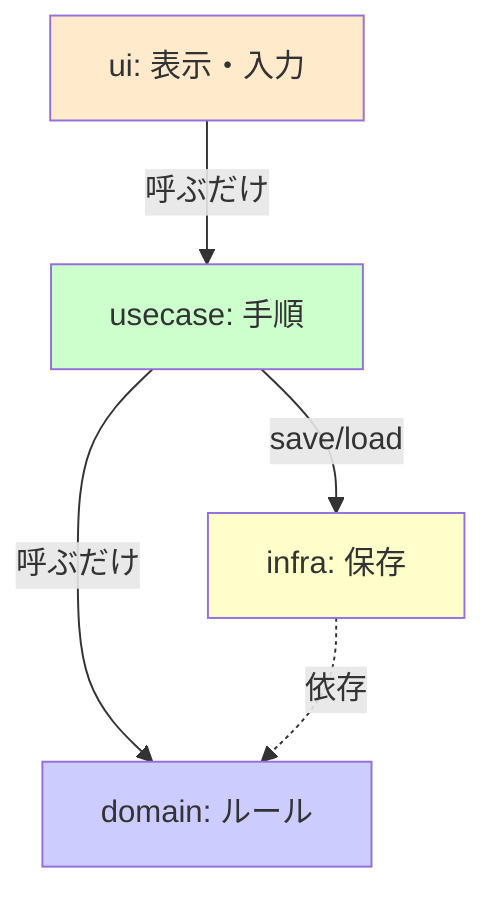

# 第04章：設計の判断軸は「変更理由」🧠✨

## この章のゴール🎯

「なんとなく分けた（好み分割）😵‍💫」を卒業して、
**“同じ理由で変わるもの同士をまとめる”** っていう、超つよい判断軸を手に入れるよ〜🪄✨

---

## まずは超大事な合言葉📣
### 4-1. まず「変更理由」ってなに？🤔💡


### ✅「変更理由が同じなら、一緒にしていい」🧲

### ✅「変更理由が違うなら、離した方がいい」✂️

たとえば…

* 画面の見た目が変わる🎨（UIの理由）
* ビジネスルールが変わる📜（業務の理由）
* 保存先や通信先が変わる🌐💾（I/Oの理由）

この **“変わる理由”** が混ざるほど、変更が連鎖して地獄になるよ〜😱💥
だから **「理由ごとに境界を引く」** のが、高凝集・低結合の入口なんだ🗺️✨

---

## 2026のTS開発メモ📝✨（最新）

* TypeScriptは **5.9** が最新リリースノートとして公開されてるよ📌 ([typescriptlang.org][1])
* Node.jsは **v24.12.0 がLTS** として公開されてるよ🟢 ([Node.js][2])
* VS Codeは **December 2025 (1.108)** が **2026-01-08** リリース📦 ([Visual Studio Code][3])

（この章は“設計の判断軸”が主役なので、環境話はここだけにするね😉💖）

---

## 変更理由で分けると、何がうれしいの？😍

* UIをちょっと変えても、ルールが壊れない🎀
* 保存先（localStorage → API）を変えても、中心ロジックがそのまま🧠✨
* 「どこを見ればいいか」が迷子にならない📁🧭

つまり…
**変更が来ても怖くない子になれる😄💪**

---

## 4-3. まずは「3つの箱」で境界線を引こう📦📦📦


✨

この章ではまず、超ざっくりこの3分類でOK🙆‍♀️💕

### ① UI（見た目・入力・表示）🖼️⌨️

例：画面、ボタン、表示文言、入力フォーム、エラー表示

### ② 業務（ルール・判断・手順）📜🧠

例：締切なら期限切れ判定、優先度ルール、登録できる条件

### ③ I/O（外部とのやりとり）🌐💾

例：fetch/API、DB、localStorage、ファイル、時間(Date) など

---

## 例題：ToDo（締切つき）で「変更理由」を出してみよ📝✅

### いまの仕様（最小）

* ToDoを追加する➕
* 締切日（due）を持てる📅
* 一覧表示する📋
* 保存はlocalStorage💾

### “変わりそうな点”＝変更理由の候補🌱✨（例）

**UIの理由🎨**

* 入力フォームをモーダルにしたい
* 期限切れは赤文字にしたい
* 表示順を「期限が近い順」に切り替えたい

**業務の理由📜**

* 締切は「当日23:59までセーフ」にしたい
* 期限切れToDoは追加できないようにしたい
* 期限が過ぎたら自動で“要注意”フラグを付けたい

**I/Oの理由🌐💾**

* localStorage → サーバAPIに変えたい
* オフライン対応のためIndexedDBにしたい
* APIレスポンス形式が変わった

ここまで出せるだけで、もう設計の目が育ってるよ👀✨

---

## 境界を引くワーク🗺️✨（この章のメイン）

やることはシンプルだよ〜！🎀

### Step 1：要件を1文で書く✍️

「ユーザーが締切つきToDoを登録して一覧できる」

### Step 2：変更理由を3〜5個、箇条書き📝

（UI/業務/I/Oに分けて書く）

### Step 3：同じ理由のものを“束ねる”🧲

* UIに関する変更理由 → UIの箱へ
* 業務ルール → ドメイン/ユースケースの箱へ
* 外部I/O → インフラの箱へ

### Step 4：箱の間に“壁”を作る🧱✨


壁＝「境界」だよ💡
境界を作るときのコツはこれ👇

* **UIは、業務の中身を知らない**（ただ呼ぶだけ）📣
* **業務は、保存方法を知らない**（“保存してね”って頼むだけ）🙏
* **I/Oは、外の世界の面倒を見る係**（HTTP/Storage担当）🧰

---

## コードで体感：悪い例😱→良い例😄

### ❌ 悪い例（全部入り🍲💥）


「表示」「入力」「ルール」「保存」が1ファイルに混ざるパターン👇

```ts
// todoFeature.ts（悪い例イメージ）
type Todo = { title: string; due?: string };

export function addTodoFromForm(inputTitle: string, inputDue: string) {
  // UIっぽい：空欄チェック
  if (inputTitle.trim() === "") {
    alert("タイトル必須です"); // UI表示
    return;
  }

  // 業務っぽい：期限切れ禁止（ルール）
  if (inputDue) {
    const due = new Date(inputDue);
    if (due.getTime() < Date.now()) {
      alert("期限切れは登録できません");
      return;
    }
  }

  // I/O：localStorage直書き
  const raw = localStorage.getItem("todos") ?? "[]";
  const todos: Todo[] = JSON.parse(raw);
  todos.push({ title: inputTitle, due: inputDue || undefined });
  localStorage.setItem("todos", JSON.stringify(todos));

  // UI：成功メッセージ
  alert("追加しました！");
}
```

これ、変更が来るとね…

* 文言変えるだけで業務も触る😱
* 保存先変えるだけでUIも壊れる😱
  みたいな “変更連鎖” が起きがち💥

---

### ✅ 良い例（変更理由で分ける🧠✨）


フォルダはこんな感じが分かりやすいよ📁💖



```txt
src/
  ui/
    addTodoButton.ts
  usecase/
    addTodo.ts
  domain/
    todo.ts
    todoRules.ts
  infra/
    todoRepositoryLocalStorage.ts
```

#### domain：ルールとデータ（業務の理由📜）

```ts
// domain/todo.ts
export type Todo = {
  title: string;
  due?: Date;
};

// domain/todoRules.ts
import type { Todo } from "./todo";

export function canAddTodo(todo: Todo, now: Date): { ok: true } | { ok: false; reason: string } {
  if (todo.title.trim() === "") return { ok: false, reason: "タイトル必須" };

  if (todo.due && todo.due.getTime() < now.getTime()) {
    return { ok: false, reason: "期限切れは登録できない" };
  }
  return { ok: true };
}
```

#### usecase：手順（業務の理由📜 + I/Oに頼む🙏）

```ts
// usecase/addTodo.ts
import type { Todo } from "../domain/todo";
import { canAddTodo } from "../domain/todoRules";

export type TodoRepository = {
  save(todo: Todo): Promise<void>;
};

export async function addTodo(repo: TodoRepository, now: Date, todo: Todo) {
  const result = canAddTodo(todo, now);
  if (!result.ok) return result;

  await repo.save(todo);
  return { ok: true } as const;
}
```

#### infra：保存（I/Oの理由💾）

```ts
// infra/todoRepositoryLocalStorage.ts
import type { Todo } from "../domain/todo";
import type { TodoRepository } from "../usecase/addTodo";

function serialize(todo: Todo) {
  return { ...todo, due: todo.due ? todo.due.toISOString() : undefined };
}
function deserialize(raw: any): Todo {
  return { title: String(raw.title), due: raw.due ? new Date(String(raw.due)) : undefined };
}

export const todoRepositoryLocalStorage: TodoRepository = {
  async save(todo) {
    const raw = localStorage.getItem("todos") ?? "[]";
    const list = JSON.parse(raw);
    list.push(serialize(todo));
    localStorage.setItem("todos", JSON.stringify(list));
  },
};
```

#### ui：表示・入力（UIの理由🎨）

```ts
// ui/addTodoButton.ts（超ざっくり例）
import { addTodo } from "../usecase/addTodo";
import { todoRepositoryLocalStorage } from "../infra/todoRepositoryLocalStorage";

export async function onClickAdd(title: string, dueText: string) {
  const todo = { title, due: dueText ? new Date(dueText) : undefined };

  const result = await addTodo(todoRepositoryLocalStorage, new Date(), todo);

  if (!result.ok) {
    alert(result.reason);
    return;
  }
  alert("追加しました！");
}
```

こうすると…

* UI変更🎨：uiだけ触ればOK
* ルール変更📜：domainだけ触ればOK
* 保存先変更🌐💾：infraだけ差し替えればOK
  ってなって、変更が怖くなくなるよ〜🥳✨

---

## この章のハンズオン🛠️✨（やってみよ〜！）


### お題：あなたの小機能（or 例題ToDo）で境界を引く🗺️

1. 機能を1文で書く✍️
2. 変更理由を **3〜5個** 書く📝（UI/業務/I/Oに分類）
3. それぞれをどこに置くか、フォルダ案を書く📁
4. 1個だけ“変更”を入れてみる（おすすめ👇）

   * localStorage保存 → メモリ保存（配列）に差し替える🔁
   * 文言だけ変える🗯️
   * 期限切れ判定ルールを変える📜

**ポイント**：変更が1箱だけで済めば勝ち🏆✨

---

## 仕上げチェック✅（迷ったらここ！）

* このファイル（or 関数）が変わる理由、1つに言える？🧠
* UIが業務ロジックの細部を知りすぎてない？👀
* 業務がlocalStorage/fetchを直呼びしてない？🚫
* I/O変更が来ても、業務は守られる？🛡️

---

## AIプロンプト🤖✨（第4章）

### 1つ目（章の指定そのまま🎀）

* 「この機能の変更理由を5つ挙げて（UI/業務/I/Oで分類）」

### 2つ目（おすすめ💡）

* 「この分類をもとに、フォルダ構成案（src/ui, usecase, domain, infra など）と、依存の向き（importのルール）を提案して」

---

## まとめ🎉

第4章はこれだけ覚えればOKだよ〜💖
**「分け方の基準は “変更理由” 🧠✨」**
UI・業務・I/Oを分けて、変更が来てもビクビクしない設計を作っていこうね😄🛡️✨

[1]: https://www.typescriptlang.org/docs/handbook/release-notes/typescript-5-9.html?utm_source=chatgpt.com "Documentation - TypeScript 5.9"
[2]: https://nodejs.org/en/blog/release/v24.12.0?utm_source=chatgpt.com "Node.js 24.12.0 (LTS)"
[3]: https://code.visualstudio.com/updates?utm_source=chatgpt.com "December 2025 (version 1.108)"
