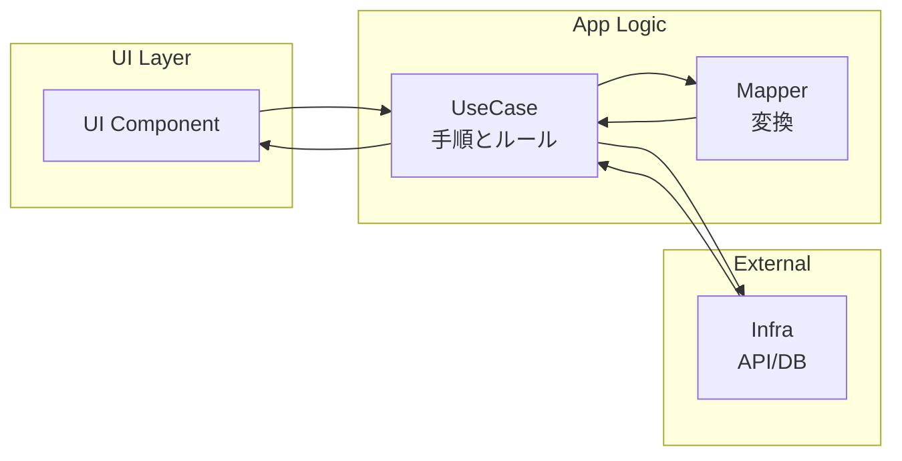

# 第06章：ニオイ図鑑② “UI×通信×状態×整形”の混在🍲💥

この章は、**フロント（コンポーネント）やAPIハンドラ**でめちゃくちゃ起きがちな
「1ファイルに全部入ってて、触るの怖い😱」を、**見抜いて・箱分けできる**ようになる回だよ〜！✨

---

### 6-0. まず結論（この章で覚える型）📦✨

混ざりがちな要素は、だいたいこの4つ👇

* **UI**：画面の見た目・イベント（クリック等）🖼️🖱️
* **UseCase**：やりたいことの流れ（取得→ルール→返す）🎯🧠
* **Infra**：外の世界（HTTP/Storage/Clockなど）🌐🔌
* **Mapper**：データの変換（API→アプリ用、アプリ→表示用）🔁🧩

この4箱に分けるだけで、**変更が局所化**して、怖さが激減するよ…！🫶✨

---

### 6-1. この章の「ニオイ」って何？👃💦


#### ニオイの正体🍲

1つのコンポーネント（またはハンドラ）の中に…

* 画面の表示
* API呼び出し（fetchなど）
* 状態管理（loading/error/data）
* 取得したデータの整形・変換
* さらに「業務ルールっぽい判断」（例：並び替え、フィルタ、金額計算）

が **ぐちゃっと混ざってる**状態😵‍💫

#### ありがちなサイン🚨

* ファイルを開くと「どこから読めば…？」ってなる📜😇
* 「表示変えるだけ」のはずが、通信や状態にも手が入る💥
* 同じ整形ロジックが、別の画面にもコピペされはじめる📎📎
* テストしようと思っても、UIとfetchが絡んで無理ゲー😱

---

### 6-2. いまどき前提の“最新寄り”メモ🆕✨（超重要な背景だけ）

* TypeScript の安定版は **5.9.3** が最新（2026/01/13時点）だよ。([npm][1])
* TypeScript 6.0 / 7.0（ネイティブ化）に向けた流れが進んでいて、6.0は“橋渡し”的な位置づけとして語られてるよ。([Microsoft for Developers][2])
* Node.js は **v21でfetchがStable扱い**になった、って公式アナウンスがあるよ（＝余計なHTTPライブラリを減らしやすい）([Node.js][3])

---

### 6-3. まず「ダメな例」を見て、ニオイを嗅ぐ👃💥


ここでは例として「ユーザー一覧を表示する画面」を想像するね🙂
（Reactっぽい書き方だけど、**“考え方”が主役**だよ！）

#### ❶ 混在してる例（1ファイルで全部やる）🍲

```ts
// UserList.tsx（例：雰囲気だけ掴んでOK）

type UserDto = { id: string; first_name: string; last_name: string; status: "active" | "inactive" };

export function UserList() {
  const [loading, setLoading] = useState(false);
  const [error, setError] = useState<string | null>(null);
  const [rows, setRows] = useState<Array<{ id: string; label: string }>>([]);

  async function load() {
    setLoading(true);
    setError(null);

    try {
      // 通信（Infra）
      const res = await fetch("/api/users");
      if (!res.ok) throw new Error("HTTP " + res.status);

      // 取得（Infra）
      const data = (await res.json()) as UserDto[];

      // ルール（UseCaseっぽい）
      const activeOnly = data.filter(u => u.status === "active");

      // 整形（Mapper）
      const mapped = activeOnly.map(u => ({
        id: u.id,
        label: `${u.last_name} ${u.first_name}`.trim(), // 表示用の整形まで…
      }));

      // 状態（State）
      setRows(mapped);
    } catch (e: any) {
      setError(e?.message ?? "unknown error");
    } finally {
      setLoading(false);
    }
  }

  useEffect(() => { load(); }, []);

  // UI
  if (loading) return <div>Loading...</div>;
  if (error) return <div style={{ color: "red" }}>{error}</div>;

  return (
    <ul>
      {rows.map(r => <li key={r.id}>{r.label}</li>)}
    </ul>
  );
}
```

これ、動く。けど…
**「何か変えたい」瞬間に地獄が始まる**やつ😇🔥

---

### 6-4. 変更が来たらどう壊れる？（変更シミュレーション）🎮💥


たとえば仕様変更👇

1. **表示名を “名 姓” にしたい**（整形の話）
2. **inactiveも表示するけど薄くしたい**（ルール＋UI）
3. **APIのURLが変わった**（通信の話）
4. **失敗時のエラーメッセージを統一したい**（複数画面に波及しがち）

混在コードだと、ぜんぶ同じファイルで絡み合ってて
「どれ触ったらどれ壊れる？」が見えない😱🕸️

---

### 6-5. 解決策：4箱に“分けるだけ”でOK📦✨


ここからが本番〜！🎉
やることはシンプル！

#### ✅ 箱の役割（この章バージョン）

* **UI**：表示とイベントだけ。UseCaseを呼ぶだけ🖼️
* **UseCase**：手順とルール（取得→判断→返す）🎯
* **Infra**：HTTPやStorageなど外部アクセス🌐
* **Mapper**：DTO⇄アプリ用⇄表示用の変換🔁

ポイントはこれ👇
**「UIにfetchを書かない」**
**「UseCaseにJSXを書かない」**
**「Infraに表示都合の整形を書かない」**
**「Mapperは変換だけ」**



---

### 6-6. ハンズオン：箱分けリファクタ🛠️✨


#### ステップ1：まず“色分け”する🎨

混在ファイルにコメントでラベルを付けるだけでOK！

* 🖼️ UI
* 🎯 UseCase
* 🌐 Infra
* 🔁 Mapper
* 🧠 State（今回はUI側に残してOK）

「ここからここまで同じ箱だな〜」って線引きしてね✍️🙂

---

#### ステップ2：ファイルを4つ作る📁✨

例（名前は好みでOK）👇

* ui/UserList.tsx
* usecase/loadUsers.ts
* infra/userApi.ts
* mapper/userMapper.ts

---

#### ステップ3：Infra（通信）を外に出す🌐

```ts
// infra/userApi.ts
export type UserDto = { id: string; first_name: string; last_name: string; status: "active" | "inactive" };

export async function fetchUsers(): Promise<UserDto[]> {
  const res = await fetch("/api/users");
  if (!res.ok) throw new Error("HTTP " + res.status);
  return (await res.json()) as UserDto[];
}
```

---

#### ステップ4：Mapper（整形）を外に出す🔁

```ts
// mapper/userMapper.ts
import type { UserDto } from "../infra/userApi";

export type UserRowVm = { id: string; label: string; isActive: boolean };

export function toUserRowVm(dto: UserDto): UserRowVm {
  return {
    id: dto.id,
    label: `${dto.last_name} ${dto.first_name}`.trim(),
    isActive: dto.status === "active",
  };
}
```

---

#### ステップ5：UseCase（ルール＆流れ）を作る🎯

```ts
// usecase/loadUsers.ts
import { fetchUsers } from "../infra/userApi";
import { toUserRowVm, type UserRowVm } from "../mapper/userMapper";

export async function loadUserRows(): Promise<UserRowVm[]> {
  const dtos = await fetchUsers();

  // ルール：activeだけ（後で変わってもここだけ）
  const activeOnly = dtos.filter(u => u.status === "active");

  // 変換：表示用へ
  return activeOnly.map(toUserRowVm);
}
```

---

#### ステップ6：UIは“呼ぶだけ”にする🖼️

```ts
// ui/UserList.tsx
import { loadUserRows } from "../usecase/loadUsers";

export function UserList() {
  const [loading, setLoading] = useState(false);
  const [error, setError] = useState<string | null>(null);
  const [rows, setRows] = useState<Array<{ id: string; label: string }>>([]);

  useEffect(() => {
    (async () => {
      setLoading(true);
      setError(null);
      try {
        const result = await loadUserRows();
        setRows(result);
      } catch (e: any) {
        setError(e?.message ?? "unknown error");
      } finally {
        setLoading(false);
      }
    })();
  }, []);

  if (loading) return <div>Loading...</div>;
  if (error) return <div style={{ color: "red" }}>{error}</div>;

  return (
    <ul>
      {rows.map(r => <li key={r.id}>{r.label}</li>)}
    </ul>
  );
}
```

はい完成〜！🎉✨
「UI×通信×整形×ルール」が、ちゃんと分かれた👏👏👏

---

### 6-7. こうなると何が嬉しいの？🎁✨（変更が“1箇所”になる）


さっきの変更がこうなる👇

* 表示名の順番変えたい（名→姓）👉 **Mapperだけ**🔁
* inactiveも表示したい👉 **UseCaseだけ**🎯（+ UIで薄くするならUIも）
* APIのURL変わった👉 **Infraだけ**🌐
* 変換ルールを別画面でも使いたい👉 Mapperを再利用できる✨

「え、どこ触ればいい？」が一発で分かるようになるのが最高😆💕

---

### 6-8. 自己チェックリスト✅👀


次の質問に「YES」が多いほど、ニオイが強いよ〜🚨

* UIファイルに「fetch」や「URL直書き」がある？🌐
* UIの中に「map/filter/sortの塊」がある？🔁🎯
* UIの中に「DTO（APIの生データ）」型が出てくる？📦
* 画面の表示変更なのに、通信や変換も触りそう？💥
* 同じ整形コードが別画面にコピペされてる？📎

---

### 6-9. よくあるつまずき（ここだけ注意）⚠️🙂

* **「UseCaseって何でも入れていいの？」**
  → だめ〜🙅‍♀️（UseCaseは“手順とルール”の中心。表示都合の整形はMapperへ）

* **「Mapper増やしすぎて面倒…」**
  → 最初は1個でOK！👍
  似た変換が増えたら分ければいい（早すぎ最適化はしない😆）

* **「UIが薄くなりすぎて不安」**
  → むしろ健康体😌💗
  UIは“表示専用”で薄いのが正義！

---

### 6-10. AIプロンプト（この章の勝ちパターン）🤖✨

そのまま貼って使えるやつ置いとくね🫶

1. 分類＆混在指摘

* 「このコードをUI/業務/通信(I/O)/変換に分類して、混ざってる箇所を指摘して」

2. 分割案の生成（ファイル名まで）

* 「UI / UseCase / Infra / Mapper に分けたい。ファイル構成案と、各ファイルに移すべき関数・型を箇条書きで提案して」

3. 変更耐性チェック

* 「この分割案で、将来 “API変更/表示変更/ルール変更” が来た時に、どのファイルだけ触れば済むかを表にして」

---

### 6-11. ミニクイズ🧠🎀（3問だけ）

Q1. 「APIレスポンスの形が変わった！」まず疑う箱は？
👉 🌐 Infra（取得）＋ 🔁 Mapper（変換）

Q2. 「並び順ルールが変わった！」はどの箱？
👉 🎯 UseCase

Q3. 「ボタンの色を変えたい！」はどの箱？
👉 🖼️ UI

---

### 次章の予告🎬✨

次は「高凝集①：責務で切る」✂️🎯
今回の“箱分け”を、もっとミクロ（関数・ファイル）でも再現できるようにしていくよ〜！😆💪

[1]: https://www.npmjs.com/package/typescript?activeTab=versions&utm_source=chatgpt.com "typescript"
[2]: https://devblogs.microsoft.com/typescript/progress-on-typescript-7-december-2025/?utm_source=chatgpt.com "Progress on TypeScript 7 - December 2025"
[3]: https://nodejs.org/en/blog/announcements/v21-release-announce?utm_source=chatgpt.com "Node.js 21 is now available!"
