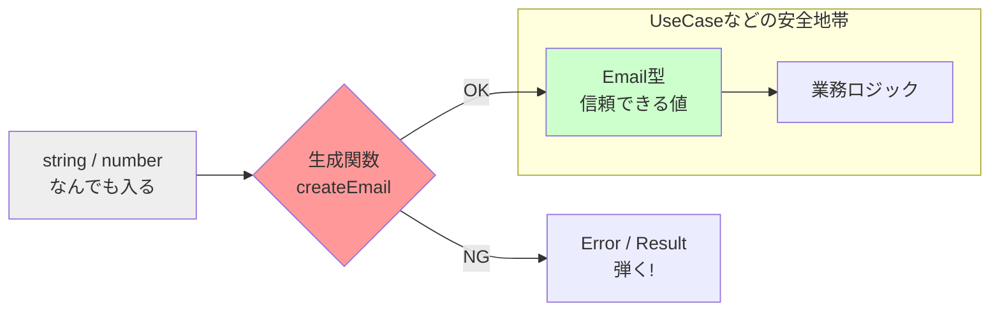

# 第08章：高凝集② データとルールを近づける（“型で守る”入口）🏷️🧠

## 8-0. まず結論💡「ルールは“使う場所”じゃなく“生まれる場所”に置く」🚪🛡️

`string` と `number` だけで全部を表現すると、**「どの文字列？どの数？」**がコードから消えちゃって、ルールがバラけます😵‍💫
そこでこの章は、**「その値の意味」と「守るべきルール」をセットで近くに置く**＝高凝集にする練習だよ🎯✨

---

## 8-1. あるある地獄🔥「プリミティブだらけ問題」😱

たとえば、こういうの👇

* `email: string`
* `price: number`
* `deadline: string`（日付文字列）
* `userId: string`

一見ふつう。でも…

* `email` に `"aaa"` 入っても通る😇
* `price` に `-100` 入っても通る😇
* `deadline` が `"2026-99-99"` でも型はOK😇
* `userId` と `email` をうっかり入れ替えても気づきにくい😇

つまり **「値の意味の違い」**を型が守ってくれないの🥲

---

## 8-2. 今日のゴール🎯「小さなドメイン型（Value Object）を作れるようになる」✨

この章で作れるようになるのはこの3つ💞

1. **ドメイン型**（例：`Email`, `JPY`, `Deadline`）を作る🏷️
2. **生成関数（入口）**でルールをチェックして、不正を弾く🛡️
3. “うっかり混ぜる事故” を **型で止める**（Branded Types）🚧

---

## 8-3. （2026年1月時点）TSの最新トピック📌🧠

* **TypeScript 5.9系**が最新安定版ラインとして案内されていて、型計算の最適化などが入っています（ZodやtRPCみたいな複雑な型のときに効く改善も明記）🧩⚡ ([TypeScript][1])
* **TypeScript 6.0は“橋渡し”**、その先に **TypeScript 7（ネイティブ実装）**の進捗が公開されています🚀（2025年12月の進捗記事） ([Microsoft for Developers][2])

この章でやる「小さなドメイン型」は、**型が強くなるほど効く**し、型が重くなりすぎない範囲で組み立てやすいよ🙂✨

---

## 8-4. 設計の合言葉🧠✨「入口で止める」🚪🛑


**ルールが散らばる典型**はこれ👇

* 画面Aでチェック
* APIハンドラでチェック
* UseCaseでもチェック
* DB直前でもチェック

これ、どこかで漏れると事故るの😇💥
だから **“入口（生成関数）で一回だけ守る”** が超強い💪✨



---

# 8-5. 実装パターン3段階🌱➡️🌳

## パターンA：まずは最小「生成関数で守る」🛡️（初心者に一番やさしい）

* `type Email = string` のままだと混ざる事故は止めにくい
* でも **生成関数**を作るだけで、ルールは集約できる✨

```ts
// まずは「生成関数」で入口を固定する（最小）
export type Email = string;

export function createEmail(input: string): Email {
  if (!/^[^\s@]+@[^\s@]+\.[^\s@]+$/.test(input)) {
    throw new Error("メールアドレスが変だよ🥲");
  }
  return input;
}
```

✅ 良い：ルールが“ここ”に集まる
⚠️ 弱点：`Email` がただの `string` なので、混ぜる事故は防ぎにくい

---

## パターンB：Branded Types（混ぜる事故を型で止める）🚧✨

TypeScriptは**構造的型付け**なので、基本は「形が同じなら同じ扱い」になりがち。
そこで **ブランド（目印）を付けたstring/number**を作るよ🏷️

ここで使うのが `unique symbol` 🌟（TS公式で説明されてる型） ([TypeScript][3])

```ts
// Branded Typesの基本セット
declare const emailBrand: unique symbol;

export type Email = string & { readonly [emailBrand]: "Email" };

export function createEmail(input: string): Email {
  if (!/^[^\s@]+@[^\s@]+\.[^\s@]+$/.test(input)) {
    throw new Error("メールアドレスが変だよ🥲");
  }
  return input as Email; // ← 例外的にここだけ許す（入口だけ）
}
```

✅ 良い：`Email` と `UserId` を取り違える事故が、コンパイルで止まる🙅‍♀️
⚠️ 注意：`as Email` は入口だけ！それ以外で乱用すると無敵バグ製造機😇💥

---

## パターンC：失敗を安全に返す（Result型）🎁✨

UIで「エラー文出したい」時、`throw` だと扱いにくいこともあるよね。
そんな時は **Result** が便利💞

```ts
export type Result<T> =
  | { ok: true; value: T }
  | { ok: false; message: string };

declare const emailBrand: unique symbol;
export type Email = string & { readonly [emailBrand]: "Email" };

export function createEmail(input: string): Result<Email> {
  if (!/^[^\s@]+@[^\s@]+\.[^\s@]+$/.test(input)) {
    return { ok: false, message: "メールの形式が変だよ🥲" };
  }
  return { ok: true, value: input as Email };
}
```

✅ 良い：UIに優しい（エラーメッセージが自然に出せる）😊
✅ 良い：UseCase側が分岐しやすい
✨ 初学者はこのパターン、かなりおすすめ！

---

# 8-6. ハンズオン🛠️：Email / Price / Deadline を作ろう💪💖

## 8-6-1. Email 📧（文字列だけど“メール専用”にする）

```ts
// email.ts
export type Result<T> =
  | { ok: true; value: T }
  | { ok: false; message: string };

declare const emailBrand: unique symbol;
export type Email = string & { readonly [emailBrand]: "Email" };

export function createEmail(input: string): Result<Email> {
  const v = input.trim();

  // ゆるめのチェック（本格運用なら要件に合わせる）
  if (!/^[^\s@]+@[^\s@]+\.[^\s@]+$/.test(v)) {
    return { ok: false, message: "メールの形式が変だよ🥲" };
  }
  return { ok: true, value: v as Email };
}
```

### ✅ ここが高凝集ポイント🎯

* 「Emailのルール」は **email.ts に集約**
* 呼び出し側は **Emailの意味を知ってるだけ**でOK🙂✨

---

## 8-6-2. Price 💰（負の値NG、通貨を名前で固定）

「`number` は何でも入れられる」問題を止めよう🚧

```ts
// money.ts
export type Result<T> =
  | { ok: true; value: T }
  | { ok: false; message: string };

declare const jpyBrand: unique symbol;
export type JPY = number & { readonly [jpyBrand]: "JPY" };

export function createJPY(input: number): Result<JPY> {
  if (!Number.isFinite(input)) {
    return { ok: false, message: "金額が数じゃないよ🥲" };
  }
  if (input < 0) {
    return { ok: false, message: "金額がマイナスだよ🥲" };
  }
  if (!Number.isInteger(input)) {
    return { ok: false, message: "円は整数にしてね🥲" };
  }
  return { ok: true, value: input as JPY };
}
```

---

## 8-6-3. Deadline ⏰（日付の解釈を一箇所へ）

日付は沼りやすい😇
この章ではシンプルに「ISO文字列（YYYY-MM-DD）」で受けて、入口で `Date` にする作戦にするよ🧠✨

```ts
// deadline.ts
export type Result<T> =
  | { ok: true; value: T }
  | { ok: false; message: string };

declare const deadlineBrand: unique symbol;
export type Deadline = Date & { readonly [deadlineBrand]: "Deadline" };

export function createDeadlineFromISO(input: string): Result<Deadline> {
  // まず形式を縛る（曖昧なDateパースを避ける）
  if (!/^\d{4}-\d{2}-\d{2}$/.test(input)) {
    return { ok: false, message: "締切はYYYY-MM-DDで入れてね🥲" };
  }

  const [y, m, d] = input.split("-").map(Number);
  const date = new Date(y, m - 1, d);

  // Dateが勝手に繰り上げる事故を防ぐ
  if (date.getFullYear() !== y || date.getMonth() !== m - 1 || date.getDate() !== d) {
    return { ok: false, message: "存在しない日付っぽいよ🥲" };
  }

  return { ok: true, value: date as Deadline };
}
```

---

# 8-7. 使ってみよう：UseCaseに“意味のある型”を流す🌊✨


ここが最高に気持ちいいところ😆💖
UseCaseの引数が、もう説明書になる📖✨

```ts
// createTodoUseCase.ts
import { Email } from "./email";
import { JPY } from "./money";
import { Deadline } from "./deadline";

export type CreateTodoInput = {
  ownerEmail: Email;
  budget: JPY;
  deadline: Deadline;
  title: string;
};

export function createTodo(input: CreateTodoInput) {
  // ここに来た時点で Email/JPY/Deadline は「正しい前提」になってる🛡️✨
  // あとは業務ルールに集中できる（高凝集！）
  return {
    ...input,
    createdAt: new Date(),
  };
}
```

✅ “型”のおかげで、UseCaseから **入力チェックのゴミ**が消える🧹✨
✅ ロジックが「やりたいこと」に集中できる🎯

---

# 8-8. （最新）実行時バリデーションもやるなら：Zodが定番🧩🛡️

TypeScriptの型は実行時に消えるから、外部入力（API/フォーム）は実行時チェックが必要になりがち。
その代表格が **Zod**（公式で「TypeScript-first validation library」と説明）だよ📚 ([Zod][4])

```ts
import { z } from "zod";

const EmailSchema = z.string().email();

export function parseEmail(input: unknown): string {
  // parseは失敗すると例外、safeParseはResult風にできるよ
  return EmailSchema.parse(input);
}
```

この章の立ち位置としては：

* **Zodで外部入力をチェック**（実行時）
* **createEmailでEmail型に変換**（ドメイン型）
  みたいに“二段ロケット”にすると超きれい🚀✨

---

# 8-9. AI活用コーナー🤖💞（使うけど、判断は自分！）

## プロンプト例①（設計案出し）🧠

* 「この `string/number` をドメイン型にするなら、型と生成関数を提案して。失敗時はResultで返して」

## プロンプト例②（危険点チェック）⚠️

* 「このドメイン型設計、責務の混在や `as` の乱用リスクがないか、危険点を3つ挙げて」

### ✅ AI案の採点ポイント🎯

* 入口（生成関数）以外で `as X` を使ってない？😇
* ルールがUseCaseやUIに散ってない？🍲
* 型が重くなりすぎてない？（複雑なジェネリクス地獄）🌀
  ※TS 5.9で型計算の最適化は進んだけど、設計で軽くできるなら軽くが勝ち🙂 ([TypeScript][1])

---

# 8-10. よくある落とし穴集🕳️😱

* `as Email` をあちこちで使う（入口が崩壊）💥
* ルールを「使う側」に書き散らかす（凝集が下がる）🧯
* ドメイン型を作ったのに、結局 `string` に戻して渡す（効果消滅）😇
* “なんでも型”を作る（例：`type SafeString = string & {...}`）→意味が薄い😵

---

# 8-11. 理解チェック✅（5分クイズ🧠✨）

1. `Email` を `string` のままにすると、どんな事故が起きる？📧💥
2. 「入口で止める」ってどこ？具体的にどの関数？🚪
3. `createJPY` が返すべきエラー文を2つ考えてみて💰
4. `Deadline` で “Dateの繰り上げ事故” を防ぐのはなぜ？⏰

---

# 8-12. ミニ課題🎀（提出物は3ファイルでOK）

🎯 ゴール：**「値の意味」を型で語れるようになる**

* `email.ts`：`Email` と `createEmail`
* `money.ts`：`JPY` と `createJPY`
* `deadline.ts`：`Deadline` と `createDeadlineFromISO`

おまけ（できたら偉い💮）：`createTodoUseCase.ts` で全部使う！

---

## 次章につながる一言📁🧭✨

ドメイン型ができると、今度は
**「どこに置けば迷子にならない？」**が気になってくるはず！
それをやるのが **第9章：命名とフォルダ**だよ〜😆💖

[1]: https://www.typescriptlang.org/docs/handbook/release-notes/typescript-5-9.html?utm_source=chatgpt.com "Documentation - TypeScript 5.9"
[2]: https://devblogs.microsoft.com/typescript/progress-on-typescript-7-december-2025/?utm_source=chatgpt.com "Progress on TypeScript 7 - December 2025"
[3]: https://www.typescriptlang.org/docs/handbook/symbols.html?utm_source=chatgpt.com "Symbols - TypeScript: Documentation"
[4]: https://zod.dev/?utm_source=chatgpt.com "Zod: Intro"
