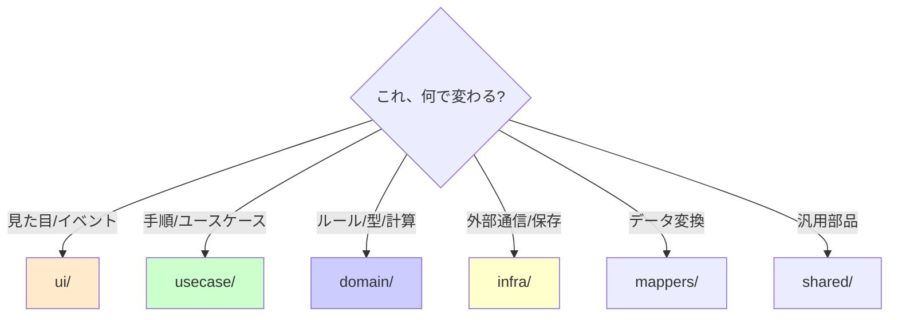

# 第09章：高凝集③ 命名とフォルダで迷子を防ぐ📁🧭✨

## この章のゴール🎯

* 「名前＝責務の宣言📛」ができるようになる
* `utils/` 増殖の“黄色信号🚦”を見抜ける
* 「置き場所ルール🗺️」を作って、探す時間を減らせる
* import が“自然に”読める構造に近づけられる🔗✨

---

## 9-1. 迷子が増えると、設計が崩れる理由😵‍💫

コードが読みにくい時って、だいたいこの2つが原因です👇

* **名前がふわっとしてる**（何をするのか分からない）🌫️
* **置き場所がふわっとしてる**（どこにあるべきか分からない）🌀

だからこの章は超シンプルにまとめると……

✅ **名前は「責務」**
✅ **フォルダは「地図」**

この2つを揃えるだけで、「変更が怖い😱」が一気に減ります✨

---

## 9-2. 命名は“センス”じゃなくて“ルール”で勝つ📛✨


### ルール①：名前は「やること」を1文で言えるように🎤

* `handle()` ❌（なにを？）
* `saveUserProfile()` ✅（なにをするか一発）

💡コツ：**動詞 + 目的語**（save / load / create / validate など）

---

### ルール②：「どこで使うか」より「何の責務か」🎯

* `userPageUtils.ts` ❌（場所が先で責務が不明）
* `formatUserDisplayName.ts` ✅（責務が先）

---

### ルール③：「迷ったら“変更理由”で命名」🧠

例：

* 仕様変更でよく変わるのが「表示形式」なら → `format...`
* 仕様変更でよく変わるのが「入力チェック」なら → `validate...`

---

### ルール④：抽象名の“3兄弟”は危険⚠️👃

* `utils` / `helpers` / `common`
  これ、増え始めたら **だいたい“責務の押し付け合い”** が始まってます🚨

✅ 対策：**“何の”utilsなのか**を名乗らせる

* `date/`（日付の責務）📅
* `money/`（金額の責務）💰
* `validation/`（検証の責務）🛡️

---

## 9-3. `utils` が増える本当の理由🍲💥

`utils` は悪じゃないけど、増殖する時は理由がだいたい同じ👇

* 「置き場所が決まってない」🌀
* 「責務の境界があいまい」🌫️
* 「とりあえず入れた」📦

つまり、`utils` は **“設計の未決”のゴミ箱**になりやすいんです🗑️😇

---

## 9-4. 迷子になりにくいフォルダ構成 3案📁🧩（初心者向け順）


### ✅案A（おすすめ）：**機能（feature）単位でまとめる**🍱✨

「その機能のことは、そのフォルダ見れば分かる」状態を作ります💪

```ts
src/
  features/
    todo/
      ui/
      usecase/
      domain/
      infra/
      mappers/
  shared/
    date/
    validation/
    http/
```

* `features/todo/` を見れば ToDo の全体がつかめる👀✨
* “同じ理由で変わるもの”が近いので、高凝集になりやすい🎯

---

### 案B：レイヤー単位（UI / domain / infra で縦に分ける）🏢

```ts
src/
  ui/
  usecase/
  domain/
  infra/
  shared/
```

* 小規模なら分かりやすい👌
* でも機能が増えると「結局どれがToDoの話？」って迷いやすい😵‍💫

---

### 案C：機能 + 境界（ちょい上級）🧱

「ToDo」「通知」みたいに境界を強めたい時に強い💪
（第17章のミニプロジェクトで刺さるやつ✨）

---

## 9-5. “置き場所ルール”テンプレ🗺️✨（このまま使ってOK）

迷子を減らすルールは、**ガチガチより“シンプル固定”**が勝ちです🎀

### ルールセット（ミニ版）🧸


* `ui/`：画面・イベント・表示だけ🎨
* `usecase/`：やりたいことの手順（業務の流れ）🧭
* `domain/`：ルール・型・禁止事項（壊したら困る核）💎
* `infra/`：HTTP / DB / storage など外部I/O🌐
* `mappers/`：変換（API→Domain、Domain→表示）🔄
* `shared/`：複数機能で共通に使う“責務別”部品📦

💡迷ったらこう決める！
👉 **「それ、どの変更理由で変わる？」**
同じ変更理由の場所に置く🧲✨



---

## 9-6. import が“自然に”なる配置のコツ🔗✨

### コツ①：同じ feature 内は相対 import でOK🏡

* 近所は近所として扱う感じ😊

### コツ②：feature をまたぐなら “入口” を決める🚪

たとえば `features/todo/index.ts` を **公開口**にして、他は触らせない（第16章で本格化🔒）

---

## 9-7. ハンズオン🛠️：フォルダ整理で“読める地図”を作ろう📁🧭✨

### お題：ToDo + 締切通知✅⏰（よくある混在）

まず現状がこうだとします👇（あるある！）

```ts
src/
  todo.ts
  api.ts
  utils.ts
  view.ts
  format.ts
```

#### Step1️⃣ 責務ラベルを貼る🏷️

* `todo.ts`：状態？ルール？API？混ざってる？🍲
* `api.ts`：HTTPだけ？それとも整形も？🌐
* `utils.ts`：中身を見て“何の責務”か分類📦

#### Step2️⃣ 案A（feature単位）に移動する🚚

```ts
src/
  features/
    todo/
      ui/
      usecase/
      domain/
      infra/
      mappers/
  shared/
    date/
    validation/
```

#### Step3️⃣ `utils.ts` を分解する✂️✨

* `utils.ts` の中身が

  * 日付なら → `shared/date/` 📅
  * 検証なら → `shared/validation/` 🛡️
  * ToDoだけの変換なら → `features/todo/mappers/` 🔄

#### Step4️⃣ “名前のつけ直し”をする📛

* `format.ts` → `formatTodoDeadlineText.ts` みたいに責務を言い切る💪

#### Step5️⃣ import を整えて「読める線」にする🧵✨

* UI が domain を直接触ってない？（触るなら理由が必要）👀
* usecase が infra を直呼びして肥大化してない？😵‍💫

---

## 9-8. AIと一緒にやると爆速🤖💨（でも最後は自分でチェック🧠✅）

### まず投げるプロンプト（章の指定どおり）🤖

1. 「この機能に合うフォルダ構成案を3つ（初心者でも迷いにくい順で）」

追加で超おすすめプロンプト🎀
2) 「このファイル名、責務が伝わる名前に直して。候補を5つ＋理由つきで」
3) 「`utils/common/helpers` に入ってる中身を“責務カテゴリ”で仕分けして」
4) 「この構成、importが不自然に長くなる場所はどこ？改善案も」

---

## 9-9. “最新事情”ミニコラム🆕✨（2026-01-13 時点）

* `typescript` の npm 最新は **5.9.3** です（公開情報として “Latest version: 5.9.3”）([npm][1])
* TypeScript 5.9 は **`import defer`** などが入りました（遅延モジュール評価）([TypeScript][2])
* さらに次の大きな流れとして、TypeScript チームは **TypeScript 6.0 を“橋渡し”リリース**として位置づけ、7系（ネイティブ移行）に向けた話を進めています([Microsoft for Developers][3])

💡だからこそ今やる価値がある！
👉 **命名とフォルダが整ってると、移行・整理・変更がラク**になります😄✨

---

## 9-10. 自動で“迷子防止柵”を立てる🧱✨（軽くでOK）

* ESLint は v9 で大きめの変更（新しい設定方式など）を含むメジャーアップデートが出ています([eslint.org][4])
* さらに ESLint v10 は **2026年1月に RC** が出ています([eslint.org][5])
* 「ESLint + Prettier を軽くしたい」派には、Biome みたいな統合ツールも選択肢（TS対応の lint/format/check を提供）([Biome][6])

（この章では“導入が目的”じゃないので、まずは **命名と置き場所ルール**が主役でOKだよ〜😊🫶）

---

## 9-11. できたかチェック✅✨（セルフ採点）

* [ ] `utils/` に“雑多”が溜まってない？🗑️
* [ ] フォルダ名だけで「何の集まりか」言える？📁
* [ ] ファイル名が「責務」を言い切ってる？📛
* [ ] 機能を追うのにフォルダを横断しすぎてない？🧭
* [ ] import が“意味のある方向”になってる？🔗

---

## まとめ🎉

この章でやったのはこれだけです👇

* **名前で責務を言い切る📛**
* **フォルダで地図を作る📁**
* **`utils` を“責務別”に分解する✂️**

次の第10章は、ここで整えた構造を使って **import依存（結合）を見える化👀🔗** していきます✨

[1]: https://www.npmjs.com/package/typescript?activeTab=versions&utm_source=chatgpt.com "typescript"
[2]: https://www.typescriptlang.org/docs/handbook/release-notes/typescript-5-9.html?utm_source=chatgpt.com "Documentation - TypeScript 5.9"
[3]: https://devblogs.microsoft.com/typescript/progress-on-typescript-7-december-2025/?utm_source=chatgpt.com "Progress on TypeScript 7 - December 2025"
[4]: https://eslint.org/blog/2024/04/eslint-v9.0.0-released/?utm_source=chatgpt.com "ESLint v9.0.0 released - ESLint - Pluggable JavaScript Linter"
[5]: https://eslint.org/blog/2026/01/eslint-v10.0.0-rc.0-released/?utm_source=chatgpt.com "ESLint v10.0.0-rc.0 released"
[6]: https://biomejs.dev/?utm_source=chatgpt.com "Biome, toolchain of the web"
