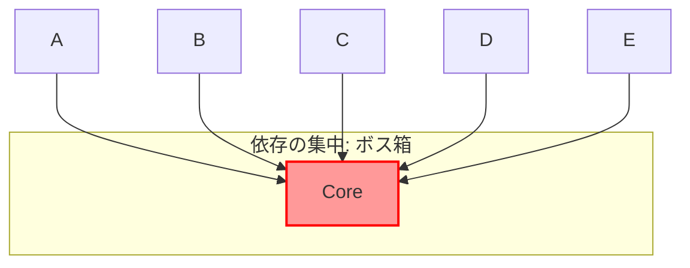
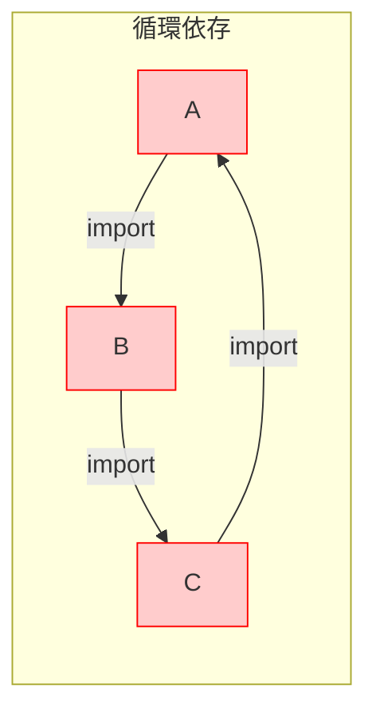

# 第10章：低結合の入口 “import依存” を見える化👀🔗

### この章でできるようになること🎯✨

* 「どこが結合強いか」を **importの矢印** で発見できる👁️
* **依存の集中（ボトルネック）** と **循環依存（circular deps）** を見つけられる🕸️😱
* 手描き→ツールで自動化、の流れで「変更が伝染する場所」を潰せるようになる💪🔥

---

## 1) importの矢印は「変更が伝染する道」🗺️➡️


モジュールAがモジュールBをimportしてるなら、

**A → B（AはBに依存）** だよね🔗
この矢印が増えるほど…

* 変更の影響範囲が読めなくなる😵‍💫
* ちょい修正が「雪崩」になる💥
* リファクタが怖くて動けなくなる🥶

だからこの章は、まず **矢印を見える形にする** のがゴールだよ〜👀✨

---

## 2) まずは手描きでOK！依存マップ作り✍️📌


ツールの前に、**人間の目でも分かる地図** を1回作るのがめっちゃ効くよ🫶

### 手描き手順（超かんたん）🧸

1. **箱（モジュール）を6〜10個だけ** 選ぶ📦

   * 例：UI / UseCase / Domain / Infra / 共通 みたいに
2. 各箱の「入口ファイル」を決める🚪

   * 例：`ui/index.ts`、`usecase/index.ts` など
3. importを見て **矢印を引く**（細かいファイル単位じゃなくてもOK）➡️
4. 矢印に **目的メモ** を添える📝

   * 「型だけ」「API呼び出し」「表示整形」など
5. 最後にチェック✅

   * 矢印が集中してる箱（←ここが怖い）😨
   * 双方向の矢印（←循環のにおい）🔁
   * 境界を跨ぎまくる矢印（←混在のにおい）🍲

---

## 3) “ヤバい形” だけ先に覚えよ👃💦

### 3-1) 依存の集中（ボス箱）👑📦


「みんながそこをimportしてる」箱があると、そこが変更の震源地になる💥


「みんながそこをimportしてる」箱があると、そこが変更の震源地になる💥

* 直すと全体が揺れる
* テストしないと怖い
* 作業が詰まりやすい



### 3-2) 循環依存（circular deps）🕸️😱

AがBをimport、BがAをimport…みたいなループ🔁
これは **“順番”の問題** が起きやすくて、実行時に値がundefinedっぽくなったり、開発体験が悪化したりするよ😵

特にVite開発中、循環依存があると **HMRが効かずフルリロード** になることがある（しかも直しにくい…！）😇


Vite公式のトラブルシュートでも「循環依存だとフルリロードになるからループを壊してね」と書かれてるよ。 ([vitejs][1])



---

## 4) 自動で見える化①：dependency-cruiser 🚢✨

「依存の検査」も「図の生成」もできる、超強い道具だよ💪
TypeScript/JavaScriptの依存を解析して、ルール違反（循環とか）を検出できる系。 ([GitHub][2])

### 4-1) 最短で動かすコマンド🛠️

```sh
npm i -D dependency-cruiser
npx depcruise --init
```

これで設定ファイルができるよ（まずはデフォルトでOK）✨

### 4-2) 循環依存があるかチェック🔍


```sh
npx depcruise src --config --output-type err-long
```

結果に “no-circular” みたいなのが出たら、そこがループの入口だよ🕸️

### 4-3) 依存グラフをSVGで出す🖼️✨

dependency-cruiserはDOT形式を出せるので、Graphvizの「dot」でSVGにできるよ🪄
（dotは標準入力から読めるからパイプで繋げられるやつ！） ([Graphviz][3])

```sh
npx depcruise src --config --output-type dot | dot -Tsvg > deps.svg
```

* `deps.svg` をブラウザで開くと、矢印の地獄が見えるよ😇

※ `dot -Tsvg` みたいな変換はGraphvizのコマンド仕様どおりだよ。 ([Graphviz][3])

---

## 5) 自動で見える化②：madge 🐙📈

madgeは「依存グラフ作る」「循環依存見つける」専門の人気ツールだよ✨
READMEでも「視覚的グラフ」「循環依存の検出」って明言されてる。 ([GitHub][4])

### 5-1) 循環依存だけ見たい（まずこれ）👀


```sh
npx madge --circular src
```

### 5-2) グラフ画像を出したい🖼️

Graphvizが入ってるとSVGも出せる（madge側もGraphvizが必要って書いてあるよ） ([GitHub][4])

```sh
npx madge src --image madge.svg
```

### 5-3) tsconfigのパス別名を使ってる時🧩

madgeは `tsConfig` を渡せる（tsconfigで解決するため）って設定があるよ。 ([GitHub][4])

```sh
npx madge src --ts-config tsconfig.json --circular
```

---

## 6) “循環依存” が起きやすい典型パターン🍲💥

初心者がハマりやすいの、だいたいこれ〜😭

### パターンA：barrel（index.ts）経由でループ🔁

* `ui/index.ts` が色々export
* `usecase` が `ui/index.ts` をimport（通知とかトーストとか）
* `ui` が `usecase/index.ts` をimport
  → はい、ループ完成🕸️😇

### パターンB：「型だけ」のつもりがループ🎭

「型だけだからOKでしょ〜」って気持ち、めっちゃ分かる…！
でも **型importが結局依存の矢印になる** から、境界を跨ぐと絡まりやすいよ🧶

---

## 7) 見つけた循環依存、どう壊す？（入口だけ）🔨✨


第11章（関数DI）で本格的にやるけど、ここでは“入口”だけね😉

### 壊し方の定番3つ🎀

1. **共有物を中立地帯へ引っ越し** 📦

   * UIでもUseCaseでもない「shared（薄い）」へ
2. **通知・ログ・時計などは“外から渡す”** 🎁

   * usecaseがUIを知らなくて済む
3. **UIの都合（表示用整形）をusecaseに持ち込まない** 🚫

   * “表示のための関数”はUI側へ寄せる

---

## 8) ハンズオン🛠️：あなたのプロジェクトでやろう✅🎉

### ステップ1：依存マップを手描き（10分）✍️

* 箱：`ui / usecase / domain / infra / shared`（なければ近いのでOK）
* 矢印を引く
* 「矢印が多い箱TOP1」を丸で囲む⭕
* 「双方向っぽい所」を赤丸🔴

### ステップ2：ツールで答え合わせ（10分）🧪

* `npx madge --circular src` を実行
* `npx depcruise src --config --output-type err-long` を実行
* それぞれで出た循環パスを、手描き地図に書き足す📝

### ステップ3：1個だけループを壊す（15分）🔨

* いちばん短い循環から狙う🎯
* 「通知」「ログ」「整形」などを外に逃がす
* もう一回ツール実行して、循環が消えたら勝ち🏆✨

---

## 9) AIプロンプト🤖💬（この章はこれだけ！）

1. 「この構造、循環依存が起きそうな点ある？疑わしい箇所を挙げて」🕸️🔍
   （※できれば、あなたの `src` 構造ツリーと、怪しいimport数ファイルを貼ると精度UPだよ📎✨）

---

## 10) まとめ🎀

* 低結合の第一歩は **importの矢印を見える化** 👀🔗
* 手描き→ツール（dependency-cruiser / madge）で、依存の集中と循環を炙り出す🔥 ([GitHub][2])
* 循環依存は開発体験も壊しやすい（ViteだとHMRがフルリロードになったり…）😇 ([vitejs][1])

次の第11章は、見つけた結合をほどくための「引数で渡す（関数DI）」に突入だよ🎁✨

[1]: https://vite.dev/guide/troubleshooting?utm_source=chatgpt.com "Troubleshooting"
[2]: https://github.com/sverweij/dependency-cruiser?utm_source=chatgpt.com "sverweij/dependency-cruiser: Validate and visualize ..."
[3]: https://graphviz.org/doc/info/command.html "Command Line | Graphviz"
[4]: https://github.com/pahen/madge "GitHub - pahen/madge: Create graphs from your CommonJS, AMD or ES6 module dependencies"
