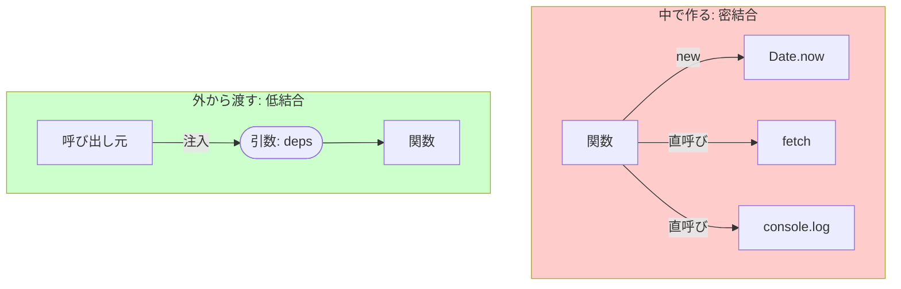

# 第11章：低結合① “引数で渡す”から始める（関数DI）🎁✨

この章は「依存（=外の世界の力）を、関数の外から“渡す”」だけで、コードが一気に変更に強くなる体験をします😊🌱
DI（Dependency Injection）って聞くと難しそうだけど、**最初の一歩は“引数で渡す”だけ**です🎀

ちなみに本日時点では、TypeScript は `npm install -g typescript` で入る最新版が **5.9 系**（公式ページ上の表記）です。([typescriptlang.org][1])
また npm では 5.9.3 が “Latest version” として表示されています。([npm][2])
TypeScript 6.0/7.0 の話も進んでいて、6.0 での非推奨→7.0 での整理、みたいなロードマップが公式に語られています。([Microsoft for Developers][3])

---

## 1) そもそも「依存」ってなに？🤔🔗


ざっくり言うと、**関数の外にあるものに頼ること**です！

よくある依存たち👇

* 時間：`Date.now()` / `new Date()` ⏰
* 通信：`fetch()` 🌐
* ログ：`console.log()` 🗣️
* 乱数：`Math.random()` 🎲
* 環境：`process.env` 🧪
* 保存：`localStorage` / DB / ファイル 📦

こういうのって、**実行するたびに結果が変わったり**、**テストで再現しづらかったり**、**呼び出し元から見えない結合**を作りやすいんです😵‍💫💦

---

## 2) 「中で作る」と何がツラいの？😱➡️😇


例えばこの関数、ぱっと見ふつうだけど…

```ts
export async function getWelcomeMessage(userId: string): Promise<string> {
  const res = await fetch(`https://api.example.com/users/${userId}`);
  const user = await res.json();

  const hour = new Date().getHours(); // 時間依存⏰
  console.log("loaded user", userId);  // ログ依存🗣️

  const greet = hour < 12 ? "おはよ〜" : "こんにちは〜";
  return `${greet} ${user.name}さん✨`;
}
```

**問題ポイント**👇


* テストで「朝/昼」を固定できない（実行時間で変わる）⏰


* テストで「朝/昼」を固定できない（実行時間で変わる）⏰
* 通信が飛ぶ（遅い・不安定・失敗する）🌩️
* `console.log` がテスト結果を汚す（地味にイヤ）🫠

つまり、**関数が“外の世界”とベタベタにくっついてる**状態です🔗💦

---

## 3) 今日の主役：関数DI（引数で渡す）🎁✨


合言葉はこれ💡

### ✅「依存は中で作らない。外から受け取る。」

“依存を渡す”って、超シンプルに言うとこう👇

* `Date.now()` をやめて `now()` を引数でもらう
* `fetch()` をやめて `fetchJson()` を引数でもらう
* `console.log()` をやめて `log()` を引数でもらう



---

---

## 4) リファクタ：依存を引数で渡す版（いちばん簡単）🧁


### 4-1. 依存の型（=関数の形）を軽く作る🧩

この章では “interface/type の本格運用” は次章に譲って、**最低限の type** だけ使います😊

```ts
export type Now = () => number;
export type FetchJson = (url: string) => Promise<unknown>;
export type Log = (message: string, extra?: unknown) => void;

export type Deps = {
  now: Now;
  fetchJson: FetchJson;
  log: Log;
};
```

### 4-2. 依存を “deps” で受け取る🎁

```ts
type User = { name: string };

export async function getWelcomeMessage(
  userId: string,
  deps: Deps
): Promise<string> {
  const data = await deps.fetchJson(`https://api.example.com/users/${userId}`);
  const user = data as User;

  const hour = new Date(deps.now()).getHours();
  deps.log("loaded user", { userId });

  const greet = hour < 12 ? "おはよ〜" : "こんにちは〜";
  return `${greet} ${user.name}さん✨`;
}
```

**これだけで何が嬉しい？**🎉

* テストで `now()` を固定できる（朝を作れる！）⏰
* テストで `fetchJson()` を偽物にできる（通信ゼロ！）🌐🚫
* `log()` を黙らせたり、呼ばれた回数を確認できる🕵️‍♀️

---

## 5) 実運用の “deps” の作り方（例）🏗️✨


「じゃあ本番は何渡すの？」ってなるよね😊

Node の `fetch` は v18 でデフォルト利用可能（当時は experimental として紹介）で、v21 で stable として案内されています。([Node.js][4])
いま主流の LTS ライン（例：Node 24 “Krypton” LTS）でももちろん使えます。([Node.js][5])

```ts
const deps: Deps = {
  now: () => Date.now(),
  fetchJson: async (url) => {
    const res = await fetch(url);
    return res.json();
  },
  log: (message, extra) => console.log(message, extra ?? ""),
};

const msg = await getWelcomeMessage("u_123", deps);
console.log(msg);
```

この「deps を組み立てる場所」は次章（Composition Root）で“気持ちよく整理する”んだけど、まずは雰囲気だけでOKです😉🫶

---

## 6) “引数が増えすぎ問題” のかわし方3つ🛡️😵‍💫


依存を渡し始めると、こうなることがある👇
「引数が deps だらけで読みにくい〜〜！😭」

そこで、よく使う形が3つ✨

### A) 依存を1個ずつ引数（小さいうちはOK）🍬

```ts
function f(x: number, now: Now, log: Log) {}
```

### B) deps オブジェクトでまとめる（いちばん万能）🎁

```ts
function f(x: number, deps: { now: Now; log: Log }) {}
```

### C) “関数を作る関数” にする（テストが超ラク）🏭✨

```ts
export function createGetWelcomeMessage(deps: Deps) {
  return async (userId: string) => getWelcomeMessage(userId, deps);
}
```

初心者のうちは **B（depsでまとめる）** が失敗しにくいです😊💕

---

## 7) ミニテスト：偽物depsで動かす🧪✨

### 7-1. “偽物now” で朝を作る⏰🌅


```ts
const fakeMorningNow: Now = () => new Date("2026-01-13T08:00:00+09:00").getTime();
```

### 7-2. “偽物fetchJson” で通信を消す🌐🚫

```ts
const fakeFetchJson: FetchJson = async () => ({ name: "ボビー" });
```

### 7-3. “偽物log” でログを記録する📝

```ts
const logs: Array<{ message: string; extra?: unknown }> = [];
const fakeLog: Log = (message, extra) => logs.push({ message, extra });
```

### 7-4. テスト実行イメージ（概念）💡

```ts
const deps: Deps = {
  now: fakeMorningNow,
  fetchJson: fakeFetchJson,
  log: fakeLog,
};

const msg = await getWelcomeMessage("u_1", deps);

if (!msg.startsWith("おはよ〜")) throw new Error("朝の挨拶になってない😭");
if (logs.length !== 1) throw new Error("logが呼ばれてない😭");
```

---

## 8) ついでに：Node の組み込みテストランナーもあるよ🧰✨

Node には `node --test` の **組み込みテストランナー**があって、Node 20 で stable 扱いとして案内されています。([Node.js][6])
（ただ、この講座は“設計が主役”なので、テスト道具は何を使ってもOKだよ〜😊🫶）

---

## 9) ハンズオン（手を動かす回）🛠️💕

### お題：通知メッセージを作る関数を、関数DIで強くする🎯✨

1. まず、依存が直書きの関数を用意（`Date.now() / fetch / console.log` が入ってるやつ）😵‍💫
2. 依存を3つに丸で囲む✍️（時間・通信・ログ）⭕⭕⭕
3. `Deps` を作って、引数で受け取る形に変更🎁
4. 偽depsで “朝固定” “通信なし” のチェックをする🧪
5. おまけ：deps の中身を増やしすぎてないか見直す（最小の契約へ）🧼✨

---

## 10) この章の「AIの使いどころ」🤖🎀（プロンプト2つ）


### プロンプト①（依存の洗い出し）🔍

「この関数の“外部依存”（時間、乱数、HTTP、ログ、環境変数など）を列挙して、引数で渡す形に直す方針を提案して。依存の名前案（now/fetchJson/logなど）も出して」

### プロンプト②（deps設計のダイエット）🥗

「deps が太りそう。依存を最小にするには、どの依存をまとめる/削る/ラップするのがいい？テストしやすさ優先で提案して」

---

## まとめ：今日はこれだけ覚えれば勝ち🏆✨

* 低結合の第一歩は **“依存を引数で渡す”** 🎁
* `Date.now()` / `fetch()` / `console.log()` を **中で呼ばない**（受け取る）🔗🚫
* すると **テストが簡単**、**変更が伝染しにくい**、**読みやすい** 🎉

次章（第12章）で、「渡す依存の“契約（interface/type）”を小さく保つ」へ進むと、さらに安定します😊📜✨

[1]: https://www.typescriptlang.org/download/?utm_source=chatgpt.com "How to set up TypeScript"
[2]: https://www.npmjs.com/package/typescript?utm_source=chatgpt.com "TypeScript"
[3]: https://devblogs.microsoft.com/typescript/progress-on-typescript-7-december-2025/?utm_source=chatgpt.com "Progress on TypeScript 7 - December 2025"
[4]: https://nodejs.org/en/blog/announcements/v18-release-announce?utm_source=chatgpt.com "Node.js 18 is now available!"
[5]: https://nodejs.org/en/blog/release/v24.11.0 "Node.js — Node.js 24.11.0 (LTS)"
[6]: https://nodejs.org/en/blog/announcements/v20-release-announce?utm_source=chatgpt.com "Node.js 20 is now available!"
