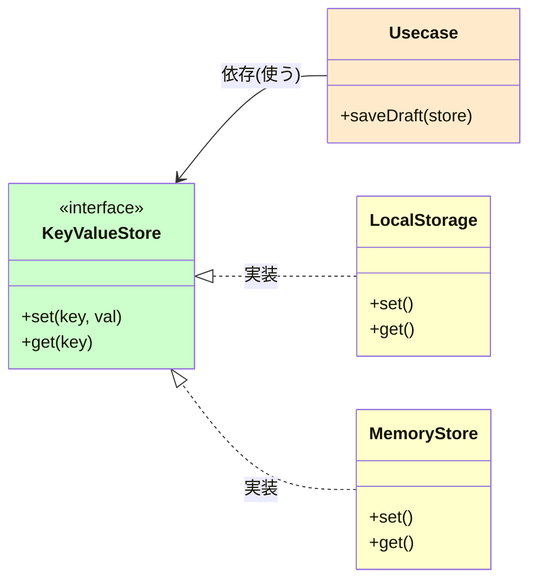

# 第12章：低結合② “契約”を作る（interface / type の使い分け）📜🔌

## 今日のゴール🎯

* 「差し替え可能」って、**何を固定して何を自由にする**ことなのか分かる🧠✨
* `interface` / `type` を、**迷わず選べる基準**を持つ🧭
* 外部I/O（API / Storage）を **“契約”で包んで、利用側を守る**🛡️

---

## 12-1. そもそも“契約”ってなに？🤝💡


“契約”はひとことで言うと…

> **「使う側（利用側）が必要な最小の形」だけを約束するもの**📜✨

たとえば、保存先が `localStorage` でも、APIでも、メモリでも…
**使う側が欲しいのは“保存できて、読めること”**だけだったりするよね？😊

このとき契約がないと、使う側がこうなりがち👇💦

* `localStorage` の細かい仕様に依存してしまう
* APIレスポンスの形がチラ見えして、あちこちに波及する
* テストがつらい（本物のI/Oを呼びがち）😱

そこで契約！🎉
**外の世界（I/O）を“薄い壁”で包んで**、中を落ち着かせるイメージだよ🏠🫶

---

## 12-2. TypeScriptは「形が合えばOK」な世界🧩✨（構造的型付け）


TypeScriptは基本、**“形（members）が同じならOK”** という考え方（構造的型付け）だよ🐣
公式ドキュメントでも、型の互換性は “structural subtyping” が基準って説明されてるよ。([TypeScript][1])

たとえば👇

```ts
interface HasId {
  id: string;
}

const a = { id: "u1", name: "Mika" };

// 形が合うのでOK（HasIdが欲しい場所に渡せる）
const f = (x: HasId) => x.id;

f(a);
```

### これ、便利だけど落とし穴もある😵

* “たまたま形が一致した別物”が入り込むことがある
* だからこそ、**契約は小さく・意図が伝わる名前**にするのが大事📛✨

---

## 12-3. `interface` と `type`：まずはこの判断でOK🧠🪄


迷ったら、最初はこのルールでほぼ勝てるよ✌️✨
（TypeScript公式も「だいたい同等だけど差がある」と整理してるよ）([TypeScript][2])

### ✅ `interface` を選ぶと気持ちいい場面🏷️

* **“オブジェクトの形” を表す契約**（今回のメイン！）
* 後から拡張したい（`extends`）
* 宣言マージ（同名 `interface` を足していける）が必要

  * `type` は宣言マージに参加できないよ ([TypeScript][2])

### ✅ `type` が得意な場面🧩

* Union（`A | B`）みたいな **分岐の表現**
* 文字列リテラル、タプル、関数型、mapped/conditional type みたいな **複雑な型遊び**
* `interface` は基本「オブジェクトの形」に強いよ ([TypeScript][2])

---

## 12-4. “良い契約”のコツ5つ🧁✨（小さく、安定させる）

### コツ①：契約は「使う側が必要なぶんだけ」🍰

外側（I/O）の都合じゃなく、**内側（利用側）の必要**で決めるのが大人っぽい設計🧠✨

### コツ②：読み取りと書き込みを分ける📖✍️


「読むだけ欲しい」場所に「書き込み権限」まで渡すと、結合が増えるよ🔗💦
（小さな契約に分けると、差し替えもテストもラク！）

### コツ③：戻り値に“外部の匂い”を持ち込まない🧼

APIの `UserDto` をそのまま返すと、内側がDTOに染まる😵
契約の戻り値は **内側が欲しい形**に寄せるのが◎

### コツ④：失敗も契約にする（Unionが強い）🚑✨

例：`throw` 乱発より、`Result` / 判別可能Unionで返すと安全になりやすいよ🧩

### コツ⑤：“契約は内側、実装は外側”の方向を守る🧭

内側が外側の詳細を知らないほど、低結合になるよ🏝️✨
（TypeScriptの構造的型付けは便利だけど、だからこそ境界が大事！）([TypeScript][1])

---

## 12-5. ハンズオン🛠️：Storageを“契約”で包んで差し替える🛡️✨

題材：**「下書き（draft）を保存して復元する」**📝💖

### Step0：まず“よくある直書き地獄”😱

```ts
// draft.ts（ありがち）
export function saveDraft(key: string, text: string) {
  localStorage.setItem(key, text);
}

export function loadDraft(key: string): string | null {
  return localStorage.getItem(key);
}
```

* `localStorage` が使えない環境だと詰む
* テストがめんどい（本物に触りがち）
* “保存先を変える”が発生した瞬間に崩れる💥

---

### Step1：利用側が欲しい“最小の契約”を作る📜✨（ここが主役！）

```ts
// ports/KeyValueStore.ts
export interface KeyValueStore {
  get(key: string): string | null;
  set(key: string, value: string): void;
}
```

ポイント🎀

* `localStorage` のメソッド名に合わせなくてOK（内側都合でOK）
* `remove` とか `clear` とか、今いらないなら入れない🙅‍♀️✨（契約は太らせない！）

---

### Step2：外側で実装する（Adapter）🔌✨

```ts
// infra/BrowserLocalStorageStore.ts
import type { KeyValueStore } from "../ports/KeyValueStore";

export class BrowserLocalStorageStore implements KeyValueStore {
  get(key: string): string | null {
    return localStorage.getItem(key);
  }
  set(key: string, value: string): void {
    localStorage.setItem(key, value);
  }
}
```

---

### Step3：テスト用に“メモリ実装”を作る🧪💖

```ts
// infra/InMemoryStore.ts
import type { KeyValueStore } from "../ports/KeyValueStore";

export class InMemoryStore implements KeyValueStore {
  private map = new Map<string, string>();

  get(key: string): string | null {
    return this.map.get(key) ?? null;
  }
  set(key: string, value: string): void {
    this.map.set(key, value);
  }
}
```

---

### Step4：利用側は「契約だけ」を見る😍✨（低結合！）


```ts
// usecase/draftUsecase.ts
import type { KeyValueStore } from "../ports/KeyValueStore";

export function saveDraft(store: KeyValueStore, key: string, text: string) {
  store.set(key, text);
}

export function loadDraft(store: KeyValueStore, key: string): string | null {
  return store.get(key);
}
```

これで…

* 保存先が変わっても usecase は無傷💪✨
* テストが秒で書ける🧪🎉



---

## 12-6. `interface` と `type` を“この章っぽく”使い分ける例🌷

### ✅ 契約（Port）は `interface` が気持ちいい📜

* 今回の `KeyValueStore` みたいな「形の約束」
* 公式ドキュメントでも、`interface` は契約を表す役割として説明されがちだよ ([TypeScript][3])

### ✅ エラー表現は `type` のUnionが強い🚑🧩


```ts
export type DraftLoadError =
  | { kind: "NotFound" }
  | { kind: "Corrupted"; reason: string };

export type DraftLoadResult =
  | { ok: true; value: string }
  | { ok: false; error: DraftLoadError };
```

Unionは `type` の得意分野だよ（`|`）([TypeScript][4])

---

## 12-7. “契約を小さくする”実戦テク🐣✨（分割パターン）


「Repository作ったらメソッド増えすぎた…😇」ってなりがちなので、最初から分けるのがオススメ！

```ts
// ports/UserRead.ts
export interface UserRead {
  findById(id: string): Promise<{ id: string; name: string } | null>;
}

// ports/UserWrite.ts
export interface UserWrite {
  save(user: { id: string; name: string }): Promise<void>;
}
```

* 読むだけのusecaseは `UserRead` だけ依存すればいい📖✨
* 書くだけのusecaseは `UserWrite` だけ依存すればいい✍️✨
  → **契約が小さいほど、結合が減る**🔗✂️

---

## 12-8. 「どっちに統一する？」はESLintで自動化できるよ🤖🧹

チームや教材では、迷いが減るように **どちらかに寄せる**ことが多いよ😊
`@typescript-eslint/consistent-type-definitions` で `interface` / `type` の統一を強制できるよ。([typescript-eslint.io][5])

---

## 12-9. AIの使いどころ🤖💞（この章の勝ちプロンプト）

### ✅ 章の指定プロンプト🎀

1. 「この契約を小さくするなら、メソッド/型は何を削るべき？」🤖✂️

### 追加で強いプロンプト💪✨

2. 「利用側が本当に必要としている操作だけに絞るとしたら、契約を2〜3個に分割して提案して」🧩
3. 「この契約、外部I/Oの詳細が漏れてる？“漏れポイント”を3つ指摘して」🕵️‍♀️

---

## 12-10. まとめ🎉✨

* 契約は **“利用側が欲しい最小の形”**📜
* TypeScriptは **形が合えばOK**（構造的型付け）だから、境界は意識して作る🧩([TypeScript][1])
* `interface`：契約（オブジェクトの形）に強い／宣言マージOK ([TypeScript][2])
* `type`：Unionなどの表現に強い🧩
* 契約が小さいほど、差し替え・テスト・変更に強くなる💪✨

---

### おまけ：1分チェッククイズ🧠💫

* Q1：`localStorage` を usecase から直呼びしてる。直すなら最初の一手は？📝
* Q2：契約が `save/find/delete/update/list/reset/clear/...` って増殖中。どう分ける？✂️
* Q3：失敗ケースを `throw` で投げまくり。Unionで返すと何が嬉しい？🚑

次の第13章で、この“契約＋DI”を **組み立て場所（Composition Root）**に集めて、さらに気持ちよくしていくよ〜🏗️✨

[1]: https://www.typescriptlang.org/docs/handbook/type-compatibility.html?utm_source=chatgpt.com "Documentation - Type Compatibility"
[2]: https://www.typescriptlang.org/docs/handbook/2/everyday-types.html?utm_source=chatgpt.com "Documentation - Everyday Types"
[3]: https://www.typescriptlang.org/docs/handbook/interfaces.html?utm_source=chatgpt.com "Handbook - Interfaces"
[4]: https://www.typescriptlang.org/docs/handbook/unions-and-intersections.html?utm_source=chatgpt.com "Handbook - Unions and Intersection Types"
[5]: https://typescript-eslint.io/rules/consistent-type-definitions/?utm_source=chatgpt.com "consistent-type-definitions"
