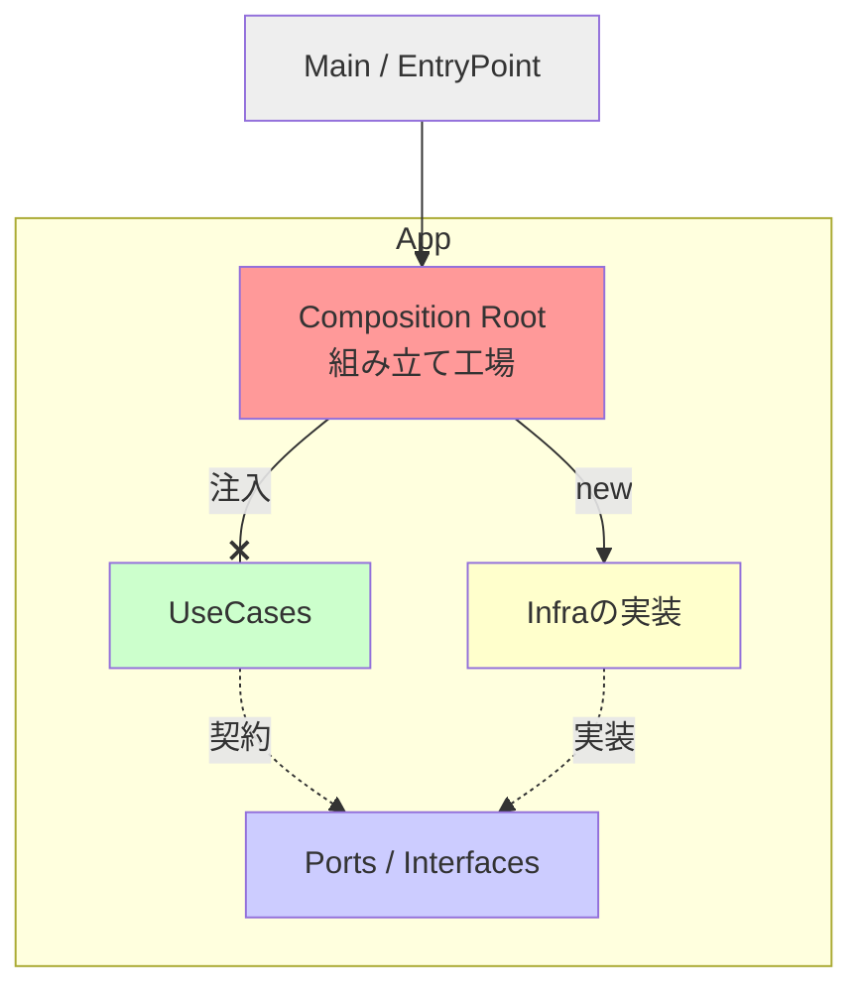

# 第13章：低結合③ “組み立て場所”を作る（Composition Root）🏗️✨

## この章でできるようになること🎯

* 「依存（DB/HTTP/時計/ログ…）」を**どこで作るべきか**が迷わなくなる✨
* UseCase（中心ロジック）が **“受け取るだけ”** になって、軽くなる🎀
* テストで差し替えが簡単になって、変更が怖くなくなる🧪💕

---

## 1) まずは“よくある地獄”を言語化😱🔥


次みたいな状態、見覚えない？👀

* いろんなファイルで `new` してる（RepoもLoggerもHTTPも…）💥
* どこで何が使われてるか追えない🕵️‍♀️
* 仕様変更すると、あちこち直す羽目になる🧯
* テストしようとしても、`Date.now()` と `fetch` とファイル I/O が絡んで詰む🧊

ここで効くのが **Composition Root** だよ〜！🏗️✨

---

## 2) Composition Rootってなに？🧠✨


超ざっくり言うと…

> **アプリを動かすための“部品（依存）”を、最後に1か所で組み立てる場所**🏗️
> それ以外の場所では、基本「作らない（newしない）」で“受け取る”🎁

この考え方は「入口（entry point）で全部を合体させる」って説明されることが多いよ📌 ([blog.ploeh.dk][1])

---

## 3) どこに置くのが自然？📁🚪


ポイントは **“アプリの入口に近い場所”** に置くこと✨（入口で最後に合体！） ([blog.ploeh.dk][1])

よくある配置例👇

* `src/main.ts`（CLI/Node実行の入口）
* `src/server.ts`（APIサーバの起動入口）
* `src/main.tsx`（フロントの起動入口）
* 入口ファイルが薄いなら、`src/app/compositionRoot.ts` に分けてOK📦

---

## 4) ルールはこれだけ（超重要）🔑✨

### ✅ UseCase側（中心ロジック）

* 依存を **引数（またはコンストラクタ）で受け取るだけ**🎀
* `fetch` / `Date.now()` / `process.env` / `console` / ファイルI/O…を **直に呼ばない**（呼ぶなら外から渡す）🧤

### ✅ Composition Root側（入口）

* 依存（実装）を `new` して組み立てる🏗️
* 「UseCase + 依存」を合体して、実行する🚀

---

## 5) 例：ミニ題材で“組み立て”を体感🧩💡

題材：**ToDoを追加して、締切が近いと通知する**✅⏰📣
（UIでもAPIでもCLIでも同じ考え方でいけるよ！）

### フォルダ構成（おすすめ）📁🧭


```text
src/
  domain/
    task.ts
  ports/
    clock.ts
    taskRepository.ts
    notifier.ts
    idGenerator.ts
  usecases/
    addTask.ts
  infra/
    systemClock.ts
    fileTaskRepository.ts
    consoleNotifier.ts
    nodeIdGenerator.ts
  app/
    compositionRoot.ts
  main.ts
```

この形のいいところ👇

* **ports**：契約（interface/type）だけ📜
* **usecases**：中心ロジック（依存は受け取るだけ）🎯
* **infra**：外界（ファイル/HTTP/時計/ログ等）🌍
* **app**：組み立て（Composition Root）🏗️

---

## 6) コード：UseCaseは“受け取るだけ”🎁✨


### ports（契約）📜

```ts
// src/ports/clock.ts
export interface Clock {
  now(): Date;
}

// src/ports/taskRepository.ts
import type { Task } from "../domain/task";

export interface TaskRepository {
  save(task: Task): Promise<void>;
}

// src/ports/notifier.ts
export interface Notifier {
  notify(message: string): Promise<void>;
}

// src/ports/idGenerator.ts
export interface IdGenerator {
  newId(): string;
}
```

### domain（ドメイン）🏷️

```ts
// src/domain/task.ts
export type Task = {
  id: string;
  title: string;
  deadline: Date;
};
```

### usecase（中心ロジック）🎯

```ts
// src/usecases/addTask.ts
import type { Task } from "../domain/task";
import type { Clock } from "../ports/clock";
import type { IdGenerator } from "../ports/idGenerator";
import type { Notifier } from "../ports/notifier";
import type { TaskRepository } from "../ports/taskRepository";

export type AddTaskDeps = {
  repo: TaskRepository;
  clock: Clock;
  idGen: IdGenerator;
  notifier: Notifier;
};

export type AddTaskInput = {
  title: string;
  deadline: Date;
};

export async function addTask(deps: AddTaskDeps, input: AddTaskInput): Promise<Task> {
  const task: Task = {
    id: deps.idGen.newId(),
    title: input.title,
    deadline: input.deadline,
  };

  await deps.repo.save(task);

  const msLeft = task.deadline.getTime() - deps.clock.now().getTime();
  const oneDayMs = 24 * 60 * 60 * 1000;

  if (msLeft <= oneDayMs) {
    await deps.notifier.notify(`締切もうすぐ！「${task.title}」⏰💦`);
  }

  return task;
}
```

ここ、最高にえらいポイント👇😍

* `Date.now()` を直接呼んでない（clock注入）⏰
* IDも外から（idGen注入）🪪
* 通知も外から（notifier注入）📣
* 保存も外から（repo注入）💾

つまり **差し替え放題**🎉

---

## 7) infra（外界の実装）🌍🧰


```ts
// src/infra/systemClock.ts
import type { Clock } from "../ports/clock";

export class SystemClock implements Clock {
  now(): Date {
    return new Date();
  }
}
```

```ts
// src/infra/consoleNotifier.ts
import type { Notifier } from "../ports/notifier";

export class ConsoleNotifier implements Notifier {
  async notify(message: string): Promise<void> {
    console.log(message);
  }
}
```

```ts
// src/infra/nodeIdGenerator.ts
import type { IdGenerator } from "../ports/idGenerator";
import { randomUUID } from "node:crypto";

export class NodeIdGenerator implements IdGenerator {
  newId(): string {
    return randomUUID();
  }
}
```

※ Repoは簡略化してOK（本章の主役は“組み立て”なので！）😊

```ts
// src/infra/fileTaskRepository.ts
import type { Task } from "../domain/task";
import type { TaskRepository } from "../ports/taskRepository";
import { promises as fs } from "node:fs";

export class FileTaskRepository implements TaskRepository {
  constructor(private readonly filePath: string) {}

  async save(task: Task): Promise<void> {
    const line = JSON.stringify(task) + "\n";
    await fs.appendFile(this.filePath, line, "utf8");
  }
}
```

---

## 8) そして主役：Composition Root🏗️✨


```ts
// src/app/compositionRoot.ts
import { addTask } from "../usecases/addTask";
import { SystemClock } from "../infra/systemClock";
import { ConsoleNotifier } from "../infra/consoleNotifier";
import { FileTaskRepository } from "../infra/fileTaskRepository";
import { NodeIdGenerator } from "../infra/nodeIdGenerator";

export function buildApp() {
  // ✅ 依存を “ここでだけ” 作る！
  const clock = new SystemClock();
  const notifier = new ConsoleNotifier();
  const repo = new FileTaskRepository("tasks.ndjson");
  const idGen = new NodeIdGenerator();

  // ✅ usecaseは依存を受け取るだけ（合体はここ）
  const deps = { clock, notifier, repo, idGen };

  return {
    addTask: (input: { title: string; deadline: Date }) => addTask(deps, input),
  };
}
```

入口は超うすくする🚪✨

```ts
// src/main.ts
import { buildApp } from "./app/compositionRoot";

async function main() {
  const app = buildApp();

  await app.addTask({
    title: "レポート提出",
    deadline: new Date(Date.now() + 6 * 60 * 60 * 1000), // 6時間後
  });
}

main().catch((e) => {
  console.error(e);
  process.exitCode = 1;
});
```

この「入口で組み立てる」って方針が Composition Root の芯だよ〜🏗️✨ ([blog.ploeh.dk][1])



---

## 9) ハンズオン🛠️（手を動かすチェックリスト）✅✨

### Step A：まず“散らかった版”を想像してみる😵‍💫

* UseCaseの中で `new FileTaskRepository(...)` しちゃってる
* UseCaseの中で `new Date()` / `console.log` しちゃってる

👉 「これ、テスト無理じゃない？」って気持ちを味わう😂

### Step B：依存を ports に切り出す📜

* `Clock` / `TaskRepository` / `Notifier` / `IdGenerator` を作る✨

### Step C：UseCaseは deps を受け取るだけにする🎀

* `addTask(deps, input)` みたいにする

### Step D：Composition Root を作って合体🏗️

* `buildApp()` で `new` を全部やる

---

## 10) “ここでnewしていい？”判定ルール🧠✨

迷ったらこれ👇

### ✅ Composition Root で new しがち（＝依存）

* 時刻・乱数・ID生成⏰🎲
* HTTP / DB / ファイル / localStorage / 環境変数🌐💾
* Logger / Analytics / Notification📣
* 外部サービスのSDK🧰

### ✅ UseCase内で作ってもだいたいOK（＝ドメインの小物）

* `Task` みたいな **純粋データ**
* `Email` / `Price` みたいな **値オブジェクト**（副作用なし）🏷️

---

## 11) TypeScriptまわり：最近の動きもサクッと🧁

* 最近の TypeScript では `tsc --init` の初期生成がかなり現代寄りになっていて、モジュール設定なども “今っぽい” 前提に寄ってきてるよ🧠✨ ([Microsoft for Developers][2])
* Node.js 側も、LTSの扱いが明確に整理されていて、今どのメジャーが LTS/Current か公式ページで追えるよ📌 ([Node.js][3])

※この章の結論はいつでも同じ：**依存の生成は入口へ寄せる**🏗️💕

---

## 12) AIプロンプト（この章の1〜2本）🤖🎀

1. **組み立て場所の提案**
   「このプロジェクト構成で、Composition Root を置く場所の候補を3つ。理由とフォルダ案もお願い」

2. **“new漏れ”監査**
   「このコードベースで ‘Composition Root以外で依存を生成している箇所’ を疑わしい順に列挙して。直し方もセットで」

---

## まとめ🎉

* Composition Root は **“依存を作る場所を1つにする”** パターン🏗️✨ ([blog.ploeh.dk][1])
* UseCaseは **受け取って使うだけ** にすると、中心が軽くなる🎀
* 変更・テスト・差し替えがラクになって、設計が一気に安定する🧪💕

次の章（第14章）は「型と実行時は別物」だから、外部入力をどう守るか🛡️…って話につながるよ〜！😄✨

[1]: https://blog.ploeh.dk/2011/07/28/CompositionRoot/?utm_source=chatgpt.com "Composition Root - ploeh blog"
[2]: https://devblogs.microsoft.com/typescript/announcing-typescript-5-9/ "Announcing TypeScript 5.9 - TypeScript"
[3]: https://nodejs.org/en/about/previous-releases "Node.js — Node.js Releases"
