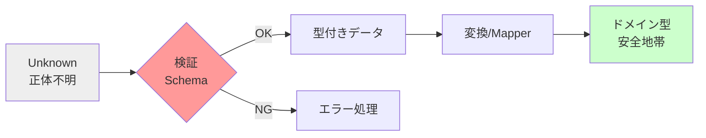

# 第14章：TSならでは① “型と実行時は別物”を理解する🧠⚠️

## 14.1 今日のゴール🎯✨

この章が終わったら、これができるようになるよ〜！😊💪

* 「型があるのに壊れる」理由を説明できる🗣️💡
* **外から来るデータ**（API/JSON/Storage/フォーム）を安全に扱える🛡️📦
* **unknown → 検証 → 変換 → ドメイン型**の流れを自分で作れる🔁✨

---

## 14.2 まず結論：TypeScriptの“型”は実行時に消える👻🫥


TypeScriptは **実行するときはJavaScript** になるよね？
そのとき、**型注釈は消える**＝実行時に守ってくれないの🥲

* 型注釈は消える（出力JSに残らない）🫥 ([TypeScript][1])
* `as`（型アサーション）も消えるから、間違ってても実行時に怒ってくれない🙃 ([TypeScript][2])

なので…👇
**「型があるから安全」じゃなくて「型＋実行時チェックがあるから安全」**だよ🛡️✨

---

## 14.3 “事故が起きる場所”はだいたい決まってる🚨📍


型が効かない危険ゾーンはここ！👀💦

* 🌐 APIレスポンス（`fetch().json()`）
* 🧾 `JSON.parse()`（ファイル読み込みも同じ）
* 💾 `localStorage` / `sessionStorage`
* 📝 フォーム入力（文字列で来がち）
* 🔗 URLクエリ（`?page=1` みたいなやつ）
* 🧩 外部SDK/プラグインが返すデータ

共通点はこれ👇
**「中身が本当にその形か、実行時に確かめないといけない」**📦🧠

---

## 14.4 安全ルートはこれだけ覚えればOK！🛣️✨


### ✅ 正しい流れ（黄金ルート）🥇

1. 外部入力は **unknown** として受け取る📦
2. **スキーマ検証**（または型ガード）でチェック🧪
3. **ドメイン型に変換**（必要なら整形・正規化）🧼
4. 以降の中心ロジックは **“確かな型”だけ**で動かす🧠✨

この流れができると、「中心ロジックが軽い」「変更が怖くない」に直結するよ〜🎀💪



---

## 14.5 代表的なやり方 3つ🧰✨


### ① スキーマバリデーション（いちばん実務向き）🛡️✅

最近は **Zod v4** が安定版で、機能追加も活発だよ📈✨ ([Zod][3])

* 書いたスキーマからTS型を推論してくれる（重複しにくい）🧠
* 失敗時のエラーが取りやすい🧾
* `safeParse` が超便利👍

Valibotも「TSの型は実行されないけど、スキーマは実行できる」って思想がはっきりしてて良いよ〜🧩✨ ([GitHub][4])

### ② 型ガード（小さいチェックに強い）🕵️‍♀️✅

ちょっとした `typeof` / `in` / `Array.isArray` で守る方法✨
ただし **複雑なオブジェクト**になると書くのが大変💦

### ③ “変換器”を必ず通す（Mapper）🧼🔁

検証済みデータでも、

* 日付文字列 → `Date`
* 通貨 → `Money`
* ID → `TodoId`
  みたいに「アプリ内で扱いやすい形」に変換するのが強い💪✨

---

## 14.6 ハンズオン🛠️：APIレスポンス（未知）→検証→ドメイン型へ🔁✨

ここからは **Zod v4** でやってみよ〜😊🧪
題材は「ToDo一覧を取ってくる」感じでいくね✅📚

### 14.6.1 依存追加📦

```powershell
npm i zod@latest
```

---

### 14.6.2 フォルダ構成（迷子防止）📁🧭

* `domain`：アプリの中心の型・ルール💎
* `infra`：API通信など外側🌐
* `mapper`：外→内の変換係🧼
* `usecase`：やりたいこと（手順）🎬

---

### 14.6.3 domain：ドメイン型を作る💎✨


```ts
// src/domain/todo.ts
export type TodoId = string & { readonly __brand: "TodoId" };

export type Todo = {
  id: TodoId;
  title: string;
  done: boolean;
  // 例：APIは文字列で返すけど、アプリ内はDateに寄せたい
  dueAt: Date | null;
};

// 入口を絞るのがコツ✨（変換はここからしか通さない）
export function toTodoId(value: string): TodoId {
  return value as TodoId;
}
```

---

### 14.6.4 infra：APIから来る“生データ”は unknown 扱い📦⚠️

```ts
// src/infra/todoApi.ts
export async function fetchTodosJson(): Promise<unknown> {
  const res = await fetch("https://example.com/api/todos");

  // ここ大事！ json() の戻りは “信用しない” 👻
  const data: unknown = await res.json();
  return data;
}
```

---

### 14.6.5 schema：Zodで“実行時に”形を検証する🧪🛡️


```ts
// src/infra/todoSchema.ts
import { z } from "zod";

export const TodoApiSchema = z.object({
  id: z.string(),
  title: z.string(),
  done: z.boolean(),
  // 文字列 or null を許可（API側の都合をそのまま受ける）
  dueAt: z.string().datetime().nullable(),
});

export const TodosApiSchema = z.array(TodoApiSchema);

export type TodoApi = z.infer<typeof TodoApiSchema>;
```

ポイント🧠✨

* **APIの形はAPIの形として**スキーマを作る（無理にドメインに合わせない）👍
* `datetime()` みたいな実行時チェックが効くのが強い🛡️

---

### 14.6.6 mapper：検証済み→ドメイン型へ変換🧼💎


```ts
// src/mapper/todoMapper.ts
import type { TodoApi } from "../infra/todoSchema";
import { toTodoId, type Todo } from "../domain/todo";

export function toTodoDomain(api: TodoApi): Todo {
  return {
    id: toTodoId(api.id),
    title: api.title.trim(),
    done: api.done,
    dueAt: api.dueAt ? new Date(api.dueAt) : null,
  };
}
```

ここが“安心ポイント”😊✨

* APIが変でも **この前に検証がある**から変換が素直に書ける👍
* `trim()` とか正規化もここでやると、中心がスッキリ🧹

---

### 14.6.7 usecase：unknown → 検証 → 変換 の一本化🎬✅

```ts
// src/usecase/getTodos.ts
import { fetchTodosJson } from "../infra/todoApi";
import { TodosApiSchema } from "../infra/todoSchema";
import { toTodoDomain } from "../mapper/todoMapper";
import type { Todo } from "../domain/todo";

export type GetTodosResult =
  | { ok: true; todos: Todo[] }
  | { ok: false; message: string };

export async function getTodos(): Promise<GetTodosResult> {
  const raw = await fetchTodosJson();

  // 失敗してもthrowしない方がUIで扱いやすいよ🙂✨
  const parsed = TodosApiSchema.safeParse(raw);

  if (!parsed.success) {
    return {
      ok: false,
      message: "データ形式が想定と違ったよ🥲（APIレスポンスを確認してね）",
    };
  }

  const todos = parsed.data.map(toTodoDomain);
  return { ok: true, todos };
}
```

---

## 14.7 “やっちゃダメ集”🚫😱（超あるある）

### ❌ `as` で握りつぶす

```ts
const data = (await res.json()) as { id: string; title: string };
```

これ、**実行時に何も確認してない**から、壊れるときは盛大に壊れる💥
`as` は「変換」じゃなくて「黙らせ」だよ🙃 ([TypeScript][2])

### ❌ `any` に逃げる

逃げた瞬間から、型の恩恵が消えてデバッグ地獄になりがち😵‍💫

### ❌ “中心ロジック”で検証を始める

中心が汚れていく…🍲💦
検証は **境界（入口）**でやるのがキレイ✨

---

## 14.8 AI活用プロンプト🤖✨（この章のやつ）

### 1) 壊れ方を想定して検証項目を列挙🧠🧾

「この入力データ、壊れ方（欠損/型違い）を想定して検証項目を列挙して」🤖

おすすめの追い質問💡

* 「“最悪の壊れ方TOP10”を想定して、Zodスキーマ案も出して」🛡️
* 「その検証が必要な理由も一言で」📝

---

## 14.9 ミニ理解チェック🧠✅（3問クイズ）

1. `as User` を書いたら、実行時にUserチェックが走る？👀
2. `fetch().json()` の戻りを “unknown” にするメリットは？📦
3. 検証（schema validation）はどこでやるのが自然？🚪

答え🎀

1. 走らない（型は消える）👻 ([TypeScript][2])
2. 「信用しない」設計になって、境界で守れる🛡️
3. アプリの入口・境界（infra→usecaseに渡す前）✅

---

## 14.10 今どきTSまわり小ネタ📰✨（知ってると嬉しい）

* TypeScript 5.9 がリリースされていて、次の 6.0 は 7.0（ネイティブ移行）への“橋渡し”という位置づけが語られてるよ🧱➡️🚀 ([Microsoft for Developers][5])
* コンパイラや言語サービスのネイティブ化（プレビュー）も進んでるよ⚡ ([Microsoft for Developers][6])

（でもこの章の結論は変わらない：**型は実行時に守ってくれない**！👻）

---

## まとめ🎉✨

* **型は開発中の味方**、でも **実行時の警備員ではない**👮‍♀️❌
* 外部入力は **unknown → 検証 → 変換 → ドメイン** が最強ルート🛡️🔁
* スキーマ検証（Zod/Valibotなど）＋Mapperで、中心ロジックがめちゃくちゃキレイになるよ〜💎✨ ([Zod][3])

[1]: https://www.typescriptlang.org/docs/handbook/2/basic-types.html?utm_source=chatgpt.com "TypeScript: Documentation - The Basics"
[2]: https://www.typescriptlang.org/docs/handbook/2/everyday-types.html?utm_source=chatgpt.com "Documentation - Everyday Types"
[3]: https://zod.dev/v4?utm_source=chatgpt.com "Release notes"
[4]: https://github.com/open-circle/valibot?utm_source=chatgpt.com "open-circle/valibot: The modular and type safe schema ..."
[5]: https://devblogs.microsoft.com/typescript/announcing-typescript-5-9/?utm_source=chatgpt.com "Announcing TypeScript 5.9"
[6]: https://devblogs.microsoft.com/typescript/announcing-typescript-native-previews/?utm_source=chatgpt.com "Announcing TypeScript Native Previews"
