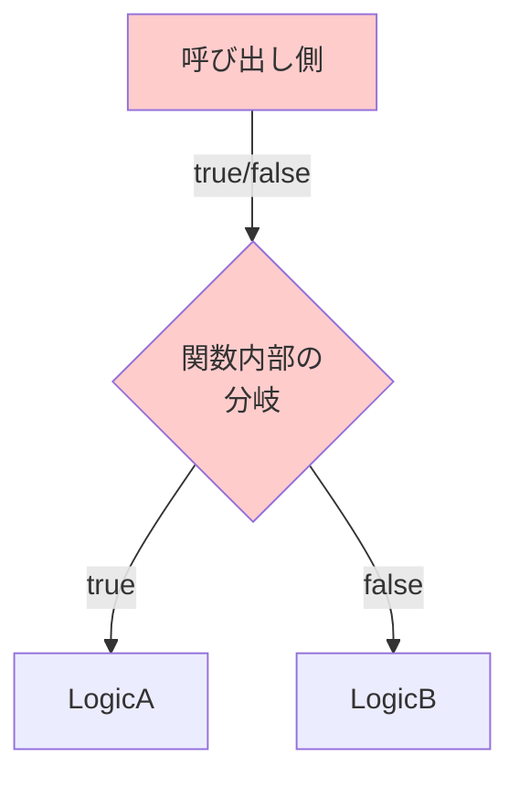

# 第15章：結合の罠① フラグ引数＆“文字列で指示”問題🚩🔤💦

### この章のゴール🎯

* 「`true/false` で挙動が変わる関数」や「`"admin"` みたいな文字列の直書き」が、なぜ設計を壊しやすいか説明できる😤✨
* TypeScriptらしく **判別可能Union（discriminated union）** で、安全＆変更に強い分岐にリファクタできる🧩✅
* 「追加仕様が来ても、壊れにくい」分岐の作り方（網羅チェック🔥）を身につける💪

※ちなみに、TypeScriptは **5.9.3 が Latest** になってます（GitHub Releases上）🆕✨ ([GitHub][1])

---

## 15.1 まずは“事故りやすいコード”を見てみよ😱

こんなコード、見覚えあるかも…！👀💦

```ts
// 😱 悪い例：フラグ引数 + 文字列で指示（stringly-typed）
export function renderPrice(
  yen: number,
  isAdmin: boolean,
  mode: string // "simple" / "detail" / "debug" ...のつもり
): string {
  let base = yen;

  // 🚩 フラグで挙動がガラッと変わる
  if (isAdmin) {
    base = Math.floor(yen * 0.9); // 管理者は割引…のつもり
  }

  // 🔤 文字列で指示（typoで死ぬ）
  if (mode === "simple") return `${base}円`;
  if (mode === "detail") return `合計: ${base}円（税込）`;
  if (mode === "debug") return `[DEBUG] price=${base}`;

  // ここが地獄：何が正しい mode なのか分からない😇
  return `${base}円`;
}
```

呼び出し側もこんな感じになりがち👇

```ts
renderPrice(1200, true, "detial"); // 😱 typo（detailのつもり）
renderPrice(1200, false, "simple");
```

---

## 15.2 何がまずいの？（結合が強くなる理由）🔗💥


### 🚩 フラグ引数がまずい理由

Martin Fowlerが「**Flag Argument**（フラグ引数）」を **“引数で別の処理をさせる匂い”** として説明してます。つまり「1つの関数が、実質2つ以上の仕事をしてる」状態になりやすいんだよね🍲💦 ([martinfowler.com][2])

* 呼び出し側が「中の分岐」を知ってないと使えない（= 結合UP）🔗
* `true` の意味が読み取れない（レビューで事故る）😵‍💫
* 分岐が増えるたびに、関数も呼び出しも複雑化する🕸️

さらにリファクタリングの定番として **“Remove Flag Argument”**（フラグ引数をやめよう）というカタログもあるよ📚✨ ([refactoring.com][3])



### 🔤 “文字列で指示”がまずい理由（stringly-typed）

“stringly typed” は「本当は型で表せるのに、文字列に寄せすぎてツラい」っていう皮肉な用語だよ😇
Jeff Atwood（Coding Horror）も「文字列に頼りすぎる実装」を例つきで説明してるよ🧯 ([Coding Horror][4])

* typoがコンパイルで防げない（実行してから気づく）😱
* どこで使われてるか追いづらい（検索祭り）🔎💦
* “追加”のたびに文字列が散らばって、仕様が分裂する💥

---

## 15.3 まずは“軽い改善”3択🧸✨（でも最終的にはUnionが強い）

### 改善①：関数を分ける✂️

「そもそも別の仕事なら、関数を分ける」✨

```ts
export const renderPriceForAdmin = (yen: number) => `${Math.floor(yen * 0.9)}円`;
export const renderPriceForUser  = (yen: number) => `${yen}円`;
```

✅ シンプル！
⚠️ ただし “mode” が増えると関数爆発しがち💣

---

### 改善②：booleanを“名前付き”にする（最小の読みやすさUP）🏷️

```ts
renderPrice(1200, /* isAdmin */ true, "detail");
```

✅ 事故が減る
⚠️ でも本質は変わってない（分岐の責務混在🍲）

---

### 改善③：ここからが本命！判別可能Unionにする🧩🔥

TypeScriptは **Union型** と **絞り込み（narrowing）** が得意！ ([TypeScript][5])
さらに **判別可能Union** は公式ドキュメントでも定番のやり方として紹介されてるよ✨ ([TypeScript][6])

---

## 15.4 判別可能Unionで“安全な分岐”に作り替えよう🛠️✨


### ✅ Step1：mode を「許可リストの型」にする

```ts
type Mode =
  | { kind: "simple" }
  | { kind: "detail" }
  | { kind: "debug" };
```

### ✅ Step2：admin/user を boolean じゃなく “意図が見える形” にする

```ts
type Viewer =
  | { role: "admin" }
  | { role: "user" };
```

### ✅ Step3：引数を “1つの命令” としてまとめる🎁

```ts
type RenderPriceCommand = {
  yen: number;
  viewer: Viewer;
  mode: Mode;
};
```

### ✅ Step4：switchで分岐（TSが勝手に絞り込んでくれる）🧠✨

```ts
export function renderPrice(cmd: RenderPriceCommand): string {
  const base =
    cmd.viewer.role === "admin" ? Math.floor(cmd.yen * 0.9) : cmd.yen;

  switch (cmd.mode.kind) {
    case "simple":
      return `${base}円`;

    case "detail":
      return `合計: ${base}円（税込）`;

    case "debug":
      return `[DEBUG] price=${base}`;

    default:
      return assertNever(cmd.mode); // 🔥 網羅チェック
  }
}

function assertNever(x: never): never {
  throw new Error(`Unexpected: ${JSON.stringify(x)}`);
}
```

これの何が嬉しいかというと…👇😍

* `"detial"` みたいなtypoが **そもそも書けない** ✅
* modeを追加したら `switch` の `default: assertNever` で **未対応が即バレ** 🔥
* 呼び出し側が “意味不明なtrue” を渡さなくてよくなる🎉

呼び出しもこうなる👇（読みやすい〜！💞）

```ts
renderPrice({
  yen: 1200,
  viewer: { role: "admin" },
  mode: { kind: "detail" },
});
```

---

## 15.5 文字列直書き問題の“現実的な入口”🚪🔤

「でもさ…外部入力（URLクエリとか）って文字列で来るよね？」←これ超あるある😤

大事なのはこれ👇
**外から来た文字列は、境界で“安全な型”に変換してから中へ入れる**🛡️✨

```ts
type ModeKind = Mode["kind"];

export function parseMode(input: string): Mode {
  switch (input) {
    case "simple":
      return { kind: "simple" };
    case "detail":
      return { kind: "detail" };
    case "debug":
      return { kind: "debug" };
    default:
      return { kind: "simple" }; // 迷ったら安全側へ🍀（またはエラー）
  }
}
```

---

## 15.6 ありがちな落とし穴と、判断ルール🧠💡

### 🚩 フラグ引数を“ほぼ確実にやめたい”サイン

* `true` の意味をコメントしないと分からない😵‍💫
* `if (flag)` の中で **処理内容が別物**（別機能っぽい）🍲
* フラグが増えた（`isAdmin, isDebug, isShort, ...`）😇

### 🔤 文字列で指示を“やめたい”サイン

* `"admin"` が複数ファイルに散ってる🕸️
* タイプミスが怖くてテストに頼ってる😱
* 仕様追加のたびに `if (mode === "...")` が増殖する👾

---

## 15.7 ハンズオン🛠️：フラグ＆文字列を卒業しよ🎓✨

### お題📌

さっきの `renderPrice(yen, isAdmin, mode)` を、次の条件で直してね👇

1. 引数は **1つのオブジェクト**にする🎁
2. `isAdmin: boolean` をやめて、`viewer.role` にする👀
3. `mode: string` をやめて、`mode.kind` の Union にする🧩
4. modeを1個追加（例：`"compact"`）して、**網羅チェックが効く**のを確認する🔥

### 仕上げの確認✅

* `"detial"` を書こうとしてコンパイルで止まる？🧯
* `"compact"` を追加したのに `switch` が未対応だと怒られる？😆

---

## 15.8 まとめチェックリスト🧾✨（レビューで使える！）

* [ ] 引数の `boolean` が「処理の種類」を切り替えてない？🚩
* [ ] `"string"` で命令してない？（typoで死ぬやつ）🔤💦
* [ ] Union + `switch` で分岐して、`never` 網羅チェックしてる？🔥
* [ ] 外部入力の文字列は、境界で型に変換してる？🛡️

---

## 15.9 AIプロンプト（この章の1〜2本）🤖💞

1. 🚩→🧩 変換用
   「この関数の boolean フラグ引数と string 指示をやめて、判別可能Union（discriminated union）に置き換える設計案を出して。型定義・関数シグネチャ・呼び出し例までセットで」

2. 🔥 網羅チェック強化用
   「Unionで分岐している switch が“追加に弱い”状態になってない？never網羅チェックや、漏れが起きるパターンを指摘して改善案を出して」

---

次の第16章は、ここで作った「安全な型」を **“モジュール境界”** としてどう守るか（公開面を絞る／importルール）に繋がるよ📁🔒✨

[1]: https://github.com/microsoft/typescript/releases "Releases · microsoft/TypeScript · GitHub"
[2]: https://martinfowler.com/bliki/FlagArgument.html?utm_source=chatgpt.com "Flag Argument"
[3]: https://refactoring.com/catalog/removeFlagArgument.html?utm_source=chatgpt.com "Remove Flag Argument - Refactoring"
[4]: https://blog.codinghorror.com/new-programming-jargon/?utm_source=chatgpt.com "New Programming Jargon"
[5]: https://www.typescriptlang.org/docs/handbook/unions-and-intersections.html?utm_source=chatgpt.com "Handbook - Unions and Intersection Types"
[6]: https://www.typescriptlang.org/docs/handbook/typescript-in-5-minutes-func.html?utm_source=chatgpt.com "Documentation - TypeScript for Functional Programmers"
