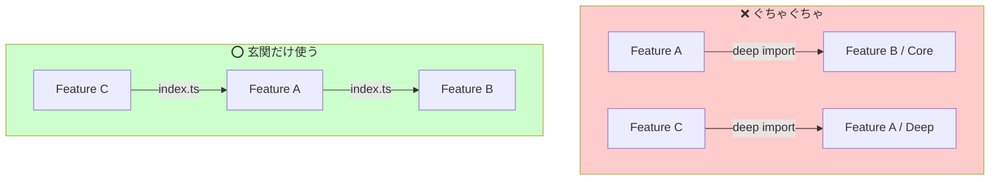

# 第16章：モジュール境界（公開面を絞る＆importルール）📁🔒✨

## この章のゴール🎯

* 「このフォルダ（モジュール）の外から触っていい場所」を**1〜数個に絞る**🚪✨
* うっかり “奥のファイル” を直接 import しちゃう事故（深い import）を**ルールで防ぐ**🧱
* 循環依存（circular deps）を**作りにくく＆見つけやすく**する👀🔁

---

## 0) ちょい最新メモ🗞️✨

* TypeScript の安定版は **5.9.3** が「latest」扱いだよ（npm上）📌 ([npm][1])
* それとは別に、**TypeScript Native Preview（tsgo）** みたいな “次世代コンパイラ” のプレビューも進んでるよ（将来 TS 7 につながる流れ）🚀 ([Microsoft for Developers][2])

この章の内容は、こういう進化が来ても崩れにくい「構造の守り」を作る話だよ〜😊🛡️

---

## 1) なんで「境界」が必要なの？🥺👉💥


コードが増えると、だいたいこうなるの👇

* A機能が、B機能の “奥の奥” のファイルを直接 import しはじめる🕳️
* すると B側で整理（リファクタ）した瞬間、Aが壊れる😱
* しかも「どこが公式な入口なの？」が分からなくて、みんな好き勝手に触る🍲💦

だからやりたいのはこれ👇

> **モジュールごとに “玄関” を作って、外部は玄関だけ使う**🏠🚪✨
> 玄関の外からは、部屋の引き出しを勝手に開けない！みたいな感じ🧸🔒



---

## 2) 今日覚えるキーワード📚✨


* **公開面（Public API）**：外部が触っていい “玄関” 🚪
* **内部（Internal）**：モジュール内でだけ使う “部屋の中” 🛋️
* **深い import（Deep import）**：`features/todo/usecase/...` みたいに奥まで直 import するやつ🕳️
* **barrel（index.ts）**：玄関として export をまとめるファイル📦
* **循環依存**：A→B→A みたいな “ぐるぐる” 🔁😵

---

## 3) 境界づくり：まずは黄金ルール3つ🌟

### ルール①：外から触っていいのは「玄関だけ」🚪✨

例：`src/features/todo/index.ts` だけ公開。
他のファイルは **外部から直接 import 禁止**🙅‍♀️

### ルール②：内部は内部で自由にやってOK🧩

`todo` モジュール内では `usecase` や `domain` を好きに import してOK👌
でも **外からは触らせない**のが大事！

### ルール③：循環依存は “検知して止める” 🛑🔁

「気をつけよう」だけだと絶対漏れるから、ツールで見張る👀✨
（後でやるよ！）

---

## 4) まずは形を決めよう：おすすめフォルダの型🧱📁


「モジュール＝フォルダ」でOK。たとえばこんな感じ👇

```txt
src/
  features/
    todo/
      index.ts          ← ここが玄関（公開面）🚪
      ui/
      usecase/
      domain/
      infra/
      _internal/        ← “絶対に外から触らない部屋” 🚫
  shared/
    index.ts
```

ポイント💡

* `index.ts` は “外から使っていいものだけ” を出す✨
* `_internal` みたいに「触るな感」を出すと、心理的にも抑止力あるよ😂🔒

---

## 5) 公開面（index.ts）の作り方：細く、強く🦴✨


### ✅ 良い index.ts（必要最小限だけ出す）

```ts
// src/features/todo/index.ts
export { createTodo } from "./usecase/createTodo";
export { completeTodo } from "./usecase/completeTodo";

export type { Todo } from "./domain/Todo";
export type { TodoId } from "./domain/TodoId";
```

* **使ってほしい関数**だけ export ✅
* 型は `export type` を使うと、実行時の import を増やしにくい（＝循環の火種を減らす）🧯✨

### ❌ ちょい危険な index.ts（雑に全部出す）

```ts
// src/features/todo/index.ts
export * from "./usecase";
export * from "./domain";
export * from "./infra";
```

これ、最初は楽なんだけど…

* “何が公開か” がぼやける🫥
* 後から整理したい時に壊れやすい💥
* barrel の連鎖で循環依存の温床になりがち😵（実例もいろいろ報告されがち） ([GitHub][3])

**おすすめ**：`export *` は基本封印して、**明示 export** に寄せよ〜✍️✨

---

## 6) import ルールを「人の気合い」から「自動」にする🤖🧱✨


ここが超大事！
ルールを決めたら、**破った瞬間に赤くなる**ようにするよ🔴😎

### 6-1) ESLint は “Flat Config” が標準路線🧰✨

ESLint v9 から `eslint.config.js`（Flat Config）が **デフォルト**になってるよ📌 ([ESLint][4])
（今後もこの形が中心になっていく流れだね） ([ESLint][5])

### 6-2) “境界” を守る：eslint-plugin-boundaries 🧱

`eslint-plugin-boundaries` は、フォルダを「要素（element）」として扱って
「どこからどこへ import していいか」をルール化できるやつだよ✨ ([GitHub][6])

#### 例：features の “玄関以外” を外から触れないようにする

※雰囲気がつかめる形にしてるよ（プロジェクトに合わせて調整してね）😊

```js
// eslint.config.mjs（例）
import boundaries from "eslint-plugin-boundaries";
import importPlugin from "eslint-plugin-import";

export default [
  {
    plugins: {
      boundaries,
      import: importPlugin,
    },
    settings: {
      "boundaries/elements": [
        { type: "feature", pattern: "src/features/*" },
        { type: "shared", pattern: "src/shared" },
      ],
    },
    rules: {
      // ✅ どの要素がどこへ依存していいか
      "boundaries/element-types": [2, {
        default: "disallow",
        rules: [
          { from: ["feature"], allow: ["shared"] },
          { from: ["feature"], allow: ["feature"] }, // feature同士は “玄関経由” にしたいので後で縛る
        ],
      }],

      // ✅ “玄関” を強制（entry point 以外から import させない）
      // 例：feature は index.ts だけを入口にする、みたいな発想
      "boundaries/entry-point": [2, {
        default: "disallow",
        rules: [
          {
            target: ["feature"],
            entryPoint: "src/features/*/index.ts",
          },
        ],
      }],

      // ✅ “private（内部）” を外から触るの禁止（_internal など）
      "boundaries/no-private": [2, {
        default: "allow",
        rules: [
          {
            target: ["feature"],
            private: ["src/features/*/_internal/**"],
          },
        ],
      }],
    },
  },
];
```

* `entry-point` と `no-private` は「玄関だけ使ってね」「立入禁止に入らないでね」を自動化できるのが強い✨ ([JS Boundaries][7])

> コツ💡：最初から完璧ルールにしないで、**まず “目立つ事故” を止める**ところからでOKだよ😊🧡

---

## 7) 循環依存を見つける（そして消す）🔁🧯


循環依存は「なぜか実行時に undefined…」みたいな事故になりがちで怖い😱
だから **検知ツール**を使うよ！

### 7-1) dependency-cruiser：ルールで循環を止められる🚓

dependency-cruiser は依存を走査して、ルール違反（循環依存など）を検出できるよ✨ ([GitHub][8])

導入の流れ（超ざっくり）👇

```sh
npm i -D dependency-cruiser
npx depcruise --init
npx depcruise src
```

### 7-2) madge：循環だけサクッと見たい時に便利🧭

madge は依存グラフ生成＆循環検出ができるツールだよ🔍 ([GitHub][9])

```sh
npm i -D madge
npx madge --circular src
```

---

## 8) さらに強い “公開面ロック”：package.json の exports 🔒📦

もし「機能をパッケージとして分ける（モノレポ/ライブラリ）」なら、
Node の `package.json` の **exports** で “公開入口以外は見せない” ができるよ✨ ([Node.js][10])

* `exports` を導入すると、定義してない入口（＝内部ファイル）へアクセスできなくなる
  → **深い import を物理的に封鎖**できる感じ🔒 ([Node.js][10])

（ただし導入は breaking change になり得るから、公開ライブラリでやるなら慎重にね🙏） ([Node.js][10])

---

## 9) ハンズオン🛠️：Todo モジュールに「玄関ルール」を入れる✅🚪

### Step 1：外部が使うものを決める🎯

* `createTodo`
* `completeTodo`
* `Todo` 型
* `TodoId` 型

### Step 2：index.ts に “明示 export” で並べる📦

（上の「良い index.ts」みたいに）

### Step 3：アプリ側の import を全部 “玄関経由” に直す🔁

```ts
// ❌ 深い import（禁止にしたい）
import { createTodo } from "../features/todo/usecase/createTodo";

// ✅ 玄関 import
import { createTodo } from "../features/todo";
```

### Step 4：_internal に隠したいものを移動🧳

「まだ触ってほしくない」「実験中」みたいなやつは `_internal` に入れて、外部アクセスを禁止🚫

### Step 5：ESLint で “破ったら怒る” を作る🔴

境界プラグインを入れて、違反 import が出たらエラーにする✨ ([JS Boundaries][7])

---

## 10) AIプロンプト（この章用）🤖📝✨

### 使うプロンプト①（境界設計を一緒に考える）

「このフォルダ構造、公開面を絞るなら“外から触っていいファイル”はどれ？
それ以外を internal 扱いにして、入口（index.ts）案を出して！」

### 使うプロンプト②（ルール化の抜け漏れチェック）

「deep import が起きそうな箇所を列挙して、禁止ルール（ESLint か depcruise）に落とすならどう書く？」

AIは “候補出し” が得意だから、**最後は自分で「責務混在」「依存増加」チェック**して採用/保留/却下しよ〜😊💪

---

## まとめ🎉（今日のチェックリスト✅）

* [ ] 各モジュールに **玄関（index.ts）** がある🚪
* [ ] 外部は **玄関 import だけ**してる🔒
* [ ] `_internal`（立入禁止）を作って守れてる🚫
* [ ] ESLint で **境界違反が赤くなる**🔴 ([ESLint][4])
* [ ] 循環依存を **検知できる状態**になってる🔁👀 ([GitHub][8])

---

次の章（総まとめミニプロジェクト）に行くと、ここで作った「境界ルール」がめちゃくちゃ効いてくるよ〜！💪🎉

[1]: https://www.npmjs.com/package/typescript?utm_source=chatgpt.com "typescript"
[2]: https://devblogs.microsoft.com/typescript/announcing-typescript-native-previews/ "Announcing TypeScript Native Previews - TypeScript"
[3]: https://github.com/angular/angular/issues/52251?utm_source=chatgpt.com "[BUG?] Undefined Import when barrel-rolling (circular- ..."
[4]: https://eslint.org/docs/latest/use/migrate-to-9.0.0?utm_source=chatgpt.com "Migrate to v9.x - ESLint - Pluggable JavaScript Linter"
[5]: https://eslint.org/blog/2025/11/eslint-v10.0.0-alpha.0-released/?utm_source=chatgpt.com "ESLint v10.0.0-alpha.0 released"
[6]: https://github.com/javierbrea/eslint-plugin-boundaries "GitHub - javierbrea/eslint-plugin-boundaries: Eslint plugin checking architecture boundaries between elements"
[7]: https://www.jsboundaries.dev/docs/rules/entry-point/ "Rule entry-point | JS Boundaries"
[8]: https://github.com/sverweij/dependency-cruiser "GitHub - sverweij/dependency-cruiser: Validate and visualize dependencies. Your rules. JavaScript, TypeScript, CoffeeScript. ES6, CommonJS, AMD."
[9]: https://github.com/pahen/madge "GitHub - pahen/madge: Create graphs from your CommonJS, AMD or ES6 module dependencies"
[10]: https://nodejs.org/api/packages.html?utm_source=chatgpt.com "Modules: Packages | Node.js v25.2.1 Documentation"
