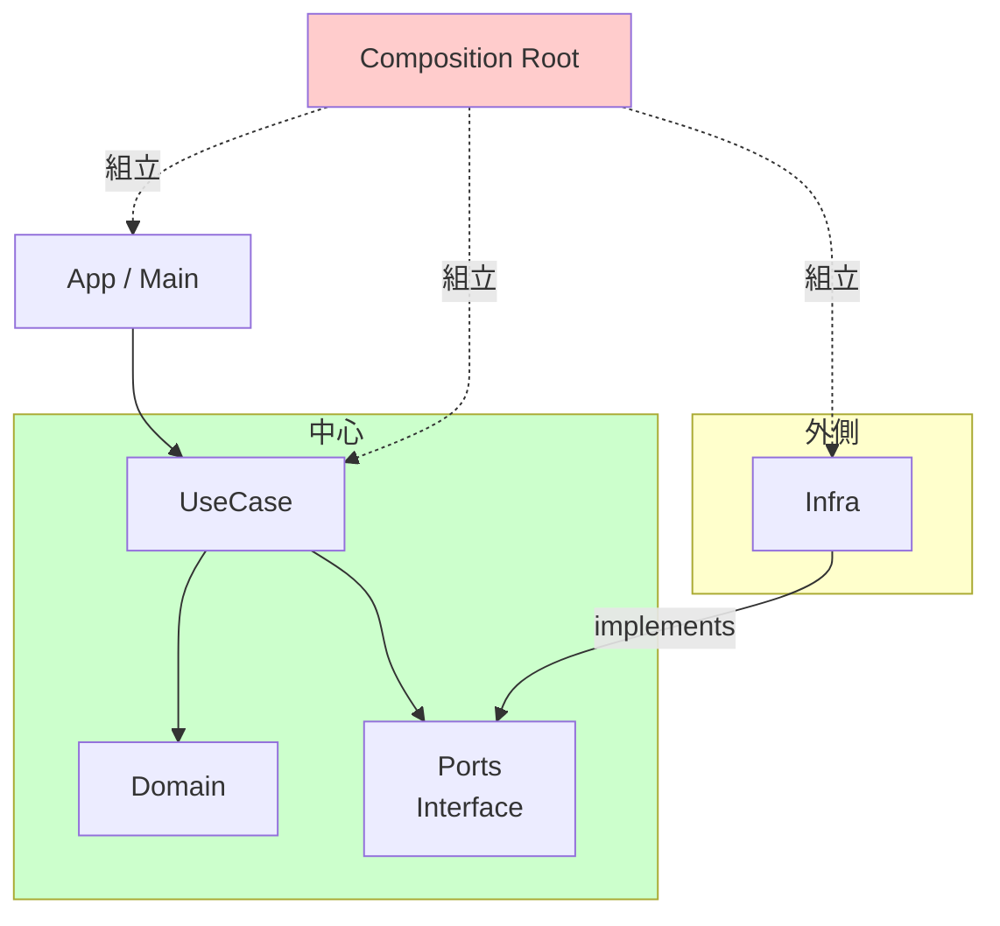

# 第17章：総まとめミニプロジェクト（設計→実装→最小テスト）💪🎉

題材は **「ToDo＋締切通知✅⏰」** で進めるよ〜！（他の題材でも同じ型で作れるようにしてあるよ🧩）

---

# この章でできるようになること🎯✨

* 「高凝集＝同じ理由で変わるものが近い」「低結合＝差し替えやすい」を **ミニアプリで再現**できるようになる🙌
* **設計（境界・依存矢印・公開API）→ 実装 → 最小テスト** の流れを体に入れる🧠💡
* “変更が来ても壊れにくい”構造の作り方がわかる🔧✨

※最新状況メモ：TypeScript は **5.9 のリリースノートが 2026-01-12 更新**になってるよ（＝今の最新系の流れの目安にできる） ([TypeScript][1])
Node.js は **24系が LTS（Krypton）** に入ってるよ ([Node.js][2])
テストは **Vitest 4.0** が現行メジャーとして定着してるよ ([vitest.dev][3])
（TypeScript 7 のネイティブ化は進行中・プレビューも出てるけど、教材の本体は “今すぐ安定運用できる型” を優先するね🧡） ([Microsoft Developer][4])

---

# 17A：設計だけ（責務・依存矢印・公開API）🗺️🔗🔒

## 1) 要件を “小さく” 固める✅📝

今回は最小でこれだけにするよ（増やすのは後でOK！）✨

* ToDoを追加する ➕
* 一覧を見る 📋
* 完了にする ✅
* 締切が近いToDoをチェックして「通知する」🔔（最初はコンソールでOK！）

### 壊れやすい（＝テスト価値が高い）ルール候補💥

* 「締切が **24時間以内** のものだけ通知」⏳
* 「完了済みは通知しない」🙅‍♀️
* 「締切が未設定のものは通知しない」🫥

---

## 2) “変更理由” を先に出す🧠✨（境界を引く材料）

このアプリ、将来どこが変わりそう？を先にメモるよ📝

* 画面（CLI → GUI → Web）変えたい🖥️➡️🌐
* 保存先（JSONファイル → SQLite → API）変えたい💾➡️🗄️➡️☁️
* 通知方法（console → Windows通知 → メール）変えたい🔔➡️📣➡️✉️
* 「締切が近い」の定義（24h → 3日）変えたい⏱️
* 時刻の取得（Date.now直呼びはやめたい）⏰⚠️

👉 だから、**UI / UseCase / 外部I/O / ルール（ドメイン）** を分けるのが勝ちやすいよ〜！🏆✨

---

## 3) モジュール分割（責務）📦✨


ここが今回の “完成形” の地図🗺️

### レイヤーの役割（超ざっくり）

* **domain**：ToDoの型とルール（純粋）🧠
* **ports**：外部の入口（契約）📜
* **usecase**：やりたいこと（アプリの中心）🎯
* **infra**：ファイル保存・現在時刻・通知など（外側）🧱
* **app**：CLIのコマンド解釈（入口）🚪
* **composition**：依存を組み立てる場所（Composition Root）🏗️

### 依存の矢印（大事！）➡️

* domain ← どこにも依存しない🥇
* usecase → domain & ports
* infra → ports（implements）
* app → usecase（を呼ぶだけ）
* composition → 全部を組み立てる

イメージ：
`app → usecase → (domain + ports) ← infra`
`composition` が最後に “合体” させる💍✨



---

## 4) 公開APIを絞る（第16章の復習）🔒✨

各フォルダに **入口（index.ts）** を作って、外からはそこだけ触らせるのがコツだよ〜！🚪💕

例：

* `src/domain/index.ts` だけ公開
* `src/usecase/index.ts` だけ公開
* `src/infra/index.ts` だけ公開（でも app からは直接触らない、composition だけが触る🎀）

---

## 5) フォルダ構成案（今回のおすすめ）📁🧭

```text
src/
  domain/
    task.ts
    dueDate.ts
    index.ts
  ports/
    taskRepository.ts
    clock.ts
    notifier.ts
    index.ts
  usecase/
    addTask.ts
    listTasks.ts
    completeTask.ts
    notifyDueTasks.ts
    index.ts
  infra/
    fileTaskRepository.ts
    systemClock.ts
    consoleNotifier.ts
    index.ts
  app/
    cli.ts
  composition/
    root.ts
```

---

## 6) 設計チェック（採用/保留/却下の観点）✅🧠

* usecase が `fs` を import してたら **却下** 🙅‍♀️
* domain が `Date.now()` を呼んでたら **保留**（Clockに寄せたい）🤔
* app が “ルール” を持ち始めたら **却下**（usecaseへ）🧯

---

## 17Aで使うAIプロンプト🤖💬

1. 「この要件（ToDo＋締切通知）を、domain/ports/usecase/infra/app/composition に分解して、責務混在が起きそうな点TOP5も教えて」
2. 「この分割で循環importが起きそうな箇所ある？フォルダ配置の注意点も」

---

---

# 17B：実装（usecase中心、I/Oは外側）🛠️✨

ここからは “小さく動く” を最短で作るよ🏃‍♀️💨
（通知は最初コンソールでOK！後でWindows通知に差し替えられるように作るのが目的🎯）

## 1) ports（契約）を先に作る📜✨

```ts
// src/ports/taskRepository.ts
import { Task } from "../domain/task";

export interface TaskRepository {
  list(): Promise<Task[]>;
  saveAll(tasks: Task[]): Promise<void>;
}
```

```ts
// src/ports/clock.ts
export interface Clock {
  now(): Date;
}
```

```ts
// src/ports/notifier.ts
import { Task } from "../domain/task";

export interface Notifier {
  notifyDue(tasks: Task[]): Promise<void>;
}
```

---

## 2) domain（型と小さなルール）🧠🏷️

「締切がある」「完了してる」みたいな最小の意味をここに置くよ✨

```ts
// src/domain/task.ts
export type TaskId = string;

export type Task = Readonly<{
  id: TaskId;
  title: string;
  dueAt?: string;   // ISO文字列（保存しやすさ優先）
  completed: boolean;
}>;

export const TaskFactory = {
  create(id: TaskId, title: string, dueAt?: Date): Task {
    return {
      id,
      title,
      dueAt: dueAt ? dueAt.toISOString() : undefined,
      completed: false,
    };
  },

  complete(task: Task): Task {
    return { ...task, completed: true };
  },
};
```

---

## 3) usecase（中心）🎯✨

「締切が近いToDoを集めて通知」＝壊れやすいので、ここが主役だよ🧪💕

```ts
// src/usecase/notifyDueTasks.ts
import { Task } from "../domain/task";
import { TaskRepository } from "../ports/taskRepository";
import { Clock } from "../ports/clock";
import { Notifier } from "../ports/notifier";

type Options = Readonly<{ withinHours: number }>;

export class NotifyDueTasks {
  constructor(
    private readonly repo: TaskRepository,
    private readonly clock: Clock,
    private readonly notifier: Notifier
  ) {}

  async execute(options: Options): Promise<Task[]> {
    const tasks = await this.repo.list();
    const now = this.clock.now().getTime();
    const limit = now + options.withinHours * 60 * 60 * 1000;

    const due = tasks.filter((t) => {
      if (t.completed) return false;
      if (!t.dueAt) return false;
      const dueAt = Date.parse(t.dueAt);
      return now <= dueAt && dueAt <= limit;
    });

    if (due.length > 0) {
      await this.notifier.notifyDue(due);
    }

    return due; // テストしやすいように返す🎁
  }
}
```

---

## 4) infra（外側）🧱✨：ファイル保存・現在時刻・通知

### JSONファイル保存（最小）

```ts
// src/infra/fileTaskRepository.ts
import { promises as fs } from "node:fs";
import { TaskRepository } from "../ports/taskRepository";
import { Task } from "../domain/task";

export class FileTaskRepository implements TaskRepository {
  constructor(private readonly path: string) {}

  async list(): Promise<Task[]> {
    try {
      const text = await fs.readFile(this.path, "utf-8");
      const parsed = JSON.parse(text) as unknown;
      if (!Array.isArray(parsed)) return [];
      return parsed as Task[];
    } catch {
      return [];
    }
  }

  async saveAll(tasks: Task[]): Promise<void> {
    const text = JSON.stringify(tasks, null, 2);
    await fs.writeFile(this.path, text, "utf-8");
  }
}
```

### 時刻（差し替え用）

```ts
// src/infra/systemClock.ts
import { Clock } from "../ports/clock";

export class SystemClock implements Clock {
  now(): Date {
    return new Date();
  }
}
```

### 通知（最初はconsoleでOK）

```ts
// src/infra/consoleNotifier.ts
import { Notifier } from "../ports/notifier";
import { Task } from "../domain/task";

export class ConsoleNotifier implements Notifier {
  async notifyDue(tasks: Task[]): Promise<void> {
    console.log("🔔 締切が近いToDoだよ！");
    for (const t of tasks) {
      console.log(`  ⏰ ${t.title}  (due: ${t.dueAt})`);
    }
  }
}
```

---

## 5) composition root（組み立て）🏗️✨

```ts
// src/composition/root.ts
import { FileTaskRepository } from "../infra/fileTaskRepository";
import { SystemClock } from "../infra/systemClock";
import { ConsoleNotifier } from "../infra/consoleNotifier";
import { NotifyDueTasks } from "../usecase/notifyDueTasks";

export function buildNotifyDueTasks() {
  const repo = new FileTaskRepository("tasks.json");
  const clock = new SystemClock();
  const notifier = new ConsoleNotifier();
  return new NotifyDueTasks(repo, clock, notifier);
}
```

---

## 6) app（CLI入口）🚪✨

```ts
// src/app/cli.ts
import { buildNotifyDueTasks } from "../composition/root";

async function main() {
  const cmd = process.argv[2];

  if (cmd === "notify") {
    const within = Number(process.argv[3] ?? "24");
    const uc = buildNotifyDueTasks();
    const due = await uc.execute({ withinHours: within });
    console.log(`✅ 通知対象: ${due.length}件`);
    return;
  }

  console.log("使い方:");
  console.log("  notify [withinHours]");
  console.log("例:");
  console.log("  notify 24");
}

main().catch((e) => {
  console.error("💥 エラー:", e);
  process.exit(1);
});
```

---

## 17Bで使うAIプロンプト🤖💬

1. 「この実装、usecaseが外部I/Oに依存してない？import観点で危険点TOP5」
2. 「ConsoleNotifierをWindows通知に差し替える場合、portsはそのままでinfraだけ差し替える案を出して」

---

---

# 17C：最小テスト（壊れやすい所だけでもOK）🧪✨


テストは “全部” じゃなくていいよ〜！🙆‍♀️
今回は **締切抽出ルール** を守る1本が最優先🎯

## 1) Vitestでやる（いまの主流ど真ん中）⚡

Vitest 4.0 が現行メジャーとしてまとまってるよ ([vitest.dev][3])

## 2) Fake（偽物）で差し替える🎭✨

* Repo：メモリ配列でOK
* Clock：固定時刻を返す
* Notifier：呼ばれたか覚えるだけ

```ts
// tests/notifyDueTasks.test.ts
import { describe, it, expect } from "vitest";
import { NotifyDueTasks } from "../src/usecase/notifyDueTasks";
import { TaskFactory, Task } from "../src/domain/task";
import { TaskRepository } from "../src/ports/taskRepository";
import { Clock } from "../src/ports/clock";
import { Notifier } from "../src/ports/notifier";

class InMemoryRepo implements TaskRepository {
  constructor(private tasks: Task[]) {}
  async list() { return this.tasks; }
  async saveAll(tasks: Task[]) { this.tasks = tasks; }
}

class FixedClock implements Clock {
  constructor(private readonly fixed: Date) {}
  now() { return this.fixed; }
}

class SpyNotifier implements Notifier {
  called = 0;
  last: Task[] = [];
  async notifyDue(tasks: Task[]) {
    this.called++;
    this.last = tasks;
  }
}

describe("NotifyDueTasks", () => {
  it("24時間以内 && 未完了 && dueあり のみ通知する🔔", async () => {
    const now = new Date("2026-01-13T12:00:00.000Z");
    const clock = new FixedClock(now);

    const within24h = new Date(now.getTime() + 23 * 60 * 60 * 1000);
    const after24h  = new Date(now.getTime() + 25 * 60 * 60 * 1000);

    const tasks: Task[] = [
      TaskFactory.create("1", "近い締切", within24h),
      TaskFactory.create("2", "遠い締切", after24h),
      { ...TaskFactory.create("3", "完了済み", within24h), completed: true },
      TaskFactory.create("4", "締切なし"),
    ];

    const repo = new InMemoryRepo(tasks);
    const notifier = new SpyNotifier();
    const uc = new NotifyDueTasks(repo, clock, notifier);

    const due = await uc.execute({ withinHours: 24 });

    expect(due.map((t) => t.id)).toEqual(["1"]);
    expect(notifier.called).toBe(1);
    expect(notifier.last.map((t) => t.id)).toEqual(["1"]);
  });
});
```

✅ これ1本あるだけで、AIが勢いで壊す変更をかなり止められるよ🛡️✨
（最近は “AIがテストを書いてくれる” けど、テストの強さは別問題なので、強くしたいならミューテーションテスト等の考え方も参考になるよ🧨🧪） ([Zenn][5])

---

## 17Cで使うAIプロンプト🤖💬

1. 「このusecaseのテスト、抜けてる境界ケース（同時刻、過去締切、invalid ISO等）を5つ挙げて」
2. 「Notifierが呼ばれない条件のテストも追加したい。最小で2本にするなら何が良い？」

---

# 章末まとめ：このプロジェクトが “高凝集・低結合” になってるかチェック✅🔎✨

* usecaseが `fs` / `console` / `Date.now()` を直接触ってない？（触ってたら結合強め⚠️）
* 変更理由ごとに置き場が分かれてる？（通知変更はinfraだけ、みたいに🎁）
* 公開API（index.ts）以外を外からimportしてない？（境界が守れてる🔒）
* テストが “ルール” を守ってる？（壊れやすい所に集中🧪）

---

# おまけ：伸ばしたい人向けの拡張案🌱✨（全部 “差し替え” でいけるよ）

* 通知を Windows通知にする📣（Notifier差し替えだけでOKが理想）
* 保存を SQLite にする🗄️（TaskRepository差し替え）
* CLIを React UI にする🌐（app差し替え、usecaseは温存）

---

必要なら、この第17章を “提出物セット” にして、
✅「設計メモ（依存矢印＋公開API）」テンプレ
✅「実装の空ファイル一式」
✅「最小テスト2本」
まで一気に教材パッケージにして出せるよ〜！📦💕

[1]: https://www.typescriptlang.org/docs/handbook/release-notes/typescript-5-9.html?utm_source=chatgpt.com "Documentation - TypeScript 5.9"
[2]: https://nodejs.org/en/blog/release/v24.11.0?utm_source=chatgpt.com "Node.js 24.11.0 (LTS)"
[3]: https://vitest.dev/blog/vitest-4?utm_source=chatgpt.com "Vitest 4.0 is out!"
[4]: https://developer.microsoft.com/blog/typescript-7-native-preview-in-visual-studio-2026?utm_source=chatgpt.com "TypeScript 7 native preview in Visual Studio 2026"
[5]: https://zenn.dev/nossa/articles/21e4ee7556a6ba?utm_source=chatgpt.com "ミューテーションテストでAI生成テストの品質を上げる"
