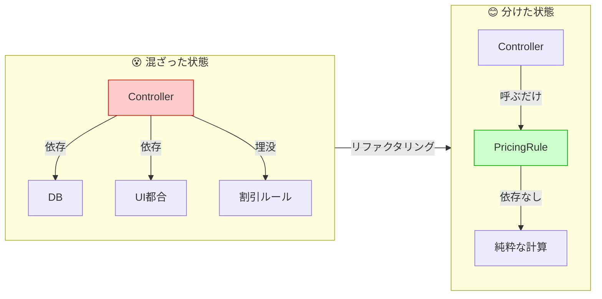

# 第01章：設計って何のため？（怖い変更を減らす）😵‍💫➡️😊


## 1. 今日のゴール🎯✨

この章で持ち帰ってほしいのは、たったこれだけ👇

* **変更が怖いのは「影響範囲が見えない」から**😱
* **守りたいのは “業務ルール”**🛡️（画面やDBより先に守る！）
* **中心を守れる形にしていくのが、ヘキサの入口**🔷🔌

「ヘキサゴナル」って聞くと難しそうだけど、最初は**“怖い変更を減らすための考え方”**として掴めばOKだよ〜😊✨

---

## 2. 変更が怖い理由（あるある）😱🍝

たとえば、こんな経験ない？👇

* ボタン1個追加しただけなのに、別の画面が壊れた😵
* DBの項目名を変えたら、なぜか注文計算がズレた😇
* どこを直せばいいか分からなくて、とりあえず検索して当てずっぽう…🔎💦

これ、ざっくり言うと👇

> **「1か所を直したはずなのに、関係ない所まで巻き込まれる」**
> → つまり **影響範囲が読めない** 🌀

影響範囲が読めないと、人はこうなる👇

* 「触るのが怖い」😵‍💫
* 「直すたびにビクビク」😖
* 「結果、保守が遅くなる」🐢💦

---

## 3. “守りたいもの”＝業務ルール（中心）🛡️❤️

ここが超大事！✨
アプリって、いろんな要素があるけど…

* 画面（UI）🖥️
* DB（保存）🗄️
* 外部API（決済/地図/通知）📡
* ログ/認証/メール…🧾✉️
  …これらは **変わりやすい** んだよね😵

でも、アプリの「魂」はこっち👇

* **注文の合計の計算**🧾
* **割引のルール**💰
* **在庫がないと注文できない**📦
* **キャンセルできる条件**🚫
* **ポイント付与の条件**🎁

こういう **業務ルール** は、アプリの価値そのもの✨
だからまずはここを「守る」発想になるよ〜🛡️😊

---

## 4. ヘキサの入口：「中心を守る」ってどういうこと？🔷🔌

ヘキサゴナル（Ports & Adapters）は超ざっくり言うと👇

* **中心（Core）**：業務ルールと手順（大事なところ）❤️
* **外側（Outside）**：UI・DB・外部APIなど（差し替わるところ）🔁

で、よくある誤解がこれ👇
「六角形だから6個に分けるの？」→ **違うよ〜！**🙅‍♀️
六角形は“描きやすいから”で、要は **内と外の境界を意識するため**なんだって考えるとスッと入るよ😊 ([alistair.cockburn.us][1])

---

## 5. ぐちゃぐちゃ構造（怖い変更が生まれる瞬間）🍝😭


まず「怖い変更」が生まれる典型を、ミニ例で体感しよ〜👇

たとえば「注文API」みたいな所で…

```csharp
// 😵 Controllerが何でもやっちゃう例（イメージ）
public IActionResult CreateOrder(CreateOrderRequest req)
{
    // 業務ルール（割引計算）
    var total = req.Items.Sum(x => x.Price * x.Qty);
    if (req.CouponCode == "OFF10") total *= 0.9m;

    // DB保存（SQL直書きのつもり）
    _db.Execute("INSERT INTO Orders ...");

    // 返すデータ整形（レスポンス都合）
    return Ok(new { Total = total, Message = "OK" });
}
```

この状態だと何が怖いかというと👇

* 割引ルール変更 → Controller修正😵
* DB構造変更 → Controller修正😵
* レスポンス変更 → Controller修正😵

**全部同じ場所が燃える🔥**
だから「ちょい修正」が「全体炎上」になりやすいの😇🔥

---

## 6. 最初の一歩：業務ルールを“中心”に集める🛡️✨

ヘキサをいきなり完成させなくてOK！
第1章では「中心を守る」の雰囲気だけつかもう😊

ポイントはこれ👇

### ✅ 業務ルールを “Core側” に寄せる

たとえば割引計算だけでも「中心」に置くと…

```csharp
// 😊 まずは業務ルールを1か所へ
public static class PricingRule
{
    public static decimal CalcTotal(IEnumerable<(decimal price, int qty)> items, string? couponCode)
    {
        var total = items.Sum(x => x.price * x.qty);
        if (couponCode == "OFF10") total *= 0.9m;
        return total;
    }
}
```

すると、変更が来ても👇

* 割引ルール変更 → **PricingRuleだけ**直す✨
* DB変更 → ここには影響しない✨
* UI変更 → ここには影響しない✨

これが「怖い変更」を減らす第一歩だよ〜😊🛡️



---

## 7. “境界”を作ると、何がうれしい？🎁✨

境界を意識しはじめると、いいことが増える👇

* **影響範囲が小さくなる**🧩
* **テストしやすくなる**🧪
* **あとからUIやDBを差し替えやすい**🔁
* **変更のたびにビクビクしなくてよくなる**😊💕

そしてこの発想を、ちゃんと仕組みにしたのが
**Ports（約束）と Adapters（つなぐ実装）**だよ〜🔌✨（次章以降で丁寧にやるね）

---

## 8. ミニワーク（5分）📝⏱️✨

いま作ってる/作ったことあるアプリを1つ思い浮かべてね😊

### ワーク①：「業務ルール」と「外側の都合」を分ける

紙でもメモでもOK！👇

* **業務ルール（守りたい）**🛡️：5個
  例）合計計算、割引、在庫チェック、権限、キャンセル条件…
* **外側の都合（差し替わる）**🔁：5個
  例）画面、DB、API形式、ログ、メール送信…

### ワーク②：怖かった変更を1つ書く😵‍💫

* 何を変えた？
* どこが巻き込まれた？
* 「本当は何が原因で怖かった？」（影響範囲？手探り？）

これ、次章以降の理解がめっちゃラクになるよ〜😊✨

---

## 9. AIと一緒にやるコツ🤖💬✨

AI拡張があるなら、ここ超ラクできるよ〜！🎉

### 使えるプロンプト例（コピペOK）📋✨

* 「このController（またはサービス）から**業務ルールっぽい処理**を箇条書きで抽出して」
* 「**“変更理由”が違う処理が混ざってる場所**を指摘して、分け方の案を出して」
* 「割引仕様が増える前提で、**ルールを1か所に集める設計案**をC#で提案して」

### ただし注意⚠️（ここだけ人間が守る🚦）

AIは勢いで「全部1クラスにまとめがち」なので、チェック👇

* 業務ルールが **UI/DBの型に引きずられてない？**😵
* “中心”に **SQL/Http/ログ詳細** を混ぜてない？🧼
* 「変更が来たらどこが直る？」が **小さくなってる？**🧩

---

## 10. まとめ📌✨

この章の結論はシンプルだよ〜😊

* 変更が怖いのは、**影響範囲が読めない**から😱
* 守るべき中心は、**業務ルール**🛡️
* ヘキサは「中心を守る」考え方で、図の六角形は本質じゃないよ🔷 ([alistair.cockburn.us][1])

あと、今どきのC#は **C# 14（.NET 10）**が軸で、Visual Studio 2026 でも試せるよ〜🧡 ([Microsoft Learn][2])

---

## 次章予告➡️😆

次はついに！

**第2章　ヘキサゴナルを一言で！🔷✨**
「中心（Core）を外側から守る」って何をどう分けるの？を、もっと分かりやすく言語化していくよ〜📌😊

行こっか〜！🚀✨

[1]: https://alistair.cockburn.us/hexagonal-architecture "hexagonal-architecture"
[2]: https://learn.microsoft.com/ja-jp/dotnet/csharp/whats-new/csharp-14 "C# 14 の新機能 | Microsoft Learn"
