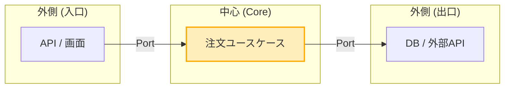
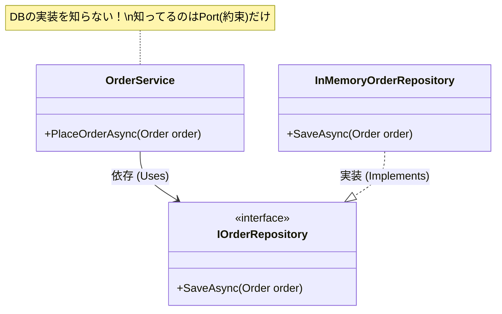

# 第02章：ヘキサゴナルを一言で！🔷✨


## まず“一言”で言うと？🧡

ヘキサゴナル（Ports & Adapters）は、**「中心（Core）を外側（UI/DB/外部API）から守って、差し替えできるようにする設計」**だよ〜🔷🛡️✨
この考え方自体は、提唱者の Alistair Cockburn さんの原典でも「アプリの中心を外部要因から隔離する」発想として説明されてるよ。([Alistair Cockburn][1])

---

## “六角形”って大事？実は図の都合だよ😆🔶

「六角形＝6個の何かが必要！」って意味じゃないよ〜🙅‍♀️💦
六角形はただの**イメージ**で、言いたいことはこれ👇

* 外側には、いろんな入口（画面・API・バッチ・テスト…）があるよね🚪🌐🧪
* 外側には、いろんな出口（DB・外部API・メール・時間…）もあるよね🗄️📡✉️⏰
* それらが **中心のルールに直接ベタ貼り**になると、変更が怖くなる😵‍💫💥
* だから「境界」を作って守る🛡️✨

この「中心を守るために境界を作る」ってところがヘキサの本体だよ〜🔷💖([Alistair Cockburn][1])

---

## “中心（Core）”ってなに？🏠❤️

ここでいう中心は、ざっくり言うと👇

* **業務ルール（ドメイン）**：例）「注文は合計金額が0円じゃダメ」💰🚫
* **手順（ユースケース）**：例）「注文する：入力→検証→保存→通知」🧾➡️✅➡️🗄️➡️📩

ポイントは、中心って **“長生きする”** ってこと🌱✨
画面は流行が変わるし、DBも変わるし、外部APIも仕様変わるしね😇📱🗄️📡

---

## “境界”ってなに？📌🚧

境界は、中心と外側の間にある「ここから先は別世界〜！」の線引きだよ😆🚧✨

* 中心：**「何をしたいか（方針）」**
* 外側：**「どうやって実現するか（詳細）」**

そして、ヘキサではこの境界を **Port（約束）** で作るのが特徴🔌📝
（Port/Adapterの詳細は次章でガッツリやるけど、ここで雰囲気だけつかも〜😊）

---

## “差し替え”って、何がそんなに嬉しいの？🔁🎁


ヘキサのご褒美はこれだよ〜👇💖

### 1) UIを変えても中心がそのまま🖥️➡️📱➡️⌨️

* 画面アプリ → Web API → CLI にしても
* **中心の「注文する」ロジックは同じ**✨

### 2) DBを変えても中心がそのまま🗄️➡️☁️➡️📄

* InMemory → SQLite → SQL Server → クラウドDB
* **中心コードが守られる**🛡️✨

### 3) テストが爆速になる🧪⚡

* DBなしで中心をテストできるの、最高だよ😆💕

---

## ちいさな例で“感覚”をつかもう☕🧾

「カフェ注文」の中心ロジックはこういう気持ち👇

* 中心：「注文を作る」🧾✨
* 外側：「HTTPで受ける」「DBに保存する」🌐🗄️

図にするとこんな感じ（ざっくり）👇



「中心は“やりたいこと”だけを知ってる」
「外側は“つなぎ役”として働く」
この分担ができると、差し替えが効くようになるよ〜🔁✨

---

## C#で“雰囲気だけ”コード（超ミニ）👶💻

まだ第2章だから、**完成形じゃなくてイメージ優先**でね😊✨

### 中心が欲しいのは「保存できること」だけ🗄️📝

```csharp
public interface IOrderRepository // Port（約束）
{
    Task SaveAsync(Order order);
}

public sealed class OrderService // Core側の処理イメージ
{
    private readonly IOrderRepository _repo;

    public OrderService(IOrderRepository repo) => _repo = repo;

    public async Task PlaceOrderAsync(Order order)
    {
        // ここに業務ルール（例：合計0円NGなど）が育っていく🌱
        await _repo.SaveAsync(order);
    }
}

public sealed record Order(Guid Id, int TotalYen);
```

### 外側は「その約束を実装してつなぐ」🔌🔁

```csharp
public sealed class InMemoryOrderRepository : IOrderRepository // Adapter
{
    private readonly List<Order> _orders = new();

    public Task SaveAsync(Order order)
    {
        _orders.Add(order);
        return Task.CompletedTask;
    }
}
```

この時点での大事ポイントは👇✨

* `OrderService` は **DBの種類を知らない**🧼
* `IOrderRepository` を差し替えたら、保存先が変えられる🔁



---

## よくある勘違い（ここで潰しとこ）💣🙂

### ❌「interfaceをいっぱい作る設計でしょ？」

→ いっぱい作るのが目的じゃないよ〜！😆
**“変わりやすい境界だけ”にPortを置く**のがコツ🔌✨

### ❌「とにかく六角形っぽく分ければOK？」

→ 形じゃなくて、**依存の向き**が本質🧲🛡️
中心が外側に引っ張られてたらアウト〜🙅‍♀️💦

### ❌「小さなアプリには不要？」

→ 最初からフル実装はいらないよ😊
でも、**DB差し替えたい／テストしたい／UI増えそう**なら早めに効いてくる🎯✨

---

## AI（Copilot/Codex）を“第2章から”賢く使う🤖💡

AIはめっちゃ便利だけど、ヘキサで一番大事な「境界」は人間が決めるのがコツだよ〜🚦😊

### 使いどころ①：一言説明を自分用に作る✍️

```text
「ヘキサゴナルを、初心者向けに“30文字以内”で説明して。
ただし “中心(Core)を守る / 境界 / 差し替え” を必ず入れて」
```

### 使いどころ②：自分のアプリで“外側”を洗い出す🔍

```text
「このプロジェクトで “外側（UI/DB/外部API/時間/ファイル）” に当たる依存を列挙して」
```

### 使いどころ③：Port候補（interface）の叩き台を作る🔌

```text
「OrderServiceが必要とする “保存” のPortとして IOrderRepository を設計して。
メソッドは最小限で、ユースケース目線の名前にして」
```

---

## ミニ演習（10〜15分）⏰🧪✨

1. あなたの言葉で、ヘキサを“一言”にしてみて📝💖
2. いま作ってる（or作った）アプリで「外側」を3つ挙げてみて👇

   * UI（画面/Controller）🌐
   * DB（EF/SQL）🗄️
   * 外部API（決済/通知）📡
3. 「中心に残したいこと」を1つ書いてみて🏠✨

   * 例：「注文のルール」「在庫引当の手順」など

---

## まとめ（この章のゴール達成✅）🎉

* ヘキサは **中心（Core）を守って差し替え可能にする設計**🔷🛡️✨
* 六角形は図の都合！大事なのは **境界**📌
* 境界を作ると、UI/DB/外部が変わっても中心が生き残る🔁💖
* だからテストも速くなるし、変更が怖くなくなる😊🧪⚡

次の章で、いよいよ **Core / Port / Adapter** の“登場人物紹介”に入って、ヘキサが一気に分かりやすくなるよ〜👥🔌✨

[1]: https://alistair.cockburn.us/hexagonal-architecture?utm_source=chatgpt.com "hexagonal-architecture - Alistair Cockburn"
