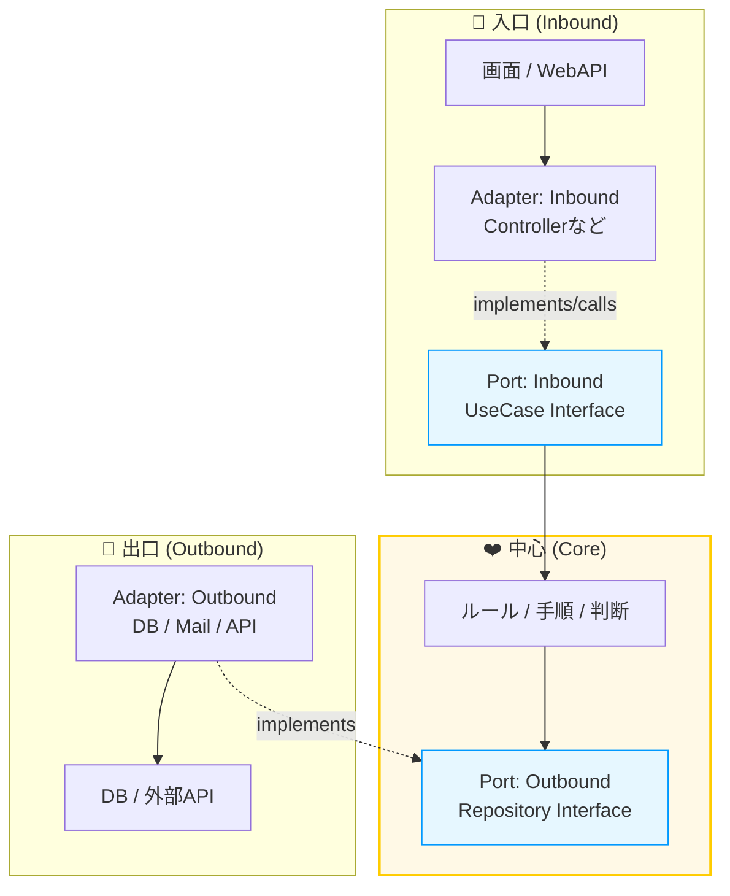
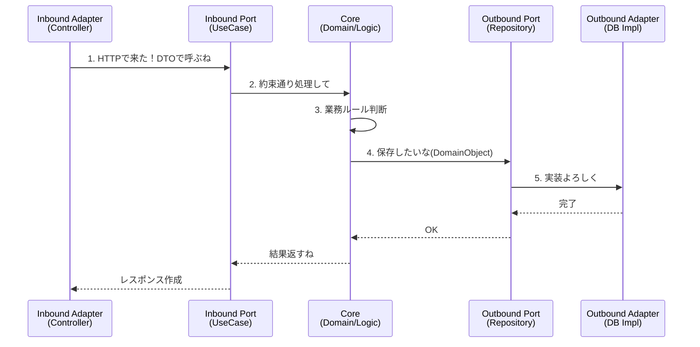

# 第03章：登場人物：Core / Port / Adapter 👥🔌


この章は「ヘキサって結局、誰が何するの？」をスッキリさせる回だよ〜😊✨
ここが分かると、後の章（Inbound/OutboundとかDIとか）も一気にラクになるっ💖

---

## 0) 今日のゴール🎯✨

* **Core / Port / Adapter** を “役割” で言い分けられるようになる🙆‍♀️
* コードを見たときに「これ誰？」って即ツッコミできるようになる😆
* “ぐちゃぐちゃ化🍝” を未然に防ぐ判断軸を持つ🛡️✨

---

## 1) まずは一枚絵でイメージ🖼️🔷


ざっくりこういう関係だよ👇

* **Core（中心）**：やりたいこと（業務ルール・手順）❤️
* **Port（約束）**：Coreが「こう呼んでね / こう使わせてね」って決める口📝🔌
* **Adapter（変換係）**：外の世界とPortをつなぐ “変換アタッチメント” 🔁🔌



この「Portが口で、Adapterが変換器」って発想がヘキサの核だよ〜🔌✨
（提唱者のAlistair Cockburnも “PortとAdapter” という言い方を前面に出してるよ）([Alistair Cockburn][1])

---

## 2) Core（コア）ってなに？🏠❤️

### Coreの正体✨

**「アプリの目的そのもの」**だよ😊
たとえばカフェアプリなら、

* 注文を作る☕🧾
* 注文できる条件をチェックする✅
* 合計金額を計算する💰
* 在庫が足りないなら断る🚫

みたいな **“判断・ルール・手順”** がCoreの担当！

### Coreがやっていいこと🙆‍♀️

* 業務ルール（禁止・制約・計算）🧠
* ユースケースの手順（入力→処理→結果）🧭
* 「何が起きたか」の表現（例：OrderCreated）🎉

### Coreが知らないほうがいいこと🙅‍♀️

* DBがSQL ServerかSQLiteか🗄️
* WebAPIがASP.NETか最小APIか🌐
* JSONの形、HTTPステータス、画面項目🧾
* ライブラリの都合（EF Coreの属性とか）🧩

> Coreは “外の都合” を知らないほど強い💪✨
> そうすると、UIやDBを変えてもCoreが揺れない🛡️

---

## 3) Port（ポート）ってなに？📝🔌

Portは一言でいうと **「約束（interface）」** だよ😊✨
そして超重要ポイント👇

### ✅ Portは “基本的にCore側に置く”

なぜなら、**「Coreが必要としてる会話」をCoreが決める**から！
Cockburnも、Portは “目的のある会話を識別するもの” という考え方をしてるよ([Alistair Cockburn][1])

---

### 3-1) Inbound Port（外→中の入口）🚪⬅️

「Coreをこう呼び出してね！」っていう入口の約束✨

例：

* `ICreateOrderUseCase`
* `IGetOrdersUseCase`

> Inbound Portは **“ユースケースの入口”** って覚えると楽だよ😆🧠

---

### 3-2) Outbound Port（中→外の出口）➡️🚪

「Coreが外部を使いたいとき、こういう形でお願い！」っていう出口の約束✨

例：

* `IOrderRepository`（保存したい）
* `IPaymentGateway`（決済したい）
* `IClock`（現在時刻が欲しい）⏰

AWSの解説でも、ヘキサはUIやDBなど外部依存からCoreを切り離して、交換しやすくするのが狙いって説明されてるよ([AWS ドキュメント][2])

---

## 4) Adapter（アダプター）ってなに？🔁🔌

Adapterは **「Portにつなぐための変換係」** だよ😊✨

### 4-1) Inbound Adapter（入口側）🌐➡️

* Controller / Minimal API / CLI / バッチの入口など
* 受け取ったものを **Coreが食べられる形** にする🍽️✨
* そして **Portを呼ぶだけ**（薄いほどえらい🥳）

例：

* `OrdersController`（HTTP → DTO → UseCase呼ぶ）
* `CreateOrderEndpoint`（Minimal API）

---

### 4-2) Outbound Adapter（出口側）➡️🗄️

* DB / 外部API / メール送信など
* Coreが欲しいのは「保存して」「送って」だけ
  だから **技術の手続き** はアダプターが背負う💪

例：

* `EfCoreOrderRepository`（Port実装してDB操作）
* `HttpPaymentGateway`（Port実装して外部決済API）
* `SystemClock`（Port実装して現在時刻）

---

## 5) 3人の “会話の流れ” をセリフで覚える🎭✨

イメージをセリフ化すると超覚えやすいよ😆

* **Inbound Adapter**「HTTPで来た〜！DTOにしてPort呼ぶね！」🌐➡️📦
* **Inbound Port**「入口の約束はこれね」📝
* **Core**「ルールに従って判断するよ」🧠✅
* **Outbound Port**「保存したい。約束はこれね」📝
* **Outbound Adapter**「DB向けに変換して保存するよ」🔁🗄️



---

## 6) ミニ実例（C#）で “誰が誰か” を体で覚える🧪💖

題材：**注文を作る**☕🧾
（ここでは「分け方」重視で、内容は最小にするね！）

### 6-1) Core側（Port + UseCase + Domain）❤️

```csharp
// ===== Core / Ports =====
public interface ICreateOrderUseCase
{
    CreateOrderResult Handle(CreateOrderCommand command);
}

public interface IOrderRepository
{
    void Save(Order order);
}

// ===== Core / Domain =====
public sealed record OrderId(Guid Value);

public sealed class Order
{
    public OrderId Id { get; }
    public string ItemName { get; }
    public int Quantity { get; }

    public Order(OrderId id, string itemName, int quantity)
    {
        if (string.IsNullOrWhiteSpace(itemName)) throw new ArgumentException("ItemName is required.");
        if (quantity <= 0) throw new ArgumentException("Quantity must be positive.");

        Id = id;
        ItemName = itemName;
        Quantity = quantity;
    }
}

// ===== Core / UseCase =====
public sealed record CreateOrderCommand(string ItemName, int Quantity);
public sealed record CreateOrderResult(Guid OrderId);

public sealed class CreateOrderUseCase : ICreateOrderUseCase
{
    private readonly IOrderRepository _repo;

    public CreateOrderUseCase(IOrderRepository repo)
        => _repo = repo;

    public CreateOrderResult Handle(CreateOrderCommand command)
    {
        var order = new Order(new OrderId(Guid.NewGuid()), command.ItemName, command.Quantity);
        _repo.Save(order);
        return new CreateOrderResult(order.Id.Value);
    }
}
```

✅ ここでのポイント💡

* Coreは **DBもHTTPも知らない**
* 外に頼むのは `IOrderRepository` という **Port（約束）** だけ🔌✨

---

### 6-2) Adapter側（InMemoryのOutbound Adapter）🧠➡️📦

```csharp
// ===== Adapter / Outbound =====
public sealed class InMemoryOrderRepository : IOrderRepository
{
    private readonly List<Order> _orders = new();

    public void Save(Order order)
        => _orders.Add(order);
}
```

✅ これが **Adapter**！
Port（`IOrderRepository`）を実装して、外部の都合（今回はメモリ）で動くよ🔁✨

---

### 6-3) Adapter側（Inbound Adapter：Controller例）🌐🙂

```csharp
// ===== Adapter / Inbound =====
public sealed record CreateOrderRequest(string ItemName, int Quantity);

public sealed class OrdersController
{
    private readonly ICreateOrderUseCase _useCase;

    public OrdersController(ICreateOrderUseCase useCase)
        => _useCase = useCase;

    public Guid Post(CreateOrderRequest request)
    {
        // 変換して Port を呼ぶ（薄く！）
        var result = _useCase.Handle(new CreateOrderCommand(request.ItemName, request.Quantity));
        return result.OrderId;
    }
}
```

✅ Controllerは **薄いのが正義**😆✨
「受け取る→変換→UseCase呼ぶ」くらいで止めると、ぐちゃぐちゃ🍝になりにくい！

---

## 7) ありがち事故あるある🍝😭（第3章のうちに潰す！）

* **事故①**：Coreの中で `HttpClient` / `DbContext` を直接使う
  → “外の都合” がCoreに侵入して、差し替え不能に😵‍💫
* **事故②**：Portが外側に置かれてて、Coreが外の都合に引っ張られる
  → 「誰が会話を決める？」が逆転しがち🙃
* **事故③**：Adapterに業務判断が入り、Coreが空っぽ
  → テストもしづらいし、ルールが散らばる🧨
* **事故④**：DTOとDomainが混ざって境界が消える
  → いつの間にか “画面都合” がCoreを汚す🧼❌

---

## 8) ミニ練習問題✍️😆（3分）

次のクラス、どれ？（Core / Port / Adapter）🤔

1. `IUserRepository`
2. `EfCoreUserRepository`
3. `UsersController`
4. `RegisterUserUseCase`
5. `RegisterUserRequest`（HTTPで受け取る用）
6. `User`（Entity）

<details>
<summary>答えを見る👀✨</summary>

* 1：Port（Outbound Port）🔌
* 2：Adapter（Outbound Adapter）🔁
* 3：Adapter（Inbound Adapter）🌐
* 4：Core（UseCase）❤️
* 5：Adapter側のDTO（Inbound Adapter寄り）📦
* 6：Core（Domain）❤️

</details>

---

## 9) AI（Copilot等）に頼るなら、ここを頼る🤖✨

AIは超便利だけど、**境界を守るのは人間の仕事**🚦😊
おすすめの使い方👇

* Portの雛形を作らせる

  * 「`IOrderRepository` を作って。メソッドは Save と FindById」
* Adapterの変換（DTO↔Domain）を作らせる

  * 「requestからCreateOrderCommandへ変換するコードを書いて」
* “混ぜてないか” チェックさせる

  * 「このController、業務ロジック入ってない？責務レビューして」

---

## 10) まとめ✅✨（この章の合言葉）

* **Core**：ルールと手順❤️
* **Port**：Coreが決める約束（interface）🔌
* **Adapter**：外の世界とつなぐ変換係🔁
* **1つのPortに複数のAdapterがありえる**（DB差し替えとか！）🔁🔁([Alistair Cockburn][1])

---

## ちいさなチェックリスト✅🧡（自分のコードに当ててみてね）

* Coreのプロジェクトから、DB/HTTP系の参照が見えてない？👀
* Port（interface）が “Coreが欲しい会話” になってる？🔌
* Adapterに業務判断が入りすぎてない？（薄い？）🌿
* DTOとDomainが混ざって境界が消えてない？🧼✨

---

### （おまけ）2026時点のC#まわり最新メモ🪟✨

今どきのC#は **C# 14 が最新**で、**.NET 10**でサポートされてるよ〜😊([Microsoft Learn][3])

---

次の第4章は「ぐちゃぐちゃ構造🍝」をわざと作って、**なにが辛いのか体感**してから、ヘキサで救う流れに入ると理解が爆速になるよ😆💖

[1]: https://alistair.cockburn.us/hexagonal-architecture?utm_source=chatgpt.com "hexagonal-architecture - Alistair Cockburn"
[2]: https://docs.aws.amazon.com/prescriptive-guidance/latest/cloud-design-patterns/hexagonal-architecture.html?utm_source=chatgpt.com "Hexagonal architecture pattern - AWS Prescriptive Guidance"
[3]: https://learn.microsoft.com/ja-jp/dotnet/csharp/whats-new/csharp-14?utm_source=chatgpt.com "C# 14 の新機能"
