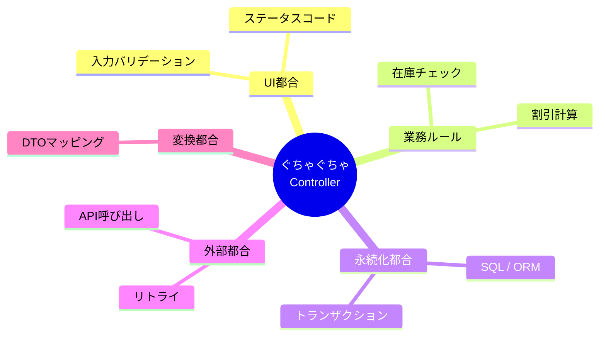
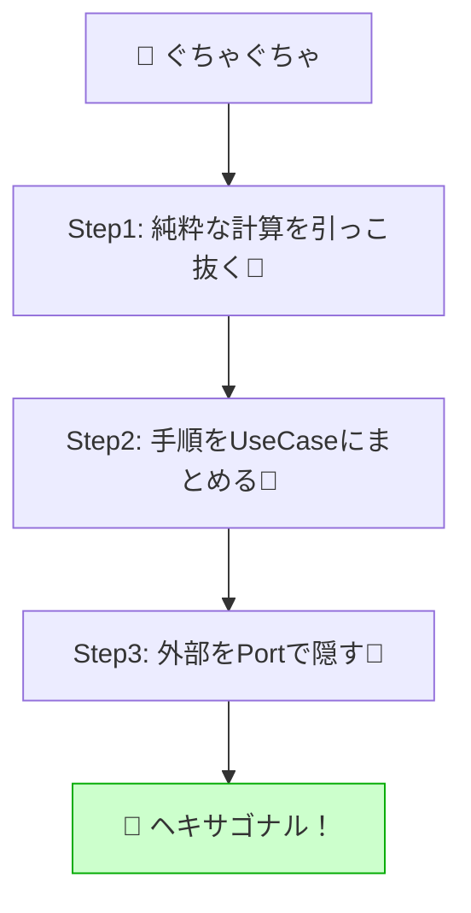

# 第04章：よくある失敗：全部ぐちゃぐちゃ構造🍝😭


この章は「ヘキサゴナルに入る前に、まず“地獄の形”をちゃんと見抜けるようになる」がゴールだよ〜！🔍✨
（現場で一番多いの、ほんとこれ🥺）

---

## 1) 「ぐちゃぐちゃ構造」ってどんな状態？🍝😵‍💫


ざっくり言うと、

* **Controller（または画面処理）に全部入ってる**

  * バリデーション✅
  * 業務ルール🧠
  * DB保存🗄️
  * DTO変換🔁
  * 外部API呼び出し📡
  * ログ・例外・トランザクション🧯
* しかもそれが **1メソッドにギュウギュウ** 😭

こうなると「ちょい修正」のつもりが…

* 画面の項目追加🖥️ → DBも変えて… → ルールも変えて… → 例外も変えて…
* **どこまで影響するか誰も読めない** 😇

---

## 2) ぐちゃぐちゃが怖い理由（“壊れ方”が派手）💥😱


よく起きる事故パターンはこれ👇

### 🔥 事故パターンA：小さな仕様追加で全部に波及

例：
「注文に *クーポンコード* を付けたい🎫✨」
→ Controllerに項目追加 → 変換追加 → DB列追加 → 条件分岐追加 → 例外追加 → テスト無理😵‍💫

### 🔥 事故パターンB：DBを変えたいだけなのに業務が巻き添え

例：
「InMemoryからSQL Serverに変えたい🗄️➡️🗄️」
→ ControllerがDbContext直叩きだと、**業務手順も一緒に崩れる** 😭

### 🔥 事故パターンC：テストができない（= 変更が怖い）

* ControllerがDB/外部API/日時/乱数に触ってると
  **テストは“全部起動した統合テスト”しかなくなる** 🧪💦
* しかも遅い＆壊れやすい＆原因切り分け地獄😇

---

## 3) ぐちゃぐちゃの正体は「変更理由のミックス」🧩😵‍💫


ポイントはこれ👇

✅ **1つのファイル（特にController）が “複数の変更理由” を抱えてる** と危険🍝



代表的な変更理由（これが混ざると事故る）👇

* **UI/HTTP都合**：入力形式、ステータスコード、ルーティング、ModelStateなど🖥️🌐
* **業務ルール**：割引条件、在庫、注文状態の遷移、金額計算など🧠💰
* **永続化都合**：テーブル、ORM、SQL、インデックス、トランザクション🗄️
* **外部都合**：外部APIの仕様変更、リトライ、タイムアウト📡⏱️
* **変換都合**：DTO↔ドメイン↔DBモデルのマッピング🔁

ヘキサゴナルは、この“混ざり”を境界で分離していく設計だよ🔷🔌✨

---

## 4) ありがちな「地獄Controller」例（わざと🍝）😇

※雰囲気が伝わればOK！「こういうの見たことある…」が大事🥺
（ControllerでもMinimal APIでも、やらかし方は同じだよ。Minimal API自体は今も公式チュートリアルが充実してる👍） ([Microsoft Learn][1])

```csharp
[ApiController]
public class OrdersController : ControllerBase
{
    private readonly AppDbContext _db;
    private readonly HttpClient _http;

    public OrdersController(AppDbContext db, IHttpClientFactory httpFactory)
    {
        _db = db;
        _http = httpFactory.CreateClient("Payment");
    }

    [HttpPost("/orders")]
    public async Task<IActionResult> Create(CreateOrderRequest req)
    {
        // 1) 入力チェック（UI都合）✅
        if (string.IsNullOrWhiteSpace(req.CustomerId))
            return BadRequest("customerId required");

        if (req.Items == null || req.Items.Count == 0)
            return BadRequest("items required");

        // 2) DBから読み取り（永続化都合）🗄️
        var customer = await _db.Customers.FindAsync(req.CustomerId);
        if (customer == null) return NotFound("customer not found");

        // 3) 業務ルール（ドメイン都合）🧠
        decimal total = 0m;
        foreach (var item in req.Items)
        {
            var product = await _db.Products.FindAsync(item.ProductId);
            if (product == null) return BadRequest("invalid product");

            if (product.Stock < item.Qty) return BadRequest("out of stock");

            total += product.Price * item.Qty;
            product.Stock -= item.Qty; // 在庫減らす（しかもここで…😇）
        }

        if (req.CouponCode != null)
        {
            // クーポン判定（業務ルールなのにここ）🎫
            if (req.CouponCode == "HAPPY10") total *= 0.9m;
        }

        // 4) 外部API（外部都合）📡
        var payRes = await _http.PostAsJsonAsync("/pay", new { amount = total });
        if (!payRes.IsSuccessStatusCode) return StatusCode(502, "payment failed");

        // 5) DB保存（永続化都合）🗄️
        var order = new OrderRow
        {
            CustomerId = req.CustomerId,
            Total = total,
            CreatedAtUtc = DateTime.UtcNow, // 時間（外部要因）⏰
        };
        _db.Orders.Add(order);
        await _db.SaveChangesAsync();

        // 6) 返却形式（UI都合）🖥️
        return Ok(new { orderId = order.Id, total });
    }
}
```

---

## 5) このコード、何がヤバいの？（混ざってるものを見える化）👀🍝

上のメソッド、実は“違う種類の仕事”が全部同居してるよね😵‍💫

* HTTPの仕事：BadRequest/NotFound/StatusCode、入力形式
* 業務の仕事：在庫を減らす、合計計算、割引判定
* DBの仕事：DbContextで読み書き、SaveChanges
* 外部の仕事：決済API呼び出し
* 変換の仕事：req→DB row、返却DTO
* 時間の仕事：DateTime.UtcNow

**これが「変更の波」が広がる原因**だよ🌊😭

---

## 6) ぐちゃぐちゃ検知チェックリスト✅🍝


見つけたら「黄色信号〜！」🚥😵‍💫

* Controllerが **100行超え** てる📜
* `DbContext` をControllerが直に触ってる🗄️
* `HttpClient` をControllerで直呼びしてる📡
* ループの中でDBアクセスしてる🔁🗄️
* `DateTime.UtcNow` が業務判断に混ざってる⏰
* `return BadRequest(...)` だらけ（= ルールとUI混線）🧯
* 「割引」「在庫」「状態遷移」みたいな単語がController内にいる🧠

---

## 7) どう直す？（ヘキサへの“脱出ルート”）🚪🔷✨


この章では“完成形”まで行かなくてOK！
まずは **分け方の順番** を覚えよう😊

### ステップ①：Controllerから「純粋な計算」を引っこ抜く🧼💡

* 合計計算、割引判定、在庫判定みたいな
  **副作用なし** の部分をメソッド/クラスに移す

### ステップ②：「手順」をUseCaseに寄せる🧭✨

* 「注文を作る」っていう手順を
  `CreateOrderUseCase` みたいなクラスへ

### ステップ③：外部（DB/外部API）を“Port（interface）”で隠す🔌🛡️

* UseCaseは `IOrderRepository` / `IPaymentGateway` だけ知る
* DB実装やHTTP実装は Adapter に押し出す🔁



> ここまで来ると、DIで差し替えやすくなるよ🔧✨
> 公式ドキュメントでも DI の基本はこの流れで整理されてるよ〜！ ([Microsoft Learn][2])

---

## 8) ミニ演習：わざと壊して“痛み”を体感しよ😈🧪💥


### 演習A：仕様追加してみる🎫

次の仕様を足してみて👇

* クーポン `HAPPY10` は「合計1000円以上のときだけ」有効
* ついでに「クーポンが無効なら理由を返したい」

ぐちゃControllerだと、分岐が増えて **読めなくなる** はず😵‍💫📈

### 演習B：テストを書こうとしてみる🧪

「DBも決済も絡む」から、
ユニットテストが書きにくくて泣くはず😭

### 演習C：次章に向けて“分けポイント”に付箋を貼る🏷️

コードにコメントでいいから👇を書いてみて✨

* ここはUI
* ここは業務
* ここはDB
* ここは外部API
* ここは変換

これができたら、もう勝ち！🏆😆

---

## 9) AI活用のコツ（ぐちゃぐちゃ脱出でめっちゃ効く🤖💞）


Copilot/Codexにお願いするときは、こう言うと強いよ👇✨

* 「このControllerの責務を分解したい。
  ①業務ロジック抽出 ②UseCase作成 ③Port(interface)設計 の順で提案して」🧠🔌
* 「DBアクセスをRepository interfaceに切り出して。Controllerは薄くしたい」🗄️➡️🔌
* 「壊さないように“ふるまい固定テスト（characterization test）”の案も出して」🧪🧷

⚠️ただし！
AIが作る“分割”は、たまに **境界が雑** になる😇
最後に「変更理由が混ざってない？」を人間がチェックすると安心だよ✅😊

---

## 10) まとめ✅✨（この章で持ち帰るもの）

* ぐちゃぐちゃ構造の本質は **「変更理由のミックス」** 🍝😵‍💫
* Controllerに業務・DB・外部・変換が混ざると **小さな変更が大爆発** 💥😭
* 脱出手順はこれ👇

  1. 純粋ロジック抽出🧼
  2. 手順をUseCaseへ🧭
  3. 外部はPortで隠す🔌🛡️

次の章では「じゃあなんでCoreが主役なの？」を、もっと腹落ちさせるよ〜🏠❤️✨

---

## おまけ：いまのC#/.NETの“最新版”感だけ超ざっくり🆕✨

教材で扱う前提の“今の主流”としては、.NETは **.NET 10（LTS）** が現役ど真ん中で、2026年1月の更新も出てるよ🧰✨ ([Microsoft][3])
C# も **C# 14（2025年11月リリース）** が最新安定として整理されてるよ📚✨ ([Microsoft Learn][4])

[1]: https://learn.microsoft.com/en-us/aspnet/core/tutorials/min-web-api?view=aspnetcore-10.0&utm_source=chatgpt.com "Tutorial: Create a Minimal API with ASP.NET Core"
[2]: https://learn.microsoft.com/en-us/aspnet/core/fundamentals/dependency-injection?view=aspnetcore-10.0&utm_source=chatgpt.com "Dependency injection in ASP.NET Core"
[3]: https://dotnet.microsoft.com/en-us/platform/support/policy?utm_source=chatgpt.com "The official .NET support policy"
[4]: https://learn.microsoft.com/ja-jp/dotnet/csharp/whats-new/csharp-version-history?utm_source=chatgpt.com "C# の歴史"
