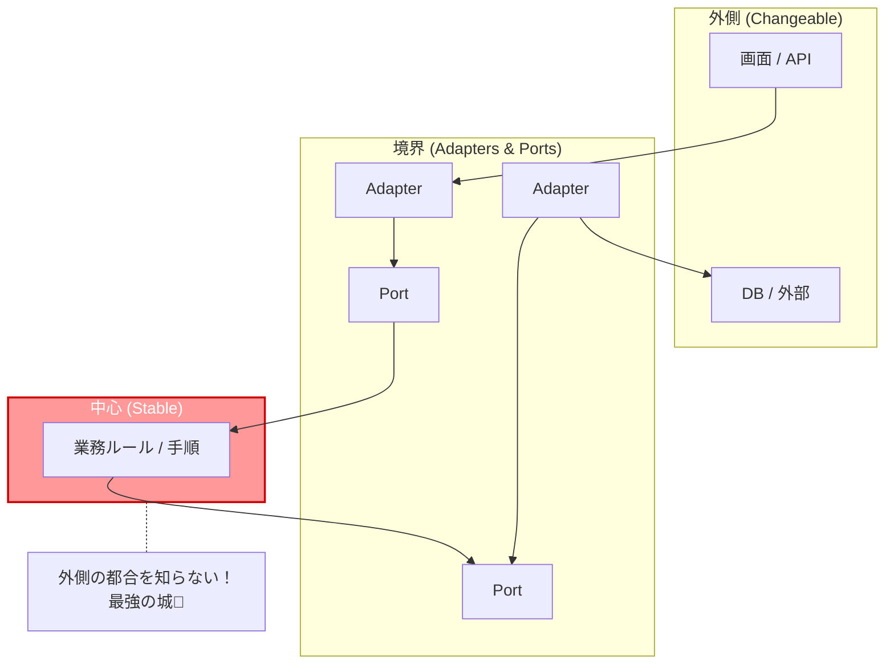
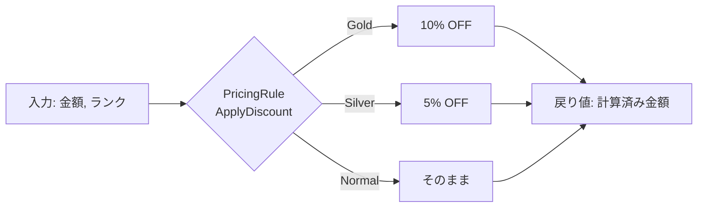

# 第05章：中心（Core）が主役な理由🏠❤️


この章は「ヘキサゴナルって結局、何を守りたい設計なの？」をハッキリさせる回だよ〜😊✨
結論から言うと、**守りたいのは“変わりにくい業務ルール（Core）”**です🛡️

---

## 0) 今日のゴール🎯✨

読み終わったら、これが言えるようになります👇

* 「UIやDBは変わる。だから真ん中に置かない」って説明できる😊
* Coreに入れていいもの／ダメなものが分かる🚦
* 「Coreを守るためのPort」って発想がスッと入る🔌💡

---

## 1) まず“変わるもの”を正直に見よう👀🔁


アプリ開発って、だいたいこうです👇

* 画面：デザイン変更・UX改善・スマホ対応・管理画面追加…📱🎨
* DB：SQLite→PostgreSQL→クラウドDB、ORM変更…🗄️🔁
* 外部：決済APIの仕様変更・レート制限・認証方式変更…💳📡
* 運用：ログ方針・監視・リトライ・タイムアウト…🧯📝

つまり **外側は“いつでも変わる前提”** なんだよね😵‍💫

一方で **変わりにくいもの** もあります👇

* 「注文は在庫があるときだけ確定できる」📦✅
* 「金額はマイナス禁止」💰🚫
* 「会員ランクで割引率が変わる」🏷️✨

こういうのが **業務ルール（＝Coreの宝物）** だよ💎❤️

---

## 2) 2026年の現実：外側の進化が速い🏎️💨


いまの最新系だと、.NETは **.NET 10 がLTS**（長期サポート）で、2026年1月時点の最新パッチは **10.0.2** だよ📌 ([Microsoft][1])
そしてC#も **C# 14** を .NET 10 / Visual Studio 2026 で試せるって公式に書いてあるよ✨ ([Microsoft Learn][2])
さらに Visual Studio 2026 も 2026年1月に更新が出てる（例：18.2.0が2026/1/13）📅 ([Microsoft Learn][3])

つまり何が言いたいかというと…

> **道具（UI/DB/フレームワーク）は今後も普通に変わる**
> だからこそ **変わりにくいCoreを主役にする** のが超大事！😊🛡️

---

## 3) Coreが主役って、どういう形？🔷🏠


イメージはこう👇（ざっくりでOK！）



ポイントは超シンプル👇

* **Coreは「何をしたいか」だけ知ってる**（例：保存したい、時刻がほしい）🧠
* **どうやってやるか（DBで保存、APIで取得）は知らない** 🙅‍♀️
* “どうやるか”は **外側（Adapter）が担当** 🔧✨

---

## 4) Coreに入れていいもの／ダメなもの🚦🙂


### ✅ Coreに入れていい（入れてほしい）もの

* ドメインのルール（制約・計算・判断）📏🧮
* ユースケースの手順（注文作る、一覧出す、など）🧭
* Port（interface：保存、取得、現在時刻など）🔌

### ❌ Coreに入れない（入れちゃダメ）もの

* ASP.NETのControllerやHttpContext 🌐🚫
* DBのORMの属性やDBモデル（例：EFの `[Key]` とか）🗄️🚫
* 外部APIの都合（HTTPレスポンス構造そのまま等）📡🚫

---

## 5) ミニ例：割引ルールはCoreに置く☕💰✨

「カフェ注文」で、会員ランクによって割引するルールがあるとするね☺️

### ✅ Core側：ルールは“純粋な計算”にする（外を知らない）

```csharp
public enum MemberRank { Normal, Silver, Gold }

public static class PricingRule
{
    public static decimal ApplyDiscount(decimal total, MemberRank rank)
    {
        var rate = rank switch
        {
            MemberRank.Gold => 0.90m,   // 10%オフ✨
            MemberRank.Silver => 0.95m, // 5%オフ✨
            _ => 1.00m
        };

        return decimal.Round(total * rate, 0); // 円なので丸め🙂
    }
}
```

これ、Coreとして最高の形🎉
なぜなら…

* DBがSQLiteでもPostgreSQLでも関係ない🗄️➡️🙂
* 画面がWebでもスマホでも関係ない📱➡️🙂
* テストが超ラク（関数に数字入れるだけ）🧪✨



---

## 6) “悪い混ぜ方”を見てピンと来よう🍝😭


たとえば、CoreのEntityにDB都合を混ぜると…

```csharp
// 😭 例：CoreにDBの都合が入り込む
using System.ComponentModel.DataAnnotations;

public class Order
{
    [Key] // ← DB都合が侵入🗄️💥
    public int Id { get; set; }

    public decimal Total { get; set; }
}
```

これをやると、将来こうなる確率が上がります👇😵‍💫

* ORM変えたいのに、Coreが巻き込まれて大改造💥
* Coreが「DBの型」「DBの制約」に引っぱられる🧲
* テストが重くなる（DB準備が必要になりがち）🧪💦

だから **Coreは“外の都合”から隔離** するのが勝ちです🛡️✨

---

## 7) 今日のミニ演習（15〜25分）✍️😊

### 演習A：あなたのアプリの「変わるもの」リスト作ってみよ📋🔁

* 画面は何が変わりそう？
* DBは将来どうなりそう？
* 外部サービスは増えそう？

👉 これを出すだけで「外側」候補が見えてくるよ✨

### 演習B：業務ルールを“純粋関数”にしてみよ🧠🧮

* 例：割引、制限、丸め、判定（OK/NG）

👉 「引数→戻り値」だけで完結させるのがコツ😊

### 演習C：外が必要なものをPortにしてみよ🔌

* 例：「現在時刻が欲しい」なら `IClock`
* 例：「保存したい」なら `IOrderRepository`

（中身は次章以降でガッツリやるよ〜💪✨）

---

## 8) AI活用のコツ（この章向け）🤖💡

AIにはこう頼むと強いよ👇

* 「割引ルールを**副作用なし**で実装して」
* 「このルールの**境界ケース**（0円、超大きい値、端数）を洗い出して」
* 「xUnitでこの関数のテストを書いて（パラメータ化も）」🧪✨

でも最後に人間が見るポイントはこれ👇🚦

* **Coreに外の都合が混ざってない？**（DB属性・HTTP型など）
* **ルールが説明できる言葉になってる？**（命名が大事！）😊

---

## 9) まとめ🎁❤️

* 外側（UI/DB/外部API）は変わる。だから **真ん中に置かない** 🔁🚫
* 守りたいのは **業務ルール（Core）** 🛡️
* Coreは外を知らない。外と話すときは **Port（約束）** 🔌✨

### Core主役チェック✅

* Coreプロジェクトだけで「ルールと手順」が読める？📖
* CoreがASP.NET/ORM/外部SDKに依存してない？🚫
* ルールはテストがサクッと書けそう？🧪✨

---

次の章（第6章）で、いよいよ **Inbound（外→中）** の「入口を薄くする」感覚を掴みにいくよ〜🚪😊✨

[1]: https://dotnet.microsoft.com/en-US/download/dotnet/10.0?utm_source=chatgpt.com "Download .NET 10.0 (Linux, macOS, and Windows) | .NET"
[2]: https://learn.microsoft.com/en-us/dotnet/csharp/whats-new/csharp-14?utm_source=chatgpt.com "What's new in C# 14"
[3]: https://learn.microsoft.com/ja-jp/visualstudio/releases/2026/release-notes?utm_source=chatgpt.com "Visual Studio 2026 リリース ノート"
