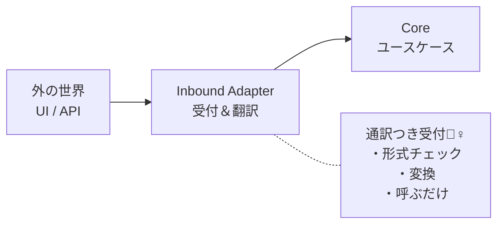

# 第06章：Inboundの考え方（外→中）⬅️🚪


（外がCoreを呼ぶ入口／Inboundは「呼び出し」を整える係／入口を薄くするメリット😊）

---

## 1) Inboundってなに？いきなり結論🍀


Inboundは、**外の世界（画面・API・CLI・バッチ・Webhook…）から、Core（中心）へ入ってくる“入口”**のことだよ〜！🚪✨
ざっくり言うと、

* **外の入力を受け取って**📩
* **Coreが理解できる形に整えて**🧹
* **Core（ユースケース）を呼ぶ**☎️
* **結果を外向けに返す**📤

これをやる場所がInboundだよ😊

ちなみに今どきのWindows + .NET 10（2025/11/11リリースのLTS）だと、Webの入口としては **ASP.NET Core（Minimal API / Controller）**が定番だよ〜🫶
([Microsoft for Developers][1])

---

## 2) “外”ってなに？Inboundの入口いろいろ🚪🌍


「外」って、要するに **Coreの外側の都合**ぜんぶ！

* Web画面のボタン押下🖱️
* Web APIのリクエスト（REST/JSON）🌐
* CLIコマンド（`app.exe order create ...`）⌨️
* バッチ（毎朝9時に集計）⏰
* キュー/イベント（注文イベントを受信）📨
* 外部サービスからのWebhook（決済完了通知）🔔

外はコロコロ変わりがち。だから **Coreを守る**ために、入口で“整える”のが超大事なんだ〜🛡️✨

---

## 3) Inboundの役割：やること／やっちゃダメなこと🙅‍♀️✅

### ✅ Inboundがやること（入口担当のおしごと）

Inbound（だいたい「Inbound Adapter」って呼ぶよ🔌）は、次を担当するとスッキリするよ😊

1. **受け取る**（HTTP/画面入力/コマンド引数）📥
2. **形式チェック**（必須項目ある？型合ってる？）🔎
3. **認証・認可**（ログインしてる？権限ある？）🔐
4. **変換する**（外のDTO → Coreに渡す“コマンド/入力モデル”へ）🔁
5. **ユースケースを呼ぶ**（Coreの入口＝Portを呼び出す）☎️
6. **結果を変換して返す**（成功/失敗をHTTPレスポンス等へ）📤
7. **例外の翻訳**（外向けエラーに整形）🧯

> ポイント：Inboundは “翻訳家＆受付” だよ📚✨

---

### 🙅‍♀️ Inboundがやっちゃダメなこと（混ぜると地獄👹）

ここ混ぜると、前の章の「全部ぐちゃぐちゃ🍝」へ逆戻り😭

* **業務ルール（ビジネス判断）をここでやる**❌

  * 例：「新規注文は合計1000円以上じゃないとダメ」とか
* **DBへ直接アクセスする**❌
* **ドメインの整合性（不変条件）を入口だけで保証しようとする**❌

業務ルールは **Coreの仕事**。入口が勝手に判断し始めると、入口が増えた瞬間に同じルールを何回も書くハメになるよ😵‍💫

---

## 4) “入口を薄くする”ってどういう意味？🧻✨


合言葉はこれ！

> **「入口は薄いほど偉い」**🙂✨

薄い入口ってのは、こういう状態👇

* Controller / Endpointは **変換して呼ぶだけ**
* ビジネスは **ユースケース側**
* だから、入口が増えても（API追加、CLI追加）**Coreは使い回せる**🔁💖

これがヘキサの「外→中」を綺麗に保つコツだよ🧠🔷

---

## 5) ミニ図で理解しよ〜🖼️🔷




Inboundは「門番」っていうより、**“通訳つき受付”**だと思うと分かりやすいよ〜🧑‍💼🗣️✨

---

## 6) 例：Minimal APIで “薄い入口” を作る（C#）🌐🔌

「入口は薄く！」を、いったん雰囲気だけでもコードで感じよ😊
（本格的なPort設計は後の章でやるけど、ここでは先にイメージ掴もう〜！）

### 6-1) Core側：ユースケース（仮）を用意する🧠

```csharp
public record CreateOrderCommand(string CustomerName, IReadOnlyList<string> Items);
public record CreateOrderResult(Guid OrderId);

public interface ICreateOrderUseCase
{
    Task<CreateOrderResult> HandleAsync(CreateOrderCommand command, CancellationToken ct);
}
```

### 6-2) Inbound側：HTTPを受けて“変換して呼ぶだけ”にする🚪

```csharp
using Microsoft.AspNetCore.Http.HttpResults;

var builder = WebApplication.CreateBuilder(args);

// ここでは仮実装をDI（本格的なDI/Composition Rootは後で丁寧にやるよ🔧）
builder.Services.AddScoped<ICreateOrderUseCase, FakeCreateOrderUseCase>();

var app = builder.Build();

app.MapPost("/orders", async (
    CreateOrderRequest req,
    ICreateOrderUseCase useCase,
    CancellationToken ct) =>
{
    // ✅ 入口の責務：外の形 → Coreに渡す形へ変換
    var command = new CreateOrderCommand(
        CustomerName: req.CustomerName,
        Items: req.Items
    );

    // ✅ 呼ぶ
    var result = await useCase.HandleAsync(command, ct);

    // ✅ 外へ返す形に変換
    return Results.Created($"/orders/{result.OrderId}", new { result.OrderId });
});

app.Run();

public record CreateOrderRequest(string CustomerName, List<string> Items);

// 仮のUseCase実装（本当はCore側に置いてテストしやすくするよ🧪）
public class FakeCreateOrderUseCase : ICreateOrderUseCase
{
    public Task<CreateOrderResult> HandleAsync(CreateOrderCommand command, CancellationToken ct)
        => Task.FromResult(new CreateOrderResult(Guid.NewGuid()));
}
```

#### ここでの学びポイント🎯✨

* Endpoint内に「業務ルール」が無い（薄い！）🙂
* 入口は **変換→呼ぶ→返す** だけ🔁
* 入口の形（HTTP）が変わっても、UseCaseが生き残れる🛡️

（ちなみに .NET 10 では Minimal API の検証サポートも入ってて、入口側の“形式チェック”を整理しやすくなってるよ💡）
([Microsoft Learn][2])

---

## 7) どこまで入口でバリデーションするの？境界ライン📏🙂


### ✅ 入口でやる（形式の問題）

* 必須項目が空（CustomerNameがnull/空）
* 型が違う（数値のはずが文字列）
* 文字数がヤバい（上限1000とか）
* 認証・認可（ログインしてる？）

### ✅ Coreでやる（業務ルールの問題）

* 「注文は最低1品必要」🍩
* 「未成年はアルコール不可」🍷🙅‍♀️
* 「合計がマイナスはありえない」💰

この線引きができると、入口が増えてもルールがブレないよ〜💖

---

## 8) よくあるミス集（超あるある）🍝😭


### ミス1：Controller/Endpointが太りすぎる🐷

「ちょっとくらいなら…」が積もると死ぬやつ😇
✅ 対策：**“変換＋呼ぶ＋返す”以外は疑う**

### ミス2：HTTPの都合がCoreに侵入する🌊

`HttpContext` とか `IFormFile` とかをCoreまで持ち込むと、差し替え地獄😵‍💫
✅ 対策：Coreは“純粋な型”だけで会話する🧼

### ミス3：入口ごとに業務ルールがコピーされる📄📄📄

Webで書いたルール、CLIにも書く…バッチにも書く…うわぁ😵
✅ 対策：**業務ルールはCoreへ集約**🛡️

---

## 9) AI活用のコツ（入口はAIが得意🤖✨）

入口（Controller/Minimal API/DTO変換）は **定型作業が多い**からAIが超得意だよ〜！

### 使える指示例（コピペOK）🪄

```text
Minimal APIで /orders のPOSTを作って。
Request DTOを受け取り、CreateOrderCommandに変換して ICreateOrderUseCase を呼び、
201 Createdで { orderId } を返す形にして。
入口には業務ルールを書かないで、変換と呼び出しとレスポンス整形だけにしてね。
```

AIに作らせた後は、人間がここだけチェックしてね✅

* 入口が太ってない？
* CoreにHTTP依存が漏れてない？
* 変換の責務が入口に閉じてる？

---

## 10) 章末ミニ課題（手を動かすよ〜🧪💖）

### 課題A：入口を“薄く”リファクタしてみよ✂️

1. わざとEndpoint内に「合計金額計算」みたいな処理を書いてみる
2. それをUseCase側へ移動する
3. Endpointを **変換→呼ぶ→返す** に戻す🙂✨

### 課題B：入口を1個増やしてみよ（CLIでもOK）➕⌨️

同じ `ICreateOrderUseCase` を呼ぶCLIを作って、
「入口が増えてもCoreが同じ」気持ちよさを体験してね😆🔁

---

## まとめ（今日のキモ）🧠🔷✨

* Inboundは **外→中の入口**（受付＆翻訳）🚪🗣️
* 入口は **薄いほど偉い**🙂
* 形式チェックは入口、業務ルールはCore🛡️
* 入口は定型多めなのでAI活用がめちゃ効く🤖✨

次の章で、今度は **Outbound（中→外）**に行くよ〜！➡️🗄️

[1]: https://devblogs.microsoft.com/dotnet/announcing-dotnet-10/?utm_source=chatgpt.com "Announcing .NET 10"
[2]: https://learn.microsoft.com/en-us/aspnet/core/fundamentals/minimal-apis?view=aspnetcore-10.0&utm_source=chatgpt.com "Minimal APIs quick reference"
