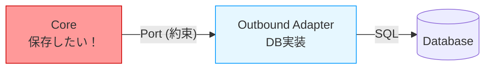

# 第07章：Outboundの考え方（中→外）➡️🗄️


（DB/外部API/時計…「外部に頼る処理」を、Coreからキレイに追い出す回だよ〜😆🔌✨）

---

## 7.1 Outboundってなに？まずは一言で！🧠✨


Outbound（アウトバウンド）は、**Core（中心のロジック）が、外部の何かを使いたいときの“出口”**だよ〜➡️🚪

たとえば…👇

* 注文を保存したい → DBが必要🗄️
* 決済したい → 外部決済APIが必要💳🌐
* 「今の時刻」が欲しい → 時計が必要⏰
* メールを送りたい → メール送信が必要✉️

でもね、ここで超大事なのは👇



この「内と外を分ける」のが Ports & Adapters の核だよ❤️
（ポート＝会話の目的、アダプタ＝差し替え可能な接続役、って感じ！） ([Alistair Cockburn][1])


---

## 7.2 なんで Outbound を分けるの？🥺➡️😊


### ① Coreが汚れない🧼✨

DBやHTTPやSDKの都合って、めっちゃ変わるよね😵‍💫
それが Core に入り込むと、業務ルール（守りたい部分）が一緒に壊れやすくなる…😭

### ② 差し替えがラクになる🔁💪

* DBを InMemory → SQLite → SQL Server に変える
* メール送信を 本物 → ダミー に変える
* 外部APIを 本番 → モック に変える

このへんが **“Coreノータッチで”** できるようになるのが最高に気持ちいい😆✨ ([Alistair Cockburn][1])

### ③ テストが超ラクになる🧪💖

DBなし、ネットなしでも、Coreのテストが回せるようになるよ〜！
（テストは “速い・安定・簡単” が正義👑）

---

## 7.3 Outbound になりやすいものリスト🗂️✅


「これ外部じゃん！」って判断しやすい代表例をまとめるね👇😆

### 🗄️ 永続化系

* DB（Repository）
* ファイル保存
* キャッシュ（Redisとか）

### 🌐 通信系

* 外部API（HttpClient系）
* 決済・認証・通知サービス

### ⏰ “非決定”なもの（テストを壊しがち😱）

* 現在時刻（DateTime.Now みたいなやつ）
* 乱数
* GUID生成
* 環境変数 / マシン名
* OSの時計やタイムゾーン

ここ、超重要ポイント💡
**「テストで固定できないもの」＝Outboundにしやすい**✨

---

## 7.4 Outbound設計の基本：Coreは「欲しいこと」だけ言う🗣️✨


Coreが言うべきなのは👇

❌「SQLでINSERTして、接続文字列はこれで…」
✅「注文を保存して」「注文を取得して」

つまり…
**Coreは “目的” を表す interface（Port）を持つ** ってことだよ🔌📝

---

## 7.5 例：注文を保存したい（Repository Port）☕🧾

Core側（ポート）では、こんな感じに「できること」だけ定義するよ👇

```csharp
namespace CafeApp.Core.Ports;

public interface IOrderRepository
{
    Task SaveAsync(Order order, CancellationToken ct);
    Task<Order?> FindByIdAsync(OrderId id, CancellationToken ct);
}
```

ポイント✅

* **DBとかEFとかSQLって単語が1ミリも出てこない**😆✨
* 「保存」「取得」みたいな **業務に近い言葉** になってる🗣️

---

## 7.6 例：時刻が欲しい（Clock / TimeProvider）⏰✨

「今の時間」は地味にテストを壊しがち😱
最近の .NET だと **TimeProvider** っていう“時間の抽象化”が用意されてて、テストしやすくなるよ〜🧪💖 ([Microsoft Learn][2])

### パターンA：Portを自作（わかりやすい）🔌

```csharp
namespace CafeApp.Core.Ports;

public interface IClock
{
    DateTimeOffset UtcNow();
}
```

外側（アダプタ）でこう実装👇

```csharp
namespace CafeApp.Adapters.Outbound;

using CafeApp.Core.Ports;

public sealed class SystemClock : IClock
{
    public DateTimeOffset UtcNow() => DateTimeOffset.UtcNow;
}
```

### パターンB：TimeProvider をそのまま使う（今風）🧠✨

TimeProvider は「時間の抽象化」だから、Portとして使いやすいよ〜 ([Microsoft Learn][2])

---

## 7.7 UseCaseから見たOutbond：依存は “Portだけ” にする🧩✅

UseCase（Core側の手順）が、外部に頼りたくなったら…👇

* **Port（interface）を受け取る**
* 具体実装（DB/HTTP/時計）は知らない

```csharp
namespace CafeApp.Core.UseCases;

using CafeApp.Core.Ports;

public sealed class CreateOrderUseCase
{
    private readonly IOrderRepository _orders;
    private readonly IClock _clock;

    public CreateOrderUseCase(IOrderRepository orders, IClock clock)
    {
        _orders = orders;
        _clock = clock;
    }

    public async Task<OrderId> HandleAsync(CreateOrderCommand cmd, CancellationToken ct)
    {
        var now = _clock.UtcNow();

        var order = Order.Create(
            customerName: cmd.CustomerName,
            createdAtUtc: now,
            items: cmd.Items);

        await _orders.SaveAsync(order, ct);

        return order.Id;
    }
}

public sealed record CreateOrderCommand(string CustomerName, IReadOnlyList<OrderItemCommand> Items);
public sealed record OrderItemCommand(string MenuItemId, int Quantity);
```

ここが最高ポイント😆💖
✅ UseCaseは **DBを知らない**
✅ UseCaseは **“保存できる”という約束だけ** 使う
→ だから差し替え放題🔁✨

---

## 7.8 Outbound Adapterの役目：外部の都合を全部ここで受け止める🤝🧯


Outbound Adapter（外側の実装）がやることは👇

* DBのモデルに変換する🔁
* 外部APIのDTOに変換する🔁
* 例外やリトライなど、外部都合の処理を抱える🧯
* Coreに「外部のクセ」を漏らさない🛡️✨

「外部は変わるもの」だからね〜😵‍💫
Coreは守る、外が頑張る、がバランス良い💪

---

## 7.9 よくある事故パターン集（超あるある😂）

### ❌ Coreで DbContext を new する

→ DBにベッタリになって差し替え不能😭

### ❌ Coreで HttpClient を直接叩く

→ 通信失敗/リトライ/認証…外部都合がCoreに侵入🌊😭

### ❌ Coreで DateTime.Now を直呼び

→ テストが日付で壊れる、タイムゾーンで壊れる😱
→ TimeProvider（またはClock Port）に逃がすと安定🧪✨ ([Microsoft Learn][2])

### ❌ Portがデカすぎる（神インターフェース化）👻

例：「IExternalServices」みたいに何でも盛る
→ 差し替えの粒度が荒くなる😵‍💫
👉 Portは **小さく・目的ごと** が基本🎯

---

## 7.10 AI活用のコツ（この章向け）🤖✨

AIに頼むと速いところ、めっちゃあるよ〜😆

### ① Portの候補を洗い出すプロンプト📝

* 「このUseCaseが外部に依存してる点を列挙して、Port案（interface）を提案して」
* 「Portを“業務用語”で命名して、メソッドシグネチャも考えて」

### ② Adapterの雛形生成🧩

* 「IOrderRepository を InMemory で実装して。スレッド安全性も少し意識して」
* 「DB実装（EF想定）で、Domain↔DBモデル変換はAdapter内に閉じて」

### ③ テスト支援🧪

* 「CreateOrderUseCase を、FakeRepository と FakeClock で単体テストして」

AIは雛形に強いけど、**境界ルール（Coreを汚さない）は人間が守る**のがコツだよ🚦😆

---

## 7.11 まとめ：第7章の合格ライン✅💮

最後に、これが言えたらOK〜！😆✨

* Outboundは **Core→外部** の出口➡️🚪
* Coreは **外部の具体を知らない**（Portだけ知る）🛡️
* DB・外部API・時計は Outbound になりやすい🗄️🌐⏰
* Adapterが外部都合（変換/例外/リトライ）を吸収する🧯
* 時刻は TimeProvider などの抽象化でテストが安定する🧪💖 ([Microsoft Learn][2])
* 今の最新は **.NET 10 / C# 14**（C# 14が最新リリース、.NET 10でサポート）だよ🆕✨ ([Microsoft Learn][3])

---

## おまけ：ミニ課題🎒✨

次の依存、OutboundにするならどんなPort名が良いと思う？😆

1. メール送信✉️
2. 決済💳
3. 乱数🎲
4. ファイル保存📁

（答え合わせしたくなったら、そのまま案を投げてね〜！🥳）

[1]: https://alistair.cockburn.us/hexagonal-architecture "hexagonal-architecture"
[2]: https://learn.microsoft.com/en-us/dotnet/standard/datetime/timeprovider-overview "What is the TimeProvider class - .NET | Microsoft Learn"
[3]: https://learn.microsoft.com/en-us/dotnet/core/whats-new/dotnet-10/overview "What's new in .NET 10 | Microsoft Learn"
