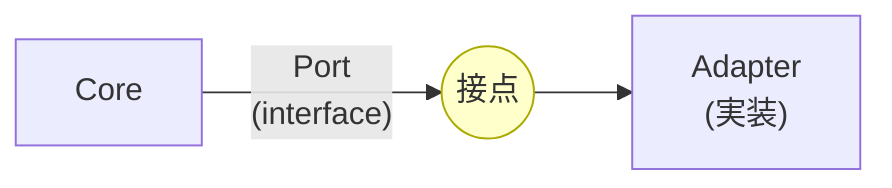

# 第08章：Portって何？（約束のinterface）📝🔌


この章のゴールはこれ！✨
**「Port＝“約束の形（interface）”」**をちゃんと理解して、**Core（中心）を守れる境界**を作れるようになることだよ〜😊💕

---

## 1) Portを一言でいうと？🔌✨


Portはね、**Coreと外側（UI/DB/外部APIなど）をつなぐ“コンセントの口”**みたいなものだよ⚡️😊
で、その“口の形”をC#で表すのが **`interface`** って感じ！

* Port ＝「こう呼んでね」「こう提供してね」っていう**約束**📝
* interface ＝ その約束を**型として固定**する道具💪✨



---

## 2) なんでPortをinterfaceにするの？（超だいじ）💖

### ✅ ① 外側を差し替えられる🔁


DBを InMemory → SQL に変えても、外部APIをモックにしても、**Core側は“約束（Port）”だけ見てればOK**になるよ😊

### ✅ ② テストがラクになる🧪✨

Portがinterfaceなら、テストでFake（ニセ実装）を差し込めるから、**DBなしでユースケース確認できる**👍

### ✅ ③ 依存の向きを守れる🛡️

「Coreが外側の詳細を知らない」状態を作れる！
これがヘキサゴナルの“強さ”だよ❤️

（ちなみに今のC# / .NETは、interfaceの表現力も強化されてて、静的メンバーの宣言などもできるようになってるよ〜。ただ、ヘキサ入門ではまず“シンプルな約束”として使うのがいちばん安全😊🧼） ([Microsoft Learn][1])

---

## 3) Portには2種類あるよ🚪➡️


### 🟦 Inbound Port（外→中）🚪

外側（Controller/CLI/GUI）が **Coreのユースケースを呼ぶための口**。

* 例：`ICreateOrderUseCase`（注文を作る）

✅ ポイント：
**interfaceはCore側に置く**（約束はCoreが持つ）
実装（UseCase本体）も基本Core側にあることが多いよ😊

---

### 🟩 Outbound Port（中→外）➡️

Coreが外側（DB/外部API/時計/メールなど）を **使うための口**。

* 例：`IOrderRepository`（注文を保存する）
* 例：`IPaymentGateway`（決済する）
* 例：`IClock`（現在時刻を取る）

✅ ポイント：
**interfaceはCore側**、**実装は外側（Adapter）**に置くよ✨

---

## 4) Port（interface）設計のコツ7つ🔧✨

### コツ①：Portは“小さく”🧸


「なんでも屋interface」になった瞬間に壊れる😭
**1つの目的に絞る**のが正義！

* ❌ `IAppService`（何でも入ってる）
* ✅ `ICreateOrderUseCase` / `IOrderRepository`

---

### コツ②：技術の匂いを入れない🧼


Portは“約束”だから、外側都合を混ぜないのが大事！

* ❌ `DbContext` / `HttpClient` / `HttpContext` が引数に出てくる
* ✅ `OrderId` / `Money` / `CreateOrderInput` みたいに**意味のある型**にする

---

### コツ③：戻り値は“欲しいものだけ”🎁

「外側が欲しがる形」じゃなくて、**ユースケースが返すべき結果**を返すよ😊

---

### コツ④：I/Oが絡むなら `Task` + `CancellationToken` を添える🧵

DBや外部APIは待ちが出るから、今どきは `async` が自然だよ✨

---

### コツ⑤：命名は“やりたいこと”で📛

`IOrderRepository` みたいな技術語より、
`IFindOrders` みたいな動詞系でもOK（チームの流儀で統一が大事😊）

---

### コツ⑥：例外は“設計が荒れる”原因になりがち⚠️

入門段階はまずシンプルでOKだけど、
**「業務的に起こりうる失敗」**（在庫不足とか）は、将来 `Result` っぽく分けると綺麗になりやすいよ😊🧯

---

### コツ⑦：Portは“Coreの言葉”で話す🗣️

画面の項目名じゃなくて、**業務の言葉**で！

* ❌ `TextBox1Value`
* ✅ `CustomerName` / `OrderItems`

---

## 5) ミニ題材（カフェ注文）でPortを書いてみる☕🧾

ここでは「注文を作る」ユースケースを想像してみよ〜😊

### ✅ Inbound Port（ユースケースの入口）🚪

```csharp
// Core/Application（例）
public interface ICreateOrderUseCase
{
    Task<CreateOrderOutput> HandleAsync(CreateOrderInput input, CancellationToken ct);
}

public sealed record CreateOrderInput(
    string CustomerName,
    IReadOnlyList<CreateOrderItemInput> Items
);

public sealed record CreateOrderItemInput(
    string MenuId,
    int Quantity
);

public sealed record CreateOrderOutput(
    string OrderId
);
```

💡ここがポイント！

* `Controller` がこのinterfaceを呼ぶだけにすると、入口が薄くなる😊✨
* 画面やAPIの都合を“そのまま”持ち込まず、最低限の入力にする🧼

---

### ✅ Outbound Port（DBへ保存する出口）🗄️

```csharp
// Core/Application（例）
public interface IOrderRepository
{
    Task SaveAsync(Order order, CancellationToken ct);
    Task<Order?> FindByIdAsync(string orderId, CancellationToken ct);
}
```

💡ポイント！

* ここに `DbContext` とか出したらアウト〜😭
* Coreは「保存できる」って事実だけ欲しいの😊

---

## 6) 「Portはどこに置く？」迷子にならないルール📦🧭


### ✅ 置き場所の鉄板

* **Port（interface）＝Core側（ApplicationやDomainの近く）**
* **Adapter（実装）＝外側（Infrastructure / Web / Persistenceなど）**

理由は単純で、**約束を持つ側が“主導権”を持つ**からだよ😊🛡️

---

## 7) よくある事故例（そして直し方）🚑💦

### 事故①：Portが肥大化🍔🍟

**症状**：Repositoryが10メソッド超えてきた…
**直し方**：ユースケース単位に分割する（例：検索用と保存用を分ける）✂️

### 事故②：Portに技術が漏れる🧪🫠

**症状**：引数に `DbContext` / `HttpClient` がいる
**直し方**：Portは“やりたいこと”、技術はAdapterに押し込む🧼

### 事故③：Port名が目的不明👻

**症状**：`IService` / `IManager` だらけ
**直し方**：動詞＋対象で言い切る（`ICreateOrderUseCase`）📛✨

---

## 8) AI活用（Copilot/Codex）で爆速にするコツ🤖⚡️

AIはPort設計でめっちゃ役立つよ〜！ただし **“境界ルール”は人が守る**のが大事😊🛡️

### 👇おすすめプロンプト例

* 「カフェ注文アプリの `ICreateOrderUseCase` をC#で。入力/出力DTOはrecord。技術依存（EF/Http）は入れないで」
* 「`IOrderRepository` を最小メソッドで設計して。メソッドが増えすぎないように」

✅ 生成されたら、最後にこれだけチェック！

* Portに技術語が混ざってない？
* メソッド増えすぎてない？
* “Coreの言葉”になってる？

---

## 9) 章末ミニ練習（手を動かそ〜！）✍️✨

### 練習①：時計Portを作ろう⏰


「現在時刻が欲しい」ってCoreが言ってる設定！

**あなたの課題**：`IClock` を定義してね😊

例の答え（こんな感じ！）👇

```csharp
public interface IClock
{
    DateTimeOffset Now { get; }
}
```

---

### 練習②：決済Portを作ろう💳✨

「合計金額を決済したい」

ヒント：

* 入力は `Money`（将来ValueObjectにする想定でもOK）
* 結果は `PaymentResult` みたいにしてもいいよ😊

---

## 10) 今日のまとめ✅💖

* **Port＝約束の口**、C#では **`interface`** で表す📝🔌
* Portは **Core側が持つ**（主導権は中心！）🛡️
* Inboundは「呼ばれる口」🚪／Outboundは「使う口」➡️
* **小さく・技術なし・Coreの言葉**が最強ルール😊✨

（最新の .NET 10 / C# 14 は2025年11月にリリースされ、Visual Studio 2026 も同時期に提供されてるよ〜📦✨） ([Microsoft for Developers][2])

[1]: https://learn.microsoft.com/en-us/dotnet/csharp/language-reference/keywords/interface?utm_source=chatgpt.com "interface keyword - C# reference"
[2]: https://devblogs.microsoft.com/dotnet/announcing-dotnet-10/?utm_source=chatgpt.com "Announcing .NET 10"
