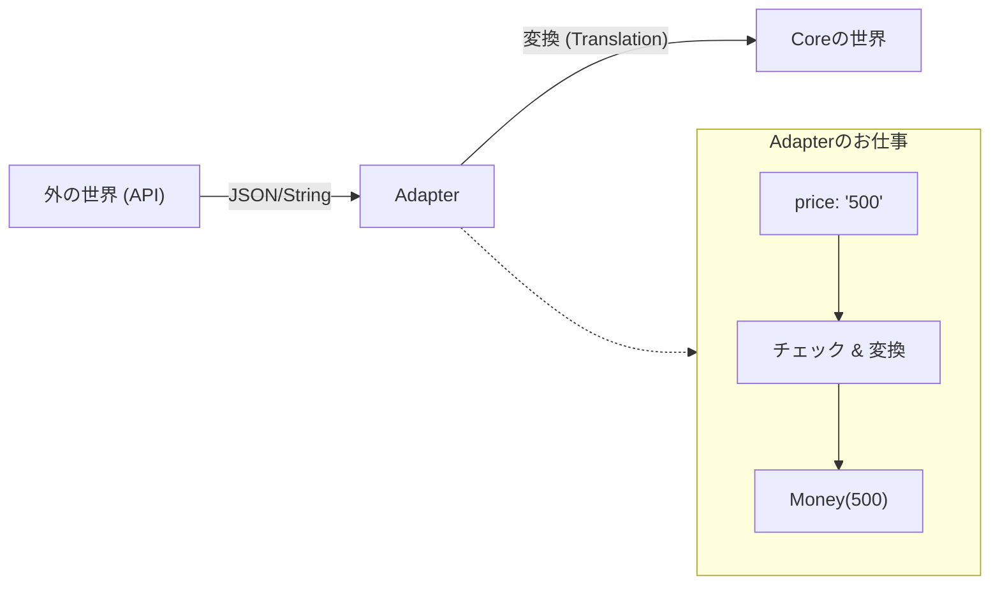

# 第09章：Adapterって何？（変換係）🔁🔌


この章は「Adapter＝通訳＆変換係！」って感覚をつかむ回だよ〜😊✨
Ports（約束）を“現実の世界”につなぐために、**外の都合を受け止めて、Coreに優しく渡す**のがAdapterの役目🧼🛡️

---

## 1) この章のゴール🎯✨

* Adapterが**何をしてOKで、何をしちゃダメか**がわかる😊
* 「DTO ↔ ドメイン」の**変換を押し込む場所**がわかる🔁
* 「外部の都合（HTTP/DB/JSONなど）」を**Coreに持ち込まない**感覚が身につく🧼✨

---

## 2) Adapterを一言でいうと？🗣️🔌


**Adapter＝Port（interface）の形に合わせて、外側を“変換”してつなぐ人**だよ😆🔁

たとえば👇

* Coreの世界：`UseCaseに渡す入力DTO` を渡したい🧭📦



この“世界の違い”を埋めるのがAdapter〜！🌍➡️🏠✨

---

## 3) Adapterがいっぱいいる理由（Inbound/Outbound）🚪➡️🗄️

### Inbound Adapter（外→中）⬅️🚪

外から来る呼び出しを、Portで呼べる形に整える係😊
例：Controller / CLI / バッチ / メッセージ購読（Queue）など

### Outbound Adapter（中→外）➡️🗄️

Coreが外部を使うとき、Portの約束に沿って実装する係😊
例：DB / 外部API / メール / ファイル / 時刻（Clock）など

---

## 4) Adapterの責務（やっていいこと）✅✨

Adapterがやっていいのは、だいたいこの4つに集約されるよ👇😊

### ✅ (1) 変換（Translation）🔁

* API Request（stringだらけ）→ Core入力DTO（型がしっかり）
* Core出力DTO → API Response（JSONにしやすい形）

### ✅ (2) 外の技術の面倒を見る🧰

* HTTPのステータスコード
* DBの接続やSQL/ORM
* 外部APIの認証・リトライ など

### ✅ (3) エラー変換（Error Mapping）🧯

* Coreの「業務エラー」→ 400 など
* 外部の「通信失敗」→ 503 など
  ※ **“意味”を変換する**のがポイント💡

### ✅ (4) 境界での軽いチェック📌

* null/空文字、数値パース、フォーマット確認
* ただし！**業務ルールの検証（例：注文の上限など）はCore側**だよ🛡️

---

## 5) Adapterがやっちゃダメなこと🚫🍝

ここ超大事〜！😵‍💫

* 🚫 **業務ルールをAdapterに書く**（あとで入口が増えると破綻しやすい）
* 🚫 **CoreがHTTP/DB/ORMの型に依存する**（差し替え不能になる）
* 🚫 **Controllerが巨大化**（変換・分岐・保存・ログ…全部入り🍝）

Adapterは「通訳」だから、**物語（業務ルール）を作らない**のが美しい✨

---

## 6) ミニ題材：カフェ注文アプリで体感しよ☕🧾

### 登場する“世界の違い”🌍

* 外側（API）：「price」が `"500"` みたいに文字列で来たりする😇
* Core：「金額はMoney型で安全に扱いたい」💎🔒

この差を**Adapterで吸収**するよ🔁✨

---

## 7) まず“Port（約束）”をCoreに置く📝🔌

### Inbound Port（注文作成ユースケース）🚪

```csharp
namespace Cafe.Core.Ports.Inbound;

public interface ICreateOrderUseCase
{
    Task<CreateOrderResult> HandleAsync(CreateOrderInput input, CancellationToken ct = default);
}

public sealed record CreateOrderInput(
    string CustomerName,
    IReadOnlyList<CreateOrderItemInput> Items
);

public sealed record CreateOrderItemInput(
    string MenuId,
    int Quantity
);

public sealed record CreateOrderResult(
    string OrderId
);
```

ここは「こう呼んでね！」の約束だけ✨
HTTPの話もJSONの話もゼロ😊🧼

---

## 8) Inbound Adapter例：Controllerは“薄く”いくよ🌐🙂

### APIのRequest/Response（外側の都合）📦

```csharp
namespace Cafe.Adapters.Inbound.WebApi;

public sealed record CreateOrderRequest(
    string? CustomerName,
    List<CreateOrderItemRequest>? Items
);

public sealed record CreateOrderItemRequest(
    string? MenuId,
    int? Quantity
);

public sealed record CreateOrderResponse(
    string OrderId
);
```

null許容なのが“外側っぽい”よね😇
Coreにこのnull地獄を持ち込まないのが勝ち🏆✨

### Controller（Adapter本体）🔁🔌

```csharp
using Cafe.Core.Ports.Inbound;
using Microsoft.AspNetCore.Mvc;

namespace Cafe.Adapters.Inbound.WebApi;

[ApiController]
[Route("api/orders")]
public sealed class OrdersController : ControllerBase
{
    private readonly ICreateOrderUseCase _useCase;

    public OrdersController(ICreateOrderUseCase useCase)
        => _useCase = useCase;

    [HttpPost]
    public async Task<ActionResult<CreateOrderResponse>> Create(
        [FromBody] CreateOrderRequest req,
        CancellationToken ct)
    {
        // ✅ 1) 境界の軽いチェック（null/空/パースなど）
        if (string.IsNullOrWhiteSpace(req.CustomerName))
            return BadRequest("CustomerName is required.");

        if (req.Items is null || req.Items.Count == 0)
            return BadRequest("Items are required.");

        // ✅ 2) 外→中 変換（Request -> Core Input DTO）
        var input = new CreateOrderInput(
            CustomerName: req.CustomerName.Trim(),
            Items: req.Items.Select(x =>
            {
                if (string.IsNullOrWhiteSpace(x.MenuId))
                    throw new ArgumentException("MenuId is required.");

                if (x.Quantity is null || x.Quantity <= 0)
                    throw new ArgumentException("Quantity must be > 0.");

                return new CreateOrderItemInput(
                    MenuId: x.MenuId.Trim(),
                    Quantity: x.Quantity.Value
                );
            }).ToList()
        );

        try
        {
            // ✅ 3) Portを呼ぶ（Coreの世界へ）
            var result = await _useCase.HandleAsync(input, ct);

            // ✅ 4) 中→外 変換（Core Result -> Response）
            return Ok(new CreateOrderResponse(result.OrderId));
        }
        catch (ArgumentException ex)
        {
            // ✅ エラー変換：入力の問題は 400
            return BadRequest(ex.Message);
        }
        // ここに「業務エラーを400にする」「外部失敗を503にする」などを積み上げていく✨
    }
}
```

ポイントまとめ😊👇

* Controllerは **受け取る → 変換 → 呼ぶ → 返す** の流れだけ🌊
* 業務ルールはUseCase側（Core）に寄せる🛡️

---

## 9) Outbound Adapterも“同じ発想”だよ🗄️🔁

Coreは「保存したい」だけ。だからPortはこう👇

```csharp
namespace Cafe.Core.Ports.Outbound;

public interface IOrderRepository
{
    Task SaveAsync(Order order, CancellationToken ct = default);
}
```

DBが何であれ、Coreは知らない😊
Adapterが「DBに合わせた形」に変換して保存する🔁🗃️

---

## 10) Adapterに変換を押し込むと何が嬉しい？🎁✨

* UIが増えても（Web/CLI/バッチ）**Coreがそのまま**😆🔁
* DBを変えても（InMemory→SQL）**Coreがそのまま**😆🔁
* テストが楽！Coreは外部なしで検証できる🧪💖

この“差し替えの強さ”がヘキサの気持ちよさだよ〜🔷✨

---

## 11) AI活用（Copilot/Codex）で爆速にするコツ🤖⚡

Adapterは定型が多いから、AIがめっちゃ得意😊✨
おすすめ指示（そのまま投げてOK）👇

* 「このRequestをCreateOrderInputに変換するメソッドを書いて。nullチェックとBadRequestも含めて」
* 「Controllerは薄く。変換・例外変換だけにして」
* 「Outbound AdapterとしてIOrderRepositoryをEF Coreで実装。Domain→DBモデル変換はAdapterに置いて」

⚠️注意：AIは油断すると **CoreにASP.NETやEF Coreのusingを混ぜてくる**ことがあるから、そこだけ人間が監査してね🚦👀

---

## 12) 章末チェックリスト✅🔍

* ✅ Adapterがやってるのは「変換・接続・エラー変換」だけ？
* ✅ Coreの型に、HTTP/DB/ORMの型が混ざってない？🧼
* ✅ Controllerが“薄い”まま？🍝になってない？
* ✅ DTO↔ドメイン変換がAdapterに寄ってる？🔁

---

## 13) おまけ：今どき版の前提（最新動向メモ）🆕✨

いまのC#は **C# 14 が最新**で、**.NET 10（LTS）**でサポートされてるよ😊 さらに **Visual Studio 2026** 側も .NET 10 を含む形で提供されている流れだよ〜🔧✨ ([Microsoft Learn][1])
.NET 10 は LTS で **3年間サポート（2028-11-10まで）**って明言されてるから、学習にも本番にも安心感あるね🛡️😊 ([Microsoft for Developers][2])

---

次の章（第10章）からは「依存の向き」をちゃんと図で整理して、**“Coreが外を知らない”**をもっとカチッと理解していくよ〜🧲➡️🛡️✨

[1]: https://learn.microsoft.com/en-us/dotnet/csharp/whats-new/csharp-14?utm_source=chatgpt.com "What's new in C# 14"
[2]: https://devblogs.microsoft.com/dotnet/announcing-dotnet-10/?utm_source=chatgpt.com "Announcing .NET 10"
