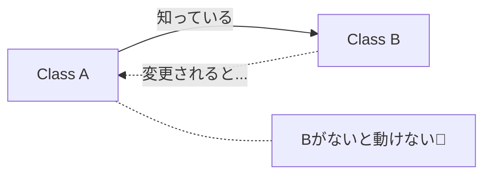

# 第10章：依存の向き①：依存ってそもそも何？🧲🙂


## 今日のゴール🎯✨

* 「依存」って言葉を、コード上でちゃんと見つけられるようになる👀✅
* 矢印（A → B）の意味を、迷わず説明できるようになる➡️📌
* 「依存が増えると何がツラいの？」を体感できるようになる😵‍💫➡️😊

---

## 1) 依存ってなに？一言でいうと🧲

**「このコードが “相手” を知らないと動けない状態」**のことだよ🙂✨

たとえば…

* あなたが「電車🚃」に依存して通学してるなら
  電車が止まると影響が出るよね？😵‍💫
* コードも同じで、**依存先が変わると、自分も直すハメになりやすい**の🥲

---

## 2) 依存は “悪” じゃないよ🙆‍♀️✨（でも増え方が問題）

依存ゼロのプログラムって基本ムリ！😂
ただし、こうなるとツラい👇

* 依存が多すぎて、変更のたびに爆発する💥😭
* テストしたいのにDBや外部APIが必須で詰む🧪🚫
* 「本当に守りたい業務ルール」が外の都合に巻き込まれる🌀🧼

だからこの章は、まず **“依存を見える化”** する練習をするよ👀✨

---

## 3) コード上の「依存」って、具体的にどれ？🧩

初心者さんが混乱しやすいけど、依存っていろんな形があるよ🙂

### A. 型（クラス/インターフェース）を知ってる依存📦

「この型を使う！」って書いた時点で依存が発生しやすい💡

* 変数の型
* 引数の型
* 戻り値の型
* フィールドの型

### B. `new` する依存🧱

`new X()` って書いた瞬間、かなり強い依存になりがち😵‍💫
（なぜなら “Xじゃないとダメ” を自分で決め打ちしてるから！）

### C. 呼び出す依存☎️

`foo.Bar()` みたいにメソッド呼び出ししてるのも依存📞
相手の仕様が変わったら壊れる可能性があるよね🥲

### D. 参照（プロジェクト参照/NuGet）依存📎

プロジェクトが参照しているライブラリに依存してるよ📦✨
（SQL、HTTP、JSON、ログ、ORM…ぜんぶここ！）

> ちなみに `using` は “依存そのもの” というより **名前空間のショートカット** だよ🙂
> でも、`using` してる先の型を使ったら依存が発生！って覚えるとラク👍

---

## 4) “矢印” の意味を固定しよう➡️📌


図で「A → B」って書いたら、基本こう思ってOK🙆‍♀️

✅ **A が B を知っている（使っている）**
✅ **B が変わると A が困る可能性がある**

つまり、矢印はこういう “片思い” なの💘😂
Aが「Bに頼ってる」状態だよ🧲



---

## 5) 例でやってみよ！依存を数えるゲーム🎮✨

### 例1：`new` があると依存が強い🧱😵‍💫

```csharp
public class OrderService
{
    public void PlaceOrder()
    {
        var repo = new SqlOrderRepository(); // ← 強い依存（決め打ち）
        repo.Save();
    }
}
```

ここでの依存は👇

* `SqlOrderRepository` という具体クラスを知ってる📦
* `new` で固定してる🧱
* `Save()` を呼び出してる☎️

**結果**：DB実装を変えたくなったら、`OrderService` を直す確率が高い🥲

---

### 例2：依存が「型」から生まれる📦

```csharp
public class OrderController
{
    private readonly CreateOrderUseCase _useCase;

    public OrderController(CreateOrderUseCase useCase) // ← 型依存
    {
        _useCase = useCase;
    }
}
```

ここは `new` がないけど、まだ依存はあるよ🙂
依存先が `CreateOrderUseCase`（具体クラス）だから、差し替えには弱め🥲

---

## 6) 依存が増えると何が困る？（3つの痛み）😵‍💫💥

### ① 変更が “連鎖” する🌀

AがBに依存、BがCに依存…ってなると
Cの変更でAまで巻き込まれることがある😭

### ② テストがしんどい🧪🚫

* DBが起動してないとテストできない
* 外部APIが落ちてるとテスト落ちる
* 速度も遅い🐢💦

### ③ 本来の関心が混ざる（ぐちゃぐちゃ化）🍝

業務ルールのはずなのに、SQLやHTTPの都合が混ざって汚れがち🧼😭

---

## 7) 2026のC#/.NET環境だと “ここ” も知っておくと安心🧠✨

いまの最新ラインだと、**C# 14 は .NET 10 以降でサポート**されてるよ📌 ([Microsoft Learn][1])
そして **.NET 10 はLTS（長期サポート）**で、3年間サポートが続く（2025年11月〜2028年11月頃）という位置づけだよ🛡️✨ ([Microsoft for Developers][2])

これが何に効くかというと👇

* 「C#の新しめ機能を使ったらビルドできない😵‍💫」みたいな事故は、**ターゲット（TFM）とC#バージョンの噛み合わせ**が原因なことが多いのね📎 ([Microsoft Learn][1])

---

## 8) 演習✍️✨（超大事！）

### 演習1：依存にマーカーを引こう🖍️👀

次のコードで「依存」を全部見つけて、コメントで印をつけてみてね🙂

```csharp
public class MailNotificationService
{
    public void Notify(string to, string message)
    {
        var client = new SmtpClient("smtp.example.com");
        client.Send(to, message);
    }
}
```

✅チェック観点

* `new` してる？🧱
* 具体クラスを型で握ってる？📦
* 何かを呼び出してる？☎️
* 文字列・設定値に依存してる？🔧

---

### 演習2：「依存の矢印」を描こう➡️📝

頭の中でOKだから、こういう矢印を書いてみてね😊

* `MailNotificationService → SmtpClient`
* `MailNotificationService → "smtp.example.com"`（設定依存っぽい）

この “矢印を描ける力” が、次章以降でめちゃ効くよ💪✨

---

## 9) Visual Studioで “依存っぽいところ” を探すコツ🔎✨

* **Find All References**：この型どこで使ってる？👀
* **Go To Definition**：その先の実装、今どこ？🧭
* **プロジェクト参照/NuGet一覧**：そもそも何に依存してる？📦

「うわ…影響範囲わからん😭」って時は、まずここからでOK🙂👍

---

## 10) AI活用（Copilot/Codex）で爆速チェック🤖✨

おすすめの頼み方👇（そのままコピペでOK系）

* 「このクラスの依存先を “型 / new / 呼び出し / 設定” に分類して列挙して」🧩
* 「依存が強い箇所を3つ挙げて、理由も書いて」🧲
* 「このコードの依存関係を矢印（A→B）で説明して」➡️

ただし⚠️：AIは境界を勝手に壊す提案もしがちだから、**“矢印の向き” は人間が守る**のがコツだよ🚦🙂

---

## まとめ✅✨（ここだけ覚えれば勝ち！）

* 依存＝「相手を知らないと動けない」状態🧲
* 依存は悪じゃないけど、増えすぎ・向きが雑だと地獄🍝😭
* 矢印 A→B は「AがBを知ってる／頼ってる」➡️
* `new` は依存を強くしがち🧱😵‍💫（次章以降でうまく扱うよ！）

---

## 次章チラ見せ👀✨

次は **「Coreが外を知らない」** っていう、ヘキサの超大事ルールに入るよ🛡️🚫
この章でやった「依存の矢印」が、そのまま武器になるからね💪🔷

[1]: https://learn.microsoft.com/en-us/dotnet/csharp/language-reference/language-versioning?utm_source=chatgpt.com "Language versioning - C# reference"
[2]: https://devblogs.microsoft.com/dotnet/announcing-dotnet-10/?utm_source=chatgpt.com "Announcing .NET 10"
