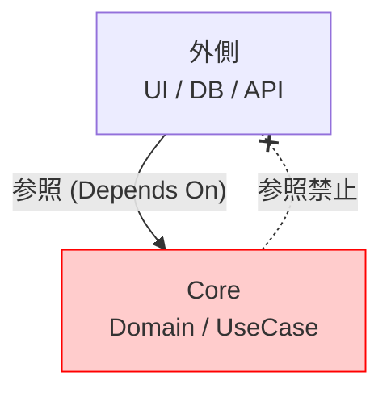

# 第11章：依存の向き②：Coreが外を知らない設計🛡️🚫


## まず今日の結論🎯

**Core（業務ルール側）は、DB・Web・フレームワークの“名前”を知らない**のが勝ちです😊✨
外側は差し替えるもの。中心は守るもの。これだけ覚えればOK〜！🔷💪

---

## 1) なんで「Core→DB参照」がダメなの？🥲🗄️


### 理由①：差し替えたくなった瞬間、Coreが巻き添え💥

DBを **SQL Server → PostgreSQL** にしたい、ORMを **EF → Dapper** にしたい、みたいな話って普通に起きます🔁
でもCoreがDBやORMを直に呼んでると、**業務ルールまで一緒に書き換え**になって地獄😵‍💫

### 理由②：テストが遅くてしんどい😫🧪

Coreのテストをしたいだけなのに、DB起動・接続・データ準備…ってなると
「テスト書く気が消える」現象が起きます🫠
Coreが外を知らなければ、**DBなしで秒速テスト**ができるようになります⚡

### 理由③：外側の都合（バージョン縛り）がCoreに侵入する🔒

例えば **EF Core 10 は .NET 10 が必須**です。つまりEFをCoreに入れると、Coreまで強制的にその都合に縛られやすいです😵‍💫
（外側の都合＝詳細 が、中心に入ってくるのが一番イヤなやつ！） ([Microsoft Learn][1])

---

## 2) 依存の矢印を「絵」で理解しよ📌➡️

依存って、ざっくりこうです👇

* **Coreが外を参照する**＝Coreが外の型やライブラリ名を知ってる（using / new / 継承 / DbContext など）
* **外がCoreを参照する**＝外側がCoreの“約束（Port）”に合わせて実装する

イメージ図（理想）🧡



---

## 3) NG例：CoreがEF Coreを直に呼んでしまう😱🧨


「動くからOK」でやりがちなやつ…！でも後で泣きます😭

```csharp
// ❌ Core側（Application）に EF Core が入ってきてる例
using Microsoft.EntityFrameworkCore;

public class CreateOrderService
{
    private readonly CafeDbContext _db; // DbContextが見えてる時点でアウト😵‍💫

    public CreateOrderService(CafeDbContext db)
    {
        _db = db;
    }

    public async Task<Guid> HandleAsync(CreateOrderCommand cmd)
    {
        var order = new Order(cmd.CustomerName, cmd.Items);
        _db.Orders.Add(order);               // DB操作がCoreに混入
        await _db.SaveChangesAsync();        // さらに混入
        return order.Id;
    }
}
```

### これの何が痛い？😵

* Coreが **EF Core / DbContext** を知っちゃった
* テストで `DbContext` を立てる必要が出がち
* DB差し替え・永続化方式変更のたびに **業務ロジック側の修正**が発生しやすい

---

## 4) OK例：Coreは「やりたいこと」だけ言う📝✨（外は後で付ける）

ポイントはこれ👇
Coreは **「保存してね」** とだけ言う（= 約束）。
**どう保存するか（EFで？ファイルで？APIで？）は外側**が決める🔁

### Core側：Port（約束）だけ置く🧩

```csharp
// ✅ Core側（Application or Domain）
// 「注文を保存できること」だけ約束する
public interface IOrderRepository
{
    Task AddAsync(Order order, CancellationToken ct);
}
```

```csharp
// ✅ Core側：UseCaseはPortだけを使う
public class CreateOrderService
{
    private readonly IOrderRepository _repo;

    public CreateOrderService(IOrderRepository repo)
    {
        _repo = repo;
    }

    public async Task<Guid> HandleAsync(CreateOrderCommand cmd, CancellationToken ct)
    {
        var order = new Order(cmd.CustomerName, cmd.Items);
        await _repo.AddAsync(order, ct); // ここには「保存する」しか書かない😊
        return order.Id;
    }
}
```

### 外側（Adapter）でEF Core実装する🗄️⚙️

```csharp
// ✅ 外側（Infrastructure / Outbound Adapter）
using Microsoft.EntityFrameworkCore;

public class EfOrderRepository : IOrderRepository
{
    private readonly CafeDbContext _db;

    public EfOrderRepository(CafeDbContext db)
    {
        _db = db;
    }

    public async Task AddAsync(Order order, CancellationToken ct)
    {
        _db.Orders.Add(order);
        await _db.SaveChangesAsync(ct);
    }
}
```

✅ これで「DBを変えたい」ってなっても、**変えるのはAdapter側だけ**になりやすいです😆🔁

---

## 5) じゃあ「Coreが外を知らない」って、具体的に何を守ればいい？🚦✨

### ✅ 最低限のルール（超だいじ）💎

* Coreプロジェクトには **EF Core / ASP.NET Core / HttpClient / Serilog** みたいな外側ライブラリを入れない
* Coreは `System.*` と、自分のDomain型くらいで生きる🌱
* DBのテーブル都合のクラス（Entity Framework用のモデル）をCoreに置かない🙅‍♀️

### ✅ Visual Studioでできる「事故防止」🧯

* **プロジェクト参照**をルール化

  * `Core` は誰も参照しない（参照される側）
  * `Infrastructure` は `Core` を参照してOK
  * 逆は絶対NG❌
* 依存関係の可視化には、VSの依存関係図・コードマップ系の機能も役立ちます🗺️✨ ([Microsoft Learn][2])

---

## 6) ミニ演習🧪😆（10分で「強さ」を体験）

### お題☕

「注文保存」を **InMemory → EF Core** に変える時、**CreateOrderService を1行も変えない**でできる？🔁

やること👇

1. `IOrderRepository` をCoreに置く📝
2. 最初は `InMemoryOrderRepository` を外側に作る📦
3. 後から `EfOrderRepository` を追加🗄️
4. DIの登録だけ差し替える（配線替え）🧩✨
   → UseCase（Core）が変わらなかったら勝ち🎉

---

## 7) ガチで事故を減らす「アーキテクチャテスト」✅🧪

「うっかりCoreにEF入れちゃった」をテストで止めるやつです🚓✨
たとえば **ArchUnitNET** みたいなライブラリで「CoreはInfrastructureを参照しない」を自動チェックできます🧠
（CIに入れると、未来の自分が助かる🥹） ([GitHub][3])

---

## 8) AI（Copilot/Codex）に頼むと強いプロンプト例🤖✨

そのまま貼ってOKなやつ置いとくね😊

* 「Coreプロジェクト内で、EF Core など外部ライブラリ参照（`using Microsoft.EntityFrameworkCore` 等）が混入してないか探して、混入箇所の修正案を出して」🕵️‍♀️🔎
* 「このソリューションの依存方向を文章で説明して。NGな参照があれば列挙して」🧭
* 「CreateOrderService が DB を知らない形に直して。必要な interface と adapter も提案して」🧩

---

## まとめ💖

* Coreは**業務ルールの城🏯**だから、外（DB/HTTP/UI）を中に入れない🛡️
* 外は差し替える、Coreは守る🔁
* まずは **“Coreが外の名前を知らない”** を合言葉にしよ😊✨

次の第12章では、この考えを完成させるための **「Portで依存を逆転（DIP超入門）」** に突入するよ〜！🔁❤️

[1]: https://learn.microsoft.com/ja-jp/ef/core/what-is-new/ef-core-10.0/whatsnew?utm_source=chatgpt.com "EF Core 10 の新機能"
[2]: https://learn.microsoft.com/en-us/visualstudio/modeling/analyze-and-model-your-architecture?view=visualstudio&utm_source=chatgpt.com "Architecture analysis & modeling tools - Visual Studio"
[3]: https://github.com/TNG/ArchUnitNET?utm_source=chatgpt.com "TNG/ArchUnitNET: A C# architecture test library to specify ..."
