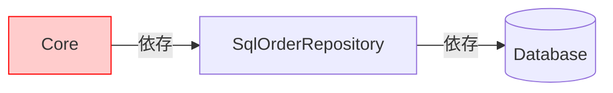
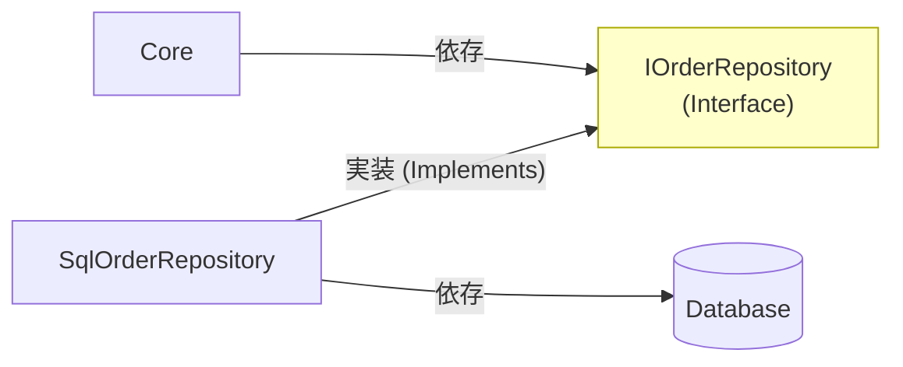

# 第12章：依存の向き③：Portで逆転する（DIPの超入門）🔁🧠


この章のゴールはこれだけ！👇
**「Coreが“外側の実装”に依存しないように、Port（interface）で依存をひっくり返せる」**ようになることです😆✨
ヘキサの心臓部❤️はここだよ〜！

---

## 1) まず、いちばん大事な絵（依存の向き）🧲➡️


やりたい世界はこれ👇

* Core（業務ルール・ユースケース）は **「〜してほしい」** だけ言う
* DBや外部APIは **「了解！そのやり方でやるね」** を外側で実装する
* つまり **“詳細が抽象（Port）にぶら下がる”** 形になる💡

そして最新の前提としては、**.NET 10（例：10.0.2）**が最新LTSとして提供されていて、**C# 14は .NET 10 以降でサポート**されています。([Microsoft][1])
（IDEも **Visual Studio 2026** の更新が続いてるよ〜🧰✨）([Microsoft Learn][2])

---

## 2) DIPってなに？（超やさしく）🧠🪄


DIP（依存性逆転の原則）は、ざっくり言うと👇

* **大事な側（Core）が、細かい側（DB等）に依存しない**
* **どっちも “約束（interface）” に依存する**
* **細かい側が、その約束を実装して合わせにくる**

つまり…
**「Coreが“注文”する側で、外側が“納品”する側」**って感じ😆📦

（Microsoftの解説でも、Dependency Inversionは「具体ではなく抽象に依存する」って説明されてるよ。）([Microsoft Learn][3])

---

## 3) ありがちな事故🍝😭：CoreがDB直叩きしちゃう


たとえばユースケースが、DBのクラスを直接 new しちゃうと…👇

```csharp
// ❌ 悪い例：Core側がDB実装にベタ依存
public class CreateOrderUseCase
{
    private readonly SqlOrderRepository _repo;

    public CreateOrderUseCase()
    {
        _repo = new SqlOrderRepository("Server=...;Database=...");
    }

    public async Task ExecuteAsync(CreateOrderCommand command)
    {
        // 業務ルール…
        var order = new Order(command.CustomerId, command.Items);

        // DB保存（詳細がCoreに入り込んでる😱）
        await _repo.SaveAsync(order);
    }
}
```

これ、何がツラいかというと…😵‍💫

* DBを変えたい（SQLite→SQL Serverとか）だけで **Coreが大改造**
* テストしたいのに **DBが必須**（遅い・不安定・面倒）
* “外側の都合”がCoreに混ざって、設計がどんどん崩れる🧼💥

---

## 4) 解決：Port（interface）をCoreに置く📝🔌✨

ここからが本番！😆🔥
Coreが欲しいのは「DBの種類」じゃなくて、

> **「注文を保存できること」**
> **「注文を取り出せること」**

みたいな “やりたいこと” だけだよね？😊
それを **Port** にする！

### 4-1) Coreに Port を作る（約束）📝


```csharp
// ✅ Core側（Application or Domain）に置く
public interface IOrderRepository
{
    Task SaveAsync(Order order);
    Task<Order?> FindByIdAsync(OrderId id);
}
```

ポイント💡

* **interfaceはCoreに置く**（＝Coreが主導権を持つ）👑✨
* 名前は “DB名” を入れない！（SqlOrderRepository みたいにしない）🙅‍♀️

### 4-2) UseCaseは Port にだけ依存する🛡️

```csharp
// ✅ Core側：抽象（Port）に依存
public class CreateOrderUseCase
{
    private readonly IOrderRepository _repo;

    public CreateOrderUseCase(IOrderRepository repo)
    {
        _repo = repo;
    }

    public async Task ExecuteAsync(CreateOrderCommand command)
    {
        var order = new Order(command.CustomerId, command.Items);

        // ✅ ここでDBの種類とか一切知らない😇
        await _repo.SaveAsync(order);
    }
}
```

これでCoreはスッキリ！🧼✨
「保存よろしく〜」って頼むだけ😊📨

---

## 5) Adapter（外側）が Port を実装する🔁🗄️


次に外側（Infrastructure / Outbound Adapter）で、約束を守る実装を書くよ👇

```csharp
// ✅ 外側（Adapter側）：Portを実装（詳細はこっちに閉じ込める）
public class SqlOrderRepository : IOrderRepository
{
    private readonly string _connectionString;

    public SqlOrderRepository(string connectionString)
    {
        _connectionString = connectionString;
    }

    public Task SaveAsync(Order order)
    {
        // ここにSQL/ORM/DB都合を書いてOK🙆‍♀️
        return Task.CompletedTask;
    }

    public Task<Order?> FindByIdAsync(OrderId id)
    {
        return Task.FromResult<Order?>(null);
    }
}
```

✅ **DBの都合は外側に隔離！**🧼
✅ **Coreは何も知らない！**🙈✨

---

## 6) ここが「依存が逆転」してる瞬間⚡🔁


### Before（事故）😭

### Before（事故）😭



### After（ヘキサの心臓❤️）



**矢印が逆転してる！**😆🎉
「詳細（SqlOrderRepository）が、Coreの決めた約束（IOrderRepository）に従う」って構図だよ。

---

## 7) “配線”はどこでやるの？🧩🔧（超ミニ）

「じゃあ IOrderRepository の中身って誰が入れるの？」ってなるよね😊
ここで登場するのが **.NET のDI（依存性注入）**！🧰✨
（.NETには標準のDIコンテナがあって、interface→実装の紐付けを登録できるよ。）([Microsoft Learn][4])

イメージだけ👇（詳しくは後のDI章でガッツリやるよ！）

```csharp
// Program.cs 側（外側）で配線するイメージ
builder.Services.AddScoped<IOrderRepository, SqlOrderRepository>();
builder.Services.AddScoped<CreateOrderUseCase>();
```

✅ **配線は外側**
✅ **Coreは配線の存在すら知らない**
これが気持ちよさ😆💖

---

## 8) テストが一気にラクになる🧪💖


Portがあると、テストでは **Fake（偽物Adapter）** を差すだけ！

```csharp
public class FakeOrderRepository : IOrderRepository
{
    public List<Order> Saved { get; } = new();

    public Task SaveAsync(Order order)
    {
        Saved.Add(order);
        return Task.CompletedTask;
    }

    public Task<Order?> FindByIdAsync(OrderId id)
        => Task.FromResult<Order?>(Saved.FirstOrDefault(o => o.Id == id));
}
```

```csharp
// ✅ DBなしでユースケース検証できる😆🎉
var fakeRepo = new FakeOrderRepository();
var useCase = new CreateOrderUseCase(fakeRepo);

await useCase.ExecuteAsync(new CreateOrderCommand(...));

Assert.Single(fakeRepo.Saved);
```

「DB起動して〜接続文字列用意して〜」が消える！🪄✨
これ、体験すると沼るよ😆💕

---

## 9) よくあるつまずきポイント集🪤😵‍💫

* **Q：PortってAdapterごとに作るの？**
  A：基本は「Coreが欲しい能力」単位だよ😊（保存したい→Repository、外部API呼びたい→Client など）📡

* **Q：interface増やしすぎない？**
  A：増やす理由は「差し替えたい」「テストしたい」「外部都合を隔離したい」があるときだけでOK👌✨

* **Q：Portに“DBっぽいメソッド”を置いちゃった…**


  A：ありがち！🤣
  `ExecuteSql(string sql)` みたいなのは **外部都合そのもの** だから、Portに置くとCoreが汚れちゃう🧼💥
  → Portは「業務の言葉」で作ろう☕🧾

---

## 10) AI活用（Copilot/Codex）で爆速にするコツ🤖⚡

AIは便利だけど、**境界ルールは人間が守る**🚦✨

### 💡おすすめプロンプト（そのまま投げてOK）

* 「`IOrderRepository` を *業務目線* のメソッド名で設計して。DB都合の語彙（SQL/テーブル等）は禁止」
* 「`SqlOrderRepository` の雛形を作って。変換（DBモデル↔ドメイン）はこのクラス内に閉じて」
* 「UseCaseは `IOrderRepository` だけを受け取る形に修正して。`new` はUseCase内で禁止」

### ✅AI出力のチェック観点👀

* Coreに `using Microsoft.EntityFrameworkCore;` が入ってない？😱
* Coreが `Sql〜` みたいな具象名を参照してない？🙈
* Portのメソッド名が “業務の言葉” になってる？☕🧾

---

## 11) ミニ演習（15〜30分）✍️🔥

### 演習A：事故コードを救出🦸‍♀️

1. UseCaseから `new SqlOrderRepository()` を消す
2. `IOrderRepository` をCoreに作る
3. UseCaseは `IOrderRepository` をコンストラクタで受け取る
4. 外側に `SqlOrderRepository : IOrderRepository` を作る

### 演習B：差し替え体験🔁

* `InMemoryOrderRepository` を作って差し替える📦
* Coreを一切変えずに動けば大成功😆🎉

---

## 12) 今日のチェックリスト✅✨（ここまでできたら勝ち！）

* [ ] UseCaseが **具象クラス**（Sql〜/EF〜）を参照してない🛡️
* [ ] Coreに **Port（interface）** があり、UseCaseはそれだけに依存してる🔌
* [ ] Adapterが **Portを実装**して、詳細を外側に隔離できてる🧼
* [ ] Fake差し替えで **DBなしテスト**ができる🧪💖

---

必要なら、次の返事で「第15章のカフェ注文アプリ☕」を前提にして、**この第12章の内容を“実コードに落とし込む完全版（ファイル構成つき）”**も作れるよ😆📦✨

[1]: https://dotnet.microsoft.com/en-us/download/dotnet?utm_source=chatgpt.com "Browse all .NET versions to download | .NET"
[2]: https://learn.microsoft.com/en-us/visualstudio/releases/2026/release-notes?utm_source=chatgpt.com "Visual Studio 2026 Release Notes"
[3]: https://learn.microsoft.com/en-us/archive/msdn-magazine/2014/may/csharp-best-practices-dangers-of-violating-solid-principles-in-csharp?utm_source=chatgpt.com "C# Best Practices - Dangers of Violating SOLID Principles ..."
[4]: https://learn.microsoft.com/en-us/dotnet/core/extensions/dependency-injection?utm_source=chatgpt.com "NET dependency injection"
