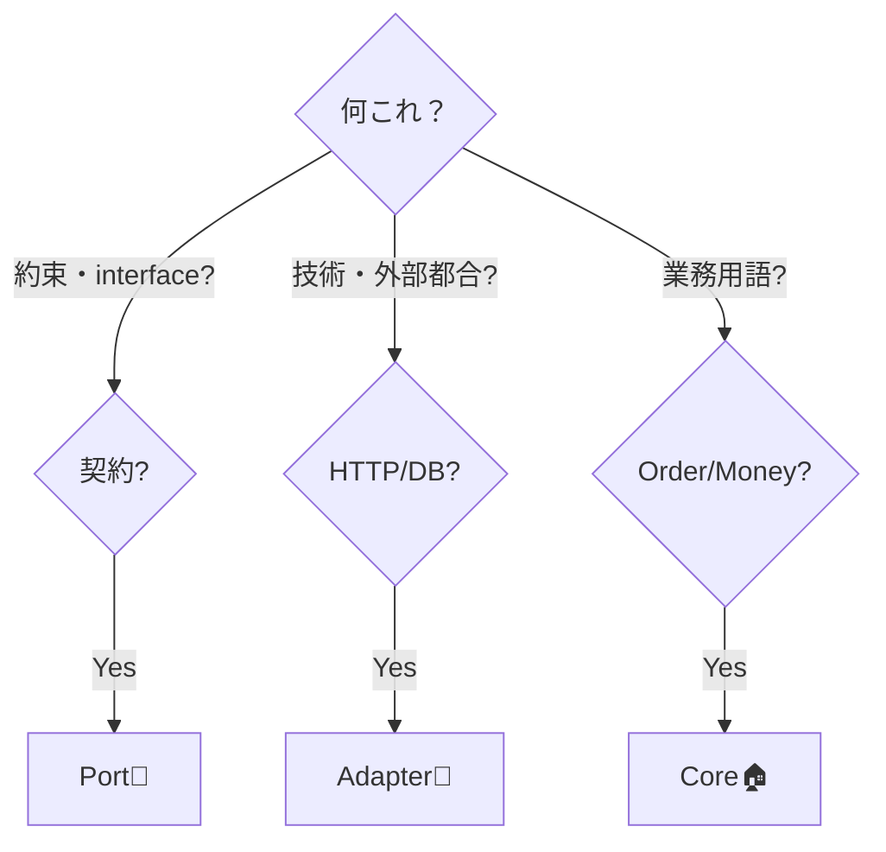

# 第13章：他アーキとの関係①：まずヘキサだけで覚えよう🔷📌


前の章（10〜12章）で「依存の矢印はCoreに向ける」「Portで逆転できる（DIPの超入門）」までやったよね！🙂
ここから急に「クリーンアーキだと〜」「レイヤードだと〜」って混ぜ始めると、**頭がごちゃっ🍝** になりやすいの🥲

だからこの章は、いったん徹底的に👇だけで整理するよ！

* **Core / Port / Adapter** の3つだけ！🧠✨
* 迷ったら「それPort？Adapter？」で判定するだけ！🔍🔌

（ヘキサ＝Ports & Adaptersの呼び名は、Alistair Cockburnが“Ports and Adapters”として整理しているよ。） ([Alistair Cockburn][1])

---

## 1) まずは「混ぜない」って、何が嬉しいの？😆🧼

混ぜると何が起こるかというと…

* 「これ…Controllerの責務？UseCaseの責務？Repositoryの責務？」って迷子になる😵‍💫
* “名前はきれい”なのに、中身はぐちゃぐちゃ🍝
* **テスト**も「どこをどうテストするの？」ってつらい🧪😭

逆に、**ヘキサだけで覚える**とこうなる👇

* 迷った瞬間に「Port？Adapter？」で判断できる✅
* 「Coreは守るべき中心🛡️」「外は差し替え対象🔁」がブレない
* 結果、後でレイヤード/クリーンを見ても「言い方が違うだけだね🙂」ってなる

---

## 2) ヘキサの一枚絵（今日の脳内イメージ）🧠🔷

ポイントは「会話（やりとり）＝Port」「つなぐ変換＝Adapter」だよ🙂
Cockburnの説明でも、Portは“目的のある会話（conversation）”として捉えられてるよ。 ([Alistair Cockburn][1])

* **Core**：業務ルール＆手順（UseCase含む）🏠❤️
* **Port**：Coreが決める「約束（interface）」📝🔌
* **Adapter**：外の都合を変換してつなぐ人🔁🔌

---

## 3) 「それPort？Adapter？」秒速判定ルール⚡🔍


迷ったらこの3ステップでOK！😊✨

### ✅ ステップA：それは“約束”？？📝

* 「こう呼んでね」「こうしてほしい」が **interface** になってる
  → **Port** の可能性大！🔌

### ✅ ステップB：それは“外の都合”？？🌐🗄️📡

* ASP.NET / DB / EF Core / HttpClient / ファイル / 時刻 / メール…みたいな**技術・外部**の話
  → **Adapter** の可能性大！🔌✨

### ✅ ステップC：それは“業務の言葉”？？☕🧾

* 注文、金額、商品、在庫…みたいに **業務の概念**で書ける
  → **Core**（Domain/Application）寄り🏠❤️



---

## 4) よくある判定例（カフェ注文アプリ☕で見る）👀✨

### 🟩 Inbound側（外→中）⬅️🚪

* `OrdersController`（ASP.NET Controller）
  → **Inbound Adapter** 🌐🔁
* `ICreateOrderUseCase`
  → **Inbound Port** 🚪📝
* `CreateOrderUseCase`（ユースケース実装）
  → **Core** 🏠🧭

### 🟦 Outbound側（中→外）➡️🗄️

* `IOrderRepository`
  → **Outbound Port** 🗄️📝
* `EfCoreOrderRepository` / `InMemoryOrderRepository`
  → **Outbound Adapter** 🗄️🔁
* `ISystemClock`（今の時刻ほしい…みたいな）
  → **Outbound Port** ⏰📝
* `SystemClock`（DateTime/TimeProviderを使って実装）
  → **Outbound Adapter** ⏰🔌

---

## 5) “混ぜると壊れる”あるある集（超重要）⚠️🥲

### ❌ あるある①：CoreがASP.NETを知ってる🌐🚫

* UseCaseが `IActionResult` を返す
* Coreが `HttpContext` を触る

👉 これやると、**UI差し替え**も**テスト**も一気にしんどい😭

### ❌ あるある②：CoreがEF Coreを知ってる🗄️🚫

* Core内に `DbContext` や `EntityFramework` の型が出てくる
* LINQの都合でドメインが歪む

👉 DB差し替えが「ほぼ無理ゲー」になる😵‍💫

### ❌ あるある③：DTO変換がCoreに漏れる📦🚫

* CoreがAPIのDTOを直接受け取る/返す

👉 外の都合が中に侵入して、じわじわ腐る🍂🥲

---

## 6) 今日の“混ぜない”チェックリスト✅🧼✨

作業中に、これを毎回チラ見してね👀💕

* Coreのプロジェクトから、ASP.NET/EF/HttpClient等を参照してない？🛡️
* **Port（interface）はCore側**に置いてる？🔌
* Adapterは「変換・接続」だけに集中してる？🔁
* 「それPort？Adapter？」で即答できないものが増えてない？😵‍💫

---

## 7) ミニ演習：「Port？Adapter？」クイズ🎮✨

次の10個、どれか当ててみて〜！😆🎯
（答えは下にあるよ👇）

1. `OrdersController`
2. `ICreateOrderUseCase`
3. `CreateOrderUseCase`
4. `Order`（注文エンティティ）
5. `OrderId`（VOっぽいやつ）
6. `IOrderRepository`
7. `EfCoreOrderRepository`
8. `InMemoryOrderRepository`
9. `OrderRequestDto`
10. `OrderResponseDto`

**答え**🎉
1=Adapter / 2=Port / 3=Core / 4=Core / 5=Core / 6=Port / 7=Adapter / 8=Adapter / 9=Adapter寄り（Inboundの都合） / 10=Adapter寄り（Outbound/Inboundの境界用）

DTOは「外の都合が強い」から、基本はAdapter側に寄せるのが安全だよ🙂🧼

---

## 8) AI（Copilot/Codex等）の使いどころ🤖✨（でも境界は守る！🚦）

AIはめっちゃ便利だけど、放っておくと **境界を平気で破る**コードを出しがち😇（悪気はない）

### 👍 おすすめの使い方

* Port（interface）の雛形を作らせる📝
* Adapterの“変換コード”を作らせる🔁
* テスト用のFake実装を作らせる🧪

### 🚫 禁止に近い使い方

* 「全部実装して！」でCoreにEF/ASP.NETを混ぜさせる🥲

#### 例：AIに投げる指示（短くてOK）🤖🗣️

```text
C#で、ヘキサゴナル構成です。
Core側に置く outbound port として IOrderRepository を interface で作って。
永続化の詳細（EF Core等）は書かないで、メソッド署名だけ提案して。
```

こう言うと、**PortをPortとして**出してくれる確率が上がるよ😆✨

---

## まとめ🎁✨

この章のゴールはシンプル！

* まずは **Core / Port / Adapter** の3つだけで整理する🙂🔷
* 迷ったら **「それPort？Adapter？」** で判定する🔍🔌
* 他アーキ（レイヤード/クリーン）との比較は、次の章で“復習として”やればOK🤝📚✨

次の第14章では、「似てるところ・違うところ」を“混乱しない順番”で整理していくよ〜😆💖

[1]: https://alistair.cockburn.us/hexagonal-architecture?utm_source=chatgpt.com "hexagonal-architecture - Alistair Cockburn"
