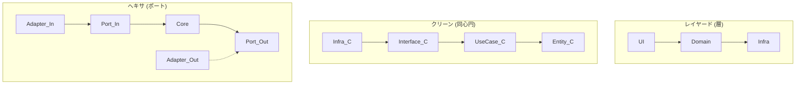

# 第14章：他アーキとの関係②：レイヤード/クリーンとの“似てる所”🤝📚


この章は「混乱しやすい“親戚アーキ”をスッキリ整理する回」だよ〜😆✨
結論から言うと、**ヘキサ・クリーン・オニオンは“だいたい仲間”**で、**見てる地図（説明のしかた）が違う**だけ…って感じ！🗺️🔍

---

## 1) まず大前提：みんな「中心を守りたい」🛡️❤️


* **中心（Core）＝業務ルール（変わりにくいポリシー）**
* **外側＝UI/DB/外部API/フレームワーク（変わりやすい仕組み）**

この価値観は共通だよ✨
クリーンアーキでは「内側ほどポリシー、外側ほどメカニズム」って言い方をするね。([クリーンコーダーブログ][1])

---

## 2) レイヤード（層）ってどんなノリ？🍰


レイヤードは、だいたいこんな“積み重ね”イメージ👇

* Presentation（画面/API）
* Application（アプリの手順）
* Domain（業務ルール）
* Infrastructure（DB/外部API）

**良いところ**😊

* 分けやすい、説明しやすい、導入しやすい

**ハマりどころ**😭

* 現実では「DomainがInfrastructureを参照しちゃう」事故が起きやすい
* 下の層に引っ張られて、中心が汚れがち（DB都合がDomainに漏れる…など）🍝

---

## 3) クリーンアーキは「同心円＋依存ルール」🎯⭕️


クリーンアーキの超コアはこれ！

* **依存（ソースコードの参照）は“内側”に向ける**
* 外側（DBやフレームワーク）は詳細、内側（ユースケースやエンティティ）は方針
  この「Dependency Rule」が中核だよ。([クリーンコーダーブログ][1])

つまりクリーンアーキは、レイヤードの弱点（中心が外に引っ張られる）を、**依存方向のルールで強制的に守る**感じ✨

---

## 4) オニオンは「ドメイン中心を厚めに守る」🧅💎


オニオンアーキは、ドメインを中心に置いて、外側に向かって層を作っていく考え方。
そして「DIP（依存逆転）」に強く依存してるよ〜ってのがポイント！([jeffreypalermo.com][2])

イメージとしては、

* **Domain が真ん中（最重要）**
* 周りに Application / Infrastructure が取り巻く
* 実装の差し替えは DI でやる

…みたいな感じで、「中心を守る圧」が強い💪✨

---

## 5) ヘキサ（Ports & Adapters）は「入口と出口を“対等”に見る」🔷🚪➡️🗄️


ヘキサの独特ポイントはここ！👇

* **外部との接点を Port（約束）で表す**
* **外部の都合を Adapter（変換係）に押し込む**
* **アプリは、ユーザー操作でも、バッチでも、テストでも、同じように駆動できる**（“等しく駆動される”）([Alistair Cockburn][3])

クリーン/オニオンが「円」で語るのに対して、ヘキサは「**接続口（Port）中心**」で語る感じだね🔌✨

---

## 6) 似てる所まとめ（ここだけ覚えればOK）✅✨

* **中心に業務ルールを置く**🏠❤️
* **外側（UI/DB/外部API）を差し替え可能にする**🔁
* **依存逆転（抽象に依存）を使う**🔄
* **テストしやすくする（中心を単体テストしやすい）**🧪💖

これ、クリーン/オニオン/ヘキサ全部の“狙い”だよ！([クリーンコーダーブログ][1])

---

## 7) 違いまとめ（混乱ポイントを1発でほどく）🧠✨




| 観点     | レイヤード        | クリーン                         | オニオン                                | ヘキサ（Ports & Adapters）                |
| ------ | ------------ | ---------------------------- | ----------------------------------- | ------------------------------------ |
| 主役の説明  | 層（上下）🍰      | 円＋依存ルール⭕️                    | ドメイン中心🧅                            | Port/Adapter（接点）🔌                   |
| 強調するもの | 分離しやすさ       | 依存の向き（内向き）([クリーンコーダーブログ][1]) | ドメイン保護＋DIP([jeffreypalermo.com][2]) | “外部との接続”を体系化([Alistair Cockburn][3]) |
| 失敗しがち  | 下層都合が上に漏れる🍝 | 形だけ真似して分割地獄🌀                | 層を増やしすぎ🧅💦                         | Port乱立・Adapter肥大化🔌🐘                |

※「オニオンとヘキサの違い」を一言で言うなら、**オニオンは“層”を作るのが強くて、ヘキサは“接点（Port/Adapter）”を作るのが強い**、って整理が分かりやすいよ。([Thoughtworks][4])

---

## 8) “ヘキサで学んでる人”がクリーンを見た時の対応表🗺️✨


* **Use Case（クリーンの内側）** ⇔ **Application（Core内の手順）**
* **Interface Adapters（クリーンの外寄り）** ⇔ **Adapters（Inbound/Outbound）**
* **Frameworks & Drivers（最外周）** ⇔ **DB/HTTP/GUIなどの外部世界**

そして、ヘキサ視点だと超シンプル👇

* クリーンの外側にあるものは **だいたい Adapter**
* クリーンの内側が欲しい機能は **Port（interface）** で約束して **依存逆転** する

---

## 9) どれを選べばいいの？（今はこう考えればOK）🎯😊

この教材の流れ的にはね、

* **まずヘキサで“Port/Adapterの感覚”を作る**🔷🔌
* その後にクリーン/オニオンを見ると、
  「あ、同じ目的を別の言葉で言ってるだけだ〜」ってなる😆✨

なので今章は、**迷ったらこう唱えてOK**👇

> 「中心を守る。外は差し替え。接点はPort/Adapter。」🛡️🔁🔌

---

## 10) ミニ演習：それってPort？Adapter？それとも層？🎮✨


次のやつ、どこに置くのが自然か考えてみてね👇（答えは下）

1. 注文の合計金額を計算する処理
2. Web API の Controller
3. DBに Order を保存する処理
4. 外部の決済APIを叩く処理
5. 「注文する」という一連の手順

**答え（ざっくり）**✅

* 1 → Core（Domain寄り）💎
* 2 → Inbound Adapter 🌐
* 3 → Outbound Adapter（Repository実装）🗄️
* 4 → Outbound Adapter（外部APIクライアント）📡
* 5 → Core（Application/UseCase）🧭

---

## 11) AI活用（この章のおすすめ使い方）🤖✨

「似てる/違う」の整理は AI が得意だよ〜！
例えば Copilot/Codex にこう頼むと早い👇

```text
ヘキサゴナル（Ports & Adapters）とクリーンアーキテクチャの対応関係を、
初心者向けに “Port/Adapter視点” で箇条書きにして。
最後に「混乱しやすい罠」も3つ入れて。
```

---

## まとめ🎁✨

* レイヤード/クリーン/オニオン/ヘキサは、方向性としてはみんな「中心を守る仲間」🤝
* **クリーンは“依存ルール”**がド真ん中、ヘキサは**“Port/Adapter（接点）”**がド真ん中([クリーンコーダーブログ][1])
* 迷ったら：**Port？Adapter？**で考えると、ヘキサはブレにくい🔌✨
* ちなみに最近は Ports & Adapters を本で学べる形でも整理が進んでるよ📚（プレビュー→正式版の話なども含めて）([Zenn][5])

次章から、いよいよミニ題材で「動く形」にしていくよ〜☕🧾😆

[1]: https://blog.cleancoder.com/uncle-bob/2012/08/13/the-clean-architecture.html?utm_source=chatgpt.com "Clean Architecture by Uncle Bob - The Clean Code Blog"
[2]: https://jeffreypalermo.com/2008/07/the-onion-architecture-part-1/?utm_source=chatgpt.com "The Onion Architecture : part 1 | Programming with Palermo"
[3]: https://alistair.cockburn.us/hexagonal-architecture?utm_source=chatgpt.com "hexagonal-architecture - Alistair Cockburn"
[4]: https://www.thoughtworks.com/insights/blog/architecture/demystify-software-architecture-patterns?utm_source=chatgpt.com "Demystifying software architecture patterns"
[5]: https://zenn.dev/kkatou/articles/ports-and-adapters-explained?utm_source=chatgpt.com "Ports & Adapters パターン：Hexagonal Architecture ..."
