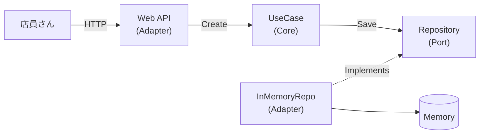

# 第15章：ミニ題材決定：カフェ注文アプリ☕🧾


ここからは「小さく作って、あとで差し替えて強さを体感する」フェーズに入るよ〜！😆💪
題材は **カフェの注文（Order）** に決定！☕🍰

---

## 15.1 今日のゴール 🎯✨

この章でやることは「作るアプリの仕様を、シンプルに決め切る」ことだよ🙂📌
ヘキサゴナルは **“題材の決め方”で学びやすさがめっちゃ変わる** から、ここは丁寧にいこう〜！

---

## 15.2 今回つくるミニアプリの姿 ☕🧾




### できること（最小の要件）✅

1. **注文を作成する**（Create Order）🧾✨
2. **注文一覧を表示する**（List Orders）📋👀

### 最初は InMemory で完成 → あとでDBに差し替える 🔁🧠

* まずは **メモリに保存（InMemory）** で「動くもの」を完成させる😆
* その後、**DBに差し替え**て「Coreが変わらない！」を体験する🛡️✨

---

## 15.3 なぜ「カフェ注文」がヘキサに向いてるの？🥰🔷

この題材、ヘキサの“おいしい所”が全部入ってるの🍯✨

* **UIは変えやすい**：Web APIでも、将来は画面アプリでもOK（入口が変わる）🚪🔁
* **保存先が変わりやすい**：InMemory → DB（出口が差し替わる）🗄️🔁
* **業務ルールが入れやすい**：数量・金額・合計計算など（Coreが主役になれる）🏠💖

---

## 15.4 用語ミニ辞書（この題材の“言葉”）📖✨

ここが地味に超大事！😳
“言葉が揃う”と、設計がスルスル進むよ〜！

* **Order（注文）**：注文そのもの🧾
* **OrderItem（注文明細）**：注文内の1行（商品＋数量）🧁×2 みたいなやつ
* **MenuItem（メニュー商品）**：ラテ、チーズケーキ等☕🍰
* **Money（金額）**：金額を表す値（できれば型で守る）💰🔒
* **Total（合計）**：OrderItemの合計金額🧮✨

---

## 15.5 ユースケース（やりたいこと）を“文章”で固める 🧠📝

### UC1：注文作成（Create Order）🧾✨

* 店員さんが「商品」と「数量」を入れる
* システムは合計金額を計算して、注文として保存する
* 注文IDを返す（控え番号みたいな感じ）🎫

### UC2：注文一覧（List Orders）📋👀

* 今日の注文が見られる
* 並び順は「新しい順」でOK（最初はシンプルで！）😊

---

## 15.6 “業務ルール”を最小だけ入れる（Coreが主役になるコツ）🏠💖

ルールゼロだと「ただのCRUD」になって、ヘキサの良さが出にくいの😭
だから、**軽めのルール**を入れて“Core感”を出そう！

おすすめの最小ルール例👇（このくらいで十分！）✨

* 数量は **1以上**（0個注文は変だよね🥺）
* 注文は **アイテムが1つ以上**ないと作れない
* 合計金額は **単価×数量の合計**で自動計算🧮
* 価格はマイナス禁止（当たり前ルールを型で守ると気持ちいい）💰🚫

---

## 15.7 画面やAPIのイメージ（入口の形）🌐🚪

将来差し替える前提だから、まずは分かりやすく **Web API** を想定しておくね🙂✨
（後でCLIにしても、画面にしても、入口のAdapterを替えるだけ〜！🔁）

### 注文作成（例：POST /orders）🧾

```json
{
  "items": [
    { "menuItemId": "latte", "quantity": 2 },
    { "menuItemId": "cheesecake", "quantity": 1 }
  ]
}
```

返すもの（例）👇

```json
{
  "orderId": "a3f1c0d0-4e8b-4d1b-8a25-2a7c2c2e9c2f",
  "total": 1650,
  "currency": "JPY"
}
```

### 注文一覧（例：GET /orders）📋

```json
[
  {
    "orderId": "a3f1c0d0-4e8b-4d1b-8a25-2a7c2c2e9c2f",
    "total": 1650,
    "currency": "JPY",
    "items": [
      { "menuItemId": "latte", "quantity": 2, "unitPrice": 550 },
      { "menuItemId": "cheesecake", "quantity": 1, "unitPrice": 550 }
    ]
  }
]
```

---

## 15.8 この題材をヘキサに落とすとこうなる 🔷🔌✨

「どれがPortでどれがAdapter？」を、ここで軽く当てておくよ〜！

### Inbound（外 → 中）⬅️

* **Web API Controller（Adapter）**：HTTPを受け取る🌐
* **UseCase（Port）**：`CreateOrder` / `ListOrders` を呼べる約束📝

### Outbound（中 → 外）➡️

* **Repository（Port）**：保存したい・一覧ほしい、という約束🗄️📝
* **InMemoryRepository（Adapter）**：メモリに保存する実装🧠📦
* （後で）**DbRepository（Adapter）**：DBに保存する実装🗃️⚙️

この形にしておくと、のちの **DB差し替え** が超気持ちいいよ😆🔁

---

## 15.9 “まずInMemoryで完成”が最強な理由 🧠🔥

* DBを先にやると、**設定・接続・移行・例外**が増えて初心者が溺れがち😵‍💫🌊
* 先にInMemoryで完成すると、**設計の良さ（差し替え）**だけに集中できる😌✨
* その後DBに変えると、**「え、Coreいじらないの？」**が体験できて感動する🥹🛡️

---

## 15.10 AIの使いどころ（この章で使うと楽）🤖✨

AIはね、**仕様の言語化**と**例の生成**に使うのが超ラク！💖

### おすすめプロンプト例 🪄

* 「カフェ注文アプリの最小ユースケースを2つに絞って、入力/出力DTO案を出して」
* 「Order / OrderItem / Money の最小クラス設計を提案して（業務ルールも少し）」
* 「InMemoryで保存するRepository実装の雛形をC#で作って」

⚠️注意：AIは勢いでDB都合をCoreに混ぜがち！
**“DTO変換やDBモデルはAdapter側”**は人間が守ってね🚦🧼

---

## 15.11 ミニ演習（この章のうちに決めちゃおう）📝✨

次の3つを、自分の言葉でメモできたら勝ち！😆💪

1. **注文作成の入力に必要な項目は？**（itemsだけで足りる？）🧾
2. **注文の一覧で返したい情報は？**（totalは返す？ itemsは返す？）📋
3. **最小ルールを何にする？**（数量1以上、アイテム1つ以上…など）🔒

---

## 15.12 チェックリスト ✅✨

* [ ] できることが **「注文作成」「注文一覧」** に絞れてる😌
* [ ] “業務ルール”が **ちょびっと**入ってる（Coreが主役になれる）🏠💖
* [ ] 最初は **InMemoryで完成** → あとでDB差し替えの流れが見えてる🔁
* [ ] 「入口（Inbound）」と「出口（Outbound）」のイメージがついた🔌✨

---

## おまけ：今の「最新基盤」メモ（さらっと）🧠✨

いまの最新は **.NET 10（LTS）**で、C#も **C# 14** が最新だよ〜！📌✨
C# 14 は .NET 10 上で動く前提になってるよ。([Microsoft Learn][1])
ASP.NET Core も .NET 10 で色々強化されてて、Minimal APIのバリデーション対応なんかも入ってるよ。([Microsoft Learn][2])

---

次の章（第16章）では、いよいよプロジェクトを作って「動く土台」を用意するよ〜！🪟⚙️💖

[1]: https://learn.microsoft.com/en-us/dotnet/csharp/whats-new/csharp-14?utm_source=chatgpt.com "What's new in C# 14"
[2]: https://learn.microsoft.com/en-us/aspnet/core/release-notes/aspnetcore-10.0?view=aspnetcore-10.0&utm_source=chatgpt.com "What's new in ASP.NET Core in .NET 10"
