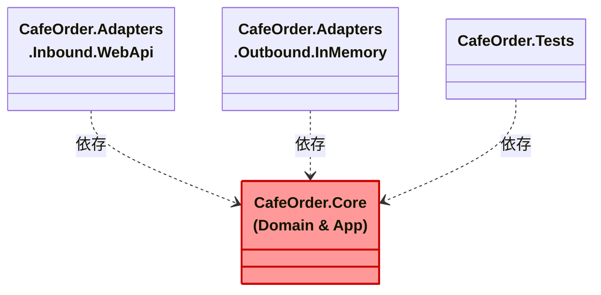

# 第16章：環境準備（Windows）🪟⚙️


ここでやることはシンプルだよ〜！
**「カフェ注文アプリ☕🧾」を、いつでも動かせて・テストも回せて・AI補助も効く状態**にするよ 🤖💪

---

## この章のゴール 🎯✨

* Visual Studio で **ソリューション＋複数プロジェクト**を作れる ✅
* **Web API が起動**して、Swagger が見える ✅
* **テストが1回走る** ✅🧪
* ついでに **Copilot が気持ちよく働ける下準備**もする ✅🤖

---

## 1) いまの「最新セット」を入れる 🧰✨

### ✅ Visual Studio（最新）

* **Visual Studio 2026**（例：**18.2.1 / 2026-01-20** の更新あり）を入れるのがいちばん楽だよ〜🫶
  ([Microsoft Learn][1])

### ✅ .NET SDK（最新）

* いまの主役は **.NET 10（LTS）**（例：**SDK 10.0.102 / 2026-01-13**）✨
  ([Microsoft][2])

### ✅ C#（最新）

* **C# 14 が最新**で、**.NET 10 でサポート**だよ〜🧡
  ([Microsoft Learn][3])

---

## 2) Visual Studio のインストール設定（迷わない版）🧩✨

Visual Studio Installer を開いたら、だいたいこれでOK！

### Workloads（ワークロード）おすすめ ✅

* **ASP.NET と Web 開発**（Web APIを作るため）🌐
* （必要なら）**.NET デスクトップ開発**（将来WPF/WinForms触るかもなら）🖥️

### Copilot も一緒に入れる 🤖✨

最近の VS は、ワークロードを選ぶと **GitHub Copilot が一緒に入る流れ**になってるよ（外してなければだいたいOK）。あとから Installer の「変更」で追加もできる〜✅
([Visual Studio][4])

---

## 3) ソリューション作成（カフェ注文アプリ☕）📦✨




### 🟦 作りたい形（今日の完成イメージ）

* `CafeOrder.Core`（中心：ドメイン＋ユースケース）🏠❤️
* `CafeOrder.Adapters.Inbound.WebApi`（入口：Web API）🚪🌐
* `CafeOrder.Adapters.Outbound.InMemory`（出口：インメモリ保存）🗄️📦
* `CafeOrder.Tests`（テスト）🧪💕

### Visual Studio で作る手順（おすすめ）🪄

1. **新しいプロジェクト作成**

2. まずは **「空のソリューション（Blank Solution）」** を作る（名前：`CafeOrder` など）📦

3. ソリューションを右クリック → **追加 → 新しいプロジェクト** で以下を追加👇

   * **クラス ライブラリ**：`CafeOrder.Core`（ターゲット：`net10.0`）
   * **ASP.NET Core Web API**：`CafeOrder.Adapters.Inbound.WebApi`（`net10.0`）
   * **クラス ライブラリ**：`CafeOrder.Adapters.Outbound.InMemory`（`net10.0`）
   * **xUnit テスト プロジェクト**（または好きなテスト）：`CafeOrder.Tests`（`net10.0`）

4. ソリューションフォルダを作って整理すると気持ちいいよ〜✨

   * `Core` / `Adapters` / `Tests` 📁💕

---

## 4) まず「起動」と「テスト」を通して安心する 😌✅

### ✅ Web API 起動チェック

* `CafeOrder.Adapters.Inbound.WebApi` を **スタートアッププロジェクト**にする
* 実行 ▶️ → ブラウザで Swagger が出たら勝ち！🎉

### ✅ テスト実行チェック

* テストエクスプローラーから **すべて実行** 🧪✨
* まだテストが無ければ、1本だけ雛形を作って「緑」を見よう💚

---

## 5) VS Code + dotnet CLI でもできる（サブ）💻✨

「軽くやりたい」「CLI好き」ならこっちもOK！

### 入れる拡張（おすすめ）

* **C# Dev Kit**（VS Codeでソリューション探索やテスト実行が強くなる）🧰✨
  ([Visual Studio Marketplace][5])
* **GitHub Copilot / Copilot Chat**（AI補助）🤖💬
  ([Visual Studio Code][6])

### 動作確認コマンド（PowerShell）🔧

```powershell
dotnet --info
dotnet --version
```

（`.NET 10` が出たらOKだよ〜✅） ([Microsoft][2])

---

## 6) ⚠️ 2026っぽい最新注意点：`.slnx` が増えるかも！😳

.NET 10 から、`dotnet new sln` の既定が **`.sln` じゃなくて `.slnx`** になったよ〜（CLI派はびっくりしがち）🫨
([Microsoft Learn][7])

「いつもの `.sln` がいい！」なら、CLIで作るときに **形式指定**すると安心✨

```powershell
dotnet new sln --format sln
```

([Microsoft Learn][8])

---

## 7) Copilot が迷子にならない“指示書”を置く 🗺️🤖✨

ここ、超大事〜！！✨
リポジトリ直下に **`.github/copilot-instructions.md`** を置くと、Copilot がそのプロジェクトのルールを先に読んでくれるよ📌
([GitHub Docs][9])

例（この講座向けの超ミニ指示）👇

```markdown
- Core は Adapters を参照しない（依存方向を守る）
- Port（interface）は Core 側に置く
- DTO は Inbound/Outbound 側に置き、Domain を直接外へ出さない
- 変換（DTO↔Domain）は Adapter の責務
- まず InMemory で動く完成を優先する
```

([GitHub Docs][9])

---

## 最後に：この章のチェックリスト ✅✅✅

* [ ] Visual Studio 2026 でプロジェクトが作れた 🧩
* [ ] `net10.0` で揃ってる 🔥 ([Microsoft][2])
* [ ] Web API が起動して Swagger が見えた 🌐✨
* [ ] テストが1回走って緑になった 🧪💚
* [ ] `.github/copilot-instructions.md` を置いた 🤖🗺️ ([GitHub Docs][9])

---

次の第17章では、この状態の上で「おすすめのフォルダ/プロジェクト構成📦🏷️」をガッツリ固めて、**“境界ルールが崩れない土台”**を作っていくよ〜😆🔷

[1]: https://learn.microsoft.com/en-us/visualstudio/releases/2026/release-notes?utm_source=chatgpt.com "Visual Studio 2026 Release Notes"
[2]: https://dotnet.microsoft.com/en-us/download?utm_source=chatgpt.com "Download .NET (Linux, macOS, and Windows) | .NET"
[3]: https://learn.microsoft.com/en-us/dotnet/csharp/whats-new/csharp-14?utm_source=chatgpt.com "What's new in C# 14"
[4]: https://visualstudio.microsoft.com/github-copilot/?utm_source=chatgpt.com "Visual Studio With GitHub Copilot - AI Pair Programming"
[5]: https://marketplace.visualstudio.com/items?itemName=ms-dotnettools.csdevkit&utm_source=chatgpt.com "C# Dev Kit"
[6]: https://code.visualstudio.com/docs/copilot/setup?utm_source=chatgpt.com "Set up GitHub Copilot in VS Code"
[7]: https://learn.microsoft.com/en-us/dotnet/core/compatibility/sdk/10.0/dotnet-new-sln-slnx-default?utm_source=chatgpt.com "`dotnet new sln` defaults to SLNX file format - .NET"
[8]: https://learn.microsoft.com/ja-jp/dotnet/core/tools/dotnet-new-sdk-templates?utm_source=chatgpt.com "'dotnet new' の .NET の既定のテンプレート - .NET CLI"
[9]: https://docs.github.com/copilot/customizing-copilot/adding-custom-instructions-for-github-copilot?utm_source=chatgpt.com "Adding repository custom instructions for GitHub Copilot"
